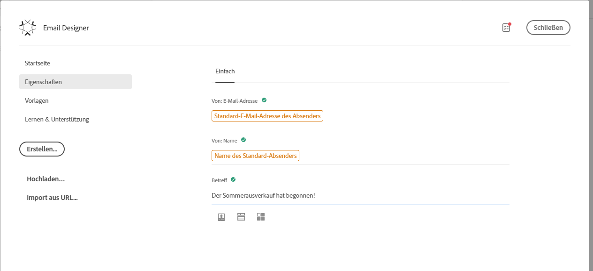
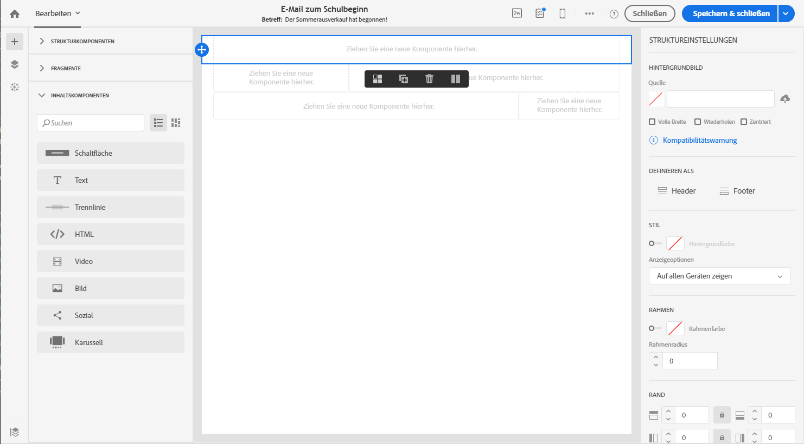
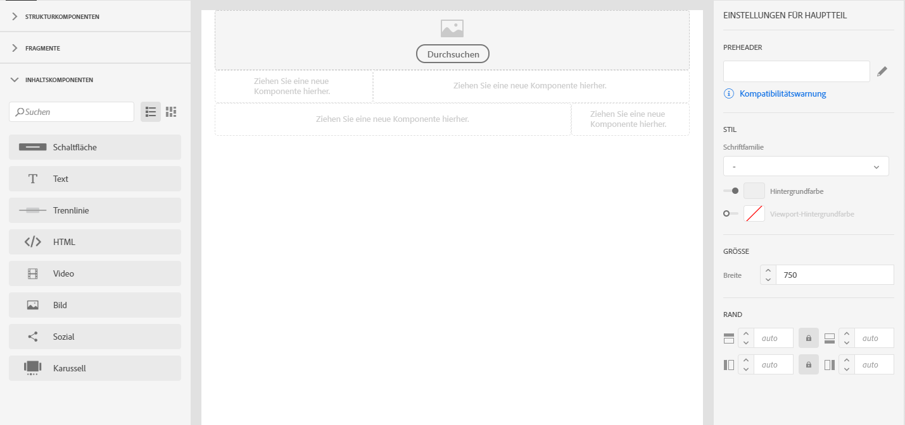
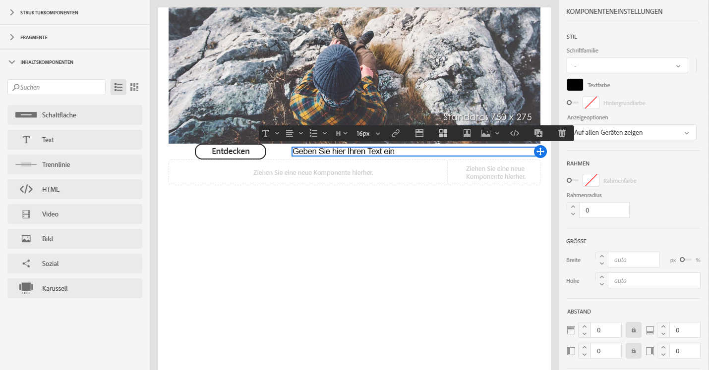
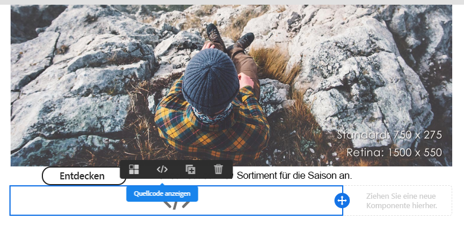
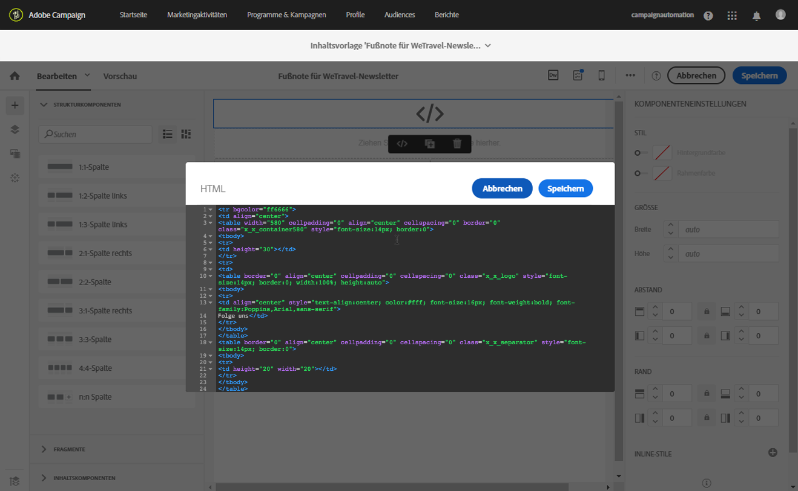
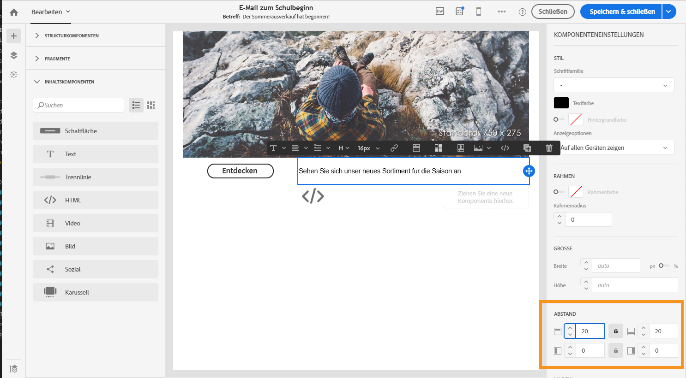

# Erste Schritte mit dem Email Designer {#quick-start}

Email Designer bietet vier Möglichkeiten zum Erstellen von E-Mails.

Sie können E-Mails [ in E-Mail-Designer](#without-existing-content) von Grund auf neu erstellen:

1. You can **create an email from a blank canvas** by easily adding structure and content components and personalize their content to send a delivery quickly. Die Stilelemente können Sie auch vollständig verwalten. Weitere Informationen finden Sie in der [Kurzanleitung](#from-scratch-email) oder in der [vollständigen Dokumentation](../../designing/using/designing-from-scratch.md#designing-an-email-content-from-scratch).

1. You can **create an email from an out-of-the-box template** by selecting a template and building your new email content from here. [mehr dazu](#building-content-from-an-out-of-the-box-template)

Sie können eine E-Mail auch [aus vorhandenem Inhalt erstellen](#with-existing-content):

1. You can **convert an existing HTML content** (created externally or in the legacy editor). [mehr dazu](#converting-an-html-content)
1. You can **import an existing HTML content** straight away in compatibility mode. [mehr dazu](#compatibility-mode)

| Ohne Inhalt | Mit Inhalt |
|---|---|
| [E-Mail neu erstellen](#from-scratch-email) | [Vorhandenen HTML-Inhalt konvertieren](#converting-an-html-content) |
| [Inhalt aus einer nativen Vorlage erstellen](#building-content-from-an-out-of-the-box-template) | [Vorhandenen HTML-Inhalt importieren](#compatibility-mode) |

## E-Mails mit dem Editor erstellen {#without-existing-content}

>[!NOTE]
>
>Unabhängig davon, nach welcher der beiden Strategien Sie E-Mails erstellen, ist es unabdingbar, vor dem Versand die Betreffzeile auszufüllen. Erfahren Sie, wie Sie eine [Betreffzeile hinzufügen](#add-a-subject-line).

### E-Mail neu erstellen {#from-scratch-email}

Sie können eine E-Mail problemlos neu erstellen, ihr Komponenten hinzufügen und deren Inhalt personalisieren. Die E-Mail ist dann rasch versendet. Bei Bedarf können Sie die Stiloptionen an den Inhalt anpassen. Weiterführende Informationen zur Verwaltung von Stileinstellungen und Inline-Attributen finden Sie im Abschnitt [E-Mail-Stile bearbeiten](../../designing/using/styles.md).

1. Erstellen Sie eine E-Mail.
1. Schließen Sie die Startseite.

### Hinzufügen einer Betreffzeile {#add-a-subject-line}

Die Betreffzeile ist in einer E-Mail obligatorisch. Weitere Informationen finden Sie unter [Definieren der Betreffzeile einer E-Mail](../../designing/using/subject-line.md).

1. Go the **[!UICONTROL Properties]** tab of the Email Designer home page (accessible through the home icon) and fill in the **[!UICONTROL Subject]** section.

### Hinzufügen von Strukturkomponenten {#add-structure-components}

Strukturkomponenten definieren das Layout Ihrer E-Mail. Weitere Informationen finden Sie unter [Definieren der E-Mail-Struktur](../../designing/using/designing-from-scratch.md#defining-the-email-structure).

Ziehen Sie die Strukturkomponenten, die Sie für Ihr Layout wünschen, auf die Arbeitsfläche.

>[!NOTE]
>
>Sie können für Ihre E-Mail verschiedene Inhaltslayouts auswählen.

### Hinzufügen von Inhaltskomponenten {#add-content-components}

Sie können Ihrer E-Mail verschiedene Inhaltskomponenten wie Bild, Text und Schaltflächen hinzufügen. Weitere Informationen finden Sie unter [Inhaltskomponenten](../../designing/using/designing-from-scratch.md#about-content-components).

* **Bild**

1. Ziehen Sie aus **Inhaltskomponenten** die Bildkomponente in eine Ihrer Strukturkomponenten.
1. Klicken Sie auf **Durchsuchen**.
1. Wählen Sie die gewünschte Bilddatei aus Ihrem Dateisystem aus.

* **Text mit Personalisierung**

1. Ziehen Sie aus **Inhaltskomponenten** die Textkomponente in eine Ihrer Strukturkomponenten.
1. Klicken Sie auf die Komponente und geben Sie den gewünschten Text ein.
1. Zum Hinzufügen eines Personalisierungsfelds klicken Sie in der Symbolleiste auf **Personalisierungsfeld einfügen**.
1. Wählen Sie das gewünschte Feld aus, zum Beispiel „Vorname“.

* **HTML**

1. Ziehen Sie aus **Inhaltskomponenten** die HTML-Komponente in eine Ihrer Strukturkomponenten.
1. Klicken Sie auf **Quellcode anzeigen**.
1. Geben Sie den gewünschten HTML-Inhalt ein.
1. Wählen Sie **Speichern** aus.

Wenn Sie HTML-Kenntnisse haben, können Sie den HTML-Code mit der **[!UICONTROL Html]**-Inhaltskomponente aus der Original-Fußzeile kopieren und einfügen. Weiterführende Informationen dazu finden Sie im Abschnitt [Über Inhaltskomponenten](../../designing/using/designing-from-scratch.md#about-content-components).

### Gestalten Ihrer E-Mail-Komponente

Sie können das Design Ihrer E-Mail anpassen, beispielsweise den Abstand einer Komponente ändern. Weiterführende Informationen zur Verwaltung von Stileinstellungen und Inline-Attributen finden Sie im Abschnitt [E-Mail-Stile bearbeiten](../../designing/using/styles.md).

1. Klicken Sie auf die **Textkomponente**.
1. Navigieren Sie rechts in der Palette zu **Abstand**.
1. Klicken Sie auf das Sperrsymbol, um die Synchronisierung zwischen den Parametern oben und unten oder rechts und links aufzuheben.
1. Passen Sie den **Abstand** nach Bedarf an.
1. Wählen Sie **Speichern** aus.

Sie können Ihre E-Mail nun speichern und senden.

### Erstellen von Inhalt aus einer vordefinierten Vorlage   {#building-content-from-an-out-of-the-box-template}

Ihre E-Mails können Sie auch aus vordefinierten Vorlagen erstellen und diese personalisieren. Hier bieten sich zum Beispiel Willkommensnachrichten für Neukunden, Newsletter und Wiedereinstellungs-E-Mails an.

1. Erstellen Sie eine E-Mail und öffnen Sie ihren Inhalt. Weiterführende Informationen dazu finden Sie im Abschnitt [E-Mails erstellen](../../channels/using/creating-an-email.md).
1. Wählen Sie das Startseiten-Symbol aus, um die Startseite von **[!UICONTROL Email Designer]** zu öffnen.
1. Klicken Sie auf die **[!UICONTROL Templates]** Registerkarte.
1. Wählen Sie eine native HTML-Vorlage aus.
Die unterschiedlichen Vorlagen bestehen aus Kombinationen verschiedener Typen von Elementen. Beispielsweise haben die Vorlagen vom Typ &quot;Feather&quot; Ränder, die Vorlagen vom Typ &quot;Astro&quot; haben dagegen keine. Weiterführende Informationen dazu finden Sie im Abschnitt [Inhaltsvorlagen](../../designing/using/using-reusable-content.md#content-templates).
1. Go the **[!UICONTROL Properties]** tab of the Email Designer home page (accessible through the home icon) and fill in the **[!UICONTROL Subject]** section.
1. Sie können diese Elemente zu mehreren E-Mail-Varianten kombinieren. For example, you can duplicate an email section by selecting a structure component and clicking **[!UICONTROL Duplicate]** from the contextual toolbar.
1. Sie können die Elemente mit den blauen Pfeilen auf der linken Seite verschieben, indem Sie eine Strukturkomponente unter oder über eine andere ziehen. Weiterführende Informationen dazu finden Sie im Abschnitt zum [Bearbeiten des E-Mail-Aufbaus](../../designing/using/designing-from-scratch.md#defining-the-email-structure).
1. Sie können Komponenten auch verschieben und so die Anordnung in jedem Strukturelement ändern. Weiterführende Informationen dazu finden Sie im Abschnitt [Fragmente und Inhaltskomponenten hinzufügen](../../designing/using/designing-from-scratch.md#defining-the-email-structure).
1. Sie können den Inhalt jedes Elements nach Bedarf ändern: Bilder, Text, Links.
1. Sie können auch die Stiloptionen beliebig auf Ihren Inhalt anpassen. Weiterführende Informationen dazu finden Sie im Abschnitt [E-Mail-Stile bearbeiten](../../designing/using/styles.md).

## Verwenden eines vorhandenen E-Mail-Inhalts {#with-existing-content}

Wenn Sie sich selbst ein Rahmenwerk aus modularen Vorlagen und Fragmenten erstellen möchten, um sie in künftigen E-Mails wiederzuverwenden und zu kombinieren, sollten Sie Ihre E-Mail-HTML-Inhalte in Email Designer-Vorlagen konvertieren.

### Konvertieren von HTML-Inhalten {#converting-an-html-content}

In diesem Anwendungsfall wird eine schnelle Konvertierung von HTML-E-Mails in E-Mail-Designer-Komponenten Angebot. Weitere Informationen zu diesem Thema finden Sie unter [Konvertieren von HTML-Inhalten](../../designing/using/using-existing-content.md#converting-an-html-content).

>[!CAUTION]
>
>Dieser Abschnitt richtet sich insbesondere an Benutzer, die mit HTML-Code vertraut sind.

>[!NOTE]
>
>Wie im Kompatibilitätsmodus ist eine HTML-Komponente nur beschränkt bearbeitbar: Sie kann nur an Ort und Stelle bearbeitet werden.

### Importieren und Bearbeiten einer HTML-E-Mail {#compatibility-mode}

Beim Hochladen von Inhalt muss dieser ein bestimmtes Tagging aufweisen, um vollständig kompatibel und im WYSIWYG-Editor von Email Designer bearbeitbar zu sein.

Weiterführende Informationen zur Konvertierung einer vorhandenen E-Mail in eine mit Email Designer kompatible E-Mail finden Sie in [diesem Abschnitt](../../designing/using/using-existing-content.md#compatibility-mode).
