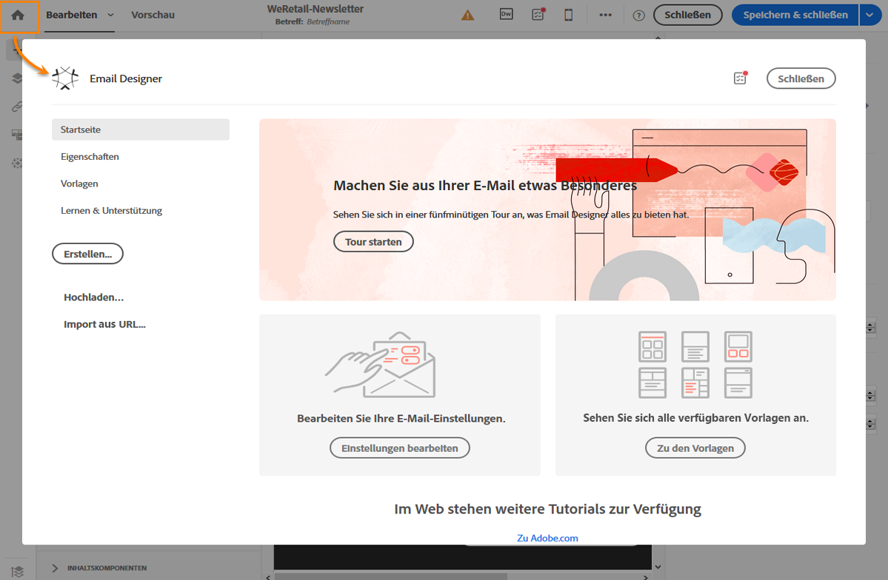
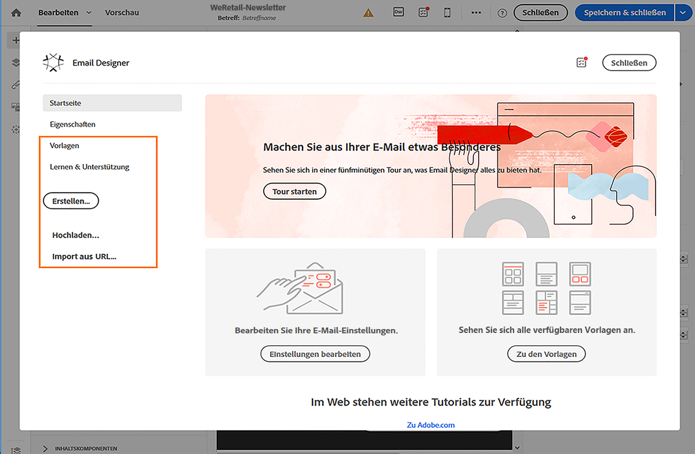

# Existierenden Inhalt auswählen{#selecting-an-existing-content}

Adobe Campaign beinhaltet eine Reihe vordefinierter Inhalte, mit denen Sie Ihre Aufgaben rascher ausführen können. Sie können entweder einen vorhandenen Inhalt verwenden oder einen außerhalb von Adobe Campaign vorbereiteten Inhalt von Ihrem Computer oder einer URL importieren.

Sie haben die Möglichkeit, bei der Erstellung einer E-Mail oder Landingpage existierenden Inhalt aus einer anderen Quelle zu laden.

>[!NOTE]
>
>In den unten stehenden Bildern sehen Sie, wie Sie existierenden Inhalt mit [Email Designer](../../designing/using/about-email-content-design.md#about-the-email-designer) laden können.

1. Öffnen Sie nach der Erstellung der E-Mail oder Landingpage deren Inhalt.
1. Wählen Sie das Startseiten-Symbol aus, um die Startseite von **[!UICONTROL Email Designer]** zu öffnen.

   

1. Wählen Sie die Quelle des Inhalts aus, den Sie laden möchten:

   * [Inhaltsvorlagen](../../start/using/about-templates.md#content-templates): Wählen Sie den Tab **[!UICONTROL Vorlagen]** aus.
   * [Neu erstellten Inhalt](../../designing/using/about-email-content-design.md#designing-an-email-content-from-scratch): Wählen Sie die Schaltfläche **[!UICONTROL Erstellen]** aus.
   * [Inhalte von Ihrem Computer als ZIP- oder HTML-Datei](../../designing/using/importing-content-from-a-file.md): Wählen Sie die Schaltfläche **[!UICONTROL Hochladen]** aus.
   * [Inhalte von einer vorhandenen URL](../../designing/using/importing-content-from-a-url.md) (nur für E-Mails): Wählen Sie die Schaltfläche **[!UICONTROL Import von URL]** aus.
   

1. Laden Sie den Inhalt. Bei der Auswahl eines neuen Inhalts wird der aktuelle Inhalt automatisch ersetzt.

   Der Inhalt kann nach dem Import bearbeitet und personalisiert werden.

   >[!NOTE]
   >
   >[Email Designer](../../designing/using/about-email-content-design.md#about-the-email-designer) nutzt spezielles Tagging. Standardmäßiger HTML-Inhalt, der in Campaign geladen wird, muss diesem Tagging entsprechen, um mit Email Designer vollständig kompatibel und bearbeitbar zu sein. Ist dies nicht der Fall, wird der Inhalt im [Kompatibilitätsmodus](../../designing/using/about-email-content-design.md#email-designer-compatibility-mode) geladen. Weiterführende Informationen dazu, wie Sie existierenden Inhalt kompatibel machen, finden Sie in [diesem Abschnitt](../../designing/using/editing-existing-contents-with-the-email-designer.md).

**Verwandte Themen:**

* [E-Mails erstellen](../../channels/using/creating-an-email.md)
* [Verwaltung von Landingpages](../../channels/using/about-landing-pages.md)

