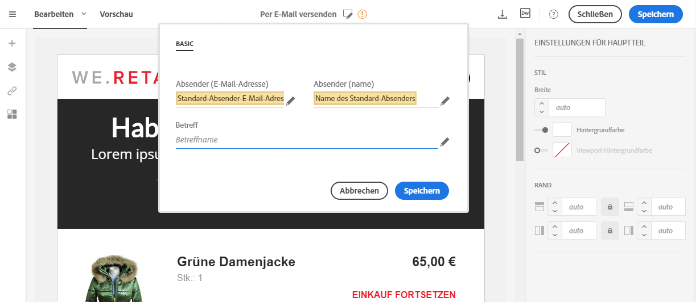
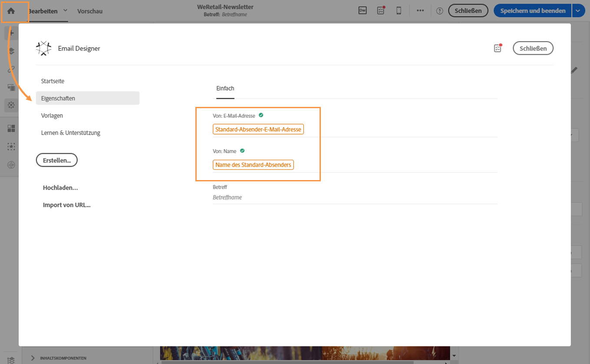

# Definieren der Betreffzeile und des Absenders einer E-Mail{#defining-the-subject-line-of-an-email}

## Definieren der Betreffzeile einer E-Mail {#subject-line}

Die Betreffzeile ist für die Vorbereitung und den Versand einer Nachricht unbedingt erforderlich.

>[!NOTE]
>
>Wenn die Betreffzeile leer ist, wird ein Warnhinweis im Nachrichten-Dashboard und in Email Designer angezeigt.

1. Erstellen Sie eine E-Mail.
1. Rufen Sie auf der Startseite von Email Designer den Tab **[!UICONTROL Eigenschaften]** auf (über das Startsymbol).
1. Füllen Sie den Abschnitt **[!UICONTROL Betreff]** aus.

   

1. Sie können zur Betreffzeile auch Personalisierungsfelder, Inhaltsbausteine und dynamische Inhalte hinzufügen, indem Sie die entsprechenden Symbole auswählen. Weiterführende Informationen dazu finden Sie unter [Personalisierung](../../designing/using/personalization.md).

## Definieren des E-Mail-Absenders einer E-Mail {#email-sender}

Um den Absendernamen zu definieren, der im Header der gesendeten Nachrichten angezeigt wird, navigieren Sie auf der Startseite von Email Designer zum Tab **[!UICONTROL Eigenschaften]** (der Zugriff erfolgt über das Startseiten-Symbol).

* Der Absendername kann im Feld **[!UICONTROL Von: Name]** angepasst werden. Wenn nicht anders angegeben, erscheint hier automatisch der **Name des Standard-Absenders**. Die Standard-E-Mail-Adresse und der Name des Absenders werden in **[!UICONTROL Marken]** definiert. Der Zugriff auf diese erfolgt über das Adobe Campaign-Logo unter dem erweiterten Menü **[!UICONTROL Administration > Instanzenkonfiguration > Markenkonfiguration]** zugegriffen werden kann.

  Sie können den Absendernamen ändern, indem Sie **Name des Absenders** auswählen. Geben Sie nun den gewünschten Absendernamen ein.

  Sie haben die Möglichkeit, den Absendernamen je nach Zielgruppe zu personalisieren. Sie können Personalisierungsfelder, Inhaltsbausteine und dynamische Inhalte hinzufügen, indem Sie die Symbole unter dem Absendernamen auswählen. Weiterführende Informationen dazu finden Sie unter [Personalisierung](../../designing/using/personalization.md).

* Das Feld **[!UICONTROL Von: E-Mail-Adresse]** kann nicht in diesem Bereich bearbeitet werden. Änderungen der E-Mail-Adresse sind nur über den Eigenschaften-Bildschirm der E-Mail möglich, auf den Sie im Dashboard zugreifen können. Lesen Sie diesbezüglich auch den Abschnitt [Liste der erweiterten E-Mail-Parameter](../../administration/using/configuring-email-channel.md#advanced-parameters).

>[!NOTE]
>
>Header-Parameter dürfen nicht leer sein. Die Angabe der Absenderadresse ist für den E-Mail-Versand zwingend erforderlich (gemäß RFC-Standard). Adobe Campaign führt eine Syntax-Prüfung der angegebenen E-Mail-Adressen durch.

**Verwandte Themen:**

* [Personalisierungsfeld einfügen](../../designing/using/personalization.md#inserting-a-personalization-field)
* [Inhaltsbaustein hinzufügen](../../designing/using/personalization.md#adding-a-content-block)
* [Dynamische Inhalte in einer E-Mail definieren](../../designing/using/personalization.md#defining-dynamic-content-in-an-email)
