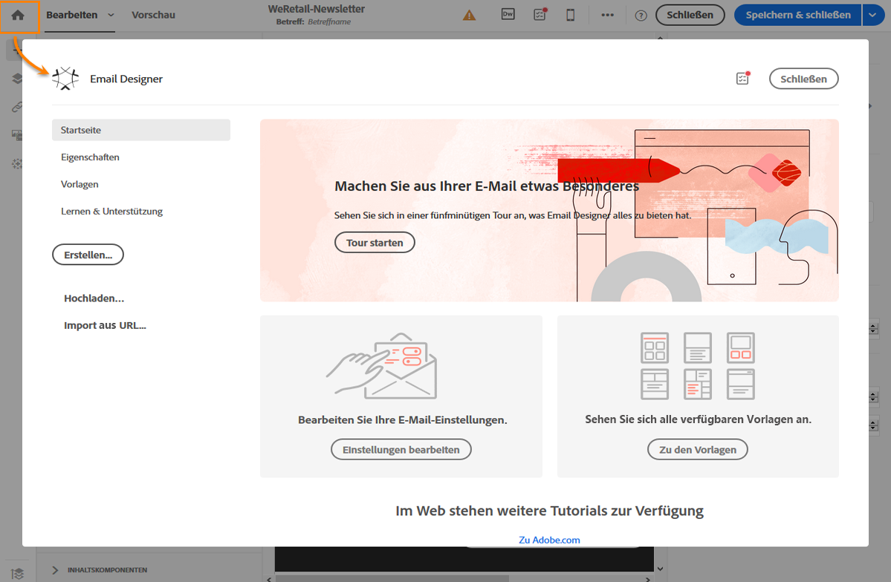
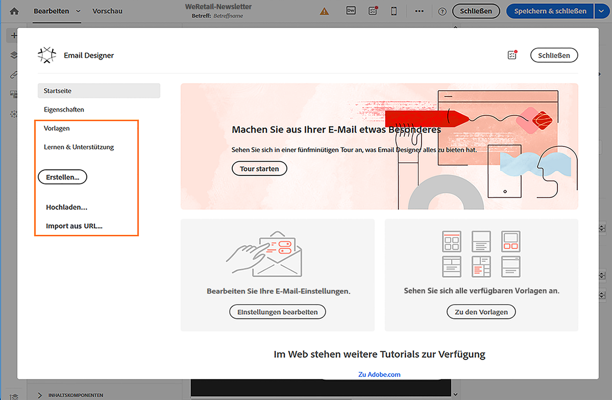
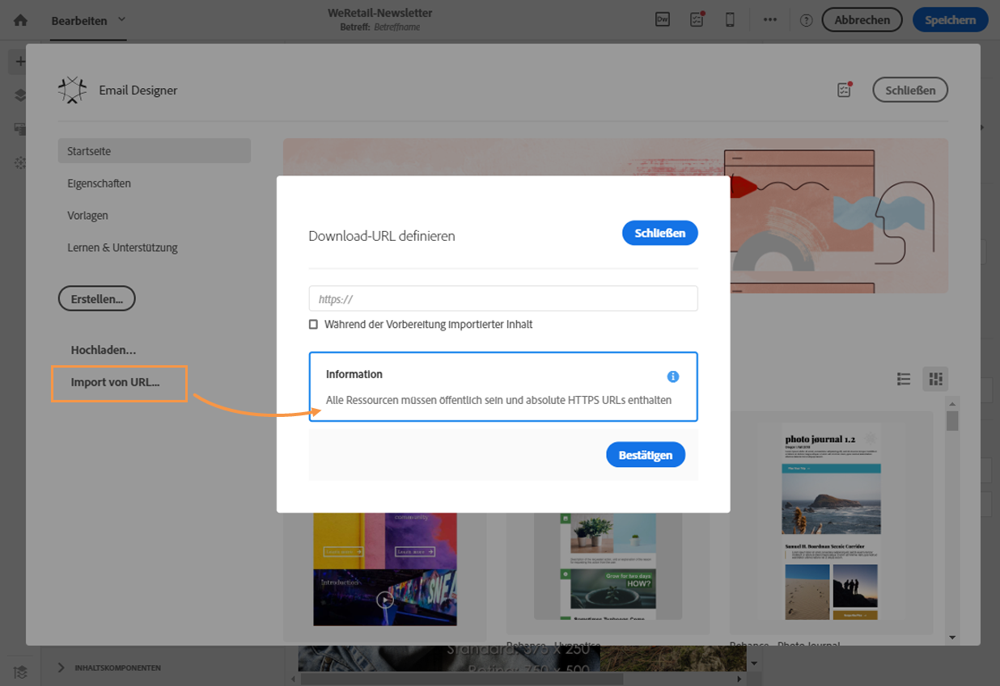
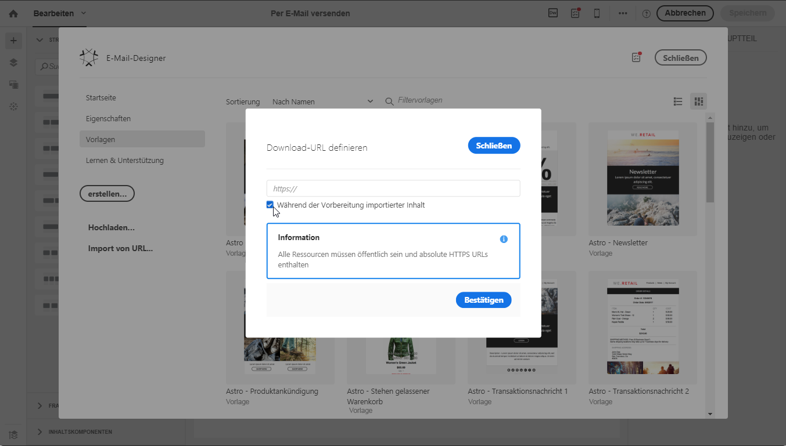
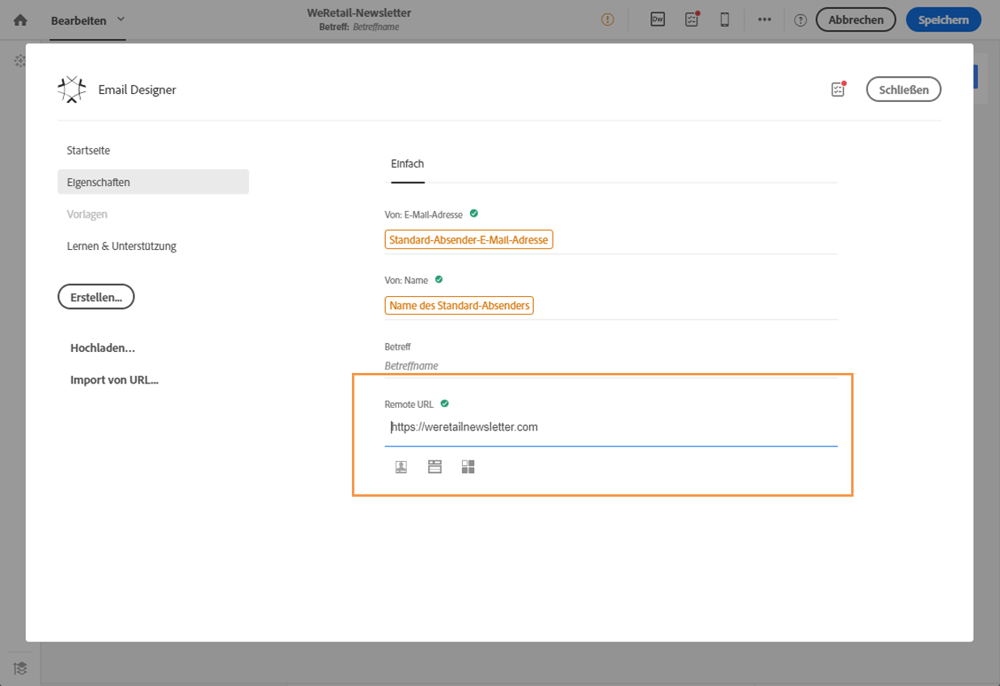
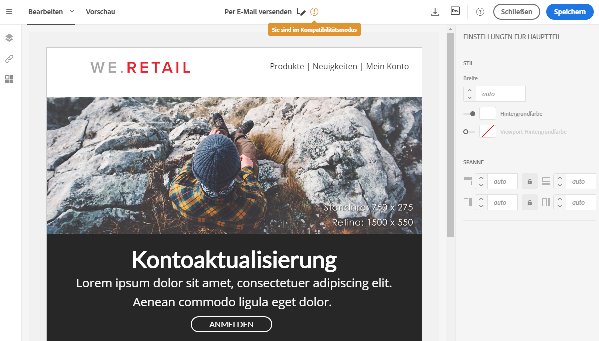

# Erstellen aus vorhandenen Inhalten {#designing-using-existing-content}

## Existierenden Inhalt auswählen{#selecting-an-existing-content}

Adobe Campaign beinhaltet eine Reihe vordefinierter Inhalte, mit denen Sie Ihre Aufgaben rascher ausführen können. Sie können entweder einen vorhandenen Inhalt verwenden oder einen außerhalb von Adobe Campaign vorbereiteten Inhalt von Ihrem Computer oder einer URL importieren.

Sie haben die Möglichkeit, bei der Erstellung einer E-Mail oder Landingpage existierenden Inhalt aus einer anderen Quelle zu laden.

>[!NOTE]
>
>In den unten stehenden Bildern sehen Sie, wie Sie existierenden Inhalt mit [Email Designer](../../designing/using/designing-content-in-adobe-campaign.md) laden können.

1. Öffnen Sie nach der Erstellung der E-Mail oder Landingpage deren Inhalt.
1. Wählen Sie das Startseiten-Symbol aus, um die Startseite von **[!UICONTROL Email Designer]** zu öffnen.

   

1. Wählen Sie die Quelle des Inhalts aus, den Sie laden möchten:

   * [Inhaltsvorlagen](../../designing/using/using-reusable-content.md#content-templates): Wählen Sie den Tab **[!UICONTROL Vorlagen]** aus.
   * [Neu erstellten Inhalt](../../designing/using/designing-from-scratch.md#designing-an-email-content-from-scratch): Wählen Sie die Schaltfläche **[!UICONTROL Erstellen]** aus.
   * [Inhalte von Ihrem Computer als ZIP- oder HTML-Datei](#importing-content-from-a-file): Wählen Sie die Schaltfläche **[!UICONTROL Hochladen]** aus.
   * [Inhalte von einer vorhandenen URL](#importing-content-from-a-url) (nur für E-Mails): Wählen Sie die Schaltfläche **[!UICONTROL Import von URL]** aus.

   

1. Laden Sie den Inhalt. Bei der Auswahl eines neuen Inhalts wird der aktuelle Inhalt automatisch ersetzt.

   Der Inhalt kann nach dem Import bearbeitet und personalisiert werden.

   >[!NOTE]
   >
   >[Email Designer](../../designing/using/designing-content-in-adobe-campaign.md) nutzt spezielles Tagging. Standardmäßiger HTML-Inhalt, der in Campaign geladen wird, muss diesem Tagging entsprechen, um mit Email Designer vollständig kompatibel und bearbeitbar zu sein. Ist dies nicht der Fall, wird der Inhalt im [Kompatibilitätsmodus](#compatibility-mode) geladen. Weiterführende Informationen dazu, wie Sie existierenden Inhalt kompatibel machen, finden Sie in [diesem Abschnitt](#editing-existing-contents-with-the-email-designer).

**Verwandte Themen:**

* [E-Mails erstellen](../../channels/using/creating-an-email.md)
* [Verwaltung von Landingpages](../../channels/using/getting-started-with-landing-pages.md)

## Existierenden Inhalt mit Email Designer bearbeiten{#editing-existing-contents-with-the-email-designer}

Um die Bearbeitungsmöglichkeiten von [Email Designer](../../designing/using/designing-content-in-adobe-campaign.md) vollständig nutzen zu können, muss Ihre hochgeladene HTML-Datei bestimmte Tags enthalten, damit sie mit dem WYSIWYG-Editor kompatibel ist.

Wenn die gesamte HTML-Datei oder Teile davon diese Tags nicht besitzt, wird der Inhalt im [Kompatibilitätsmodus](#compatibility-mode) geladen.

Wenn Sie bestehenden externen Inhalt in Email Designer bearbeiten möchten, lesen Sie den Abschnitt zum [Erstellen von E-Mails unter Verwendung von vorhandenem Inhalt](../../designing/using/using-existing-content.md).

## Vorhandenen E-Mail-Inhalt importieren {#importing}

### Inhalt aus einer Datei importieren {#importing-content-from-a-file}

Wählen Sie auf der Startseite von Email Designer die Schaltfläche **[!UICONTROL Hochladen]** aus, um eine Datei vom Computer hochzuladen, und bestätigen Sie anschließend den Vorgang.

Die Struktur des komprimierten Ordners ist freigestellt. Die HTML-Dateien müssen jedoch mit relativen Pfadangaben referenziert werden und die Baumstruktur des komprimierten Ordners respektieren.

Folgende Formate werden für den Import unterstützt:

* Eine HTML-Datei mit integriertem Stylesheet,
* Ein komprimierter Ordner (.zip) mit HTML-Datei, Stylesheet (.css) und Bildern.

>[!NOTE]
>
>Wir empfehlen, für E-Mail-Inhalt einzelne HTML-Dateien mit integriertem Stylesheet zu importieren.

#### Inhalt aus einer URL importieren {#importing-content-from-a-url}

Bevor Sie Inhalt aus einer URL importieren, vergewissern Sie sich, dass der Inhalt folgende Anforderungen erfüllt:

* Der Inhalt muss über diese URL öffentlich verfügbar sein.
* Aus Sicherheitsgründen sind nur URLs erlaubt, die mit **[!UICONTROL https]** beginnen.
* Achten Sie darauf, dass alle Ressourcen (Bilder, CSS) in absoluten Relationen und in HTTPS eingerichtet sind. Andernfalls wird die Mirrorseite nach dem Versand der E-Mail ohne ihre Ressourcen dargestellt. Hier ist ein Beispiel einer Definition einer absoluten Relation:

   ```
   <a href="https://www.mywebsite.com/images/myimage.png">
   ```

>[!NOTE]
>
>Das Laden von Inhalt aus einer URL ist nur für den E-Mail-Kanal verfügbar.

Um existierenden Inhalt von einer URL abzurufen, gehen Sie wie folgt vor:

1. Wählen Sie auf der Startseite von Email Designer die Schaltfläche **[!UICONTROL Import von URL]** aus.

   

1. Definieren Sie die URL, von der der Inhalt abgerufen werden soll.
1. Wählen Sie **[!UICONTROL Bestätigen]** aus.

 Funktion im Video kennenlernen.

>[!VIDEO](https://video.tv.adobe.com/v/25926?quality=12)

Weitere Anleitungsvideos zu Campaign Standard finden Sie [hier](https://experienceleague.adobe.com/docs/campaign-standard-learn/tutorials/overview.html?lang=de).

### Während der Vorbereitung Inhalt von einer URL automatisch abrufen {#retrieving-content-from-a-url-automatically-at-preparation-time}

Durch den Import von Inhalten von einer URL während der Nachrichtenvorbereitung wird immer bei der E-Mail-Vorbereitung der jeweils letzte HTML-Inhalt abgerufen. Dadurch ist der Inhalt wiederkehrender E-Mails zum Versandzeitpunkt immer aktuell. Mit dieser Funktion können Sie auch eine Nachricht für einen bestimmten Tag erstellen, auch wenn der Inhalt noch nicht bereit ist.

Um Inhalte in der Vorbereitungsphase abzurufen, gehen Sie wie folgt vor:

1. Wählen Sie die Option **[!UICONTROL Während der Vorbereitung importierter Inhalt]** aus.

   

1. Der URL-Inhalt wird im Editor als schreibgeschützt angezeigt.

   >[!CAUTION]
   >
   >Bei diesem Schritt sollte die HTML-Anzeige im Inhaltseditor nicht berücksichtigt werden. Sie wird in der Vorbereitungsphase abgerufen.

1. Um den abgerufenen URL-Inhalt in der Vorschau zu betrachten, öffnen Sie die Nachricht nach deren Erstellung und wählen Sie dann die Schaltfläche **[!UICONTROL Vorschau]** aus.

Die Remote URL, von der der Inhalt abgerufen wird, kann personalisiert werden. Gehen Sie dazu wie folgt vor:

1. Wählen Sie am oberen Bildschirmrand den Titel der E-Mail aus, um in Email Designer den Tab **[!UICONTROL Eigenschaften]** zu öffnen.
1. Gehen Sie zum Feld **[!UICONTROL Remote URL]**.

   

1. Fügen Sie das Personalisierungsfeld, den Inhaltsbaustein oder den dynamischen Text ein.

   Beispielsweise können Sie im Inhaltsbaustein **[!UICONTROL Aktuelles Datum – TTMMJJJJ]** das Datum eingeben.

   >[!NOTE]
   >
   >Die verfügbaren Personalisierungsfelder werden nur mit den Attributen für **Versand** verknüpft (Erstellungsdatum der E-Mail, Status, Kampagnentitel etc.).

Wenn der Download von Inhalten beim ersten Versuch fehlschlägt, kann er zweimal wiederholt werden:

1. Der zweite Versuch beginnt 50 ms nach dem ersten Versuch.
1. Der dritte Versuch beginnt 100 ms nach dem zweiten Versuch.

In folgenden Fällen sind diese Wiederholungen hilfreich:

* Ein kurzzeitiger Service-Ausfall auf einem entfernten Server
* Ein Server-Ausfall auf einem Cluster: In diesem Fall ist es dank des Lastenausgleichs an einen funktionierenden Server wahrscheinlicher, dass die weiteren Zustellversuche erfolgreich sind.

### Kompatibilitätsmodus {#compatibility-mode}

Beim Hochladen von Inhalt muss dieser ein bestimmtes Tagging aufweisen, um vollständig kompatibel und im WYSIWYG-Editor von Email Designer bearbeitbar zu sein.

Wenn die hochgeladenen HTML-Datei oder Teile davon nicht mit dem Tagging kompatibel ist, wird der Inhalt im so genannten Kompatibilitätsmodus geladen, in dem die Bearbeitungsmöglichkeiten über die Benutzeroberfläche eingeschränkt sind.

Im Kompatibilitätsmodus können Sie die folgenden Änderungen über die Benutzeroberfläche vornehmen (nicht verfügbare Aktionen sind verborgen):

* Ändern des Textes oder eines Bildes
* Einfügen von Links und Personalisierungsfeldern
* Bearbeiten einiger Stiloptionen im ausgewählten HTML-Baustein
* Definieren von bedingten Inhalten



Sonstige Änderungen, wie etwa das Hinzufügen neuer Bereiche zu Ihrer E-Mail oder deren zusätzliche Gestaltung, müssen direkt im Quellcode der E-Mail im HTML-Modus vorgenommen werden.

Weiterführende Informationen zur Konvertierung einer vorhandenen E-Mail in eine mit Email Designer kompatible E-Mail finden Sie in [diesem Abschnitt](../../designing/using/using-existing-content.md).

**Verwandtes Thema**:

* [E-Mails erstellen](../../channels/using/creating-an-email.md)
* [Einführungsvideo für Email Designer](../../designing/using/designing-content-in-adobe-campaign.md#video)
* [Neuen E-Mail-Inhalt gestalten](../../designing/using/designing-from-scratch.md#designing-an-email-content-from-scratch)

## Konvertieren von HTML-Inhalten {#converting-an-html-content}

Wenn Sie sich selbst ein Rahmenwerk aus modularen Vorlagen und Fragmenten erstellen möchten, um sie in künftigen E-Mails wiederzuverwenden und zu kombinieren, sollten Sie Ihre E-Mail-HTML-Inhalte in Email Designer-Vorlagen konvertieren.

In diesem Anwendungsbeispiel erfahren Sie, wie Sie eine HTML-E-Mail rasch in Email Designer-Komponenten konvertieren können.

>[!CAUTION]
>
>Dieser Abschnitt richtet sich an Benutzer mit fortgeschrittenen HTML-Kenntnissen.

>[!NOTE]
>
>Wie im Kompatibilitätsmodus ist eine HTML-Komponente nur beschränkt bearbeitbar: Sie kann nur an Ort und Stelle bearbeitet werden.

Achten Sie darauf, dass der ursprüngliche HTML-Code außerhalb von Email Designer in wiederverwendbare Bereiche unterteilt ist.

Ist dies nicht der Fall, schneiden Sie die unterschiedlichen Bestandteile aus Ihrem HTML-Code aus. Beispiel:

```
<!-- 3 COLUMN w/CTA (SCALED) -->
<table width="100%" align="center" cellspacing="0" cellpadding="0" border="0" role="presentation" style="max-width:680px;">
<tbody>
<tr>
<td class="padh10" align="center" valign="top" style="padding:0 5px 20px 5px;">
<table width="100%" cellspacing="0" cellpadding="0" border="0" role="presentation">
<tbody>
<tr>
...
</tr>
</tbody>
</table>
</td>
</tr>
</tbody>
</table>
<!-- //3 COLUMN w/CTA (SCALED) -->
```

Sobald Sie alle Bestandteile identifiziert haben, wiederholen Sie in Email Designer folgenden Vorgang für jeden Teil Ihrer vorhandenen E-Mail:

1. Öffnen Sie Email Designer, um leeren E-Mail-Inhalt zu erstellen.
1. Legen Sie die Attribute für den Hauptteil fest: Hintergrundfarben, Breite etc. Weiterführende Informationen dazu finden Sie im Abschnitt [E-Mail-Stile bearbeiten](../../designing/using/styles.md).
1. Fügen Sie eine Strukturkomponente hinzu. Weiterführende Informationen dazu finden Sie im Abschnitt zum [Bearbeiten des E-Mail-Aufbaus](../../designing/using/designing-from-scratch.md#defining-the-email-structure).
1. Fügen Sie eine HTML-Komponente hinzu. Weiterführende Informationen dazu finden Sie im Abschnitt [Fragmente und Inhaltskomponenten hinzufügen](../../designing/using/designing-from-scratch.md#defining-the-email-structure).
1. Fügen Sie Ihren HTML-Code mit Copy &amp; Paste in diese Komponente ein.
1. Zur Mobile-Ansicht wechseln. Weiterführende Informationen hierzu finden Sie in [diesem Abschnitt](../../designing/using/plain-text-html-modes.md#switching-to-mobile-view).

   Die responsive Ansicht ist fehlerhaft, da Ihr CSS fehlt.

1. Um dieses Problem zu beheben, wechseln Sie zum Quellcode-Modus und kopieren Sie Ihren CSS-Abschnitt in einen neuen CSS-Abschnitt. Beispiel:

   ```
   <style type="text/css">
   a {text-decoration:none;}
   body {min-width:100% !important; margin:0 auto !important; padding:0 !important;}
   img {line-height:100%; text-decoration:none; -ms-interpolation-mode:bicubic;}
   ...
   </style>
   ```

   >[!NOTE]
   >
   >Stellen Sie sicher, dass Sie Ihren Stil nach diesem Abschnitt in einem anderen CSS-Tag hinzufügen.
   >
   >Verändern Sie das von Email Designer erzeugte CSS nicht:
   >
   >* `<style data-name="default" type="text/css">(##)</style>`
   >* `<style data-name="supportIOS10" type="text/css">(##)</style>`
   >* `<style data-name="mediaIOS8" type="text/css">(##)</style>`
   >* `<style data-name="media-default-max-width-500px" type="text/css">(##)</style>`
   >* `<style data-name="media-default--webkit-min-device-pixel-ratio-0" type="text/css">(##)</style>`


1. Kehren Sie zur mobilen Ansicht zurück und prüfen Sie, ob Ihr Inhalt korrekt angezeigt wird, und speichern Sie Ihre Änderungen.
