# Produktlisten in Transaktionsnachrichten verwenden {#using-product-listings}

>[!IMPORTANT]
>
>Produktlisten sind für **Transaktions-E-Mails** nur in der Benutzeroberfläche von [Email Designer](../../designing/using/designing-content-in-adobe-campaign.md#email-designer-interface) verfügbar.

Beim Bearbeiten des Inhalts einer Transaktions-E-Mail können Sie Produktlisten erstellen, die auf eine oder mehrere Datenkollektionen verweisen. Beispielsweise können Sie bei einem abgebrochenen Einkauf eine E-Mail versenden, in der alle Produkte samt Bild, Preis und Link aufgelistet sind, die sich beim Verlassen der Website im Warenkorb des Benutzers befanden.

Um eine Liste mit Produkten aus einem abgebrochenen Einkauf in eine Transaktionsnachricht einzufügen, folgen Sie den unten stehenden Schritten.

Sie können sich die erforderlichen Schritte zur Konfiguration von Produktlisten in einer Transaktions-E-Mail auch in [diesen Videos](https://experienceleague.adobe.com/docs/campaign-standard-learn/tutorials/designing-content/product-listings-in-transactional-email.html?lang=de#configure-product-listings-in-transactional-emails) ansehen.

>[!NOTE]
>
>Adobe Campaign unterstützt keine verschachtelten Produktlisten, was bedeutet, dass Sie keine Produktliste in eine andere einfügen können.

## Produktliste definieren            {#defining-a-product-listing}

Damit Sie eine Produktliste in einer Transaktionsnachricht verwenden können, müssen Sie zuerst auf Ereignisebene die Liste der Produkte und die Felder für jedes Produkt der Liste definieren, die angezeigt werden sollen. Weiterführende Informationen dazu finden Sie im Abschnitt [Datenkollektionen definieren](../../channels/using/configuring-transactional-event.md#defining-data-collections).

1. Wählen Sie in der Transaktionsnachricht den jeweiligen **[!UICONTROL Inhaltsbaustein]** aus, um den E-Mail-Inhalt zu ändern.
1. Fügen Sie mit Drag-and-Drop eine Strukturkomponente in den Arbeitsbereich ein. Weiterführende Informationen dazu finden Sie unter [E-Mail-Aufbau definieren](../../designing/using/designing-from-scratch.md#defining-the-email-structure).

   Wählen Sie beispielsweise den einspaltigen Aufbau aus und fügen Sie eine Textkomponente, eine Bildkomponente und eine Schaltflächen-Komponente hinzu. Weiterführende Informationen dazu finden Sie unter [Inhaltskomponenten verwenden](../../designing/using/designing-from-scratch.md#about-content-components).

1. Wählen Sie die soeben erstellte Strukturkomponente und danach in der kontextuellen Symbolleiste das Symbol zum **[!UICONTROL Aktivieren einer Produktliste]** aus.

   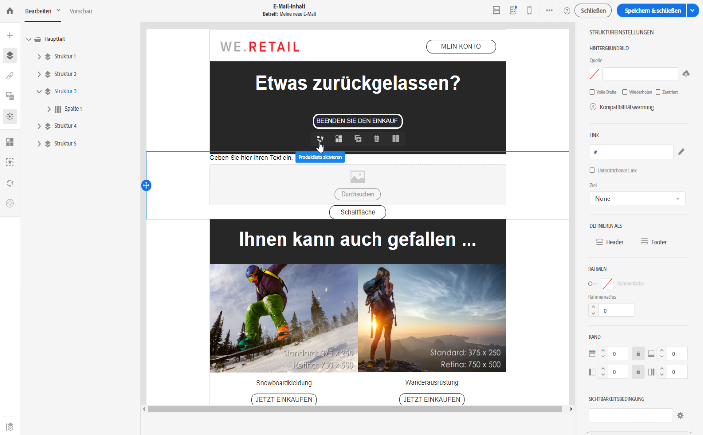

   Die Strukturkomponente wird durch einen orangen Rahmen hervorgehoben und die Einstellungsoptionen für **[!UICONTROL Produktliste]** werden auf der linken Seite geöffnet.

   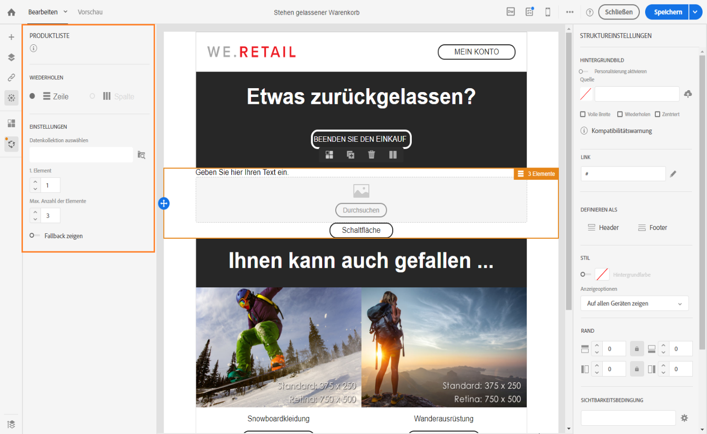

1. Wählen Sie aus, wie die Elemente der Sammlung dargestellt werden sollen:

   * **[!UICONTROL Zeile]**: horizontal, also alle Elemente einer Reihe untereinander.
   * **[!UICONTROL Spalte]**: vertikal, also alle Elemente in einer Reihe nebeneinander.

   >[!NOTE]
   >
   >Die Option **[!UICONTROL Spalte]** ist nur verfügbar, wenn eine mehrspaltige Strukturkomponente verwendet wird (**[!UICONTROL 2-2-Spalte]**, **[!UICONTROL 3-3-Spalte]** und **[!UICONTROL 4-4-Spalte]** ). Füllen Sie bei der Bearbeitung der Produktliste nur die erste Spalte aus. Die anderen Spalten werden nicht berücksichtigt. Weiterführende Informationen zur Auswahl von Strukturkomponenten finden Sie unter [E-Mail-Aufbau definieren](../../designing/using/designing-from-scratch.md#defining-the-email-structure).

1. Wählen Sie die Datenkollektion aus, die Sie erstellt haben, als Sie das mit der Transaktionsnachricht in Verbindung stehende Ereignis konfiguriert haben. Sie finden sie im Knoten **[!UICONTROL Kontext]** > **[!UICONTROL Echtzeit-Ereignis]** > **[!UICONTROL Ereignis-Kontext]**.

   

   Weiterführende Informationen zur Konfiguration des Ereignisses finden Sie im Abschnitt [Datenkollektionen definieren](../../channels/using/configuring-transactional-event.md#defining-data-collections).

1. Wählen Sie in der Dropdown-Liste **[!UICONTROL 1. Element]** das Element aus, das in der Liste der E-Mail als erstes Element erscheinen soll.

   Wenn Sie z. B. &quot;2&quot; auswählen, wird das erste Element der Sammlung nicht in der E-Mail angezeigt. Die Produktliste beginnt in diesem Fall mit dem zweiten Element.

1. Wählen Sie die Höchstzahl der Elemente aus, die in der Liste angezeigt werden sollen.

   >[!NOTE]
   >
   >Wenn die Elemente in Ihrer Liste senkrecht dargestellt werden sollen (**[!UICONTROL Spalte]**), entspricht die Höchstzahl der Elemente der ausgewählten Strukturkomponente (2, 3 oder 4 Spalten). Weiterführende Informationen zur Auswahl von Strukturkomponenten finden Sie im Abschnitt zum [Bearbeiten des E-Mail-Aufbaus](../../designing/using/designing-from-scratch.md#defining-the-email-structure).

## Produktliste befüllen            {#populating-the-product-listing}

Gehen Sie folgendermaßen vor, um eine Liste mit Produkten darzustellen, die von dem Ereignis stammen, das mit der Transaktions-E-Mail verknüpft ist.

Weiterführende Informationen zur Erstellung einer Kollektion und der entsprechenden Felder bei der Konfiguration des Ereignisses finden Sie unter [Datenkollektionen definieren](../../channels/using/configuring-transactional-event.md#defining-data-collections).

1. Wählen Sie die zuvor eingefügte Bildkomponente und dann **[!UICONTROL Personalisierung aktivieren]** aus. Wählen Sie danach das Stiftsymbol im Einstellungsbereich aus.

   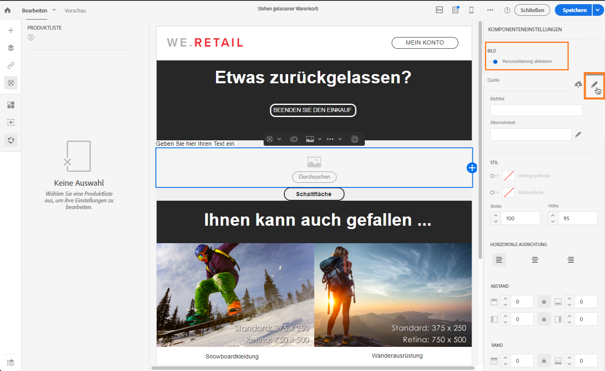

1. Wählen Sie im sich öffnenden Fenster **[!UICONTROL Bildquellen-URL]** die Option **[!UICONTROL Personalisierungsfeld hinzufügen]** aus.

   Öffnen Sie im Knoten **[!UICONTROL Kontext]** > **[!UICONTROL Echtzeit-Ereignis]** > **[!UICONTROL Ereignis-Kontext]** den Knoten der von Ihnen erstellten Kollektion (hier **[!UICONTROL Produktliste]**) und wählen Sie das von Ihnen definierte Bild-Feld aus (hier **[!UICONTROL Produktbild]** ). Wählen Sie **[!UICONTROL Speichern]** aus.

   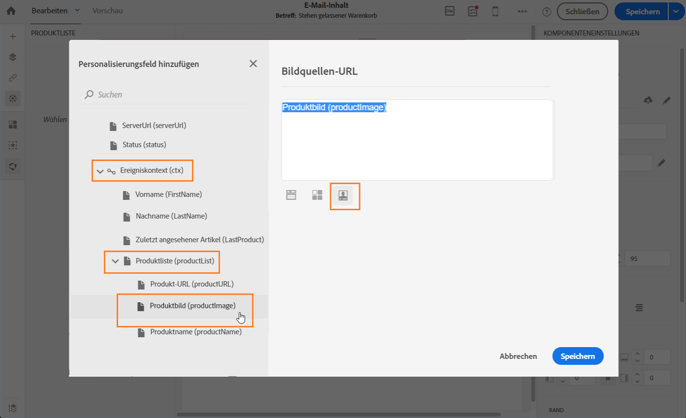

   Das von Ihnen ausgewählte Personalisierungsfeld wird jetzt im Einstellungsbereich angezeigt.

1. Wählen Sie in der kontextuellen Symbolleiste an der gewünschten Position **[!UICONTROL Personalisierungsfeld einfügen]** aus.

   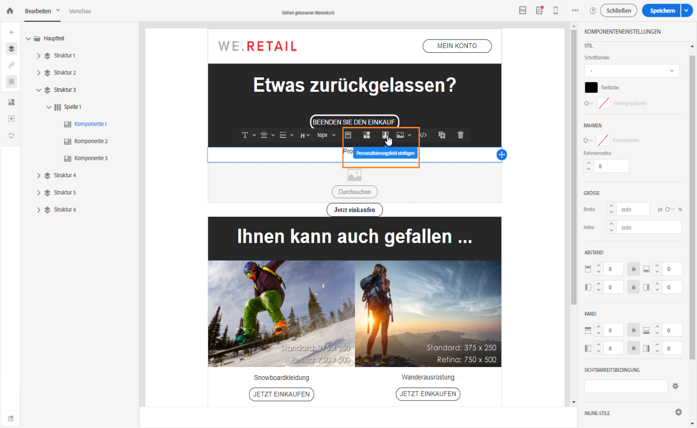

1. Öffnen Sie im Knoten **[!UICONTROL Kontext]** > **[!UICONTROL Echtzeit-Ereignis]** > **[!UICONTROL Ereignis-Kontext]** den Knoten der von Ihnen erstellten Kollektion (hier **[!UICONTROL Produktliste]**) und wählen Sie das von Ihnen erstellte Feld aus (hier **[!UICONTROL Produktname]**). Wählen Sie **[!UICONTROL Bestätigen]** aus.

   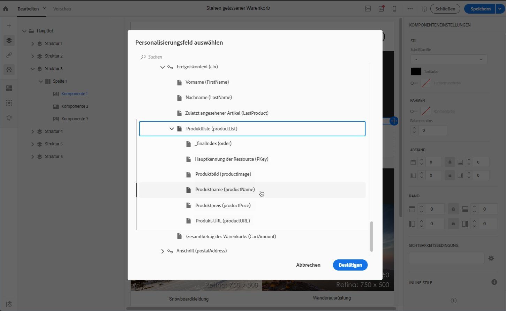

   Das von Ihnen ausgewählte Personalisierungsfeld wird jetzt an der gewünschten Position im E-Mail-Inhalt dargestellt.

1. Gehen Sie beim Einfügen des Preises analog vor.
1. Wählen Sie den Text und dann in der kontextuellen Symbolleiste **[!UICONTROL Link einfügen]** aus.

   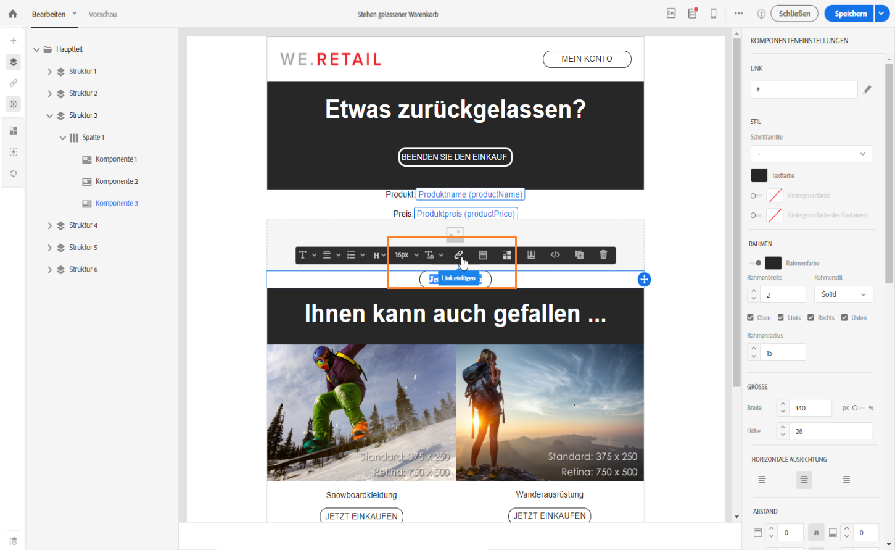

1. Wählen Sie im sich öffnenden Fenster **[!UICONTROL Link einfügen]** die Option **[!UICONTROL Personalisierungsfeld hinzufügen]** aus.

   Öffnen Sie im Knoten **[!UICONTROL Kontext]** > **[!UICONTROL Echtzeit-Ereignis]** > **[!UICONTROL Ereignis-Kontext]** den Knoten der von Ihnen erstellten Kollektion (hier **[!UICONTROL Produktliste]**) und wählen Sie das von Ihnen erstellte URL-Feld aus (hier **[!UICONTROL Produkt-URL]**). Wählen Sie **[!UICONTROL Speichern]** aus.

   >[!IMPORTANT]
   >
   >Achten Sie aus Sicherheitsgründen darauf, dass Sie das Personalisierungsfeld in einen Link einfügen, der mit einem statischen Domain-Namen beginnt.

   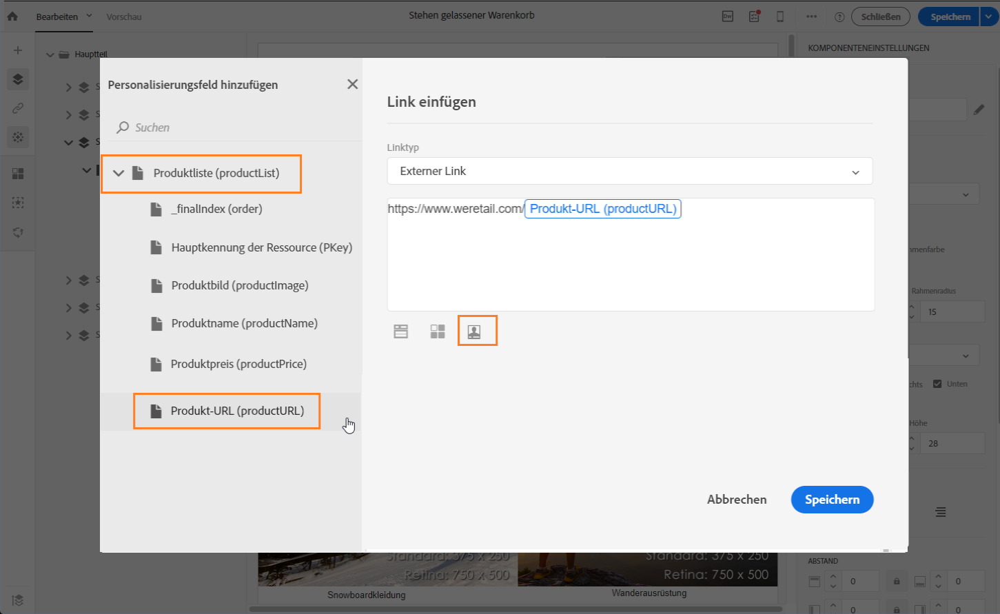

   Das von Ihnen ausgewählte Personalisierungsfeld wird jetzt im Einstellungsbereich angezeigt.

1. Wählen Sie die Strukturkomponente aus, auf die die Produktliste angewendet wird, und wählen Sie danach **[!UICONTROL Fallback zeigen]** aus, um den Standardinhalt zu definieren.

   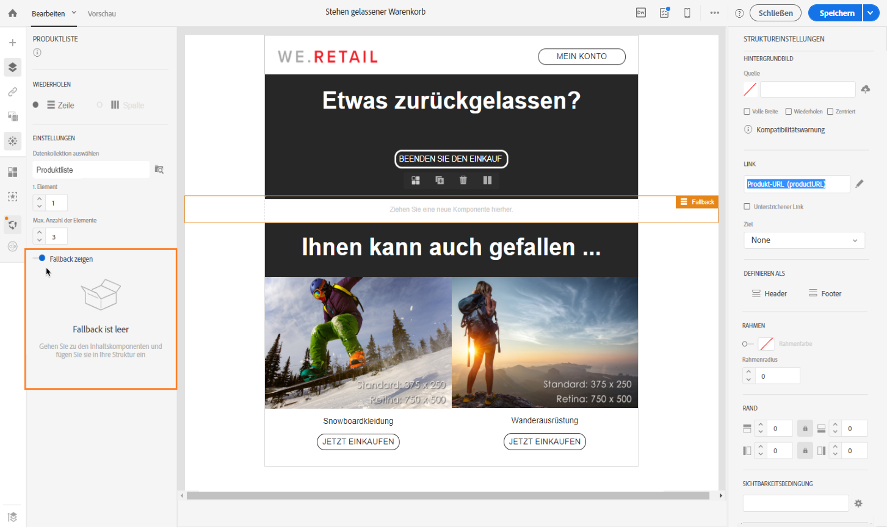

1. Ziehen Sie eine oder mehrere Inhaltskomponenten in den Arbeitsbereich und bearbeiten Sie sie nach Bedarf.

   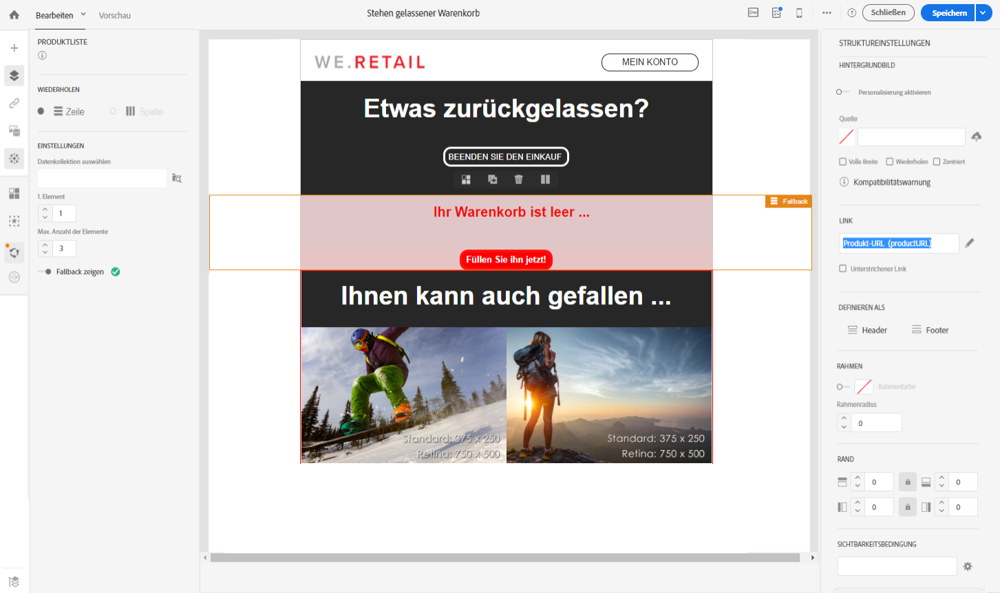

   Der Fallback-Inhalt wird angezeigt, wenn die Sammlung beim Auslösen des Triggers leer ist. Das ist beispielsweise dann der Fall, wenn ein Kunde nichts im Warenkorb liegen hat.

1. Bearbeiten Sie im Einstellungsbereich die Formatvorlagen der Produktliste. Weitere Informationen dazu finden Sie im Abschnitt [E-Mail-Stile verwalten](../../designing/using/styles.md).
1. Sehen Sie sich die E-Mail in der Vorschau an, indem Sie ein Testprofil verwenden, das mit dem entsprechenden Transaktionsereignis verknüpft ist und für das Sie Sammlungsdaten definiert haben. Fügen Sie für das Testprofil, das Sie verwenden möchten, beispielsweise die folgenden Informationen zum Abschnitt **[!UICONTROL Ereignisdaten]** hinzu:

   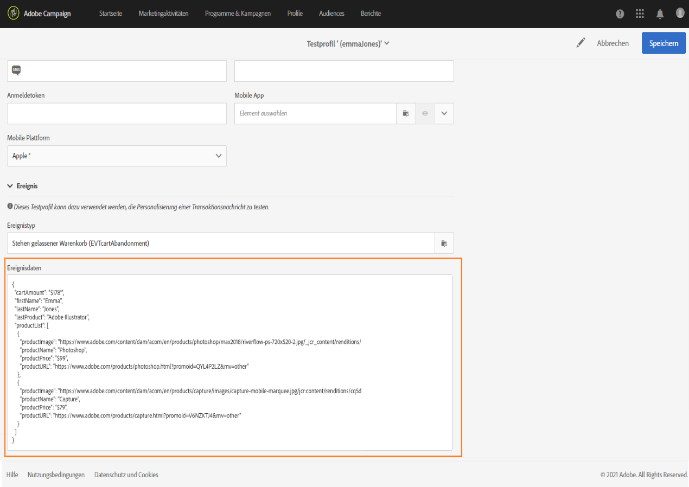

   Weiterführende Informationen zur Definition eines Testprofils in einer Transaktionsnachricht finden Sie in [diesem Abschnitt](../../channels/using/testing-transactional-message.md#defining-specific-test-profile).
