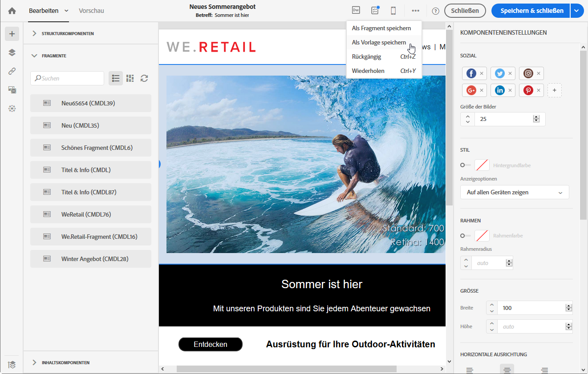
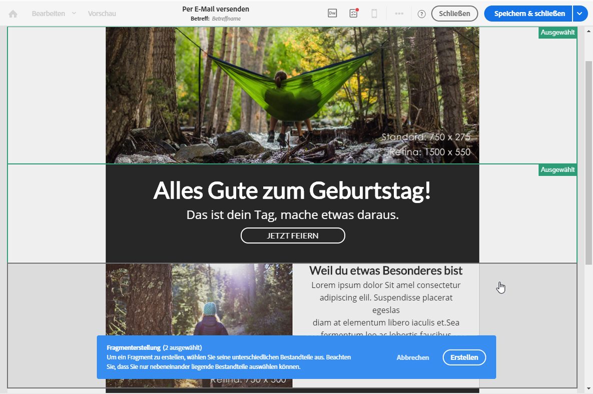

# Erstellen und Verwenden wiederverwendbarer Inhalte {#using-reusable-content}

Erfahren Sie, wie Sie die Bearbeitung Ihrer E-Mail-Inhalte meistern. In Email Designer können Sie Vorlagen und Fragmente mit eigenen vordefinierten Inhalten erstellen und diese in künftigen E-Mails wiederverwenden.

## Erstellen von E-Mails mit Vorlagen {#designing-templates}

>[!NOTE]
>
> In Adobe Campaign Standard können Sie verschiedene Arten von Vorlagen erstellen, auf die Sie über das Menü **Ressourcen** > **Vorlagen** zugreifen können. In Email Designer werden Inhaltsvorlagen verwendet. Weitere Informationen finden Sie unter [Über Vorlagen](../../start/using/marketing-activity-templates.md).

### Über Inhaltsvorlagen {#content-templates}

Sie können HTML-Inhalte verwalten, die im Tab **[!UICONTROL Vorlagen]** auf der Startseite von [Email Designer](../../designing/using/designing-content-in-adobe-campaign.md) verfügbar sind.

Die nativen E-Mail-Inhaltsvorlagen enthalten 18 für Mobilgeräte optimierte Layouts und vier von Behance-Künstlern erstellte responsive Vorlagen. Diese decken die häufigsten Anwendungsfälle ab, wie Willkommensnachrichten für Kunden, Newsletter und Re-Engagement-E-Mails. In diese Vorlagen können Sie Ihre eigenen Markeninhalte einfügen und müssen dadurch E-Mails nicht von Grund auf neu erstellen.

Der Zugriff auf die HTML-Inhaltsvorlagen erfolgt über das Fenster **[!UICONTROL Ressourcen]** > **[!UICONTROL Inhaltsvorlagen und -fragmente]** in [Erweitertes Menü](../../start/using/interface-description.md#advanced-menu). Dort können Sie Landingpage-Inhaltsvorlagen, E-Mail-Inhaltsvorlagen und Fragmente verwalten.

Die nativen Inhaltsvorlagen sind schreibgeschützt. Um bearbeitet werden zu können, müssen sie zuerst dupliziert werden.

Sie können auch neue Vorlagen oder Fragmente erstellen und eigene Inhalte definieren. Weiterführende Informationen dazu finden Sie in den Abschnitten zum [Erstellen einer Inhaltsvorlage](#creating-a-content-template) und zum [Erstellen eines Inhaltsfragments](#creating-a-content-fragment).

Bei der Bearbeitung von Inhalt mit Email Designer können Sie auch Inhaltsvorlagen erstellen, indem Sie Inhalt als ein Fragment oder eine Vorlage speichern. Weiterführende Informationen dazu finden Sie in den Abschnitten zum [Speichern von Inhalt als Vorlage](#saving-content-as-template) und zum [Speichern von Inhalt als Fragment](../../designing/using/using-reusable-content.md#saving-content-as-a-fragment).

**Verwandte Themen:**

* [In diesem Video](https://docs.adobe.com/content/help/en/campaign-learn/campaign-standard-tutorials/designing-content/email-designer/email-content-templates.html) erfahren Sie, wie Sie Inhaltsvorlagen personalisieren können.
* Weiterführende Informationen zum Bearbeiten von Inhalten finden Sie im Abschnitt [Über die Inhaltserstellung in E-Mails](../../designing/using/designing-content-in-adobe-campaign.md).

### Inhaltsvorlage erstellen {#creating-a-content-template}

Sie können eigene Inhaltsvorlagen erstellen und beliebig oft verwenden.

Das folgende Beispiel zeigt, wie eine E-Mail-Inhaltsvorlage erstellt wird.

1. Gehen Sie zu **[!UICONTROL Ressourcen]** > **[!UICONTROL Inhaltsvorlagen und -fragmente]** und wählen Sie **[!UICONTROL Erstellen]** aus.
1. Wählen Sie den Titel der E-Mail aus, um auf den Tab **[!UICONTROL Eigenschaften]** in Email Designer zuzugreifen.
1. Geben Sie einen charakteristischen Titel an und wählen Sie die folgenden Parameter aus, damit Sie diese Vorlage in E-Mails verwenden können.

   * Wählen Sie **[!UICONTROL Freigegeben]** oder **[!UICONTROL Versand]** in der Dropdown-Liste **[!UICONTROL Content-Typ]** aus.
   * Wählen Sie **[!UICONTROL Vorlage]** in der Dropdown-Liste **[!UICONTROL HTML-Typ]** aus.

   

1. Bei Bedarf können Sie ein Bild als Miniaturansicht für diese Vorlage festlegen. Wählen Sie es in den Vorlageneigenschaften im Tab **[!UICONTROL Miniaturansicht]** aus.

   

   Diese Miniaturansicht wird im Tab **[!UICONTROL Vorlagen]** auf der Startseite von [Email Designer](../../designing/using/designing-content-in-adobe-campaign.md) angezeigt.

1. Schließen Sie den Tab **[!UICONTROL Eigenschaften]**, um zum Hauptarbeitsbereich zurückzukehren.
1. Fügen Sie Struktur- und Inhaltskomponenten hinzu, die Sie nach Bedarf anpassen können.
   >[!NOTE]
   >
   > Sie können keine Personalisierungsfelder oder situationsbedingten Inhalt in eine Inhaltsvorlage einfügen.
1. Speichern Sie die Vorlage nach der Bearbeitung.

Diese Vorlage kann jetzt in jeder mit Email Designer erstellten E-Mail verwendet werden. Wählen Sie sie im Tab **[!UICONTROL Vorlagen]** auf der Startseite von [Email Designer](../../designing/using/designing-content-in-adobe-campaign.md) aus.

### Inhalt als Vorlage speichern {#saving-content-as-template}

Bei der Bearbeitung einer E-Mail mit Email Designer können Sie den Inhalt dieser E-Mail direkt als Vorlage speichern.

<!--[!CAUTION]
>
>You cannot save as template a structure containing personalization fields or dynamic content.-->

1. Wählen Sie in der Symbolleiste von Email Designer **[!UICONTROL Als Vorlage speichern]** aus.

   

1. Fügen Sie bei Bedarf einen Titel und eine Beschreibung hinzu und wählen Sie dann **[!UICONTROL Speichern]** aus.

   

1. Um die soeben erstellte Vorlage zu finden, gehen Sie zu **[!UICONTROL Ressourcen]** > **[!UICONTROL Inhaltsvorlagen und -fragmente]**.

1. Um Ihre neue Vorlage zu verwenden, wählen Sie sie im Tab **[!UICONTROL Vorlagen]** auf der Startseite von [Email Designer](../../designing/using/designing-content-in-adobe-campaign.md) aus.

   

### Erstellen einer Vorlage mit Fragmenten und Komponenten {#template-fragments-components}

Sie können jetzt mit Email Designer eine E-Mail-Vorlage erstellen. Mit Inhaltskomponenten können Sie die unterschiedlichen Bereiche der E-Mail gestalten und die Einstellungen so anpassen, dass das Ergebnis möglichst dem ursprünglichen Newsletter entspricht. Fügen Sie schließlich die soeben von Ihnen erstellten Fragmente ein.

1. Erstellen Sie mit Email Designer eine Vorlage. Weiterführende Informationen dazu finden Sie im Abschnitt [Inhaltsvorlagen](#content-templates).
1. Fügen Sie mehrere Strukturkomponenten in die Vorlage ein, die der Kopfzeile, Fußzeile und dem Textkörper Ihrer E-Mail entsprechen. Weiterführende Informationen zum Hinzufügen von Strukturkomponenten finden Sie im Abschnitt [Die E-Mail-Struktur mit Email Designer bearbeiten](../../designing/using/designing-from-scratch.md#defining-the-email-structure).
1. Fügen Sie so viele Inhaltskomponenten ein, wie Sie für die Erstellung Ihres Newsletters benötigen. Diesen Inhalt werden Sie in Ihrer E-Mail jeden Monat aktualisieren können.

   

   Wenn Sie HTML-Kenntnisse besitzen, empfiehlt Adobe, **[!UICONTROL HTML]**-Komponenten für komplexe Elemente der ursprünglichen E-Mail zu verwenden und diese zu kopieren und einzufügen. Für den restlichen Inhalt können Sie andere Komponenten wie **[!UICONTROL Schaltfläche]**, **[!UICONTROL Bild]** oder **[!UICONTROL Text]** verwenden. Weiterführende Informationen dazu finden Sie im Abschnitt [Über Inhaltskomponenten](../../designing/using/designing-from-scratch.md#about-content-components).

   >[!NOTE]
   >
   >Mit der **[!UICONTROL HTML]**-Komponente können Komponenten erstellt werden, die beschränkte Bearbeitungsmöglichkeiten bieten. Wählen Sie diese Komponente nur aus, wenn Sie mit der Handhabung von HTML-Code vertraut sind.

1. Passen Sie die Inhaltskomponenten so an, dass sie der ursprünglichen E-Mail möglichst ähnlich sind.

   

   Weiterführende Informationen zur Verwaltung von Stileinstellungen und Inline-Attributen finden Sie im Abschnitt [E-Mail-Stile bearbeiten](../../designing/using/styles.md).

1. Fügen Sie die zwei Fragmente (Kopf- und Fußzeile) ein, die Sie zuvor in der gewünschten Strukturkomponente erstellt haben.

   

1. Speichern Sie Ihre Vorlage.

Sie können diese Vorlage jetzt in Email Designer vollständig verwalten und damit einen Newsletter erstellen, aktualisieren und monatlich an Ihre Empfänger senden.

Erstellen Sie dazu eine E-Mail und wählen Sie die soeben von Ihnen erstellte Inhaltsvorlage aus.

**Verwandtes Thema**:

* [E-Mails erstellen](../../channels/using/creating-an-email.md)
* [Einführungsvideo für Email Designer](https://video.tv.adobe.com/v/22771/?autoplay=true&hidetitle=true&captions=ger)
* [Neuen E-Mail-Inhalt gestalten](../../designing/using/designing-from-scratch.md#designing-an-email-content-from-scratch)

## Über Fragmente     {#about-fragments}

>[!CONTEXTUALHELP]
>id="ac_fragments"
>title="Fragmente"
>abstract="Ein Fragment ist eine wiederverwendbare Komponente, die in einer oder mehreren E-Mails referenziert werden kann."

Ein Fragment ist eine wiederverwendbare Komponente, die in einer oder mehreren E-Mails referenziert werden kann.
Fragmente finden Sie in der Benutzeroberfläche unter **Ressourcen** > **Inhaltsfragmente und Vorlagen**.

So nutzen Sie Fragmente in Email Designer optimal:

* Eigene Fragmente erstellen: Siehe [Inhaltsfragment erstellen](#creating-a-content-fragment) und [Inhalt als Fragment speichern](#saving-content-as-a-fragment).
* Diese können beliebig oft in E-Mails verwendet werden. Siehe [Elemente in eine E-Mail einfügen](#inserting-elements-into-an-email).
* Wenn Sie ein Fragment bearbeiten, werden die Änderungen synchronisiert und automatisch in alle E-Mails eingefügt, die dieses Fragment enthalten (vorausgesetzt die E-Mails wurden noch nicht vorbereitet oder gesendet).

Wenn Fragmente zu einer E-Mail hinzugefügt werden, sind sie standardmäßig gesperrt. Wenn Sie ein Fragment für eine bestimmte E-Mail ändern möchten, können Sie die Synchronisation mit dem ursprünglichen Fragment aufheben, indem Sie es in der E-Mail, in der es verwendet wird, entsperren. Danach werden die Änderungen nicht mehr synchronisiert.

Um ein Fragment in einer E-Mail zu entsperren, wählen Sie zuerst das Fragment aus und danach das Sperrsymbol in der dedizierten Symbolleiste.

Dieses Fragment wird dann zu einer unabhängigen Komponente, die nicht mehr mit dem ursprünglichen Fragment verknüpft ist. Es kann dann wie jede andere Inhaltskomponente bearbeitet werden. Siehe [Über Inhaltskomponenten](../../designing/using/designing-from-scratch.md#about-content-components).

### Einfügen von Fragmenten in eine E-Mail {#inserting-elements-into-an-email}

Um den Inhalt Ihrer E-Mail zu definieren, können Sie Inhaltselemente in die zuvor platzierten Strukturkomponenten einfügen. Siehe auch den Abschnitt [E-Mail-Struktur bearbeiten](../../designing/using/designing-from-scratch.md#defining-the-email-structure)

1. Öffnen Sie die Inhaltselemente durch Auswahl des Zeichens **+** auf der linken Seite. Wählen Sie [Fragmente](#about-fragments) oder [Inhaltskomponenten](../../designing/using/designing-from-scratch.md#about-content-components) aus.
1. Wenn Sie bereits den Titel oder einen Teil des Titels des Fragments kennen, das Sie hinzufügen möchten, können Sie danach suchen.

   

1. Ziehen Sie ein Fragment oder eine Inhaltskomponente aus der Palette und legen Sie sie in der Strukturkomponente der E-Mail ab.

   

   Nachdem ein Element zur E-Mail hinzugefügt wurde, kann es innerhalb derselben Strukturkomponente oder in eine andere Strukturkomponente in der E-Mail verschoben werden.

   

1. Bearbeiten Sie das Element entsprechend den Anforderungen der jeweiligen E-Mail. Sie können Text, Links, Bilder etc. hinzufügen.

   >[!NOTE]
   >
   >Fragmente sind beim Hinzufügen zu einer E-Mail standardmäßig gesperrt. Wenn Sie ein Fragment für eine E-Mail verändern möchten, können Sie die Synchronisation mit dem ursprünglichen Fragment unterbrechen oder die gewünschten Änderungen direkt im Fragment vornehmen. Siehe [Über Fragmente](#about-fragments).

1. Wiederholen Sie diese Schritte für alle Elemente, die Sie zur E-Mail hinzufügen möchten.
1. Speichern Sie Ihre E-Mail.

Nachdem Inhalt in die E-Mail-Struktur geladen wurde, können Sie den Stil jedes Inhaltselements ändern. Siehe auch den Abschnitt zum [Bearbeiten von Elementen](../../designing/using/styles.md).

>[!NOTE]
>
>Änderungen eines Fragments werden automatisch mit den E-Mails synchronisiert, in denen das Fragment verwendet wird. Weiterführende Informationen dazu finden Sie im Abschnitt [Über Fragmente](#about-fragments).

### Inhaltsfragment erstellen     {#creating-a-content-fragment}

Sie können Ihre eigenen Inhaltsfragmente erstellen und nach Bedarf in einer oder in mehreren E-Mails verwenden.

1. Gehen Sie zu **[!UICONTROL Ressourcen]** > **[!UICONTROL Inhaltsvorlagen und -fragmente]** und wählen Sie **[!UICONTROL Erstellen]** aus.
1. Wählen Sie den Titel der E-Mail aus, um auf den Tab **[!UICONTROL Eigenschaften]** in Email Designer zuzugreifen.
1. Geben Sie einen charakteristischen Titel an und wählen Sie die folgenden Parameter aus, damit Sie das Fragment später bei der Bearbeitung des E-Mail-Inhalts wiederfinden.

   * Da Fragmente nur mit E-Mails kompatibel sind, wählen Sie aus der Dropdown-Liste **[!UICONTROL Inhaltstyp]** die Option **[!UICONTROL Versand]** aus.
   * Wählen Sie aus der Dropdown-Liste **[!UICONTROL HTML-Typ]** die Option **[!UICONTROL Fragment]** aus, um diesen Inhalt als Fragment verwenden zu können.

   

1. Bei Bedarf können Sie ein Bild als Miniaturansicht für dieses Fragment festlegen. Wählen Sie es in den Vorlageneigenschaften im Tab **[!UICONTROL Miniaturansicht]** aus.

   

   Diese Miniaturansicht wird beim Bearbeiten einer E-Mail neben dem Titel des Fragments angezeigt.

1. Schließen Sie den Tab **[!UICONTROL Eigenschaften]**, um zum Hauptarbeitsbereich zurückzukehren.
1. Fügen Sie Struktur- und Inhaltskomponenten hinzu, die Sie nach Bedarf anpassen können.

   >[!CAUTION]
   >
   >Fragmente können keine Personalisierungsfelder, dynamischen Inhalte oder andere Fragmente enthalten.
   >
   >Speichern Sie Inhalt nicht als Fragmentinhalt mit leeren Strukturkomponenten. Sobald das Fragment eingefügt wurde, kann es nicht mehr bearbeitet werden.
   >
   >Die [Mobile-Ansicht](../../designing/using/plain-text-html-modes.md#switching-to-mobile-view) ist nicht in Fragmenten verfügbar.

1. Speichern Sie das Fragment nach der Bearbeitung.

Dieses Fragment kann jetzt in jeder mit Email Designer erstellten E-Mail verwendet werden. Es wird in der Palette im Bereich **[!UICONTROL Fragmente]** angezeigt.

>[!NOTE]
>
>Sie können nur dann Personalisierungsfelder in einem Fragment einfügen, wenn es in einer E-Mail verwendet wird und gesperrt ist. Siehe [Über Fragmente](#about-fragments).

### Inhalt als Fragment speichern     {#saving-content-as-a-fragment}

Bei der Bearbeitung einer E-Mail mit Email Designer können Sie direkt einen Teil dieser E-Mail als Fragment speichern.

* Strukturen, die Personalisierungsfelder, dynamische Inhalte oder ein anderes Fragment enthalten, können nicht als Fragment gespeichert werden.
* Sie können nur nebeneinander liegende Strukturen auswählen.
<!-- - You cannot select an empty structure.-->

1. Wählen Sie bei der Bearbeitung einer E-Mail in Email Designer in der Hauptsymbolleiste **[!UICONTROL Als Fragment speichern]** aus.

   

1. Wählen Sie im Arbeitsbereich die Strukturen aus, aus denen das Fragment bestehen soll.

   

   >[!NOTE]
   >
   >Achten Sie dabei darauf, dass die ausgewählten Strukturen nebeneinander liegen und keine Personalisierungsfelder, dynamischen Inhalte oder ein anderes Fragment enthalten.
   <!--You cannot select an empty structure.-->

1. Wählen Sie **[!UICONTROL Erstellen]** aus.

1. Fügen Sie bei Bedarf einen Titel und eine Beschreibung hinzu und wählen Sie dann **[!UICONTROL Speichern]** aus.

   

1. Um das soeben erstellte Fragment zu finden, gehen Sie zu **[!UICONTROL Ressourcen]** > **[!UICONTROL Inhaltsvorlagen und -fragmente]**.

   

1. Um das neue Fragment zu verwenden, öffnen Sie einen beliebigen E-Mail-Inhalt und wählen Sie es aus der Liste der Fragmente aus.

>[!NOTE]
>Die [Mobile-Ansicht](../../designing/using/plain-text-html-modes.md#switching-to-mobile-view) ist nicht in Fragmenten verfügbar. Wenn Sie die Mobile-Ansicht einer E-Mail bearbeiten möchten, tun Sie das, bevor Sie Ihren Inhalt als Fragment speichern.

<!--You need to copy-paste the HTML corresponding to the section that you want to save into a new fragment.

>[!NOTE]
>
>To do this, you need to be familiar with HTML code.

To save as a fragment some email content that you created, follow the steps below.

1. When editing an email in the Email Designer, select **[!UICONTROL Edit]** > **[!UICONTROL HTML]** to open the HTML version of that email.
1. Select and copy the HTML corresponding to the part that you want to save.
1. Go to **[!UICONTROL Resources]** > **[!UICONTROL Content templates & fragments]** and click **[!UICONTROL Create]**.
1. Click the email label to access the **[!UICONTROL Properties]** tab of the Email Designer and select **[!UICONTROL Fragment]** from the **[!UICONTROL HTML type]** drop-down list.
1. Select **[!UICONTROL Edit]** > **[!UICONTROL HTML]** to open the HTML version of the fragment.
1. Paste the HTML that you copied where appropriate.
1. Switch back to the **[!UICONTROL Edit]** view to check the result and save the new fragment.-->

## Erstellen wiederverwendbarer Kopf- und Fußzeilen aus Fragmenten {#header-footer-fragments}

Erstellen Sie mit Email Designer für jeden wiederverwendbaren Bereich ein Fragment. Für unser Beispiel brauchen wir zwei Fragmente: eines für die Kopfzeile und eines für die Fußzeile. Kopieren Sie dann die entsprechenden Teile aus dem existierenden Inhalt in diese Fragmente.

Gehen Sie dazu wie folgt vor:

1. Gehen Sie in Adobe Campaign zu **[!UICONTROL Ressourcen]** > **[!UICONTROL Inhaltsvorlagen und -fragmente]** und erstellen Sie ein Fragment für die Kopfzeile. Weiterführende Informationen dazu finden Sie im Abschnitt [Inhaltsfragment erstellen](#creating-a-content-fragment).
1. Fügen Sie beliebig viele Strukturkomponenten zu diesem Fragment hinzu.

   

1. Fügen Sie Bild- und Textkomponenten in Ihre Struktur ein.

   

1. Laden Sie das entsprechende Bild hoch, geben Sie Ihren Text ein und passen Sie die Einstellungen an.

   

1. Speichern Sie Ihr Fragment.
1. Gehen Sie bei der Erstellung der Fußzeile analog vor und speichern Sie sie.

   

Ihre Fragmente können jetzt in einer Vorlage verwendet werden.
