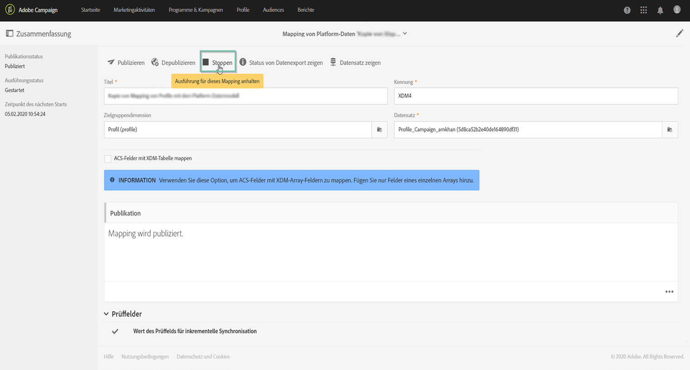

# Datenerfassung über APIs aktivieren {#triggering-data-ingestion-apis}

>[!IMPORTANT]
>
>Adobe Experience Platform Data Connector befindet sich derzeit in der Betaphase, die häufig ohne Vorankündigung aktualisiert werden kann. Kunden müssen auf Azure gehostet werden (derzeit nur für Nordamerika in der Betaphase), um auf diese Funktionen zugreifen zu können. Wenden Sie sich an die Adobe-Kundenunterstützung, wenn Sie Zugriff haben möchten.

Mit Adobe Campaign Standard können Sie die sofortige Erfassung von Daten-Mappings über APIs aktivieren und den Status der Aufnahmeanfragen abrufen.

Auf dieser Seite wird beschrieben, wie Sie den Aufnahmestatus Ihrer Daten-Mappings aktivieren und abrufen. Globale Informationen zu Campaign Standard-APIs finden Sie in [diesem Abschnitt](../../api/using/get-started-apis.md).

## Voraussetzungen {#prerequisites}

Bevor Sie die APIs verwenden, muss das Daten-Mapping zunächst in der Benutzeroberfläche von Campaign Standard konfiguriert und publiziert worden sein. Lesen Sie diesbezüglich auch diese Abschnitte:

* [Mapping-Definition](../../developing/using/aep-mapping-definition.md)
* [Mapping-Aktivierung](../../developing/using/aep-mapping-activation.md)

Nachdem das Daten-Mapping erstellt wurde, müssen Sie seine Ausführung stoppen, damit es jederzeit über die APIs aktiviert werden kann. Gehen Sie dazu wie folgt vor:

1. Gehen Sie in Campaign Standard zum Menü **[!UICONTROL Administration]** > **[!UICONTROL Entwicklung]** > **[!UICONTROL Plattform]** > **[!UICONTROL Status des Datenexports zu Platform]**.

1. Doppelklicken Sie auf das Daten-Mapping, um es zu öffnen, und wählen Sie dann die Schaltfläche **[!UICONTROL Stoppen]** aus.

   

1. Speichern Sie Ihre Änderungen

Die Ausführung des Daten-Mappings wurde somit angehalten. Sie können die Ausführung mithilfe von Campaign Standard-APIs manuell aktivieren.

## Sofortige Aufnahme des Daten-Mappings starten {#starting-immediate-ingestion}

Die sofortige Aufnahme eines XDM-Mappings in Adobe Experience Platform wird mit einem POST-Vorgang ausgelöst:

`POST https://mc.adobe.io/<ORGANIZATION>/campaign/dataIngestion/xdmIngestion/<XDM Mapping ID>/ingest`

>[!NOTE]
>
>Um den POST API-Aufruf zur Aufnahme ausführen zu können, muss der Benutzer über die Rolle **SQL-Funktionsausführung** verfügen, die von einem Campaign Standard-Administrator vergeben werden kann, indem er das folgende JS-Skript ausführt:
>
>`var sqlRoleObj = REST.head.roleBase.sql.get();
REST.head.securityGroup.Administrators.roles.post(sqlRoleObj);`

Der POST-Vorgang gibt Informationen zum erstellten Anfragestatus zurück:

* Anfrage für das XDM-Mapping erfolgreich gesendet:

```
{
"requestId": <value>,
"info": "Ingestion request submitted successfully for the Mapping ID: <value>",
"status":"Success"
}
```

* Anfrage für das XDM-Mapping ist bereits in Bearbeitung:

```
{
"requestId": <value>,
"info": "Ingestion request already in progress for the Mapping ID: <value>",
"status":"In Progress"
}
```

* Anfrage ist fehlgeschlagen, da das XDM-Mapping nicht publiziert oder angehalten wurde:

```
{
"info": "Unable to submit data ingestion request, XDM Mapping ID: <value> is not stopped",
"status": "Failed"
}
{
"info": "Unable to submit data ingestion request, XDM Mapping ID: <value> is not published",
"status": "Failed"
}
```

## Status einer Aufnahmeanfrage abrufen {#retrieving-status}

Der Status einer Aufnahmeanfrage kann mit einem GET-Vorgang und der gewünschten Anfrage-ID in den Parametern abgerufen werden:

```
GET https://mc.adobe.io/<ORGANIZATION>/campaign/dataIngestion/xdmIngestion/<XDM Mapping ID>/ingest
{"requestId"="<value>"}
```

>[!NOTE]
Ausführliche Informationen zum Status von XDM-Mapping-Anfragen und den zugehörigen Vorgängen finden Sie in der Benutzeroberfläche von Campaign Standard im Menü **[!UICONTROL Status des Datenexports zu Platform]** (siehe [Mapping-Aktivierung ](../../developing/using/aep-mapping-activation.md)).

Der GET-Vorgang gibt die folgenden Informationen zurück:

* **batchId**: Dieses Feld wird nur ausgefüllt, wenn nach der Vorbereitung und dem Hochladen des Batches ein Fehler aufgetreten ist,
* **Info**: die XDM-Mapping-ID,
* **numRecords**: die Anzahl der aufgenommenen Datensätze (nur Erfolgsstatus),
* **Status**: der Status der Aufnahmeanfrage (erfolgreich abgeschlossen/fehlgeschlagen/in Bearbeitung)

Mögliche Antworten auf den GET-Vorgang sind:

* Aufnahmeanfrage erfolgreich abgeschlossen:

   ```
   {
   "batchId": "",
   "info": "Mapping Id: <value>. ",
   "numRecords": 15,
   "requestId": 3520,
   "status": "Success"
   }
   ```

* Aufnahmeanfrage fehlgeschlagen mit 0 aufgenommenen Datensätzen:

   ```
   {
   "batchId": "",
   "info": "Mapping Id: <value>. ACP-880056 Failed to fetch the record from the database.",
   "numRecords": 0,
   "requestId": 3520,
   "status": "Failed"
   }
   ```

* Aufnahmeanfrage fehlgeschlagen mit einigen hochgeladenen Datensätzen im Batch:

   ```
   {
   "batchId": "<value>",
   "info": "Mapping Id: <value>. ACP-880096 Sync Job failed to upload. Please check the error in the Platform UI.",
   "numRecords": 0,
   "requestId": <value>,
   "status": "Failed"
   }
   ```

* Aufnahmeanfrage nach der Aufnahme einiger Datensätze abgebrochen (dies kann in Crash-Szenarien passieren):

   ```
   {
   "batchId": "",
   "info": "Mapping Id: <value>. Ingestion request aborted due to some issue with data ingestion service. Please submit a new request",
   "numRecords": 0,
   "requestId": <value>,
   "status": "Aborted"
   }
   ```

* Aufnahmeanfrage in Bearbeitung (wenn die Anfrage die Daten in einem Batch hochgeladen hat oder wenn der Batch für die Anfrage vorbereitet wird):

   ```
   {
   "batchId": "",
   "info": "Mapping Id: <value>.",
   "numRecords": 0,
   "requestId": <value>,
   "status": "In Progress"
   }
   ```
