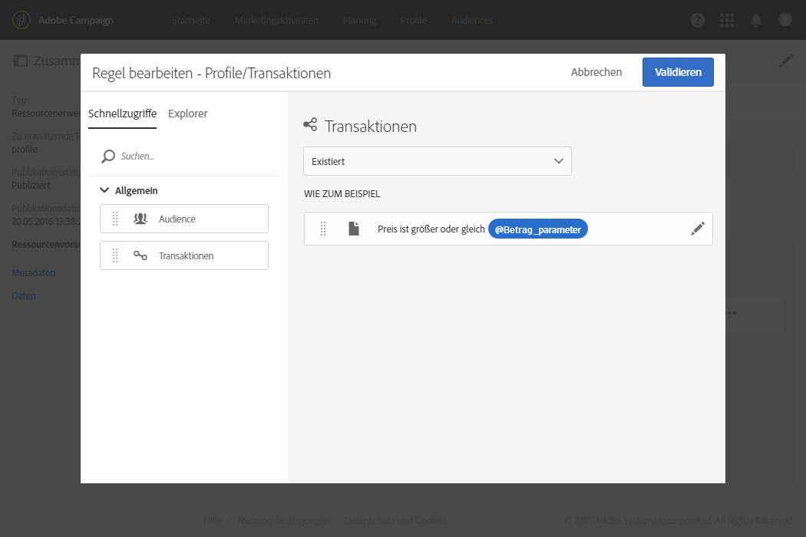
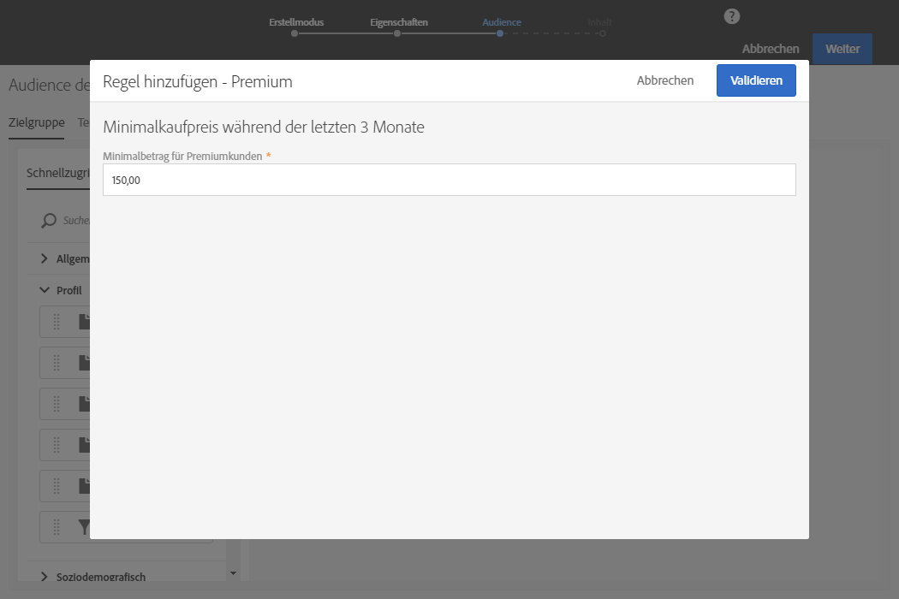

# Filterdefinition konfigurieren{#configuring-filter-definition}

Sie können im Tab **[!UICONTROL Filterdefinition]** erweiterte Filter erstellen, auf die Benutzer anschließend direkten Zugriff haben, wenn sie komplexe Abfragen wie beispielsweise die Definition einer Zielgruppe erstellen.

Dieser Schritt ist nicht zwingend erforderlich, da dennoch Daten in Ihre Ressource geladen werden können und Sie darauf über Workflows, Zielgruppen und REST-API zugreifen können.

Diese Filter finden im Abfrage-Editor in Form von vorkonfigurierten Regeln Verwendung. Durch sie können die Schritte zum Erhalt der gewünschten Konfiguration reduziert werden, was insbesondere für den Fall wiederholter Segmentierungen von Interesse ist.

Sie können zum Beispiel einen Filter definieren, mit dem Sie alle Transaktionen auswählen können, die innerhalb der letzten drei Monate einen bestimmten Wert überstiegen haben.

Erweitern Sie dazu die Ressource **[!UICONTROL Profile]**, definieren Sie einen Filter und verknüpfen Sie ihn über eine Regel mit einer zuvor erstellten Transaktionstabelle. Definieren Sie in der Regel, dass der Transaktionspreis größer oder gleich einem bestimmten Parameter sein muss und das Transaktionsdatum in einem Zeitraum innerhalb der letzten drei Monate liegen muss.

1. Beachten Sie dabei, dass Sie eine Transaktionstabelle erstellen und veröffentlichen müssen. Siehe auch [Ressource erstellen oder erweitern](../../developing/using/creating-or-extending-the-resource.md).

   >[!NOTE]
   >
   >In diesem Beispiel wird eine benutzerdefinierte Transaktionstabelle verwendet. Sie können diese auf Ihre eigenen Geschäftsanforderungen anpassen.

1. Bevor Sie in der Ressource **[!UICONTROL Profile]** einen mit der Transaktionstabelle verknüpften Filter definieren, müssen Sie die Relation mit dieser Tabelle definieren und Ihre Änderungen veröffentlichen. Siehe auch [Relationen mit anderen Ressourcen definieren](../../developing/using/configuring-the-resource-s-data-structure.md#defining-links-with-other-resources) und [Datenbankstruktur aktualisieren](../../developing/using/updating-the-database-structure.md).
1. Wählen Sie im Tab **[!UICONTROL Definition]** des Definitionsbildschirms des neuen Filters die Transaktionstabelle aus.

   

1. Ziehen Sie im Fenster **[!UICONTROL Regel hinzufügen - Profile/Transaktionen]** die Transaktionstabelle in den Arbeitsbereich. Wählen Sie im nächsten Fenster das Feld, das Sie verwenden möchten.

   

1. Aktivieren Sie im Fenster **[!UICONTROL Regel hinzufügen - Transaktionen]** unter **[!UICONTROL Optionale Parametereinstellungen]** die Option **[!UICONTROL In den Parametermodus wechseln]**.

   Wählen Sie in den **[!UICONTROL Filterbedingungen]** den Operator **[!UICONTROL Größer oder gleich]**. Geben Sie im **[!UICONTROL Parameter]**-Feld einen Namen ein und klicken Sie auf das Pluszeichen, um den neuen Parameter zu erstellen.

   

1. Bestätigen Sie Ihre Änderungen. Hierbei handelt es sich um das konfigurierbare Eingabefeld, in das der Benutzer später zur Ausführung seiner Abfrage einfach einen Wert eintragen muss.

   

1. Kombinieren Sie diese Regel mit einer anderen Regel, die besagt, dass das Datum in einem die letzten drei Monate umfassenden Zeitraum liegen muss.

   

1. Wählen Sie die Kategorie aus, in der Ihr Filter erscheinen soll.

   

1. Passen Sie im **[!UICONTROL Parameter]**-Tab des Bildschirms zur Filterdefinition Beschreibung und Titel des Filters an, um den Benutzern den Betreff Ihres Filters zu verdeutlichen. Ebendiese Informationen werden im Abfrage-Editor angezeigt.

   

   Sollten Sie mehrere konfigurierbare Felder definieren, können Sie die Reihenfolge ändern, in der diese in der Benutzeroberfläche angezeigt werden.

1. Speichern Sie Ihre Änderungen und veröffentlichen Sie die Ressourcen. Weiterführende Informationen finden Sie im Abschnitt [Datenbankstruktur aktualisieren](../../developing/using/updating-the-database-structure.md).

Sobald die Erweiterung der **[!UICONTROL Profile]**-Ressource veröffentlicht wurde, ist der Filter für Benutzer in den Schnellzugriffen der [Abfrage-Editor](../../automating/using/editing-queries.md)-Benutzeroberfläche sichtbar.

Bei der Erstellung einer E-Mail können Benutzer auf diese Weise einfach ihre Zielgruppe so definieren, dass die Nachricht an alle Kunden gesendet wird, die in den letzten drei Monaten einen gewissen Betrag ausgegeben haben.

Dafür haben Benutzer lediglich den gewünschten Betrag in der angezeigten Dialogbox einzugeben, anstatt die Konfiguration selbst vornehmen zu müssen.

Sobald ein Filter konfiguriert ist, können Sie ihn mithilfe dieser Syntax über Campaign Standard-APIs verwenden:

`GET https://mc.adobe.io/<ORGANIZATION>/campaign/profileAndServicesExt/<resourceName>/by<customFilterName>?<customFilterparam>=<customFilterValue>`

Weiterführende Informationen finden Sie in der [Dokumentation zu Campaign Standard-APIs](../../api/using/filtering.md#custom-filters).
