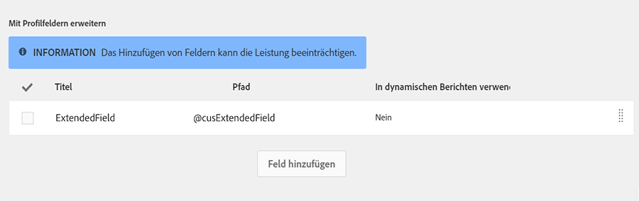
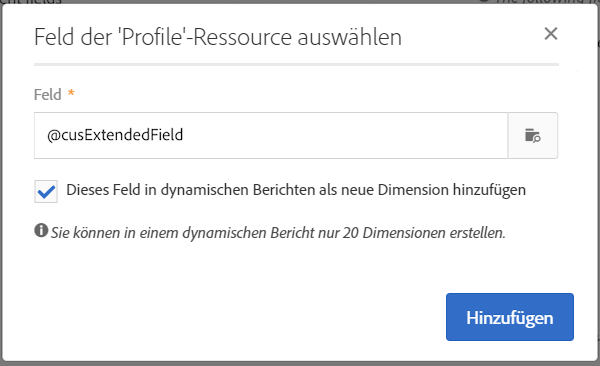

# Datenstruktur der Ressource konfigurieren{#configuring-the-resource-s-data-structure}

Im Anschluss an die Erstellung einer neuen benutzerdefinierten Ressource ist deren Datenstruktur zu konfigurieren.

When editing the resource, in the **[!UICONTROL Data structure]** tab, you can add:

* [Felder](#adding-fields-to-a-resource)
* [Identifizierungsschlüssel](#defining-identification-keys)
* [Indexe](#defining-indexes)
* [Relationen](#defining-links-with-other-resources)
* [Versandlogs](#defining-sending-logs-extension)

## Felder zu einer Ressource hinzufügen {#adding-fields-to-a-resource}

Sie können einer Ressource neue Felder hinzufügen, um Daten zu speichern, die nicht im vordefinierten Datenmodell enthalten sind.

1. Use the **[!UICONTROL Create element]** button to create a field.
1. Vergeben Sie einen Titel und eine Kennung, wählen Sie den Feldtyp aus und passen Sie gegebenenfalls die für das Feld maximal zulässige Länge an.

   The **[!UICONTROL ID]** field is mandatory and must be unique for each field added.

   >[!NOTE]
   >
   >Verwenden Sie maximal 30 Zeichen.

   

1. To modify one of the fields, check the **[!UICONTROL Edit Properties]** button.

   

1. In the **[!UICONTROL Field definition]** screen, you can define a category that will be used for the audience and targeting, or even add a description.

   

1. Aktivieren Sie die **[!UICONTROL Specify a list of authorized values]** Option, wenn Sie Werte definieren müssen, die dem Benutzer angeboten werden (Aufzählungswerte).

   Klicken Sie dann auf **[!UICONTROL Create element]** und geben Sie ein **[!UICONTROL Label]** und **[!UICONTROL Value]** an. Fügen Sie so viele Werte wie nötig hinzu.

1. Once you have added your fields, check the **[!UICONTROL Add audit fields]** box to include fields detailing the creation date, the user that created the resource, the date, and the author of the last modification.
1. Check the **[!UICONTROL Add access authorization management fields]** box to include the fields stating who has access rights to that particular resource.

   Diese Felder erscheinen in den Daten und Metadaten, die nach Aktualisierung der Datenbank angezeigt werden können. Weiterführende Informationen finden Sie im Abschnitt [Datenbankstruktur aktualisieren](../../developing/using/updating-the-database-structure.md).

1. Markieren Sie das **[!UICONTROL Add automatic ID]** Feld, um automatisch eine ID zu generieren. Bitte beachten Sie, dass vorhandene Entitäten leer bleiben. Weitere Informationen finden Sie unter [Generating a unique ID for profiles and custom resources](../../developing/using/configuring-the-resource-s-data-structure.md#generating-a-unique-id-for-profiles-and-custom-resources).
1. To modify the way in which the name of the resource elements will appear in the lists and creation steps, check the **[!UICONTROL Customize the title of the resource elements]** box. Wählen Sie eines der für diese Ressource erstellten Felder aus.

   

   >[!NOTE]
   >
   >Wenn Sie diese Option nicht aktivieren, wird der automatische primäre Schlüssel (der automatisch bei jedem Hinzufügen einer Entität zur Tabelle erstellt wird) verwendet, wenn Sie alle Entitäten aus dieser Tabelle auflisten.

Die Felder Ihrer Ressource sind jetzt definiert.

## Identifizierungsschlüssel definieren {#defining-identification-keys}

Jede Ressource muss mindestens einen Schlüssel zu ihrer eindeutigen Identifizierung aufweisen. Sie können beispielsweise einen Schlüssel definieren, der besagt, dass zwei Produkte in einer Verkaufstabelle nicht dieselbe ID aufweisen können.

1. Specify it in the **[!UICONTROL Automatic primary key]** section the size for the storage if you would like to have a technical key automatically and incrementally generated.

   

1. Use the **[!UICONTROL Create element]** button to create a key.

   The **[!UICONTROL Label]** and **[!UICONTROL ID]** fields are completed by default but you can edit them.

   >[!NOTE]
   >
   >Verwenden Sie maximal 30 Zeichen.

1. To define the elements making up this key, click **[!UICONTROL Create element]** and select the fields that you created for this resource.

   

   Created keys are displayed in the **[!UICONTROL Custom keys]** section.

Ihre Identifizierungsschlüssel für die Ressource werden jetzt erstellt.

>[!NOTE]
>
>Weitere Informationen zu Best Practices beim Erstellen von Identifizierungsschlüsseln finden Sie in diesem [Abschnitt](../../developing/using/data-model-best-practices.md#keys).

## Indexe definieren {#defining-indexes}

Indexe können eines oder mehrere Felder der Ressource referenzieren. Indexe ermöglichen es, Datensätze in der Datenbank zu sortieren, um sie leichter auffindbar zu machen. Auf diese Weise werden die SQL-Abfragen optimiert.

Die Definition von Indexen wird empfohlen, ist aber nicht zwingend erforderlich.

1. Use the **[!UICONTROL Create element]** button to create an index.

   

1. The **[!UICONTROL Label]** and **[!UICONTROL ID]** fields are completed by default, but you can edit them.

   >[!NOTE]
   >
   >Verwenden Sie maximal 30 Zeichen.

1. Wählen Sie aus den für die Ressource erstellten Feldern die aus, aus denen sich der Index zusammensetzen soll.

   

1. Klicks **[!UICONTROL Confirm]**.

Die erstellten Indexe werden in der Liste des Bereichs **[!UICONTROL Index]** angezeigt.

>[!NOTE]
>
>Weitere Informationen zu Best Practices beim Erstellen von Indizes finden Sie in diesem [Abschnitt](../../developing/using/data-model-best-practices.md#indexes).

## Relationen mit anderen Ressourcen definieren {#defining-links-with-other-resources}

Eine Relation beschreibt die Beziehung einer Tabelle zu anderen Tabellen.

1. Use the **[!UICONTROL Create element]** button to create a link to a target resource.
1. Klicks **[!UICONTROL Select a target resource]**.

   

1. Die verfügbaren Ressourcen werden in alphabetischer Reihenfolge angezeigt und können nach Namen gefiltert werden. Ihr technischer Name wird in Klammern angezeigt.

   Select an element from the list and click **[!UICONTROL Confirm]**.

   

1. Wählen Sie die **[!UICONTROL Link type]** Kardinalität aus. Das Verhalten der Datensätze beim Löschen oder Duplizieren variiert je nach gewählter Kardinalität.

   Diese Relationstypen sind verfügbar:

   * **[!UICONTROL 1 cardinality simple link]**: ein Vorkommen der Ausgangstabelle kann maximal ein entsprechendes Vorkommen der Zieltabelle aufweisen.
   * **[!UICONTROL N cardinality collection link]**: Ein Vorkommen der Ausgangstabelle kann mehrere entsprechende Vorkommen der Zieltabelle aufweisen, aber ein Vorkommen der Zieltabelle kann maximal ein entsprechendes Vorkommen der Ausgangstabelle aufweisen.
   * **[!UICONTROL 0 or 1 cardinality simple link]**: ein Vorkommen der Ausgangstabelle kann maximal ein entsprechendes Vorkommen der Zieltabelle oder kein Vorkommen aufweisen. Note that this kind of **[!UICONTROL Link type]** can cause performance issue.
   

1. In the **[!UICONTROL New link]** screen, the **[!UICONTROL Label]** and **[!UICONTROL ID]** fields are completed by default, but you can edit them.

   >[!NOTE]
   >
   >Verwenden Sie maximal 30 Zeichen.

   >[!CAUTION]
   >
   >Nach der Erstellung kann ein Link nicht mehr umbenannt werden. Um einen Link umzubenennen, müssen Sie ihn zuerst löschen und dann wieder erstellen.

1. The **[!UICONTROL Category for the audience and targeting]** list allows you to assign this link to a category making it more visible in the query editor tool.
1. If needed, the **[!UICONTROL Reverse link definition]** section allows you to display the label and ID of the resource in the targeted resource.
1. Define the behavior of the records referenced by the link in the **[!UICONTROL Behavior if deleted/duplicated]** section.

   Standardmäßig wird der Zieldatensatz gelöscht, wenn dieser nicht mehr durch die Relation referenziert wird.

   

1. Im **[!UICONTROL Join definition]** Abschnitt ist die Standardoption **[!UICONTROL Use the primary keys to make the join]** ausgewählt, Sie können jedoch zwischen zwei Optionen wählen:

   * **[!UICONTROL Use the primary key to make the join]**: Mit dieser Verbindungsdefinition können Sie den primären Profilschlüssel verwenden, um mit dem primären Schlüssel des Käufers zu vereinbaren.
   * **[!UICONTROL Define specific join conditions]**: Mit dieser Verbindungsdefinition können Sie die Felder, die zu beiden Ressourcen gehören, manuell auswählen. Bitte beachten Sie, dass bei falscher Konfiguration der Daten der Datensatz **Bestellung** nicht sichtbar ist.
   

The links created are displayed in the list in the **[!UICONTROL Links]** section.

>[!NOTE]
>
>Weitere Informationen zu Best Practices beim Erstellen von Indizes finden Sie in diesem [Abschnitt](../../developing/using/data-model-best-practices.md#links).

**Beispiel: Herstellung einer Relation zwischen einer erstellten Ressource und der &#39;Profile&#39;-Ressource**

In diesem Beispiel möchten wir eine Relation zwischen der neuen Ressource **Bestellung** und der benutzerdefinierten Ressource **Profile** herstellen:

1. Erstellen Sie Ihre neue Ressource **Bestellung**.
1. To link it with the **Profiles** custom resource, unfold the **[!UICONTROL Links]** section in the **[!UICONTROL Data structure]** tab and click **[!UICONTROL Create element]**.
1. Select the target resource, here **[!UICONTROL Profiles (profile)]**.
1. Lassen Sie in diesem Beispiel den standardmäßigen **[!UICONTROL 1 cardinality simple link]** Linktyp ausgewählt.

   

1. Wählen Sie eine Verbindungsdefinition, hier behalten Sie die Standardeinstellung **[!UICONTROL Use the primary key to make the join]**.

   

1. Bei Bedarf können Sie einen Detailbildschirm definieren, um **Bestellung** zu bearbeiten und ihn mit einem Profil zu verknüpfen.

   Blenden Sie den **[!UICONTROL Detail screen configuration]** Abschnitt aus und überprüfen Sie die **[!UICONTROL Define a detail screen]** Konfiguration des Bildschirms, der jedem Element der Ressource entspricht. Wenn Sie diese Option nicht aktivieren, steht für die Elemente der Ressource keine Detailansicht zur Verfügung.

1. Klicks **[!UICONTROL Create element]**.
1. Select your linked resource and click **[!UICONTROL Add]**.

   Your new resource will then be available in the advanced menu by selecting **[!UICONTROL Client data]** > **[!UICONTROL Purchase]**.

   

1. Once your configuration is done, click **[!UICONTROL Confirm]**.

   Sie können Ihre neue Ressource jetzt publizieren.

By adding this link, a **Purchase** tab is added to the profiles detail screen from the **[!UICONTROL Profiles & audiences]** > **[!UICONTROL Profiles]** menu. Bitte beachten Sie, dass dies speziell für die **[!UICONTROL Profile]**-Ressource gilt.

## Erweiterung der Versandlogs definieren {#defining-sending-logs-extension}

Durch die Erweiterung der Versandlogs haben Sie folgende Möglichkeiten:

* Erweiterung der Möglichkeiten von dynamischen Berichten durch **das Hinzufügen von benutzerdefinierten Profilfeldern**
* Erweiterung der Versandlog-Daten durch **Segmentcode- und Profildaten**

**Erweiterung mit einem Segmentcode**

Der Benutzer kann die Logs mit dem von der Workflow-Engine stammenden Segmentcode erweitern.

Der Segmentcode muss im Workflow definiert werden.

Um diese Erweiterung zu aktivieren, aktivieren Sie die Option **[!UICONTROL Add segment code]**.

Weiterführende Informationen zum Segmentcode finden Sie im Abschnitt [Segmentierung](../../automating/using/segmentation.md).

**Mit Profilfeldern erweitern**

>[!NOTE]
>
>Der Administrator hätte die Profil-Ressource mit einem benutzerdefinierten Feld erweitern sollen.

Click **[!UICONTROL Add field]** and select any custom field from the profile resource.

Um eine neue Unterdimension zu erstellen, die mit der Profildimension verknüpft ist, aktivieren Sie die **[!UICONTROL Add this field in Dynamic reporting as a new dimension]** Option.

Sie können die benutzerdefinierte Felder-Dimension von einem dynamischen Bericht in eine Freiformtabelle ziehen.

Weiterführende Informationen zu dynamischen Berichten finden Sie in der [Liste von Komponenten](../../reporting/using/list-of-components-.md).

>[!CAUTION]
>
>Die Anzahl der an dynamische Berichte gesendeten Felder ist auf 20 begrenzt.

## Eigenschaften einer Ressource bearbeiten {#editing-resource-properties}

In the custom resource screen, the **[!UICONTROL Summary]** pane indicates the status of the newly created resource. Sie können den Zugriff auf die Ressource und ihre allgemeinen Eigenschaften bearbeiten.

1. Click the **[!UICONTROL Edit properties]** button to add a description.

   

1. Ändern Sie bei Bedarf Titel und Kennung der Ressource.

   >[!NOTE]
   >
   >Verwenden Sie maximal 30 Zeichen.

1. Beschränken Sie hier gegebenenfalls die Verwendung dieser Ressource auf gewisse Organisationseinheiten. Nur Benutzer in berechtigten Einheiten dürfen dann diese Ressource in der Anwendung verwenden.
1. Speichern Sie die Änderungen.

Ihre Änderungen werden gespeichert. Publizieren Sie die Ressource erneut, damit die Änderungen wirksam werden.

## Eindeutige Kennung für Profile und benutzerdefinierte Ressourcen erstellen {#generating-a-unique-id-for-profiles-and-custom-resources}

Standardmäßig erhalten Profile und benutzerdefinierte Ressourcen bei ihrer Erstellung keine Kennung. Sie können jedoch eine Option aktivieren, durch die bei der Erstellung von Elementen automatisch eine eindeutige Kennung erzeugt wird. Diese Kennung kann folgendermaßen verwendet werden:

* Exportierte Datensätze einfach in einem externen Tool identifizieren.
* Datensätze abstimmen, wenn aktualisierte Daten importiert werden, die in einer anderen Anwendung verarbeitet wurden.

Die Kennung kann nur für Profile und benutzerdefinierte Ressourcen aktiviert werden.

1. Erstellen Sie eine Erweiterung für die Profil-Ressource oder erstellen Sie eine neue Ressource.
1. Aktivieren Sie in der Definition der Datenstruktur die **[!UICONTROL Add automatic ID field]** Option unter dem **[!UICONTROL Fields]** Abschnitt.

   

   >[!NOTE]
   >
   >Nur neue Datensätze erhalten eine ACS ID. Das **[!UICONTROL ACS ID]** Feld bleibt für Profile oder Elemente, die vor Aktivierung dieser Option erstellt wurden, leer.

1. Speichern und publizieren Sie die an der Ressource vorgenommene Änderung. Wenn dieser Mechanismus für mit der API erstellte Elemente gelten soll, aktivieren Sie die Option zum Erweitern der API.

The **[!UICONTROL ACS ID]** field is now available and automatically populated when new elements are created manually, from the API, or inserted from an import workflow. Das ACS-ID-Feld ist ein UUID-Feld und ist indexiert.

Beim Export von Profilen oder benutzerdefinierten Ressourcen können Sie jetzt die Spalte **[!UICONTROL ACS ID]** hinzufügen, wenn sie für diese Ressource aktiviert wurde. Sie können mithilfe dieser ID auch Datensätze in externen Tools identifizieren.

Daten, die in einer anderen Anwendung (z. B. einem CRM) verarbeitet bzw. aktualisiert wurden und erneut importiert werden, können mit dieser eindeutigen Kennung einfach abgestimmt werden.

>[!NOTE]
>
>The **[!UICONTROL ACS ID]** field is not updated for profiles or elements created before enabling the option. Nur neue Datensätze erhalten eine ACS ID.
>
>Dieses Feld ist schreibgeschützt. Es kann nicht geändert werden.
