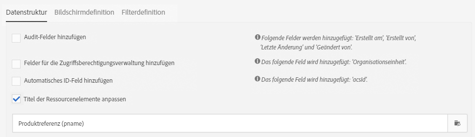
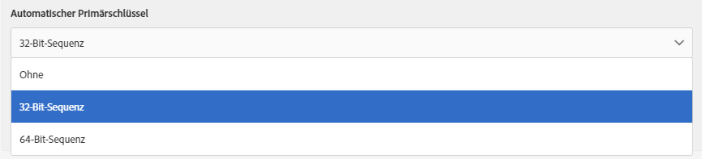

# Datenstruktur der Ressource konfigurieren{#configuring-the-resource-s-data-structure}

Im Anschluss an die Erstellung einer neuen benutzerdefinierten Ressource ist deren Datenstruktur zu konfigurieren.

In diesem Zusammenhang können im Tab **[!UICONTROL Datenstruktur]** folgende Elemente hinzugefügt werden:

* [Felder](#adding-fields-to-a-resource)
* [Identifizierungsschlüssel](#defining-identification-keys)
* [Indizes](#defining-indexes)
* [Relationen](#defining-links-with-other-resources)
* [Versandlogs](#defining-sending-logs-extension)

## Felder zu einer Ressource hinzufügen {#adding-fields-to-a-resource}

Sie können einer Ressource neue Felder hinzufügen, um Daten zu speichern, die nicht im vordefinierten Datenmodell enthalten sind.

1. Verwenden Sie die Schaltfläche **[!UICONTROL Element erstellen]**, um ein Feld zu erstellen.
1. Vergeben Sie einen Titel und eine Kennung, wählen Sie den Feldtyp aus und passen Sie gegebenenfalls die für das Feld maximal zulässige Länge an.

   Das Feld **[!UICONTROL Kennung]** ist ein Pflichtfeld und muss für jedes hinzugefügte Feld eindeutig sein.

   >[!NOTE]
   >
   >Verwenden Sie maximal 30 Zeichen.

   

1. Um eines der Felder zu bearbeiten, wählen Sie die Schaltfläche **[!UICONTROL Eigenschaften bearbeiten]** aus.

   

1. Im Bildschirm **[!UICONTROL Definition des Felds]** haben Sie die Möglichkeit, eine Kategorie zu definieren, die beispielsweise in Audiences und Zielgruppenbestimmungen verwendet werden kann, oder eine Beschreibung hinzuzufügen.

   

1. Aktivieren Sie die Option **[!UICONTROL Liste zulässiger Werte definieren]**, um die Werte zu definieren, die dem Benutzer vorgeschlagen werden sollen (Auflistungswerte).

   Wählen Sie danach **[!UICONTROL Element erstellen]** aus und definieren Sie einen **[!UICONTROL Titel]** und einen **[!UICONTROL Wert]**. Fügen Sie so viele Werte wie nötig hinzu.

1. Aktivieren Sie die Option **[!UICONTROL Audit-Felder hinzufügen]**, um Felder für das Erstellungsdatum, den Benutzer, der die Ressource erstellt hat, sowie das Datum und den Verfasser der letzten Änderung einzuschließen.
1. Die Option **[!UICONTROL Felder für die Zugriffsberechtigungsverwaltung hinzufügen]** ermöglicht es darüber hinaus, Felder zur Angabe der Benutzer, die zum Zugriff auf die Ressource berechtigt sind, einzuschließen.

   Diese Felder erscheinen in den Daten und Metadaten, die nach Aktualisierung der Datenbank angezeigt werden können. Weiterführende Informationen finden Sie im Abschnitt [Datenbankstruktur aktualisieren](../../developing/using/updating-the-database-structure.md).

1. Aktivieren Sie das Feld **[!UICONTROL Automatisches ID-Feld hinzufügen]**, um automatisch eine Kennung zu erstellen. Bitte beachten Sie, dass vorhandene Entitäten leer bleiben. Weitere Informationen finden Sie unter [Eindeutige Kennung für Profile und benutzerdefinierte Ressourcen erstellen](../../developing/using/configuring-the-resource-s-data-structure.md#generating-a-unique-id-for-profiles-and-custom-resources).
1. Wenn Sie die Art der Anzeige des Namens der Ressourcenelemente in Listen und in den Erstellungsschritten anpassen möchten, aktivieren Sie die Option **[!UICONTROL Titel der Ressourcenelemente anpassen]**. Wählen Sie eines der für diese Ressource erstellten Felder aus.

   

   >[!NOTE]
   >
   >Wenn Sie diese Option nicht aktivieren, wird der automatische Primärschlüssel (der automatisch bei jedem Hinzufügen einer Entität zur Tabelle erstellt wird) verwendet, wenn Sie alle Entitäten aus dieser Tabelle auflisten.

Die Felder Ihrer Ressource sind jetzt definiert.

## Identifizierungsschlüssel definieren        {#defining-identification-keys}

Jede Ressource muss mindestens einen Schlüssel zu ihrer eindeutigen Identifizierung aufweisen. Sie können beispielsweise einen Schlüssel definieren, der besagt, dass zwei Produkte in einer Verkaufstabelle nicht dieselbe ID aufweisen können.

1. Definieren Sie im Bereich **[!UICONTROL Automatischer Primärschlüssel]** die Größe des Speichers, wenn ein technischer Schlüssel automatisch und inkrementell erstellt werden soll.

   

1. Verwenden Sie die Schaltfläche **[!UICONTROL Element erstellen]**, um einen Schlüssel zu erstellen.

   Die Felder **[!UICONTROL Titel]** und **[!UICONTROL Kennung]** sind standardmäßig vorausgefüllt, können jedoch angepasst werden.

   >[!NOTE]
   >
   >Verwenden Sie maximal 30 Zeichen.

1. Um die Elemente dieses Schlüssels zu definieren, wählen Sie **[!UICONTROL Element erstellen]** und danach die für diese Ressource erstellten Felder aus.

   

   Die erstellten Schlüssel werden im Bereich **[!UICONTROL Benutzerdefinierte Schlüssel]** angezeigt.

Ihre Identifizierungsschlüssel für die Ressource werden jetzt erstellt.

>[!NOTE]
>
>Weitere Informationen zu Best Practices beim Erstellen von Identifizierungsschlüsseln finden Sie in diesem [Abschnitt](../../developing/using/data-model-best-practices.md#keys).

## Indexe definieren        {#defining-indexes}

Indexe können eines oder mehrere Felder der Ressource referenzieren. Indexe ermöglichen es, Datensätze in der Datenbank zu sortieren, um sie leichter auffindbar zu machen. Auf diese Weise werden die SQL-Abfragen optimiert.

Die Definition von Indexen wird empfohlen, ist aber nicht zwingend erforderlich.

1. Verwenden Sie die Schaltfläche **[!UICONTROL Element erstellen]**, um einen Index zu erstellen.

   

1. Die Felder **[!UICONTROL Titel]** und **[!UICONTROL Kennung]** sind standardmäßig vorausgefüllt, können jedoch angepasst werden.

   >[!NOTE]
   >
   >Verwenden Sie maximal 30 Zeichen.

1. Wählen Sie aus den für die Ressource erstellten Feldern die aus, aus denen sich der Index zusammensetzen soll.

   

1. Wählen Sie **[!UICONTROL Bestätigen]** aus.

Die erstellten Indexe werden in der Liste des Bereichs **[!UICONTROL Index]** angezeigt.

>[!NOTE]
>
>Weitere Informationen zu Best Practices beim Erstellen von Indizes finden Sie in diesem [Abschnitt](../../developing/using/data-model-best-practices.md#indexes).

## Relationen mit anderen Ressourcen definieren {#defining-links-with-other-resources}

Eine Relation beschreibt die Beziehung einer Tabelle zu anderen Tabellen.

1. Verwenden Sie die Schaltfläche **[!UICONTROL Element erstellen]**, um eine Relation zu einer Zielressource zu erstellen.
1. Wählen Sie **[!UICONTROL Zielressource auswählen]** aus.

   

1. Die verfügbaren Ressourcen werden in alphabetischer Reihenfolge angezeigt und können nach Namen gefiltert werden. Ihr technischer Name wird in Klammern angezeigt.

   Wählen Sie ein Element in der Liste aus und **[!UICONTROL bestätigen]** Sie danach die Auswahl.

   

1. Wählen Sie den **[!UICONTROL Relationstyp]** der Kardinalität entsprechend aus. Das Verhalten der Datensätze beim Löschen oder Duplizieren variiert je nach gewählter Kardinalität.

   Diese Relationstypen sind verfügbar:

   * **[!UICONTROL Einfache Relation mit Kardinalität 1]**: Eine Entität in der Quelltabelle kann maximal mit einer Entität in der Zieltabelle in Beziehung stehen.
   * **[!UICONTROL Sammlungsrelation mit Kardinalität N]**: Eine Entität in der Quelltabelle kann mit mehreren Entitäten in der Zieltabelle in Beziehung stehen, aber eine Entität in der Zieltabelle kann nur maximal mit einer Entität in der Quelltabelle in Beziehung stehen.
   * **[!UICONTROL Einfache Relation mit Kardinalität 0 oder 1]**: Eine Entität in der Quelltabelle kann nur mit maximal einer oder keiner Entität in der Zieltabelle in Beziehung stehen. Bitte beachten Sie, dass dieser **[!UICONTROL Relationstyp]** Performance-Probleme verursachen kann.

   

1. Im Bildschirm **[!UICONTROL Neue Relation]** sind die Felder **[!UICONTROL Titel]** und **[!UICONTROL Kennung]** standardmäßig vorausgefüllt, sie können jedoch angepasst werden.

   >[!NOTE]
   >
   >Verwenden Sie maximal 30 Zeichen.
   >
   >Nach der Erstellung kann ein Link nicht mehr umbenannt werden. Um einen Link umzubenennen, müssen Sie ihn zuerst löschen und dann wieder erstellen.

1. Mit der Liste **[!UICONTROL Audience- und Zielgruppenkategorie]** können Sie diese Relation einer Kategorie zuordnen, wodurch sie im Abfrageeditor besser sichtbar wird.
1. Nötigenfalls können Sie im Bereich **[!UICONTROL Definition der Umkehrrelation]** den Titel und die Kennung der Ressource in der Zielressource anzeigen.
1. Definieren Sie im Bereich **[!UICONTROL Verhalten beim Löschen/Duplizieren]** das Verhalten der durch die Relation referenzierten Datensätze.

   Standardmäßig wird der Zieldatensatz gelöscht, wenn dieser nicht mehr durch die Relation referenziert wird.

   

1. Im Bereich **[!UICONTROL Definition des Joins]** ist die Standardoption **[!UICONTROL Join über die Primärschlüssel erstellen]** ausgewählt, es stehen aber zwei Optionen zur Verfügung:

   * **[!UICONTROL Join über die Primärschlüssel erstellen]**: Mit dieser Join-Definition können Sie den Primärschlüssel der Profile mit dem Primärschlüssel der Käufe abstimmen.
   * **[!UICONTROL Spezifische Join-Bedingungen definieren]**: Mit dieser Join-Definition können Sie manuell die Felder auswählen, mit denen der Join beider Ressourcen hergestellt wird. Bitte beachten Sie, dass bei falscher Konfiguration der Daten der Datensatz **Bestellung** nicht sichtbar ist.

   

Die erstellten Relationen werden in der Liste des Bereichs **[!UICONTROL Relationen]** angezeigt.

>[!NOTE]
>
>Weitere Informationen zu Best Practices beim Erstellen von Indizes finden Sie in diesem [Abschnitt](../../developing/using/data-model-best-practices.md#links).

**Beispiel: Herstellung einer Relation zwischen einer erstellten Ressource und der &#39;Profile&#39;-Ressource**

In diesem Beispiel möchten wir eine Relation zwischen der neuen Ressource **Bestellung** und der benutzerdefinierten Ressource **Profile** herstellen:

1. Erstellen Sie Ihre neue Ressource **Bestellung**.
1. Um eine Relation mit der benutzerdefinierten Ressource **Profile** herzustellen, erweitern Sie den Bereich **[!UICONTROL Relationen]** im Tab **[!UICONTROL Datenstruktur]** und wählen Sie **[!UICONTROL Element erstellen]** aus.
1. Wählen Sie die Zielressource aus, hier **[!UICONTROL Profile (profile)]**.
1. Behalten Sie für unser Beispiel den ausgewählten Relationstyp **[!UICONTROL Einfache Relation mit Kardinalität 1]** bei.

   

1. Wählen Sie eine Definition des Joins. Behalten Sie für unser Beispiel den Standardeintrag **[!UICONTROL Join über die Primärschlüssel erstellen]** bei.

   

1. Bei Bedarf können Sie einen Detailbildschirm definieren, um **Bestellung** zu bearbeiten und ihn mit einem Profil zu verknüpfen.

   Erweitern Sie den Bereich **[!UICONTROL Konfiguration des Detailbildschirms]** und aktivieren Sie die Option **[!UICONTROL Detailbildschirm definieren]**, um den Bildschirm entsprechend den Elementen der Ressource zu konfigurieren. Wenn Sie diese Option nicht aktivieren, steht für die Elemente der Ressource keine Detailansicht zur Verfügung.

1. Wählen Sie **[!UICONTROL Element erstellen]** aus.
1. Wählen Sie Ihre verknüpfte Ressource aus und danach **[!UICONTROL Hinzufügen]**.

   Ihre neue Ressource ist daraufhin im erweiterten Menü durch die Auswahl von **[!UICONTROL Benutzerdefinierte Daten]** > **[!UICONTROL Bestellung]** verfügbar.

   

1. Wählen Sie nach der Konfiguration **[!UICONTROL Bestätigen]** aus.

   Sie können Ihre neue Ressource jetzt veröffentlichen.

Durch Hinzufügen dieser Relation wird der Tab **Bestellung** zum Detailbildschirm der Profile hinzugefügt und ist über das Menü **[!UICONTROL Profile &amp; Audiences]** > **[!UICONTROL Profile]** abrufbar. Bitte beachten Sie, dass dies speziell für die **[!UICONTROL Profile]**-Ressource gilt.

## Erweiterung der Versandlogs definieren {#defining-sending-logs-extension}

Durch die Erweiterung der Versandlogs haben Sie folgende Möglichkeiten:

* Erweiterung der Möglichkeiten von dynamischen Berichten durch **das Hinzufügen von benutzerdefinierten Profilfeldern**
* Erweiterung der Versandlog-Daten durch **Segmentcode- und Profildaten**

**Erweiterung mit einem Segmentcode**

Der Benutzer kann die Logs mit dem von der Workflow-Engine stammenden Segmentcode erweitern.

Der Segmentcode muss im Workflow definiert werden.

Um diese Erweiterung zu aktivieren, wählen Sie die Option **[!UICONTROL Segmentcode hinzufügen]** aus.

Weiterführende Informationen zum Segmentcode finden Sie im Abschnitt [Segmentierung](../../automating/using/segmentation.md).

**Mit Profilfeldern erweitern**

>[!NOTE]
>
>Der Administrator hätte die Profil-Ressource mit einem benutzerdefinierten Feld erweitern sollen.

Wählen Sie **[!UICONTROL Feld hinzufügen]** aus und danach ein beliebiges benutzerdefiniertes Feld aus der Profil-Ressource.

Um eine neue mit der Profil-Dimension verknüpfte Unterdimension zu erstellen, aktivieren Sie die Option **[!UICONTROL Dieses Feld in dynamischen Berichten als neue Dimension hinzufügen]**.

Sie können die benutzerdefinierte Felder-Dimension von einem dynamischen Bericht in eine Freiformtabelle ziehen.

Weiterführende Informationen zu dynamischen Berichten finden Sie in der [Liste von Komponenten](../../reporting/using/list-of-components.md).

>[!IMPORTANT]
>
>Die Anzahl der an dynamische Berichte gesendeten Felder ist auf 20 begrenzt.

## Eigenschaften einer Ressource bearbeiten        {#editing-resource-properties}

Im Bildschirm der benutzerdefinierten Ressource werden im Bereich der **[!UICONTROL Zusammenfassung]** der Typ und der Status der neu erstellten Ressource angezeigt. Sie können den Zugriff auf die Ressource und ihre allgemeinen Eigenschaften bearbeiten.

1. Fügen Sie über die Schaltfläche **[!UICONTROL Eigenschaften bearbeiten]** eine Beschreibung hinzu.

   

1. Ändern Sie bei Bedarf Titel und Kennung der Ressource.

   >[!NOTE]
   >
   >Verwenden Sie maximal 30 Zeichen.

1. Beschränken Sie hier gegebenenfalls die Verwendung dieser Ressource auf gewisse Organisationseinheiten. Nur Benutzer in berechtigten Einheiten dürfen dann diese Ressource in der Anwendung verwenden.
1. Speichern Sie die Änderungen.

Ihre Änderungen werden gespeichert. Veröffentlichen Sie die Ressource erneut, damit die Änderungen wirksam werden.

## Eindeutige Kennung für Profile und benutzerdefinierte Ressourcen erstellen {#generating-a-unique-id-for-profiles-and-custom-resources}

Standardmäßig erhalten Profile und benutzerdefinierte Ressourcen bei ihrer Erstellung keine Kennung. Sie können jedoch eine Option aktivieren, durch die bei der Erstellung von Elementen automatisch eine eindeutige Kennung erzeugt wird. Diese Kennung kann folgendermaßen verwendet werden:

* Exportierte Datensätze einfach in einem externen Tool identifizieren.
* Datensätze abstimmen, wenn aktualisierte Daten importiert werden, die in einer anderen Anwendung verarbeitet wurden.

Die Kennung kann nur für Profile und benutzerdefinierte Ressourcen aktiviert werden.

1. Erstellen Sie eine Erweiterung für die Profil-Ressource oder erstellen Sie eine neue Ressource.
1. Aktivieren Sie in der Definition der Datenstruktur unter dem Bereich **[!UICONTROL Felder]** die Option **[!UICONTROL Automatisches ID-Feld hinzufügen]**.

   

   >[!NOTE]
   >
   >Nur neue Datensätze erhalten eine ACS-ID. Das Feld **[!UICONTROL ACS-ID]** bleibt für Profile oder Elemente leer, die vor der Aktivierung dieser Option erstellt wurden.

1. Speichern und veröffentlichen Sie die an der Ressource vorgenommene Änderung. Wenn dieser Mechanismus für mit der API erstellte Elemente gelten soll, aktivieren Sie die Option zum Erweitern der API.

Das **[!UICONTROL ACS-ID]**-Feld ist jetzt verfügbar und wird automatisch befüllt, wenn neue Elemente manuell oder durch die API erstellt oder über einen Import-Workflow eingefügt werden. Das ACS-ID-Feld ist ein UUID-Feld und ist indexiert.

Beim Export von Profilen oder benutzerdefinierten Ressourcen können Sie jetzt die Spalte **[!UICONTROL ACS-ID]** hinzufügen, wenn sie für diese Ressource aktiviert wurde. Sie können mithilfe dieser ID auch Datensätze in externen Tools identifizieren.

Daten, die in einer anderen Anwendung (z. B. einem CRM) verarbeitet bzw. aktualisiert wurden und erneut importiert werden, können mit dieser eindeutigen Kennung einfach abgestimmt werden.

>[!NOTE]
>
>Das Feld **[!UICONTROL ACS-ID]** wird nicht für Profile oder Elemente aktualisiert, die vor der Aktivierung der Option erstellt wurden. Nur neue Datensätze erhalten eine ACS-ID.
>
>Dieses Feld ist schreibgeschützt. Es kann nicht geändert werden.
