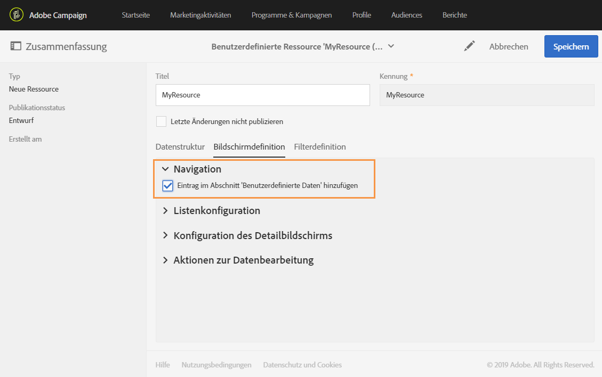
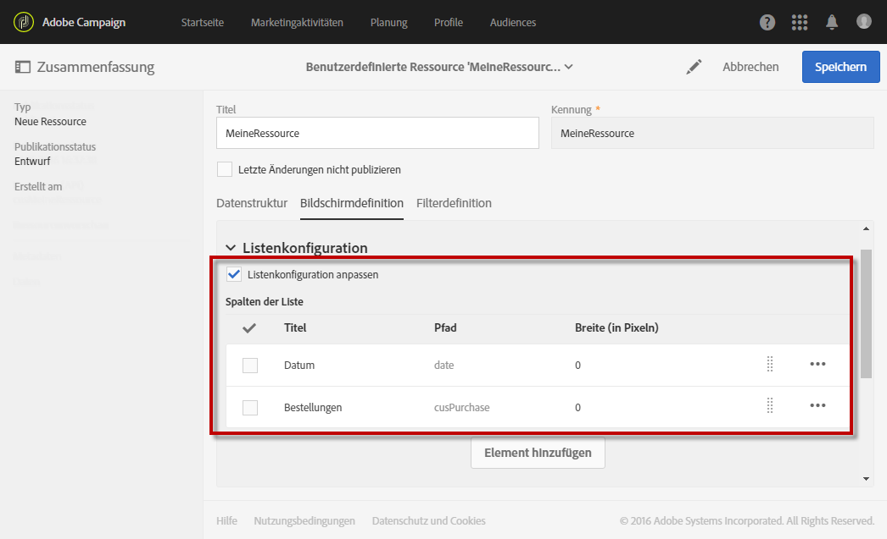
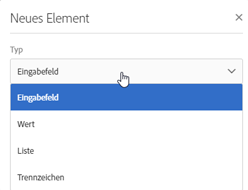
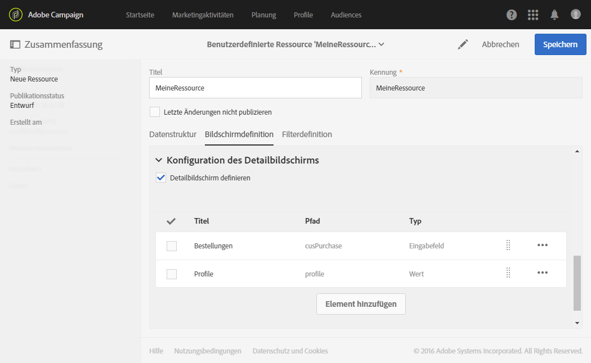
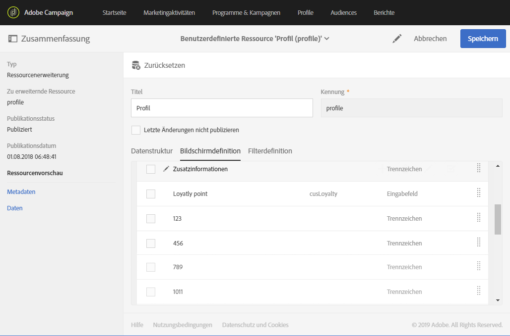

# Bildschirmdefinition konfigurieren{#configuring-the-screen-definition}

Bei der Erstellung einer Ressource oder beim Hinzufügen neuer Felder zu einer existierenden Ressource können Sie festlegen, wie sie in der Benutzeroberfläche dargestellt werden sollen.

Dieser Schritt ist nicht zwingend erforderlich, da dennoch Daten in Ihre Ressource geladen werden können und Sie darauf über Workflows, Audiences und REST-API zugreifen können.

Im Tab **[!UICONTROL Bildschirmdefinition]** haben Sie folgende Möglichkeiten:

* Hinzufügung eines Eintrags im Navigationsmenü, um Zugriff auf die benutzerdefinierte Ressource zu geben;
* Anpassung der Anzeige der Liste mit den einzelnen Elementen der benutzerdefinierten Ressource;
* Konfiguration des Detailbildschirms der einzelnen Elemente der Ressource.

## Zugriff vom Navigationsmenü aus einrichten  {#enabling-access-from-the-navigation-menu}

Wenn Sie für Ihre Ressource einen eigenen Bildschirm einrichten möchten, können Sie einen vom Navigationsmenü aus verfügbar machen.

1. Öffnen Sie im Tab **[!UICONTROL Bildschirmdefinition]** der Ressource den Bereich **[!UICONTROL Navigation]**.
1. Aktivieren Sie die Option **[!UICONTROL Eintrag im Abschnitt &quot;Benutzerdefinierte Daten&quot; hinzufügen]**, wenn Sie den Zugriff auf die Ressource im Navigationsmenü ermöglichen möchten.

   

Die Ressource erscheint dann als Untereintrag des Abschnitts **[!UICONTROL Benutzerdefinierte Daten]**.

## Standard-Listenkonfiguration definieren {#defining-the-default-list-configuration}

Im Bereich **[!UICONTROL Listenkonfiguration]** des Bildschirms können Sie die Spalten und Informationen definieren, die standardmäßig im Überblick einer Ressource dargestellt werden.

1. Aktivieren Sie die Option **[!UICONTROL Listenkonfiguration anpassen]**, um die Anzeige der Spalten der Ressource zu definieren.
1. Verwenden Sie die Schaltfläche **[!UICONTROL Element erstellen]**, um aus den zuvor erstellten Feldern die auszuwählen, die in der Liste angezeigt werden sollen.
1. Die hinzugefügten Felder erscheinen in der Liste. Spaltentitel und -breite können angepasst werden.

   

1. Aktivieren Sie im Bereich **[!UICONTROL Einfache Suche]** die Option **[!UICONTROL Bei der Suche berücksichtigte Felder definieren]**, um die Felder anzugeben, die bei der Suche berücksichtigt werden sollen.

   >[!IMPORTANT]
   >
   >Diese Konfiguration ersetzt die bei der Standardsuche berücksichtigten Felder.

1. Aktivieren Sie im Bereich **[!UICONTROL Erweiterte Filter]** die Option **[!UICONTROL Felder zur Suche hinzufügen]**, um das einfache Suchfeld durch weitere Felder zu ergänzen. Wenn Sie beispielsweise das Feld &quot;Datum&quot; aus den zuvor erstellten Feldern auswählen, hat der Benutzer die Möglichkeit, die Datensätze ausschließlich nach dem Datum zu filtern.
1. Die Reihenfolge der Felder kann für beide Suchoptionen angepasst werden.
1. Bei der erweiterten Suche besteht die Möglichkeit, Felder vom Typ &quot;Relation zu einer verknüpften Ressource&quot; hinzuzufügen. Diese Filter erscheinen im Menü **[!UICONTROL Suche]** des erzeugten Bildschirms.

Der Übersichtsbildschirm der Ressource ist somit definiert.

## Konfiguration des Detailbildschirms definieren  {#defining-the-detail-screen-configuration}

In der Bildschirmdefinition können Sie im Bereich **[!UICONTROL Konfiguration des Detailbildschirms]** die Spalten und Informationen definieren, die im Detailbildschirm eines jeden Elements der Ressource dargestellt werden sollen.

1. Erweitern Sie den Bereich **[!UICONTROL Konfiguration des Detailbildschirms]** und aktivieren Sie die Option **[!UICONTROL Detailbildschirm definieren]**, um den Bildschirm entsprechend den Elementen der Ressource zu konfigurieren. Wenn Sie diese Option nicht aktivieren, steht für die Elemente der Ressource keine Detailansicht zur Verfügung.
1. Sie haben die Möglichkeit, alle Felder Ihrer benutzerdefinierten Ressource durch die Verwendung einer einzigen Schaltfläche hinzuzufügen. Wählen Sie dazu das Symbol  oder die Schaltfläche **[!UICONTROL Element hinzufügen]** aus.
1. Wählen Sie aus den für die Ressource erstellten Elementen eines aus und geben Sie den Feldtyp an:

   * **[!UICONTROL Eingabefeld]**: Es handelt sich um ein editierbares Feld.
   * **[!UICONTROL Wert]**: Es handelt sich um ein nicht editierbares Feld.
   * **[!UICONTROL Liste]**: Es handelt sich um eine Tabelle.
   * **[!UICONTROL Trennzeichen]**: unterteilt Ihre Elemente in Kategorien.

   

1. Das hinzugefügte Element wird in der Liste angezeigt. Der Titel ist anpassbar.

   

1. Sie können beliebig viele **[!UICONTROL Trennzeichen]** hinzufügen, um Ihre Elemente in unterschiedliche Kategorien zu unterteilen.

   Damit können Sie Ihr Fenster übersichtlicher gestalten.

   

Der Detailbildschirm der Ressource ist somit konfiguriert.

## Aktionen zur Datenbearbeitung  {#actions-on-data-section}

An dieser Stelle kann eine dedizierte Symbolleiste für den Bildschirm der benutzerdefinierten Ressource definiert werden. Dabei stehen drei Optionen zur Verfügung:

* **[!UICONTROL Erstellen zulassen]** - ermöglicht es, die Erstellung von Elementen der benutzerdefinierten Ressource zu aktivieren. Auf diese Weise können Benutzer zusätzliche Datensätze hinzufügen.

   >[!NOTE]
   >
   >Um diese Option verfügbar zu machen, ist der Detailbildschirm der Ressource zu aktivieren.

* **[!UICONTROL Duplizieren zulassen]** - ermöglicht die Duplizierung von mit der benutzerdefinierten Ressource verknüpften Datensätzen.
* **[!UICONTROL Löschen zulassen]** - ermöglicht es, mit der benutzerdefinierten Ressource verknüpfte Datensätze zu löschen.
