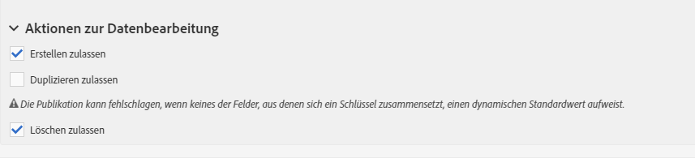

# Bildschirmdefinition konfigurieren{#configuring-the-screen-definition}

Bei der Erstellung einer Ressource oder beim Hinzufügen neuer Felder zu einer existierenden Ressource können Sie festlegen, wie sie in der Benutzeroberfläche dargestellt werden sollen.

Dieser Schritt ist nicht zwingend erforderlich, da dennoch Daten in Ihre Ressource geladen werden können und Sie darauf über Workflows, Audiences und REST-API zugreifen können.

Auf der **[!UICONTROL Screen definition]** Registerkarte haben Sie folgende Möglichkeiten:

* Hinzufügung eines Eintrags im Navigationsmenü, um Zugriff auf die benutzerdefinierte Ressource zu geben;
* Anpassung der Anzeige der Liste mit den einzelnen Elementen der benutzerdefinierten Ressource;
* Konfiguration des Detailbildschirms der einzelnen Elemente der Ressource.

## Zugriff vom Navigationsmenü aus einrichten {#enabling-access-from-the-navigation-menu}

Wenn Sie für Ihre Ressource einen eigenen Bildschirm einrichten möchten, können Sie einen vom Navigationsmenü aus verfügbar machen.

1. From the **[!UICONTROL Screen definition]** tab of the resource, unfold the **[!UICONTROL Navigation]** section.
1. Markieren Sie das **[!UICONTROL Add an entry in the 'Client data' section]** Kästchen, um Zugriff auf diese Ressource im Navigationsbereich zuzulassen.

   

The resource will appear as a sub-entry within the **[!UICONTROL Client data]** section.

## Standard-Listenkonfiguration definieren {#defining-the-default-list-configuration}

The **[!UICONTROL List configuration]** section of the screen definition lets you define the columns and information that will be displayed by default in the overview of a resource.

1. Check the **[!UICONTROL Customize the list configuration]** box to define the way the columns of the resource are displayed.
1. Use the **[!UICONTROL Create element]** button to select a field from those that you have created.
1. Die hinzugefügten Felder erscheinen in der Liste. Spaltentitel und -breite können angepasst werden.

   

1. Überprüfen Sie im **[!UICONTROL Simple search]** Abschnitt die **[!UICONTROL Specify the fields to be taken into account in the search]** , um festzulegen, welche Felder in die Suche einbezogen werden.

   >[!IMPORTANT]
   >
   >Diese Konfiguration ersetzt die bei der Standardsuche berücksichtigten Felder.

1. Markieren Sie im **[!UICONTROL Advanced filtering]** Abschnitt das **[!UICONTROL Add search fields]** Kästchen, um weitere Felder über das einfache Suchfeld hinaus hinzuzufügen. Wenn Sie beispielsweise das Feld &quot;Datum&quot; aus den zuvor erstellten Feldern auswählen, hat der Benutzer die Möglichkeit, die Datensätze ausschließlich nach dem Datum zu filtern.
1. Die Reihenfolge der Felder kann für beide Suchoptionen angepasst werden.
1. Bei der erweiterten Suche besteht die Möglichkeit, Felder vom Typ &quot;Relation zu einer verknüpften Ressource&quot; hinzuzufügen. These filters appear in the **[!UICONTROL Search]** menu of the generated screen.

Der Übersichtsbildschirm der Ressource ist somit definiert.

## Konfiguration des Detailbildschirms definieren {#defining-the-detail-screen-configuration}

The **[!UICONTROL Detail screen configuration]** section of the screen definition lets you define the columns and information that will be displayed in the detail screen of each element of the resource.

1. Blenden Sie den **[!UICONTROL Detail screen configuration]** Abschnitt aus und überprüfen Sie die **[!UICONTROL Define a detail screen]** Konfiguration des Bildschirms, der jedem Element der Ressource entspricht. Wenn Sie diese Option nicht aktivieren, steht für die Elemente der Ressource keine Detailansicht zur Verfügung.
1. Sie haben die Möglichkeit, alle Felder Ihrer benutzerdefinierten Ressource durch die Verwendung einer einzigen Schaltfläche hinzuzufügen. To do this, click the  icon or use the **[!UICONTROL Add an element]** button.
1. Wählen Sie aus den für die Ressource erstellten Elementen eins aus und geben Sie den Feldtyp an:

   * **[!UICONTROL Input field]**: ist ein bearbeitbares Feld.
   * **[!UICONTROL Value]**: ist ein schreibgeschütztes Feld.
   * **[!UICONTROL List]**: ist ein Tisch.
   * **[!UICONTROL Separator]**: teilt Ihre Elemente in Kategorien auf.
   

1. Das hinzugefügte Element wird in der Liste angezeigt. Der Titel ist anpassbar.

   

1. Add as many **[!UICONTROL Separator]** as needed to split your elements into different categories.

   Damit können Sie Ihr Fenster übersichtlicher gestalten.

   

Der Detailbildschirm der Ressource ist somit konfiguriert.

## Aktionen zur Datenbearbeitung {#actions-on-data-section}

An dieser Stelle kann eine dedizierte Symbolleiste für den Bildschirm der benutzerdefinierten Ressource definiert werden. Dabei stehen drei Optionen zur Verfügung:

* **[!UICONTROL Authorize creating]**: Mit dieser Option können Sie die Erstellung von Elementen der Ressource aktivieren. Auf diese Weise können Benutzer zusätzliche Datensätze hinzufügen.

   >[!NOTE]
   >
   >Um diese Option verfügbar zu machen, ist der Detailbildschirm der Ressource zu aktivieren.

* **[!UICONTROL Authorize duplicating]**: Mit dieser Option können Sie doppelte Datensätze aktivieren, die mit der benutzerdefinierten Ressource verknüpft sind.
* **[!UICONTROL Authorize deleting]**: Mit dieser Option können Sie das Löschen von Datensätzen aktivieren, die mit der benutzerdefinierten Ressource verknüpft sind.
