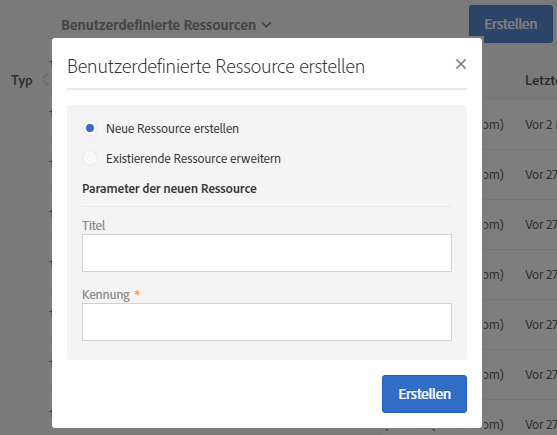
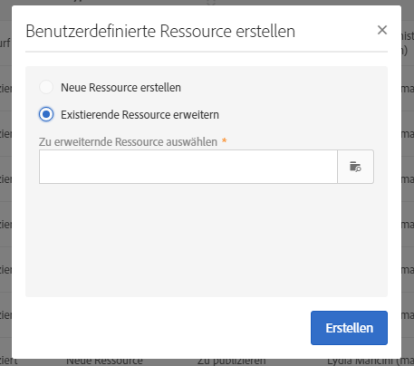

# Ressource erstellen oder erweitern{#creating-or-extending-the-resource}

Administratoren können eine neue Ressource erstellen oder eine existierende Ressource erweitern, wenn Daten bearbeitet werden müssen, die nicht im nativen Datenmodell enthalten sind.

Nur die folgenden nativen Ressourcen können erweitert werden:

* **[!UICONTROL Campaign (campaign)]**
* **[!UICONTROL Sendungen (delivery)]**
* **[!UICONTROL Landingpage (Landingpage)]**
* **[!UICONTROL Profile (profile)]**
* **[!UICONTROL Programm (program)]**
* **[!UICONTROL Service (service)]**
* **[!UICONTROL App-Abonnements (appSubscriptionRcp)]**
* **[!UICONTROL Testprofile (seedMember)]**
* **[!UICONTROL Workflow (workflow)]**

Wenn Sie eine Ressource erstellen oder erweitern möchten, gehen Sie wie folgt vor:

1. Wählen Sie in **[!UICONTROL Administration]** > **[!UICONTROL Entwicklung]** > **[!UICONTROL Benutzerdefinierte Ressourcen]** die Schaltfläche **[!UICONTROL Erstellen]**.
1. Wählen Sie die gewünschte Aktion:

   * **[!UICONTROL Neue Ressource erstellen]**: Füllen Sie die Felder **[!UICONTROL Titel]** und **[!UICONTROL ID]** aus. Das Feld **[!UICONTROL Kennung]** ist ein Pflichtfeld. Falls kein Titel angegeben wird, wird dieser automatisch ausgehend von der Kennung vergeben.

     

     >[!NOTE]
     >
     >Verwenden Sie maximal 30 Zeichen.

   * **[!UICONTROL Existierende Ressource erweitern]**: Wählen Sie die zu erweiternde Ressource aus.

     

1. Wählen Sie **[!UICONTROL Erstellen]** aus, um die Ressource zu erstellen. Diese erhält daraufhin den Status **[!UICONTROL Entwurf]**, falls es sich um eine neue Ressource handelt, oder den Status **[!UICONTROL In Bearbeitung]** im Fall einer Erweiterung.

Die neue Ressource wird erstellt und kann jetzt konfiguriert werden. Weiterführende Informationen zur Ressourcenkonfiguration finden Sie im Abschnitt [Datenstruktur der Ressource konfigurieren](../../developing/using/configuring-the-resource-s-data-structure.md).
