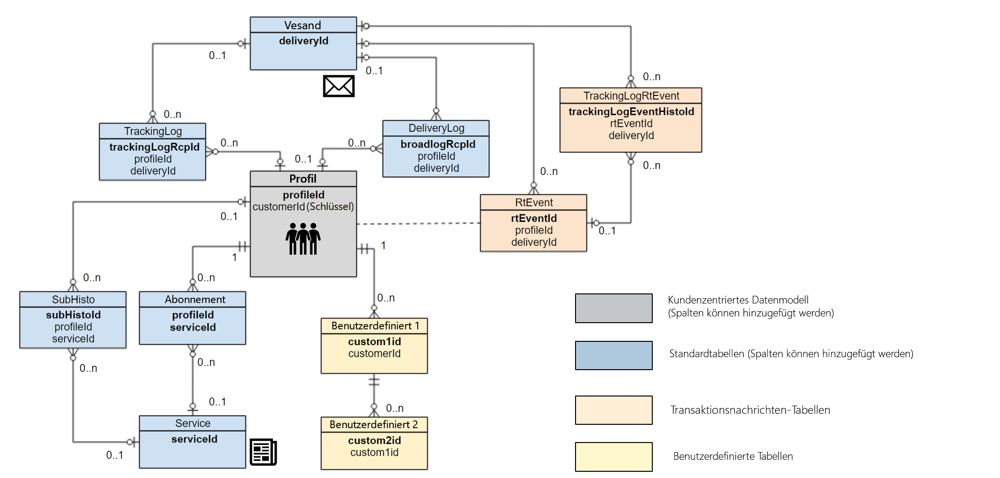

# Best Practices für Datenmodelle{#data-model-best-practices}

In diesem Dokument werden die wichtigsten Empfehlungen beim Entwerfen Ihres Adobe Campaign-Datenmodells erläutert.

>[!NOTE]
>
>Informationen zum Erstellen und Ändern von Ressourcen zur Erweiterung des vordefinierten Adobe Campaign-Datenmodells finden Sie in [diesem Abschnitt](../../developing/using/key-steps-to-add-a-resource.md).
>
>Eine Datenmodelldarstellung der nativen Ressourcen finden Sie auf [dieser Seite](../../developing/using/datamodel-introduction.md).

## Übersicht {#overview}

Das Adobe Campaign-System ist äußerst flexibel und kann über die ursprüngliche Implementierung hinaus erweitert werden. Obwohl die Möglichkeiten unbegrenzt sind, ist es wichtig, die richtigen Entscheidungen zu treffen und eine solide Grundlage zu schaffen, um mit der Entwicklung Ihres Datenmodells zu beginnen.

Dieses Dokument enthält gängige Anwendungsfälle und Best Practices, mit denen Sie lernen, das Adobe Campaign-Tool ordnungsgemäß einzurichten.

## Architektur von Datenmodellen {#data-model-architecture}

Adobe Campaign Standard ist ein leistungsstarkes kanalübergreifendes System zur Kampagnenverwaltung, das es Ihnen ermöglicht, Online- und Offline-Strategien zu kombinieren, um personalisierte Kundenerlebnisse bereitzustellen.

### Kundenorientierter Ansatz {#customer-centric-approach}

Während die meisten E-Mail-Dienstleister für die Kundenkommunikation einen listenorientierten Ansatz verfolgen, setzt Adobe Campaign eine relationale Datenbank ein, um eine breitere Sicht auf die Kunden und ihre Eigenschaften zu nutzen.

Dieser kundenorientierte Ansatz wird in der Grafik unten dargestellt. Die Ressource **Profil** in Grau stellt die Hauptkundentabelle dar, um die herum alles erstellt wird:

Das Standarddatenmodell von Adobe Campaign wird in diesem [Abschnitt](../../developing/using/datamodel-introduction.md) dargestellt.

<!--You can find a datamodel representation for the out-of-the-box resources [here](../../developing/using/datamodel-introduction.md).-->

<!--### What is a customer? {#customer-definition}

If you have customer data in more than one system, you need to determine which solution will allow you to identify records as one person. This work might require rules, eventually a match and merge processes to determine the primary record. This primary record should be the one sent to Adobe Campaign.

While some of this data cleansing might be performed in Adobe Campaign, the recommendation is to run these processes outside and only import clean data in Adobe Campaign. You should keep Campaign as a marketing solution more than a data cleansing tool.

Be able to provide a primary customer record which will be sent to Adobe Campaign.-->

### Daten für Adobe Campaign {#data-for-campaign}

Welche Daten sollten an Adobe Campaign gesendet werden? Es ist äußerst wichtig festzustellen, welche Daten Sie für Ihre Marketingaktivitäten benötigen.

>[!NOTE]
>
>Adobe Campaign ist kein Data Warehouse. Versuchen Sie daher nicht, alle möglichen Kunden und die damit verbundenen Informationen in Adobe Campaign zu importieren.

Um zu entscheiden, ob ein Attribut in Adobe Campaign erforderlich ist, stellen Sie fest, ob es in eine der folgenden Kategorien passt:
* Für die **Segmentierung** verwendetes Attribut
* Für **Datenverwaltungsprozesse** verwendetes Attribut (z. B. Aggregatberechnung)
* Für die **Personalisierung** verwendetes Attribut
* Für die **Berichterstellung** verwendetes Attribut (Berichte können auf der Grundlage von benutzerdefinierten Profildaten erstellt werden)

Wenn ein Attribut nicht in eine dieser Kategorien fällt, benötigen Sie es wahrscheinlich nicht in Adobe Campaign.

### Datentypen {#data-types}

Um eine gute Architektur und Systemleistung sicherzustellen, befolgen Sie die folgenden Best Practices, wenn Sie Daten in Adobe Campaign einrichten:
* Die Länge eines Zeichenfolgenfelds sollte immer mit der Spalte definiert werden. Standardmäßig beträgt die maximale Länge in Adobe Campaign 255 Zeichen. Adobe empfiehlt jedoch, das Feld zu kürzen, wenn Sie bereits wissen, dass auch eine kürzere Länge ausreicht.
* Es ist akzeptabel, dass ein Feld in Adobe Campaign kürzer ist als im Quellsystem, wenn Sie sicher sind, dass die Länge im Quellsystem zu groß ist und nicht benötigt wird. Dies könnte eine kürzere Zeichenfolge oder kleinere Ganzzahl in Adobe Campaign bedeuten.

## Datenstruktur konfigurieren {#configuring-data-structure}

In diesem Abschnitt werden Best Practices für die [Konfiguration der Datenstruktur einer Ressource](../../developing/using/configuring-the-resource-s-data-structure.md) beschrieben.

### Kennungen {#identifiers}

Adobe Campaign-Ressourcen verfügen über drei Kennungen (IDs). Sie können auch eine zusätzliche Kennung hinzuzufügen.

Die folgende Tabelle beschreibt diese Kennungen und ihren Zweck.

>[!NOTE]
>
>Der Anzeigename ist der Name des Felds, der dem Benutzer über die Benutzeroberfläche von Adobe Campaign angezeigt wird. Der technische Name ist der tatsächliche Feldname in der Ressourcendefinition (und der Name der Tabellenspalte).

| Anzeigename | Technischer Name | Beschreibung | Best Practices |
|--- |--- |--- |--- |
|  | PKey | <ul><li>PKey ist der physische Primärschlüssel einer Adobe Campaign-Tabelle.</li><li>Diese Kennung ist in der Regel für eine bestimmte Adobe Campaign-Instanz eindeutig.</li><li>In Adobe Campaign Standard ist dieser Wert für den Endbenutzer nicht sichtbar (mit Ausnahme von URLs).</li></ul> | <ul><li>Über das [API-System](../../api/using/get-started-apis.md) ist es möglich, einen PKey-Wert abzurufen (bei dem es sich um einen generierten/Hash-Wert handelt, und nicht um den physischen Schlüssel).</li><li>Es wird nicht empfohlen, ihn für andere Zwecke zu verwenden, als Datensätze per API abzurufen, zu aktualisieren oder zu löschen.</li></ul> |
| ID | name oder internalName | <ul><li>Diese Information ist eine eindeutige Kennung eines Datensatzes in einer Tabelle. Dieser Wert kann manuell aktualisiert werden.</li><li>Diese Kennung behält ihren Wert bei, wenn sie in einer anderen Instanz von Adobe Campaign bereitgestellt wird. Sie muss einen anderen Namen haben als der generierte Wert, der über ein Package exportiert werden kann.</li><li>Dies ist nicht der eigentliche Primärschlüssel der Tabelle.</li></ul> | <ul><li>Verwenden Sie keine Sonderzeichen wie Leerzeichen &quot; &quot;, Doppelpunkt &quot;:&quot; oder Bindestrich &quot;-&quot;.</li><li>Alle diese Zeichen würden durch einen Unterstrich (_) ersetzt werden. Beispielsweise würden &quot;abc-def&quot; und &quot;abc:def&quot; als &quot;abc_def&quot; gespeichert werden und sich gegenseitig überschreiben.</li></ul> |
| Titel | label | <ul><li>Der Titel ist die Unternehmenskennung eines Objekts oder Datensatzes in Adobe Campaign.</li><li>Dieses Objekt erlaubt Leerzeichen und Sonderzeichen.</li><li>Der Titel garantiert nicht die Einzigartigkeit eines Datensatzes.</li></ul> | <ul><li>Es wird empfohlen, eine Struktur für die Objekttitel festzulegen.</li><li>Dies ist die benutzerfreundlichste Lösung, um einen Datensatz oder ein Objekt für einen Adobe Campaign-Benutzer zu identifizieren.</li></ul> |
| ACS-ID | acsId | <ul><li>Es kann eine zusätzliche Kennung generiert werden: die [ACS-ID](../../developing/using/configuring-the-resource-s-data-structure.md#generating-a-unique-id-for-profiles-and-custom-resources).</li><li>Da der PKey nicht in der Benutzeroberfläche von Adobe Campaign verwendet werden kann, ist dies eine Lösung, um einen eindeutigen Wert zu erhalten, der beim Einfügen eines Profildatensatzes generiert wird.</li><li>Der Wert kann nur dann automatisch generiert werden, wenn die Option in der Ressource aktiviert ist, bevor ein Datensatz in Adobe Campaign eingefügt wird.</li></ul> | <ul><li>Diese UUID kann als Abstimmschlüssel verwendet werden.</li><li>Eine automatisch generierte ACS-ID kann nicht als Referenz in einem Workflow oder in einer Package-Definition verwendet werden.</li><li>Dieser Wert ist spezifisch für eine Adobe Campaign-Instanz.</li></ul> |

### Identifizierungsschlüssel {#keys}

Jede in Adobe Campaign erstellte Ressource muss über mindestens einen eindeutigen [Identifizierungsschlüssel](../../developing/using/configuring-the-resource-s-data-structure.md#defining-identification-keys) verfügen.

<!--Most organizations are importing records from external systems. While the physical key of a resource lies behind the PKey attribute, it is possible to determine a custom key in addition.

This custom key is the actual record primary key in the external system feeding Adobe Campaign.

When an out-of-the-box resource has both an internal auto-generated and an internal custom key, the internal key will be set as a unique index in the physical database table.-->

Beim Erstellen einer benutzerdefinierten Ressource stehen Ihnen zwei Optionen zur Verfügung:

* Eine Kombination aus automatisch erstelltem Schlüssel und internem benutzerdefiniertem Schlüssel. Diese Option ist interessant, wenn Ihr Systemschlüssel ein zusammengesetzter Schlüssel oder keine Ganzzahl ist. Ganzzahlen bieten höhere Leistungen in umfangreichen Tabellen und in Verbindung mit anderen Tabellen.
* Verwendung des Primärschlüssels als Primärschlüssel des externen Systems. Diese Lösung wird in der Regel bevorzugt, da sie das Importieren und Exportieren von Daten durch einen einheitlichen Schlüssel zwischen verschiedenen Systemen vereinfacht.

Identifizierungsschlüssel sollten nicht als Referenz in Workflows verwendet werden.

<!--For more on defining identification keys, see [this section](../../developing/using/configuring-the-resource-s-data-structure.md#defining-identification-keys).-->

### Indizes {#indexes}

Adobe Campaign fügt allen in einer Ressource definierten primären und internen Schlüsseln automatisch einen [Index](../../developing/using/configuring-the-resource-s-data-structure.md#defining-indexes) hinzu.

* Adobe empfiehlt, zusätzliche Indizes zu definieren, da dies die Leistung verbessern kann.
* Fügen Sie jedoch nicht zu viele Indizes hinzu, da sie Speicherplatz in der Datenbank belegen. Zahlreiche Indizes können sich auch negativ auf die Leistung auswirken.
* Wählen Sie die zu definierenden Indizes sorgfältig aus.

<!--For more on defining indexes, see [this section](../../developing/using/configuring-the-resource-s-data-structure.md#defining-indexes).

When you are performing an initial import with very high volumes of data insert in Adobe Campaign database, it is recommended to run that import without custom indexes at first. It will allow to accelerate the insertion process. Once you’ve completed this important import, it is possible to enable the index(es).-->

### Relationen {#links}

Die Definition von Relationen zu anderen Ressourcen wird in [diesem Abschnitt](../../developing/using/configuring-the-resource-s-data-structure.md#defining-links-with-other-resources) erläutert.

* Obwohl es möglich ist, eine beliebige Tabelle in einem Workflow einzubinden, empfiehlt Adobe, allgemeine Relationen zwischen Ressourcen direkt in der Definition der Datenstruktur festzulegen.
* Die Relation sollte entsprechend den tatsächlichen Daten in den Tabellen definiert werden. Eine falsche Definition könnte sich auf Daten auswirken, die über Relationen abgerufen wurden, z. B. durch unerwartetes Duplizieren von Datensätzen.
* Benennen Sie die Relation konsequent nach der Ressource. Der Name der Relation sollte Aufschluss über die ferne Tabelle geben.
* Benennen Sie eine Relation nicht mit &quot;id&quot; als Suffix. Benennen Sie sie beispielsweise &quot;transaction&quot; anstelle von &quot;transactionId&quot;.

<!--For more on defining links with other resources, see [this section](../../developing/using/configuring-the-resource-s-data-structure.md#defining-links-with-other-resources).-->

## Leistung {#performance}

Befolgen Sie die nachstehenden Best Practices, um eine bessere Leistung sicherzustellen.

### Allgemeine Empfehlungen {#general-recommendations}

* Vermeiden Sie die Verwendung von Operationen wie &quot;CONTAINS&quot; in Abfragen. Wenn Sie wissen, wonach gefiltert werden soll, wenden Sie dieselbe Bedingung mit &quot;EQUAL TO&quot; oder anderen spezifischen Filteroperatoren an.
* Vermeiden Sie die Verknüpfung mit nicht indizierten Feldern beim Aufbau von Daten in Workflows.
* Vergewissern Sie sich, dass Prozesse wie Import und Export außerhalb der Geschäftszeiten ausgeführt werden.
* Stellen Sie sicher, dass ein Zeitplan für alle täglichen Aktivitäten vorhanden ist und halten Sie sich an ihn.
* Wenn einer oder mehrere der täglichen Prozesse fehlschlagen und sie am selben Tag noch ausgeführt werden müssen, stellen Sie sicher, dass beim Starten des manuellen Prozesses keine Konflikte auftreten, da dies die Systemleistung beeinträchtigen könnte.
* Stellen Sie sicher, dass keine der täglichen Kampagnen während des Importvorgangs oder bei der Ausführung eines manuellen Prozesses ausgeführt wird.
* Verwenden Sie eine oder mehrere Referenztabellen, anstatt ein Feld in jeder Zeile zu duplizieren. Bei Verwendung von Schlüssel/Wert-Paaren ist es empfehlenswert, einen numerischen Schlüssel zu wählen.
* Eine kurze Zeichenfolge ist weiterhin zulässig. Falls Referenztabellen bereits in einem externen System vorhanden sind, erleichtert die Wiederverwendung derselben die Datenintegration mit Adobe Campaign.

### 1-zu-n-Beziehungen {#one-to-many-relationships}

* Das Datendesign beeinflusst Benutzerfreundlichkeit und Funktionalität. Wenn Sie Ihr Datenmodell mit zahlreichen 1-zu-n-Beziehungen entwickeln, wird es für Benutzer schwieriger, in der Anwendung eine sinnvolle Logik zu erstellen. Für technisch nicht versierte Marketing-Experten kann es schwierig sein, eine 1-zu-n-Filterlogik zu entwerfen und zu verstehen.
* Es wird empfohlen, alle wichtigen Felder in einer Tabelle zu vereinen, da Benutzer so leichter Abfragen erstellen können. Unter Umständen kann die Leistung auch verbessert werden, wenn einige Felder in mehreren Tabellen dupliziert werden, wenn dadurch ein Join vermieden werden kann.
* Bestimmte integrierte Funktionen können nicht auf 1-zu-n Beziehungen verweisen, z. B. die Angebotsgewichtungsformel und Sendungen.

### Große Tabellen {#large-tables}

Im Folgenden finden Sie einige Best Practices, die beim Entwerfen Ihres Datenmodells mit großen Tabellen und komplexen Joins befolgt werden sollten.

* Reduzieren Sie die Anzahl der Spalten, indem Sie beispielsweise die nicht verwendeten Spalten ermitteln.
* Optimieren Sie die Datenmodellrelationen, indem Sie komplexe Joins vermeiden, wie z. B. Joins mit mehreren Bedingungen und/oder mit mehreren Spalten.
* Verwenden Sie für Join-Schlüssel immer numerische Daten anstelle von Zeichenfolgen.
* Reduzieren Sie die Tiefe der Protokollaufbewahrung so weit wie möglich. Wenn Sie einen tieferen Verlauf benötigen, können Sie Berechnungen aggregieren und/oder benutzerdefinierte Protokolltabellen bearbeiten, um einen größeren Verlauf zu speichern.