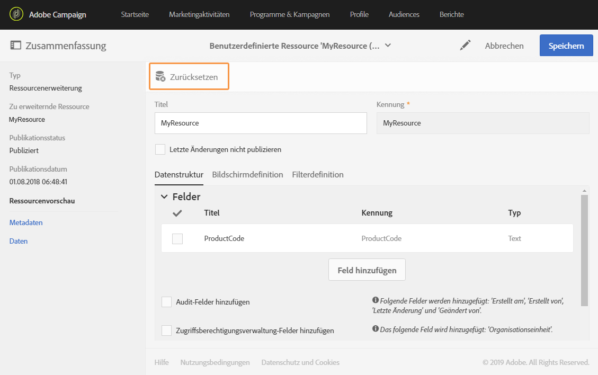
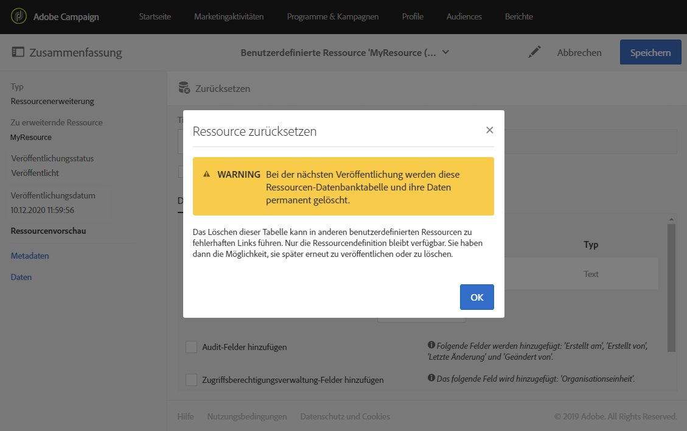

# Ressourcen löschen{#deleting-a-resource}

Eine Ressource muss den **[!UICONTROL Entwurf]**-Status aufweisen, um gelöscht werden zu können. Die Ressource befindet sich im Status **[!UICONTROL Entwurf]**, wenn:

* soeben erstellt und noch nicht publiziert wurde.
* sie bereits publiziert aber anschließend zurückgesetzt wurde.

>[!IMPORTANT]
>
>Das Zurücksetzen und Löschen einer benutzerdefinierten Ressource sind heikle Verfahren, die sich auf andere Ressourcen auswirken können. Diese Vorgänge dürfen nur von einem erfahrenen Benutzer durchgeführt werden.

Um eine publizierte Ressource zurückzusetzen und zu löschen, gehen Sie folgendermaßen vor:

1. Wählen Sie die zurückzusetzende Ressource aus.
1. Verwenden Sie die Schaltfläche **[!UICONTROL Zurücksetzen]** in der Symbolleiste.

   

1. Bestätigen Sie die Aktion mit der Schaltfläche **[!UICONTROL OK]**.

   >[!IMPORTANT]
   >
   >Dieser Vorgang kann nicht rückgängig gemacht werden: Die Datenbanktabelle der Ressource oder die Spalten und deren Daten werden permanent gelöscht, wenn die Änderung publiziert wird. Dadurch können auch die Verknüpfungen mit anderen benutzerdefinierten Ressourcen beeinträchtigt werden. Nur die Ressource-Definition wird weiterhin verfügbar sein.

   

   >[!NOTE]
   >
   >Wenn Sie eine Erweiterung der nativen Ressource **Profile (profile)** zurücksetzen, müssen Sie auch etwaige **Testprofil (seedMember)**-Erweiterungen zurücksetzen, die Sie definiert haben. Weiterführende Informationen zur Erweiterung der Profilressource finden Sie in [diesem Abschnitt](../../developing/using/extending-the-profile-resource-with-a-new-field.md).

1. Publizieren Sie die Ressource. Eine detaillierte Anleitung finden Sie im Abschnitt [Benutzerdefinierte Ressource publizieren](../../developing/using/updating-the-database-structure.md#publishing-a-custom-resource).

   Die Ressource ist nun im Modus **Entwurf** und weist den Aktivierungsstatus **[!UICONTROL Deaktiviert]** auf.

1. Markieren Sie im Modus **[!UICONTROL Liste]** die zu löschende Ressource und wählen Sie dann das Symbol **[!UICONTROL Element löschen]** aus.

   

Ihre Ressource wird aus dem Datenmodell gelöscht.

>[!NOTE]
>
>Wenn ein Feld einer für ein Ereignis verwendeten benutzerdefinierten Ressource geändert oder gelöscht wird, wird das zugehörige Ereignis automatisch depubliziert. Siehe [Transaktionsnachrichten konfigurieren](../../administration/using/configuring-transactional-messaging.md).

