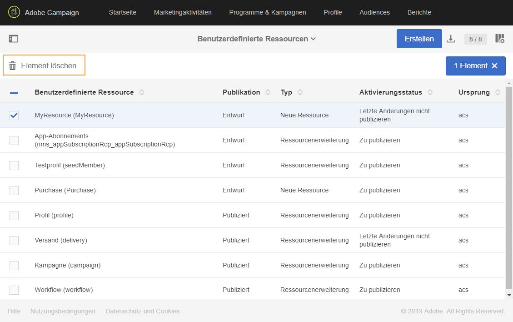

# Ressourcen löschen{#deleting-a-resource}

To delete a resource, the resource in question must be a **[!UICONTROL Draft]**. The resource is in **[!UICONTROL Draft]** status if:

* soeben erstellt und noch nicht publiziert wurde.
* sie bereits publiziert aber anschließend zurückgesetzt wurde.

>[!IMPORTANT]
>
>Das Zurücksetzen und Löschen einer benutzerdefinierten Ressource sind heikle Verfahren, die sich auf andere Ressourcen auswirken können. Diese Vorgänge dürfen nur von einem erfahrenen Benutzer durchgeführt werden.

Um eine publizierte Ressource zurückzusetzen und zu löschen, gehen Sie folgendermaßen vor:

1. Wählen Sie die zurückzusetzende Ressource aus.
1. Click the **[!UICONTROL Re-draft]** button in the action bar.

   

1. Klicks **[!UICONTROL Ok]**.

   >[!IMPORTANT]
   >
   >Dieser Vorgang kann nicht rückgängig gemacht werden: Die Datenbanktabelle der Ressource oder die Spalten und deren Daten werden permanent gelöscht, wenn die Änderung publiziert wird. Dadurch können auch die Verknüpfungen mit anderen benutzerdefinierten Ressourcen beeinträchtigt werden. Nur die Ressource-Definition wird weiterhin verfügbar sein.

   

   >[!NOTE]
   >
   >Wenn Sie eine Erweiterung der nativen Ressource **Profile (profile)** zurücksetzen, müssen Sie auch etwaige **Testprofil (seedMember)**-Erweiterungen zurücksetzen, die Sie definiert haben. Weiterführende Informationen zur Erweiterung der Profilressource finden Sie in [diesem Abschnitt](../../developing/using/extending-the-profile-resource-with-a-new-field.md).

1. Publizieren Sie die Ressource. Eine detaillierte Anleitung finden Sie im Abschnitt [Benutzerdefinierte Ressource publizieren](../../developing/using/updating-the-database-structure.md#publishing-a-custom-resource).

   The resource then goes into **Draft** mode and its activation status is **[!UICONTROL Inactive]**.

1. In **[!UICONTROL List]** mode, check the resource to delete then click the  **[!UICONTROL Delete element]** icon.

   

Ihre Ressource wird aus dem Datenmodell gelöscht.

>[!NOTE]
>
>Wenn ein Feld einer für ein Ereignis verwendeten benutzerdefinierten Ressource geändert oder gelöscht wird, wird das zugehörige Ereignis automatisch depubliziert. Siehe [Transaktionsnachrichten konfigurieren](../../administration/using/configuring-transactional-messaging.md).

