# Profil-Ressource um ein neues Feld erweitern{#extending-the-profile-resource-with-a-new-field}

## Über Profilerweiterungen {#about-extending-profiles}

Das folgende Anwendungsbeispiel erläutert die Erweiterung der Profil- und der Testprofil-Ressourcen um ein zusätzliches Feld.

In unserem Beispiel wird gezeigt, wie die Profile unter Verwendung einer Landingpage mit dem neuen Feld aktualisiert werden und dann an Profile ein Newsletter gesendet wird, der genau ihren Interessen entspricht.

Gehen Sie dazu wie folgt vor:

* [Schritt 1: Profil-Ressource erweitern](#step-1--extend-the-profile-resource)
* [Schritt 2: Testprofil erweitern](#step-2--extend-the-test-profile)
* [Schritt 3: Benutzerdefinierte Ressource veröffentlichen](#step-3--publish-your-custom-resource)
* [Schritt 4: Profile mit einem Workflow aktualisieren und auswählen](#step-4--update-and-target-profiles-with-a-workflow)

Das folgende Feld wird dann zu unseren Profilen hinzugefügt und kann für einen Versand ausgewählt werden:

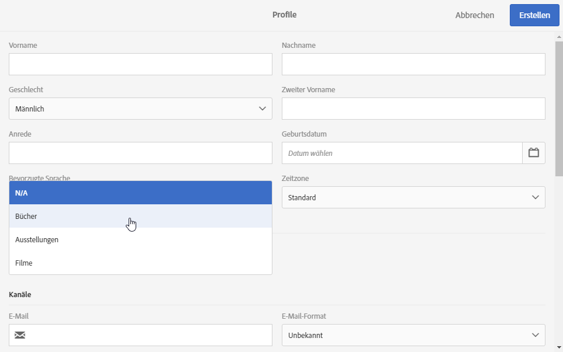

Verwandte Themen:

* [Über benutzerdefinierte Ressourcen](../../developing/using/data-model-concepts.md)
* [Profile verwalten](../../audiences/using/about-profiles.md)
* [Testprofile verwalten](../../audiences/using/managing-test-profiles.md)

## Schritt 1: Profil-Ressource erweitern {#step-1--extend-the-profile-resource}

Um das neue Feld **Interessen** für unsere Profile zu erstellen, müssen Sie zunächst die native Ressource **[!UICONTROL Profile (profile)]** erweitern.

1. Greifen Sie mithilfe des Adobe Campaign-Logos oben links im Bildschirm und der Schaltflächen **[!UICONTROL Administration]** > **[!UICONTROL Entwicklung]** > **[!UICONTROL Benutzerdefinierte Ressourcen]** auf das entsprechende Menü zu.
1. Wenn Sie die Ressource **[!UICONTROL Profile]** noch nicht erweitert haben, wählen Sie **[!UICONTROL Erstellen]** aus.
1. Wählen Sie die Option **[!UICONTROL Existierende Ressource erweitern]**.
1. Wählen Sie die Ressource **[!UICONTROL Profil (profile)]** aus.
1. Wählen Sie **[!UICONTROL Erstellen]** aus.

   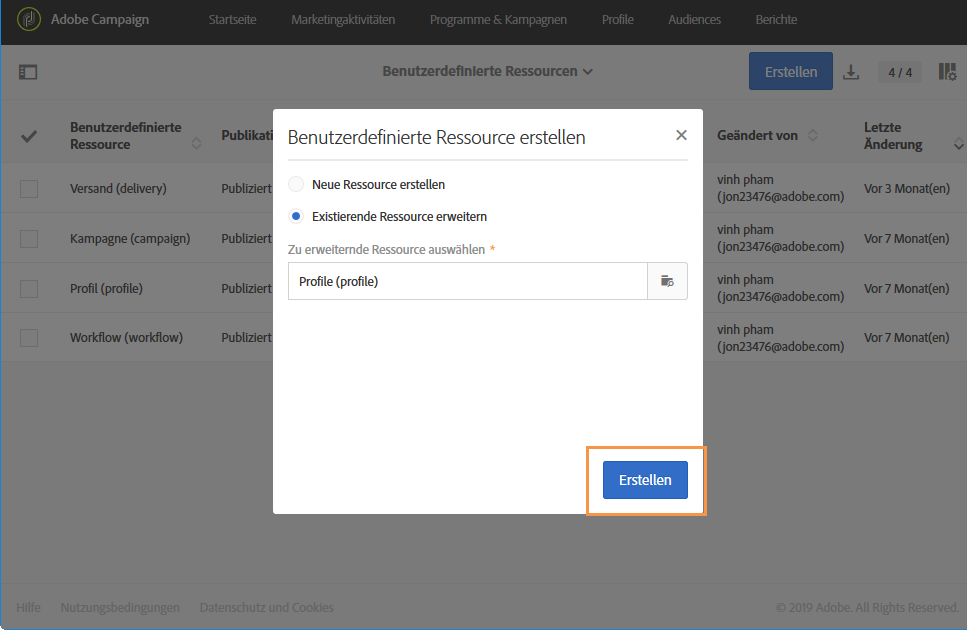

1. Wählen Sie in der Kategorie **[!UICONTROL Felder]** im Tab **[!UICONTROL Datenstruktur]** die Option **[!UICONTROL Element erstellen]** aus.

   >[!NOTE]
   >
   >Wenn Sie die Ressource **[!UICONTROL Profil]** bereits für andere Zwecke erweitert haben, können Sie mit diesem Schritt beginnen, indem Sie **[!UICONTROL Feld hinzufügen]** auswählen.

   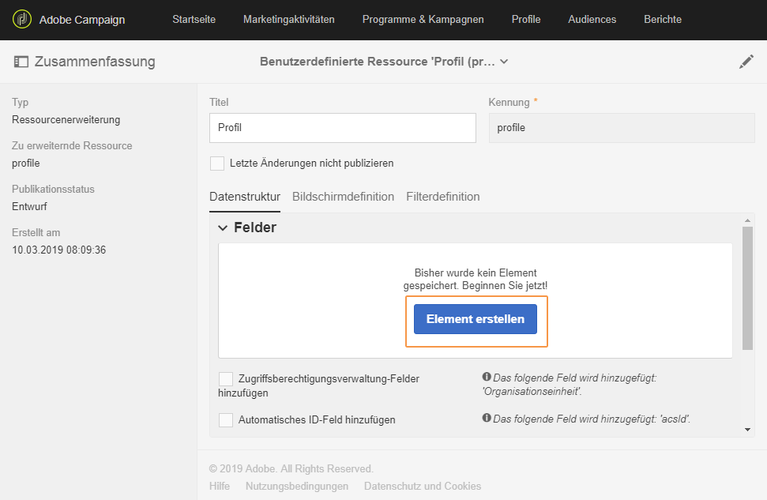

1. Fügen Sie einen **[!UICONTROL Titel]** und eine **[!UICONTROL Kennung]** hinzu. Wählen Sie den Typ **[!UICONTROL Text]** und danach **[!UICONTROL Hinzufügen]** aus.

   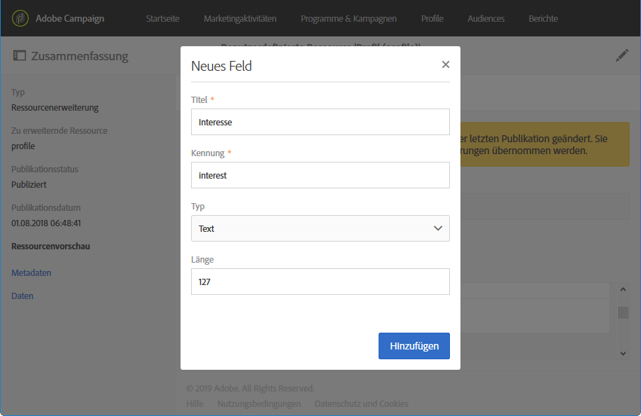

1. Um das Feld zu konfigurieren, wählen Sie im Tab **[!UICONTROL Datenstruktur]** in der Dropdown-Liste **[!UICONTROL Felder]** die Option  und dann  im zuvor erstellten Feld aus.
1. In unserem Beispiel sollen bestimmte Werte hinzugefügt werden. Wählen Sie dazu **[!UICONTROL Liste zulässiger Werte definieren]** aus.

   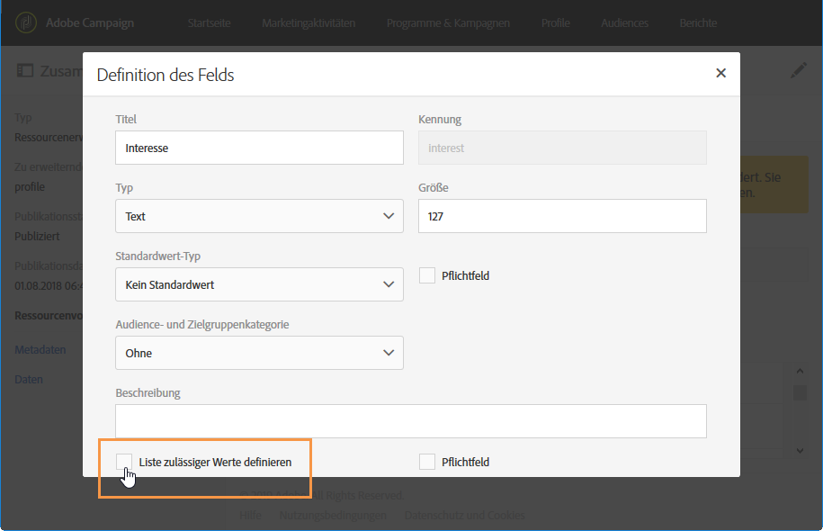

1. Wählen Sie **[!UICONTROL Element hinzufügen]** und danach beliebig viele Werte aus, indem Sie einen **[!UICONTROL Titel]** und eine **[!UICONTROL Kennung]** hinzufügen und **[!UICONTROL Hinzufügen]** auswählen.

   In unserem Beispiel sollen die Werte &quot;Bücher&quot;, &quot;Ausstellungen&quot;, &quot;Filme&quot; und &quot;k. A.&quot; erstellt werden, die in den Profilen zur Auswahl stehen werden.

   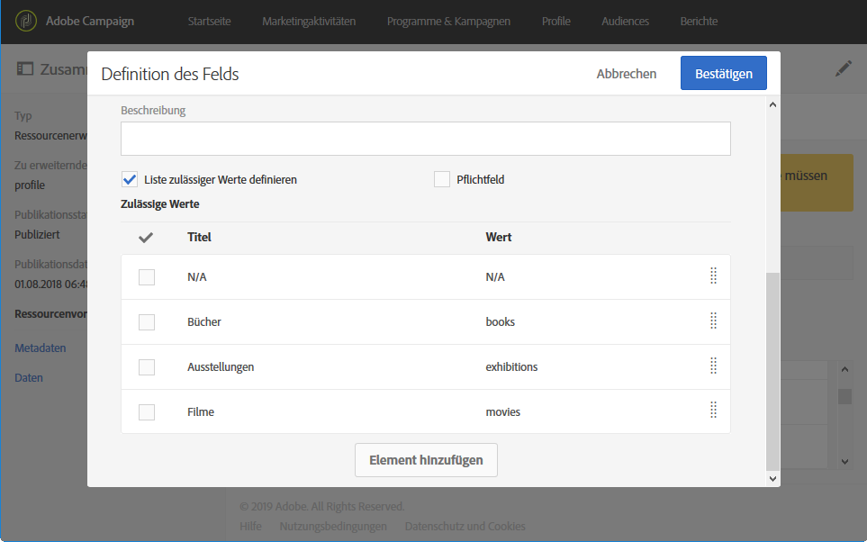

1. Um dieses Feld im Bildschirm **[!UICONTROL Profil]** hinzuzufügen, wählen Sie den Tab **[!UICONTROL Bildschirmdefinition]** aus.
1. Wählen Sie aus der Dropdown-Liste **[!UICONTROL Konfiguration des Detailbildschirms]** die Option **[!UICONTROL Abschnitt mit Personalisierungsfeldern hinzufügen]** und danach **[!UICONTROL Element erstellen]** aus.

   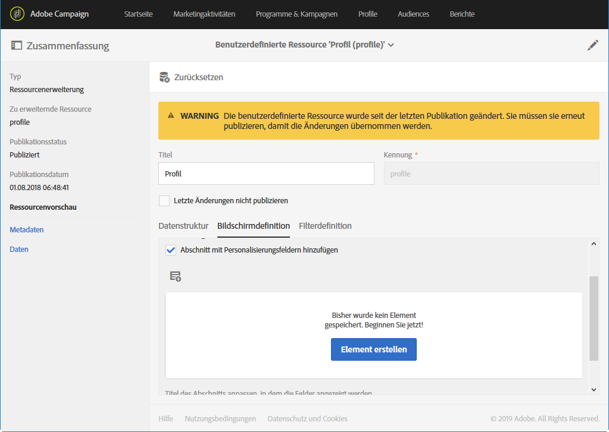

1. Wählen Sie einen **[!UICONTROL Typ]** aus. In unserem Beispiel soll ein Eingabefeld hinzugefügt werden. Wählen Sie anschließend das zuvor von Ihnen erstellte Feld und danach **[!UICONTROL Hinzufügen]** aus.

   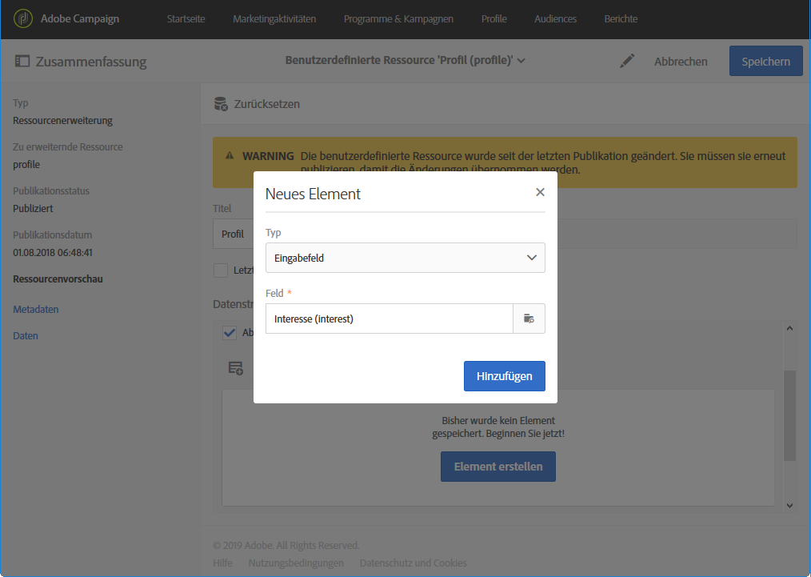

1. Um zur übersichtlicheren Gestaltung Ihres Profilfensters ein Trennzeichen hinzuzufügen, wählen Sie **[!UICONTROL Element erstellen]** und danach **[!UICONTROL Trennzeichen]** in der Dropdown-Liste **[!UICONTROL Typ]** aus.

   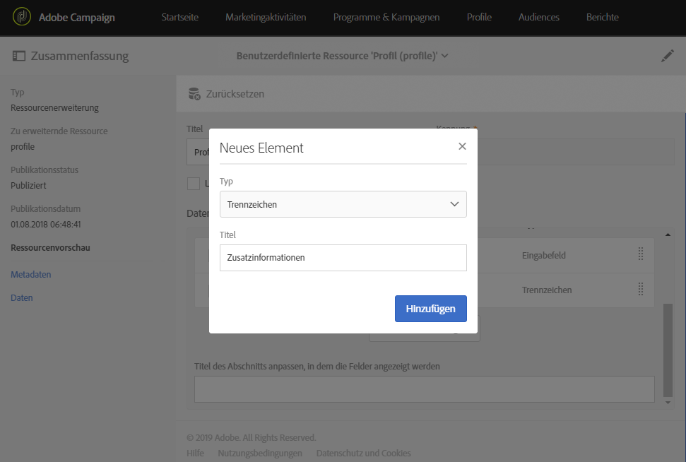

Ihr Feld wird daraufhin konfiguriert. Jetzt wird es auf das Testprofil erweitert.

>[!NOTE]
>
>Wenn Sie die Testprofil-Ressource nicht erweitern müssen, können Sie mit dem Schritt zum Veröffentlichen fortfahren.

## Schritt 2: Testprofil erweitern       {#step-2--extend-the-test-profile}

Um zu überprüfen, ob das neu erstellte Feld korrekt konfiguriert ist, können Sie es testen, indem Sie Ihre Nachricht an Testprofile senden. Zunächst muss das neue Feld auch auf die Testprofile übertragen werden.

1. Greifen Sie mithilfe des Adobe Campaign-Logos oben links im Bildschirm und der Schaltflächen **[!UICONTROL Administration]** > **[!UICONTROL Entwicklung]** > **[!UICONTROL Benutzerdefinierte Ressourcen]** auf das entsprechende Menü zu.
1. Wenn Sie die Ressource **[!UICONTROL Profile]** noch nicht erweitert haben, wählen Sie **[!UICONTROL Erstellen]** aus.
1. Wählen Sie die Option **[!UICONTROL Existierende Ressource erweitern]**.
1. Wählen Sie die Ressource **[!UICONTROL Testprofil (seedMember)]** aus.
1. Wählen Sie **[!UICONTROL Erstellen]** aus.

   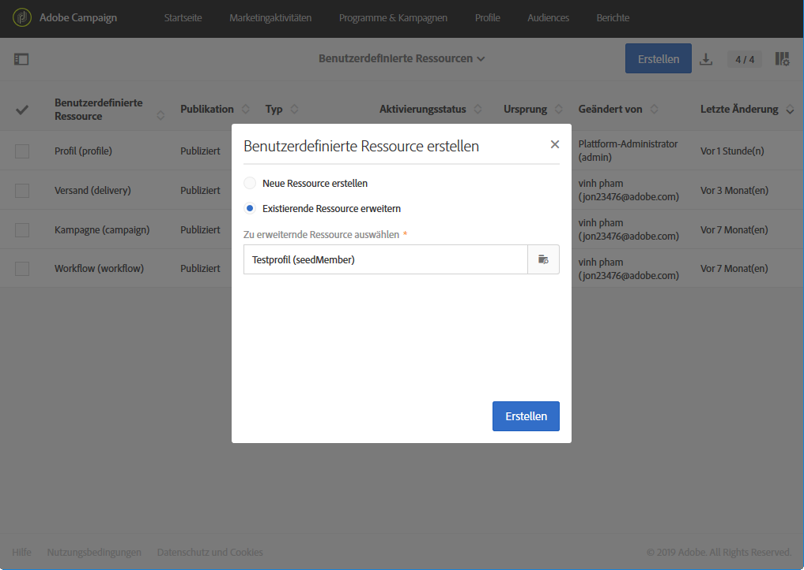

1. Wählen Sie im Tab **[!UICONTROL Datenstruktur]** die Option **[!UICONTROL Element erstellen]** aus.

   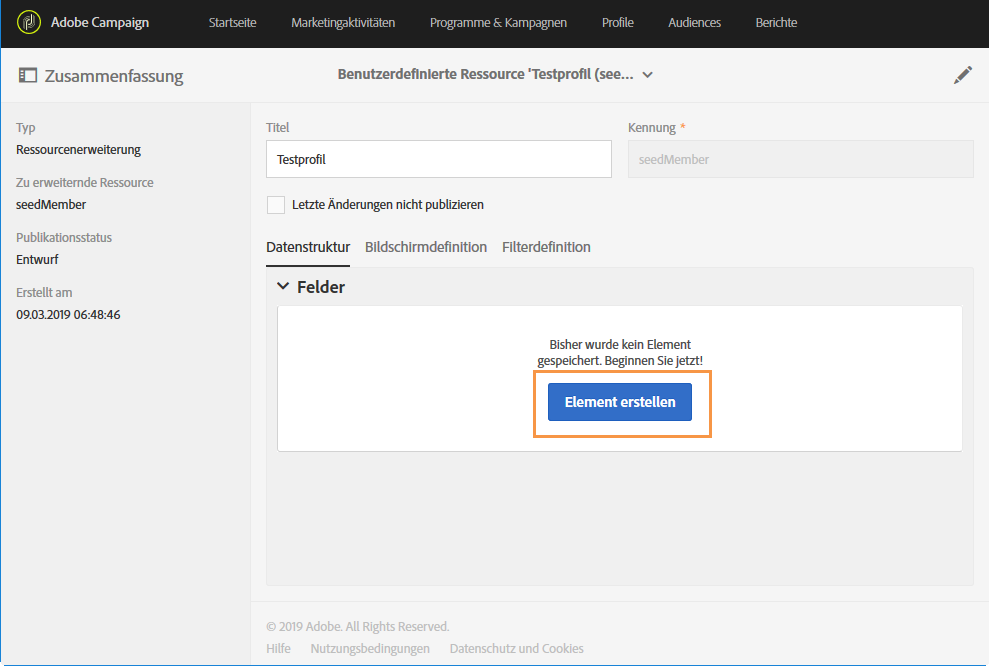

1. Wählen Sie das zuvor von Ihnen erstellte Ressourcenfeld und danach **[!UICONTROL Hinzufügen]** aus.

   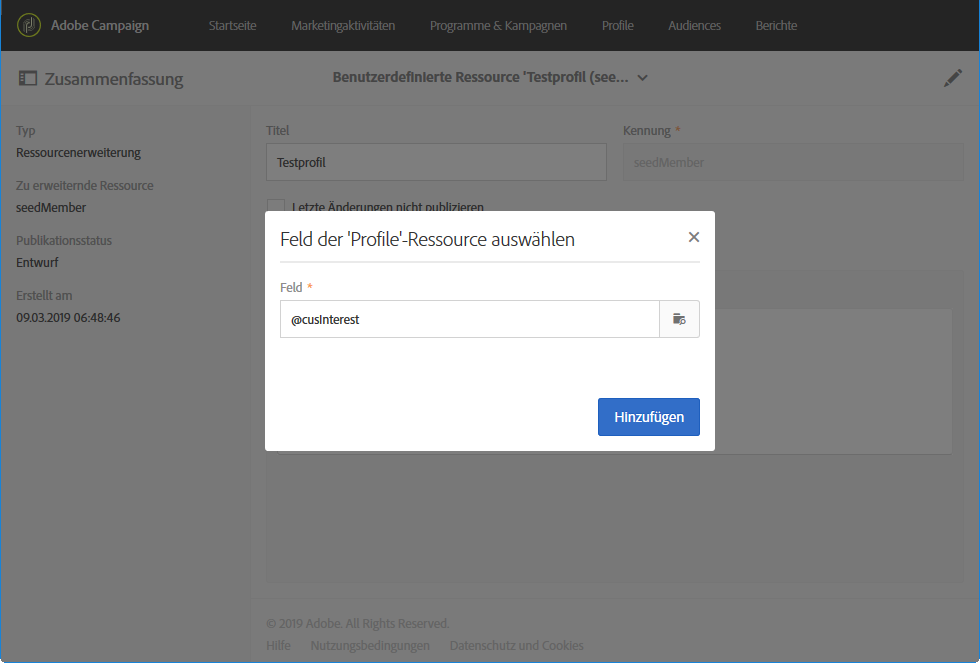

1. Führen Sie dieselben Schritte 11 bis 13 der Anleitung zur Profilerweiterung durch, um dieses Feld im Bildschirm **[!UICONTROL Testprofil]** hinzuzufügen.
1. Wählen Sie **[!UICONTROL Speichern]** aus.

Ihr neues Feld ist jetzt sowohl in den Profilen als auch in den Testprofilen verfügbar. Damit es korrekt konfiguriert wird, müssen Sie Ihre benutzerdefinierte Ressource veröffentlichen.

## Schritt 3: Benutzerdefinierte Ressource veröffentlichen   {#step-3--publish-your-custom-resource}

Zur Übernahme der Änderungen der Ressourcen und deren Verwendung muss die Datenbank aktualisiert werden.

1. Wählen Sie im erweiterten Menü **Administration** > **Entwicklung** und dann **Veröffentlichen** aus.
1. Standardmäßig ist die Option **[!UICONTROL Änderungen seit der letzten Veröffentlichung ermitteln]** aktiv. Dies bedeutet, dass nur die Änderungen übernommen werden, die seit der letzten Veröffentlichung vorgenommen wurden.

   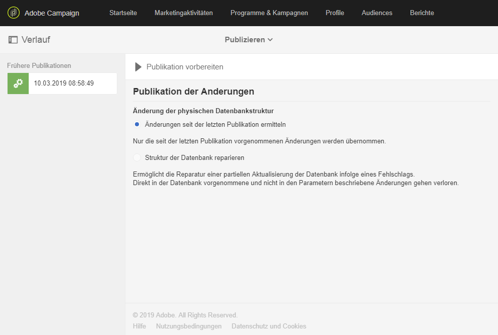

1. Wählen Sie **[!UICONTROL Veröffentlichung vorbereiten]** aus, um die Analyse zu starten, durch die Ihre Datenbank aktualisiert wird.
1. Nach erfolgreicher Analyse können Sie unter Verwendung der Schaltfläche **Veröffentlichen** die Konfigurationsänderungen übernehmen.

   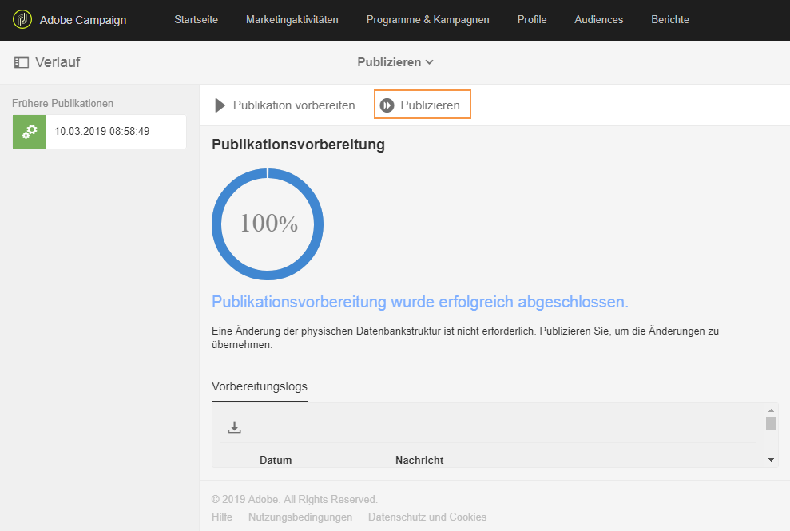

1. Im Anschluss an die Veröffentlichung werden in der **Zusammenfassung** der entsprechenden Ressourcen der Status **Veröffentlicht** und das letzte Veröffentlichungsdatum angezeigt.

   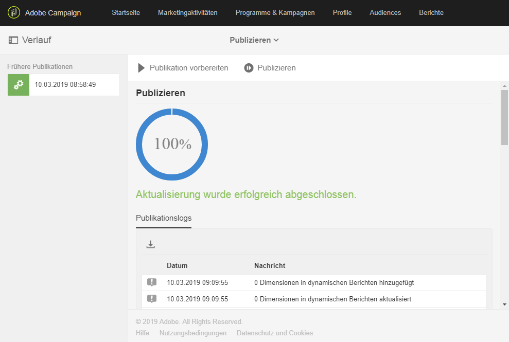

1. Wählen Sie den Tab **[!UICONTROL Profile]** und danach **[!UICONTROL Neu]** aus, um zu überprüfen, ob Ihre Änderungen korrekt implementiert wurden.

   

Ihr neues Ressourcenfeld kann jetzt verwendet und beispielsweise bei einem Versand ausgewählt werden.

## Schritt 4: Profile mit einem Workflow aktualisieren und auswählen       {#step-4--update-and-target-profiles-with-a-workflow}

Um Profile mit Daten aus dem neuen benutzerdefinierten Feld zu aktualisieren, können Sie mithilfe der Vorlage **[!UICONTROL Profilakquise]** eine Landingpage erstellen. Weiterführende Informationen zu Landingpages finden Sie auf dieser [Seite](../../channels/using/getting-started-with-landing-pages.md).

In unserem Beispiel sollen in einem Workflow Profile ausgewählt werden, bei denen dieses Feld nicht ausgefüllt ist. Diese sollen eine E-Mail erhalten, in der sie gebeten werden, ihre Profile zu aktualisieren, damit sie Newsletter und Angebote erhalten können. Jedes Profil erhält daraufhin einen personalisierten Newsletter, der an die jeweiligen Interessen angepasst ist.

Zuerst muss eine Landingpage erstellt werden, über die das **Interessen**-Feld der Profile der Zielgruppe aktualisiert wird:

1. Wählen Sie im Tab **[!UICONTROL Marketing-Aktivitäten]** die Option **[!UICONTROL Erstellen]** und dann **[!UICONTROL Landingpage]** aus.
1. Wählen Sie einen Landingpage-Typ aus. Wählen Sie hier **[!UICONTROL Profilakquise]** aus, da die Profile aktualisiert werden müssen.
1. Wählen Sie **[!UICONTROL Erstellen]** aus.
1. Klicken Sie auf den Baustein **[!UICONTROL Inhalt]**, um den Inhalt der Landingpage zu bearbeiten.

   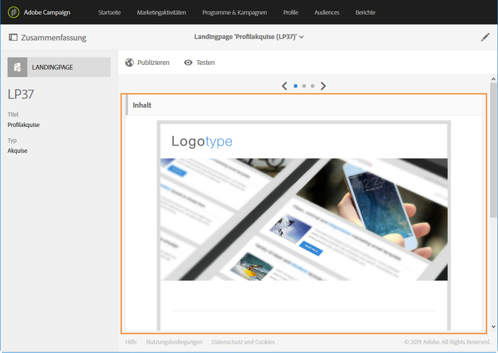

1. Passen Sie Ihre Landingpage nach Bedarf an.
1. Wählen Sie das für Ihre Profile konfigurierte Feld aus, in dem diese ihre Interessen auswählen können. Wählen Sie im linken Bereich die zuvor erstellte benutzerdefinierte Ressource **Interessen** aus.

   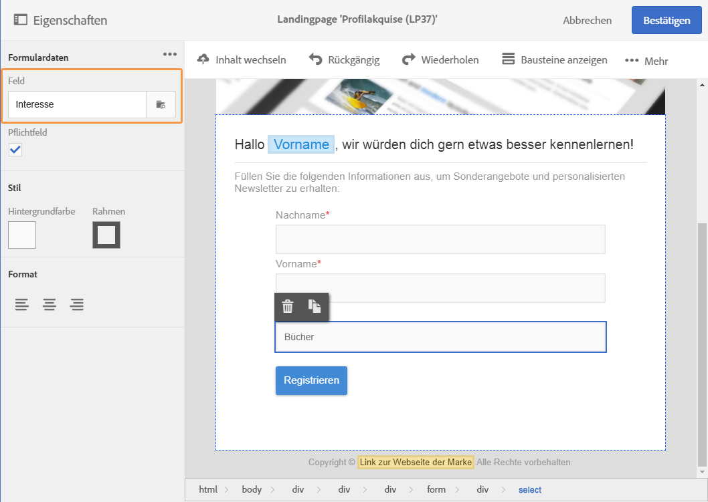

1. Speichern Sie Ihre Landingpage und testen Sie sie, um festzustellen, ob die Felder korrekt konfiguriert sind.
1. Wenn Ihre Landingpage bereit ist, wählen Sie **[!UICONTROL Veröffentlichen]** aus.

Ihre Landingpage kann jetzt verwendet werden. Um die Profile zu aktualisieren, erstellen Sie einen Workflow, mit dem anschließend ein spezielles Angebot entsprechend den ausgewählten Interessen gesendet wird.

1. Wählen Sie im Tab **[!UICONTROL Marketing-Aktivitäten]** die Option **[!UICONTROL Erstellen]** und dann **[!UICONTROL Workflow]** aus.
1. Ziehen Sie die Aktivität **[!UICONTROL Abfrage]** in den Arbeitsbereich, um die entsprechenden Profile oder Audiences auszuwählen.
1. Ziehen Sie die Aktivität **[!UICONTROL E-Mail-Versand]** in den Arbeitsbereich, um die E-Mail zu konfigurieren, die einen Link zur Landingpage enthält. Wählen Sie **[!UICONTROL Ausgehende Transition mit der Population hinzufügen]** aus.

   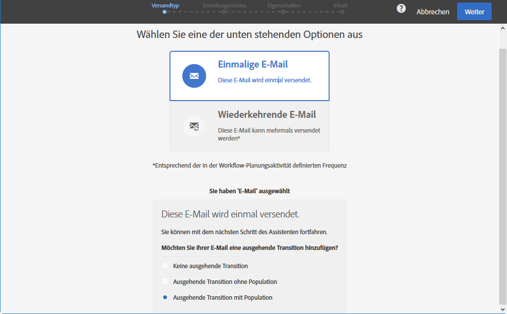

1. Erstellen und gestalten Sie Ihre E-Mail nach Bedarf. Weiterführende Informationen zur Personalisierung von E-Mails finden Sie auf dieser [Seite](../../designing/using/quick-start.md).
1. Fügen Sie zu Ihrer E-Mail eine Schaltfläche hinzu, mit der Profile zu Ihrer Landingpage weitergeleitet werden.
1. Wählen Sie die hinzugefügte Schaltfläche aus und klicken Sie danach auf der linken Seite in den **[!UICONTROL Link]**-Bereich.

   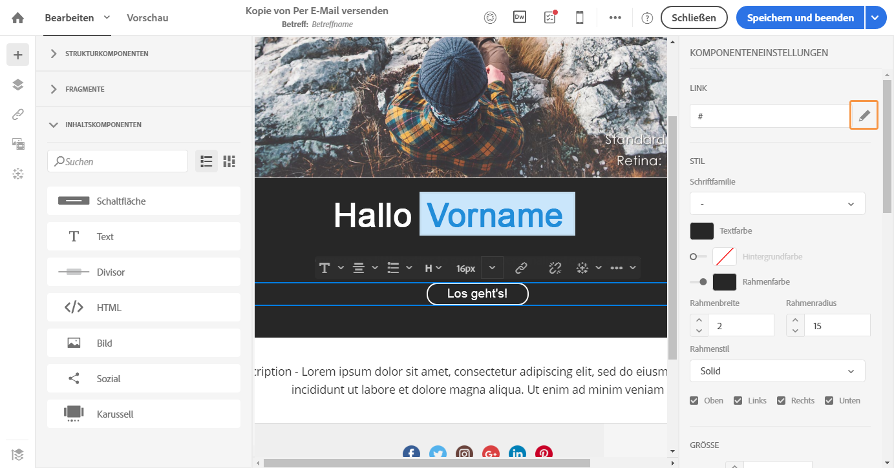

1. Wählen Sie im Fenster **[!UICONTROL Link einfügen]** die Option **[!UICONTROL Landingpage]** aus der Dropdown-Liste **[!UICONTROL Linktyp]** und danach die zuvor erstellte Landingpage aus.

   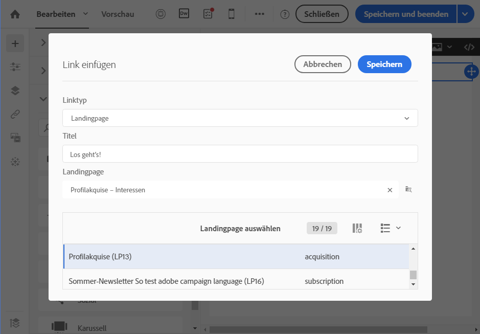

1. Wählen Sie **[!UICONTROL Speichern]** aus. Ihre E-Mail ist jetzt fertig und Sie können mit Ihrem Workflow fortfahren.
1. Fügen Sie die Aktivität **[!UICONTROL Warten]** hinzu, um Ihren Profilen etwas Zeit zum Ausfüllen des Formulars auf der Landingpage zu geben.
1. Fügen Sie die Aktivität **[!UICONTROL Segmentierung]** hinzu, um die ausgehende Transition entsprechend den **Interessen** aufzuspalten.
1. Erstellen Sie für jedes **Interesse** ein ausgehendes Segment.

   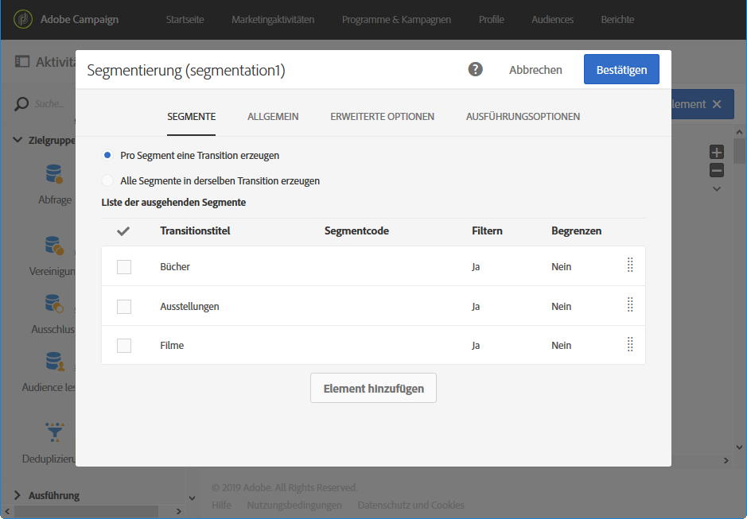

1. Fügen Sie nach jeder Transition die Aktivität **[!UICONTROL E-Mail-Versand]** hinzu und erstellen Sie entsprechend den ausgewählten **Interessen** eine personalisierte E-Mail.
1. Wenn die Konfiguration abgeschlossen ist, starten Sie den Workflow.

   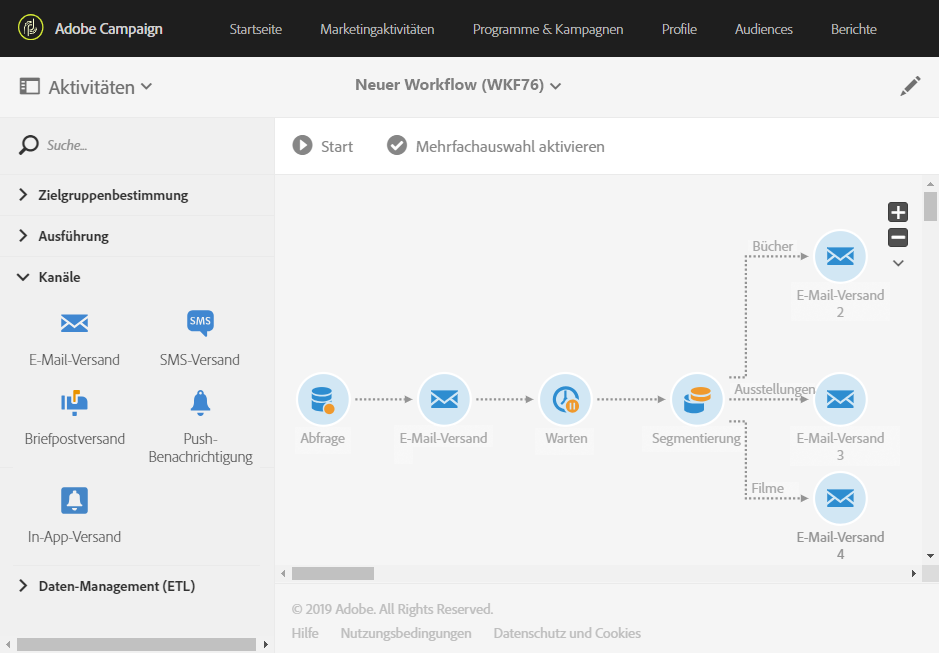

Die Profile erhalten jetzt eine E-Mail, in der sie ersucht werden, dieses Interessen-Feld auszufüllen. In weiterer Folge erhalten sie eine personalisierte E-Mail, die den ausgewählten Interessen entspricht.
