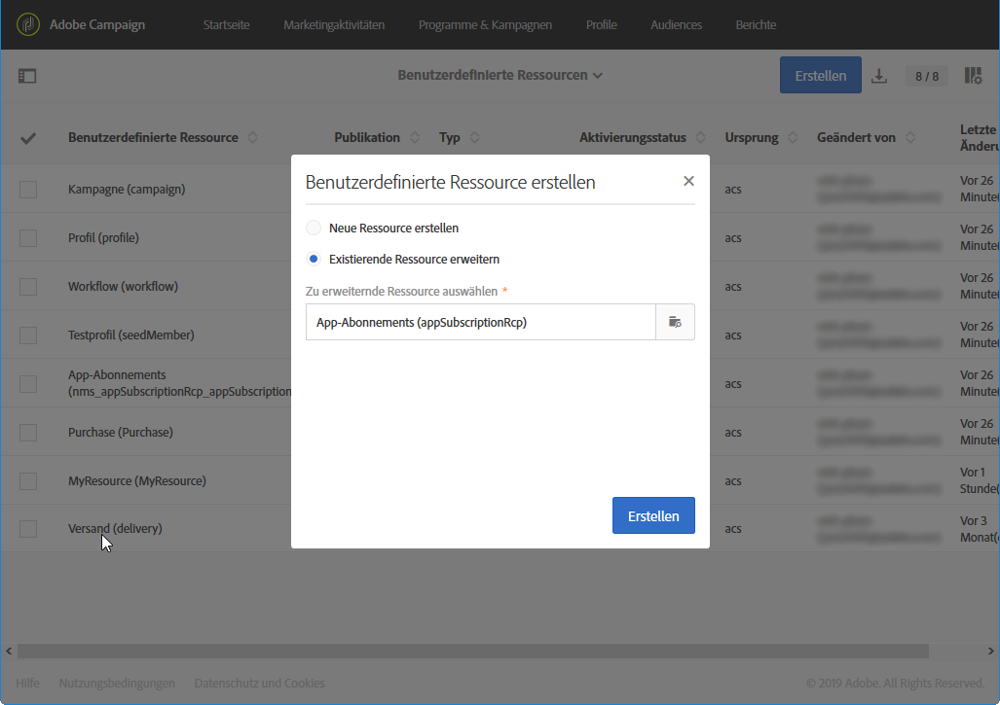
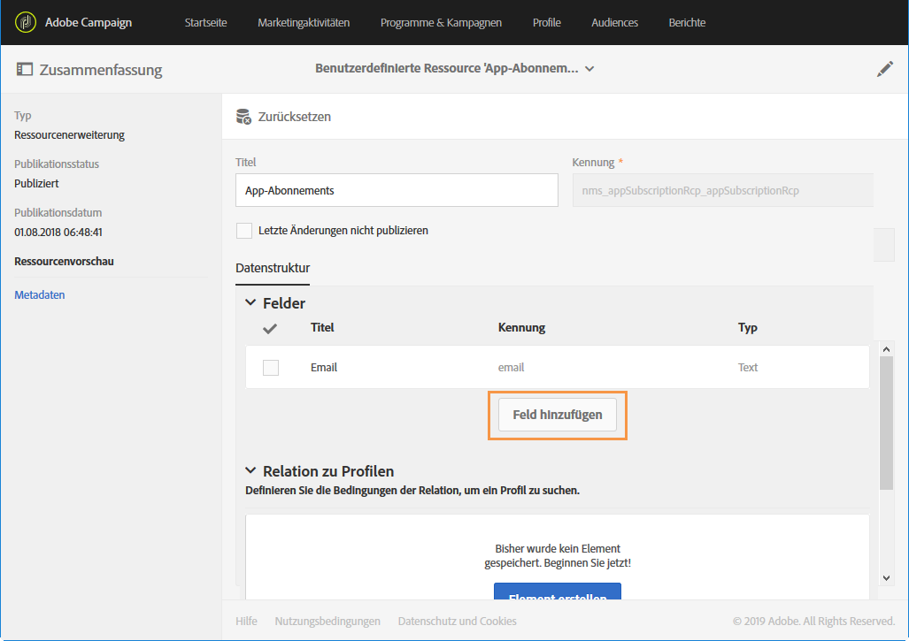
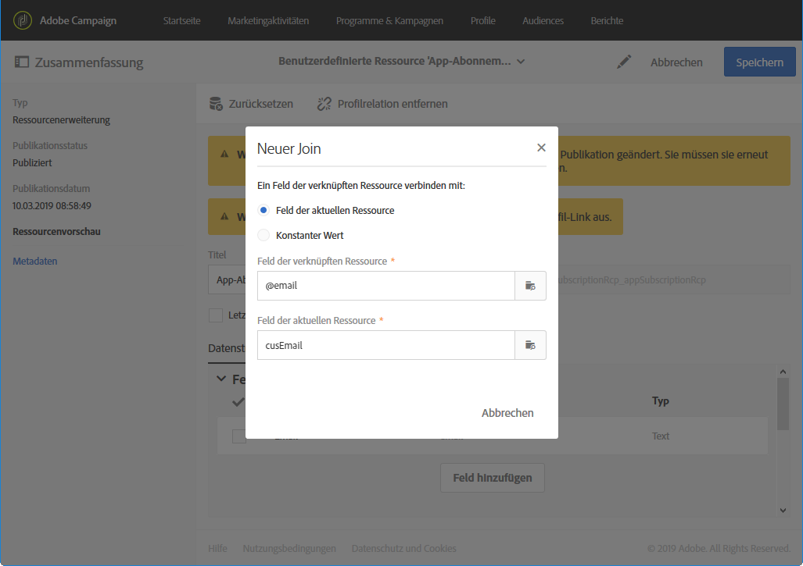

# App-Abonnements-Ressource erweitern{#extending-the-subscriptions-to-an-application-resource}

In Adobe Campaign, mobile profile attributes data sent from mobile device are stored in **[!UICONTROL Subscriptions to an application (appSubscriptionRcp)]** resource which allows you to define the data that you want to collect from your applications&#39; subscribers. For more information on custom resources, refer to [this page](../../developing/using/key-steps-to-add-a-resource.md).

Diese Ressource kann erweitert werden, um die Daten festzulegen, die vom Mobilgerät an Adobe Campaign gesendet und gesammelt werden sollen.

1. From the advanced menu, via the Adobe Campaign logo, select **[!UICONTROL Administration]** > **[!UICONTROL Development]**, then **[!UICONTROL Custom resources]**.
1. Klicken Sie auf **[!UICONTROL Create]** und wählen Sie die **[!UICONTROL Extend an existing resource]** Option.
1. Wählen Sie die **[!UICONTROL Subscriptions to an application (appSubscriptionRcp)]** Ressource aus und klicken Sie auf **[!UICONTROL Create]**.

   

1. In the **[!UICONTROL Fields]** category of the **[!UICONTROL Data structure]** tab, define the customer data that you want to retrieve from your mobile application by clicking the **[!UICONTROL Add field]** button.

   >[!NOTE]
   >
   >Falls Sie mehrere mobile Apps verwalten, müssen alle Felder aufgelistet werden, die von allen Ihren Apps verwendet werden. Der iOS- oder Android-Aufruf zum Erfassen von personenbezogenen Daten (PII) definiert die pro Anwendung abzurufenden Felder.

   

1. Add a **[!UICONTROL Label]** and an **[!UICONTROL ID]** to your new field. Select your field&#39;s **[!UICONTROL Type]**.

   

1. In the **[!UICONTROL Link to profiles]** category, configure the reconciliation key used to link the profiles from the Adobe Campaign database to your applications&#39; subscribers, such as the email.

   Beachten Sie, dass Sie für Ihre In-App-Nachrichten in allen Mobile Apps nur einen einzigen Abstimmschlüssel definieren können.

   

1. **[!UICONTROL Save]** und veröffentlichen Sie Ihre benutzerdefinierte Ressource. Weiterführende Informationen zur Publikation benutzerdefinierter Ressourcen finden Sie auf dieser [Seite](../../developing/using/updating-the-database-structure.md#publishing-a-custom-resource).

