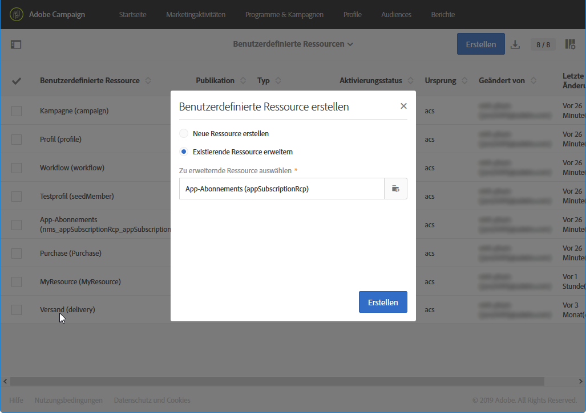
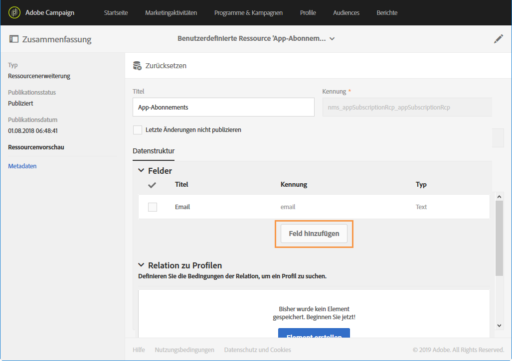
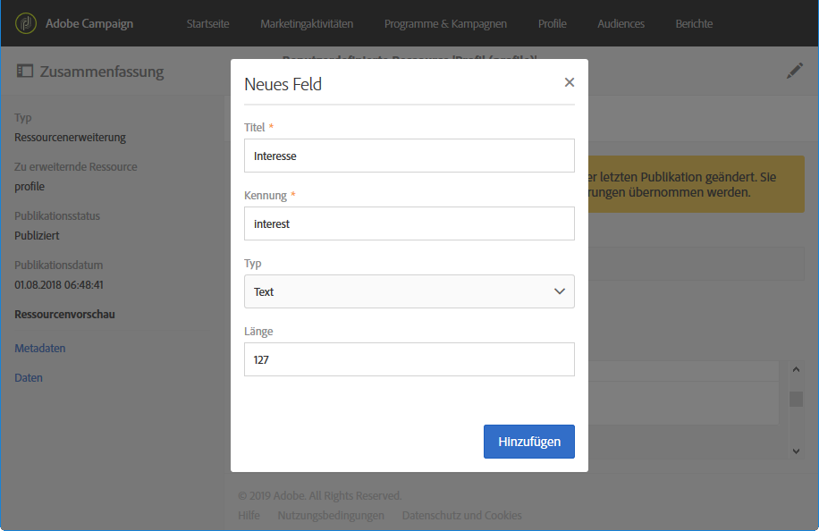
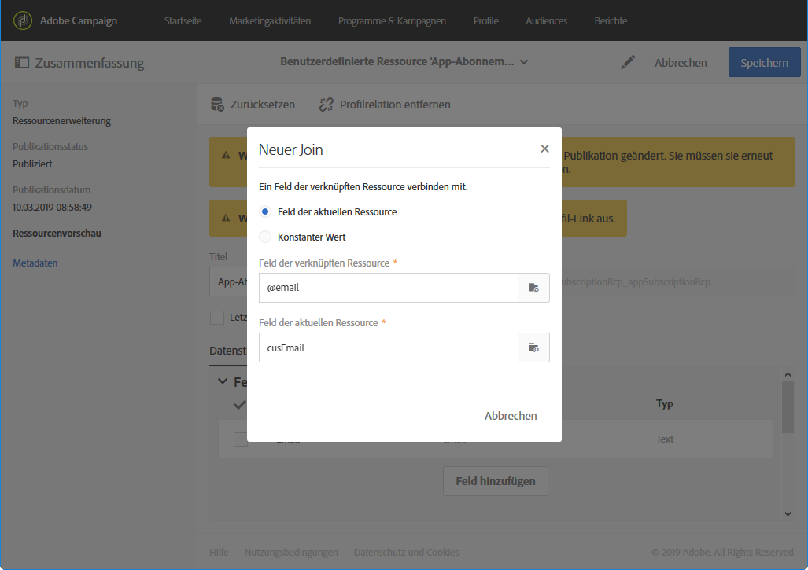

# App-Abonnements-Ressource erweitern{#extending-the-subscriptions-to-an-application-resource}

In Adobe Campaign sind Attribute zu mobilen Profilen, die von Mobilgeräten gesendet werden, in der Ressource **[!UICONTROL App-Abonnements (appSubscriptionRcp)]** gespeichert. Dort können die Daten definiert werden, die über die Abonnenten Ihrer Apps gesammelt werden sollen. Weiterführende Informationen zu benutzerdefinierten Ressourcen finden Sie auf dieser [Seite](../../developing/using/key-steps-to-add-a-resource.md).

Diese Ressource kann erweitert werden, um die Daten festzulegen, die vom Mobilgerät an Adobe Campaign gesendet und gesammelt werden sollen.

1. Öffnen Sie im erweiterten Menü über das Adobe Campaign-Logo **[!UICONTROL Administration]** > **[!UICONTROL Entwicklung]** > **[!UICONTROL Benutzerdefinierte Ressourcen]**.
1. Wählen Sie **[!UICONTROL Erstellen]** und danach die Option **[!UICONTROL Existierende Ressource erweitern]** aus.
1. Wählen Sie die Ressource **[!UICONTROL App-Abonnements (appSubscriptionRcp)]** und danach **[!UICONTROL Erstellen]** aus.

   

1. Definieren Sie in der Kategorie **[!UICONTROL Felder]** im Tab **[!UICONTROL Datenstruktur]** die Kundendaten, die Sie aus Ihrer Mobile App abrufen möchten, indem Sie die Schaltfläche **[!UICONTROL Feld hinzufügen]** verwenden.

   >[!NOTE]
   >
   >Falls Sie mehrere mobile Apps verwalten, müssen alle Felder aufgelistet werden, die von allen Ihren Apps verwendet werden. Der iOS- oder Android-Aufruf zum Erfassen von personenbezogenen Daten (PII) definiert die pro Anwendung abzurufenden Felder.

   

1. Geben Sie für Ihr neues Feld einen **[!UICONTROL Titel]** und eine **[!UICONTROL Kennung]** ein. Wählen Sie den **[!UICONTROL Typ]** Ihres Feldes aus.

   

1. Konfigurieren Sie in der Kategorie **[!UICONTROL Profilrelation]** den Abstimmschlüssel, der zur Verknüpfung von Profilen der Adobe Campaign-Datenbank mit Abonnenten Ihrer App dient (beispielsweise die E-Mail-Adresse).

   Beachten Sie, dass Sie für Ihre In-App-Nachrichten in allen Mobile Apps nur einen einzigen Abstimmschlüssel definieren können.

   

1. **[!UICONTROL Speichern]** und veröffentlichen Sie dann Ihre benutzerdefinierte Ressource. Weiterführende Informationen zur Veröffentlichung benutzerdefinierter Ressourcen finden Sie auf dieser [Seite](../../developing/using/updating-the-database-structure.md#publishing-a-custom-resource).
