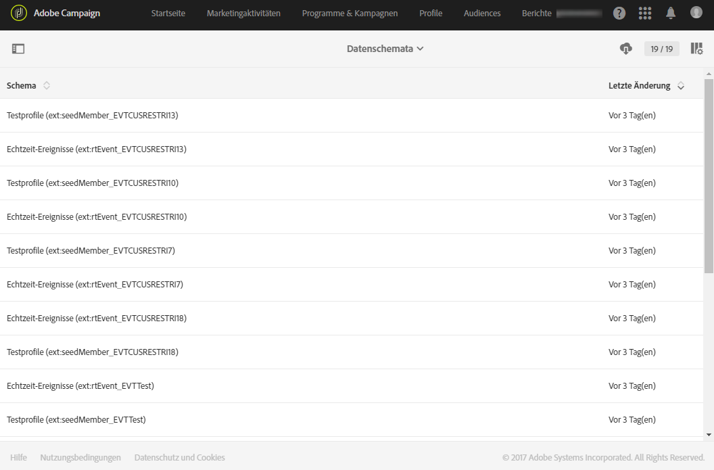

# Änderungen an Datenmodellen verfolgen{#monitoring-data-model-changes}

Das Menü **[!UICONTROL Diagnose]** erlaubt den Zugriff auf verschiedene, von der Anwendung erzeugte technische Objekte und deren Analyse.

>[!NOTE]
>
>Die Bildschirme dieses Menüs sind schreibgeschützt.

Folgende Objekte sind sichtbar:

* Datenschemata
* Webseiten
* Filter
* Navigation
* Batch-Vorgänge

