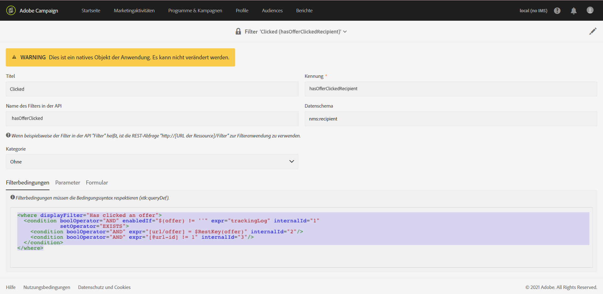

# Änderungen an Datenmodellen verfolgen{#monitoring-data-model-changes}

Im Menü **[!UICONTROL Diagnose]** können Sie die von der Anwendung erzeugten technischen Objekte sehen und analysieren.

>[!NOTE]
>
>Die Bildschirme dieses Menüs sind schreibgeschützt.


Folgende Objekte sind sichtbar:

* Datenschemata
* Webseiten
* Filter
* Navigation
* Komponenten
* Batch-Vorgänge

Sie können die Listenkonfiguration ändern:

* Sie können Spalten hinzufügen und entfernen.
* Sie können Spaltennamen definieren.
* Sie können die Anzeigereihenfolge der Spalten in der Liste festlegen.
* Sie können die Sortierreihenfolge der Werte in der Liste auswählen.

Sie können die Liste filtern:

* Sie können native Datenschemata, Webseiten, Filter und Navigationsobjekte ein- oder ausschließen.
* Sie können Objekte nach ihrem Namen suchen.
* Sie können Batch-Vorgänge nach Status, Startdatum und Enddatum filtern.

Sie können die angezeigte Liste in einer Datei im TXT-Format mit durch Komma getrennten Werten herunterladen.

Sie können die Details des ausgewählten Objekts anzeigen.

Beispielsweise können Sie diese Funktion verwenden, um die Filterkriterien von nativen Filtern anzuzeigen. Dieses Beispiel zeigt den Code, der für die Filterkriterien eines nativen Filters angezeigt wird:

```xml
<where displayFilter="Has clicked an offer">
  <condition boolOperator="AND" enabledIf="$(offer) != ''" expr="trackingLog" internalId="1" setOperator="EXISTS">
    <condition boolOperator="AND" expr="[url/offer] = $RestKey(offer)" internalId="2"/>
    <condition boolOperator="AND" expr="[@url-id] != 1" internalId="3"/>
  </condition>
</where>
```

