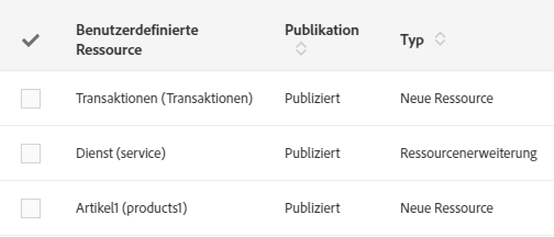

# Status der Ressourcen{#resource-statuses}

Je nach ihrem Veröffentlichungs- oder Aktivierungsstatus können Ressourcen unterschiedliche Status aufweisen.

Im Übersichtsbildschirm der **[!UICONTROL benutzerdefinierten Ressourcen]** wird ihr Status standardmäßig in zwei Spalten angezeigt.

**Veröffentlichungsstatus**

* **Entwurf**: Die Ressource wurde neu erstellt oder zurückgesetzt. Sie muss veröffentlicht werden, um die Tabellen und Datenbankfelder sowie die entsprechenden APIs zu erzeugen. Eine zurückgesetzte Ressource wird im Zuge der Veröffentlichung automatisch inaktiv gemacht.
* **Initialisierung ausstehend**: Die Zurücksetzung erfolgt während der nächsten Veröffentlichung. Die Initialisierung erfolgt im Zuge der nächsten Veröffentlichung. Sowohl bei der Zurücksetzung als auch bei der Vorbereitung der Veröffentlichung werden mehrere Warnmeldungen angezeigt, um den Benutzer zu informieren.

  Weiterführende Informationen zum Zurücksetzen finden Sie im Abschnitt [Ressource löschen](../../developing/using/deleting-a-resource.md).

  >[!NOTE]
  >
  >Die Option **[!UICONTROL Zurücksetzung abbrechen]** ist verfügbar, wenn die Ressource, die Sie zurücksetzen möchten, Relationen mit anderen Ressourcen mit dem Status &quot;Veröffentlicht&quot; aufweist. Mithilfe dieser Option lässt sich der Initialisierungsprozess umkehren. Die benutzerdefinierten Ressourcen nehmen auf diese Weise ihren ursprünglichen Status an.

* **Veröffentlicht**: Die Ressource wurde veröffentlicht. Wenn eine veröffentlichte Ressource in der Folge geändert wird, fordert ein Hinweis den Benutzer auf, sie erneut zu veröffentlichen, um die letzten Änderungen zu übernehmen.

Durch Aktivierung der Option **[!UICONTROL Letzte Änderungen nicht veröffentlichen]** vermeiden Sie, dass Ihre Änderungen bei zukünftigen Veröffentlichungen berücksichtigt werden.

Die Konfiguration dieser Option erfolgt im Definitionsbildschirm der benutzerdefinierten Ressource.
