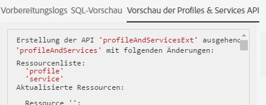

# Schritt 2: Erweiterung publizieren{#step-publish-the-extension}

1. From the advanced menu, via the Adobe Campaign logo, select **[!UICONTROL Administration]** &gt; **[!UICONTROL Development]**, then **[!UICONTROL Publication]**.
1. Verwenden Sie die Schaltfläche **[!UICONTROL Publikation vorbereiten].**
1. Wählen Sie die Option **[!UICONTROL Create the Profiles &amp; Services Ext API]aus.**

   

   >[!NOTE]
   >
   >Wenn die API bereits publiziert wurde (d. h. wenn Sie diese Option für diese oder eine andere Ressource schon einmal aktiviert haben), wird die API-Aktualisierung erzwungen.

1. Gehen Sie in den Tab **[!UICONTROL Vorschau der Profiles &amp; Services API].**

   Dort können Sie die Änderungen einsehen, die bei der API-Publikation auf die aktuelle Version der API profilesAndServicesExt angewendet werden.

   Hier wird das Angebotscode-Feld (ID: cusBrand) in die API eingefügt.

   

1. **[!UICONTROL Publizieren]Sie die Änderungen mithilfe der gleichnamigen Schaltfläche.**

