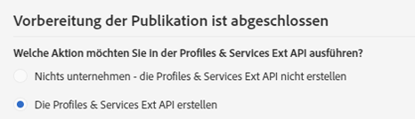
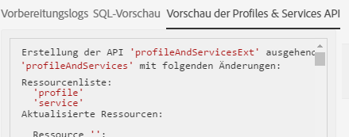

# Schritt 2: Erweiterung veröffentlichen{#step-publish-the-extension}

1. Greifen Sie mithilfe des Adobe Campaign-Logos oben links im Bildschirm und der Schaltflächen **[!UICONTROL Administration]** > **[!UICONTROL Entwicklung]** > **[!UICONTROL Veröffentlichung]** auf das entsprechende Menü zu.
1. Verwenden Sie die Schaltfläche **[!UICONTROL Veröffentlichung vorbereiten]**.
1. Wählen Sie die Option **[!UICONTROL Die Profiles &amp; Services Ext API erstellen]** aus.

   

   >[!NOTE]
   >
   >Wenn die API bereits veröffentlicht wurde (d. h. wenn Sie diese Option für diese oder eine andere Ressource schon einmal aktiviert haben), wird die API-Aktualisierung erzwungen.

1. Gehen Sie in den Tab **[!UICONTROL Vorschau der Profiles &amp; Services API]**.

   Dort können Sie die Änderungen einsehen, die bei der API-Veröffentlichung auf die aktuelle Version der API profilesAndServicesExt angewendet werden.

   Hier wird das Angebotscode-Feld (ID: cusBrand) in die API eingefügt.

   

1. **[!UICONTROL Veröffentlichen]** Sie die Änderungen mithilfe der gleichnamigen Schaltfläche.
