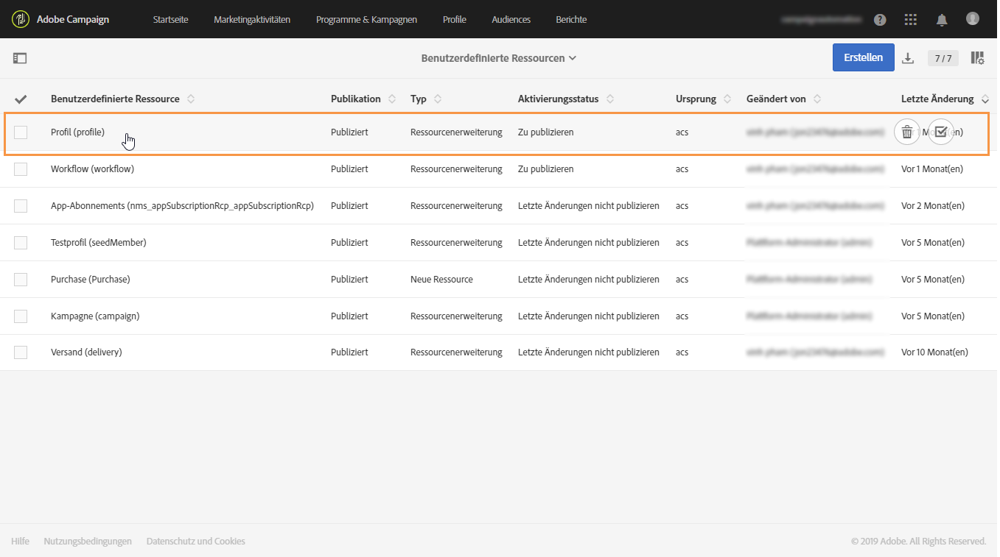
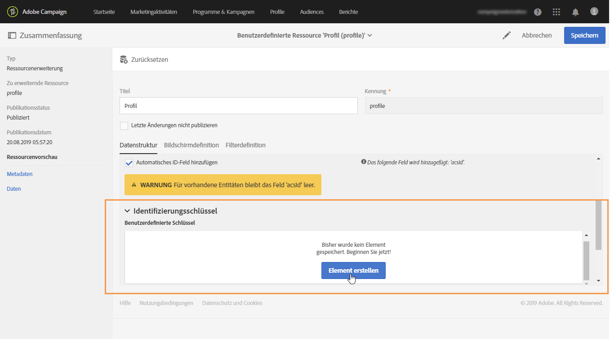
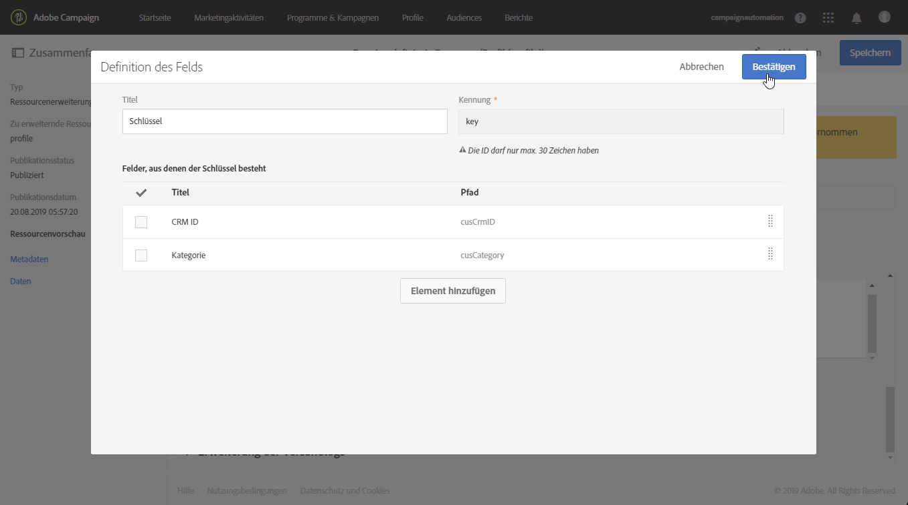
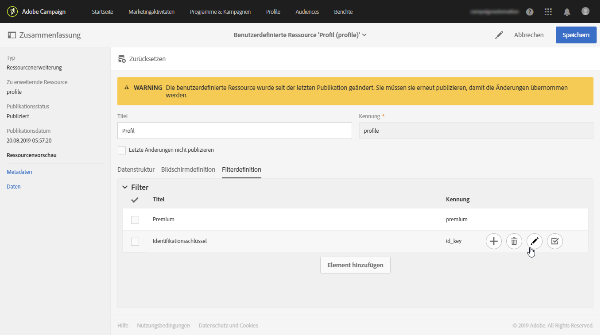
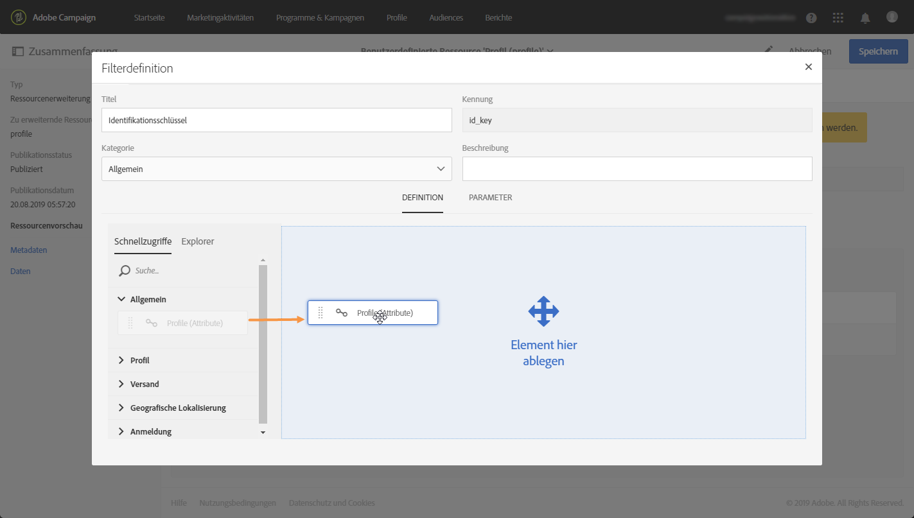
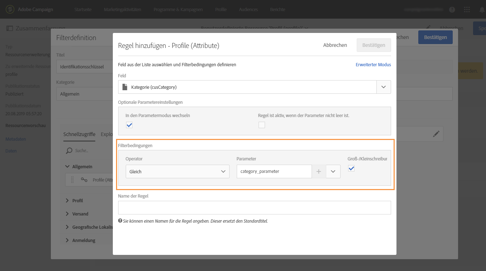
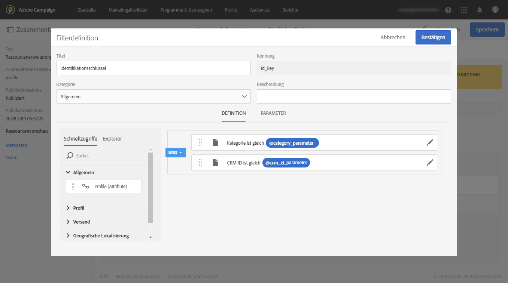
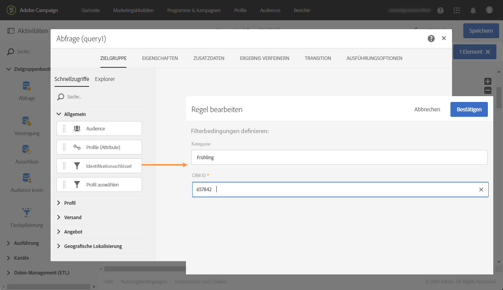

# Aufrufen einer Ressource mit einem zusammengesetzten Identifizierungsschlüssel{#calling-a-resource-using-a-composite-identification-key}

Es kann vorkommen, dass Sie für eine Ressource einen Identifikationsschlüssel definieren müssen, der aus zwei Feldern besteht. Nach der Konfiguration des Identifizierungsschlüssels müssen Sie eine Filterdefinition konfigurieren, um die Ressource mit diesem Identifizierungsschlüssel entweder über die Campaign Standard-Benutzeroberfläche oder über APIs aufrufen zu können.

In unserem Beispiel wurde die Ressource **Profil** mit den benutzerdefinierten Feldern **&quot;CRM ID&quot;** und **&quot;Kategorie&quot;** erweitert. Wir erstellen zuerst einen Identifizierungsschlüssel für die Ressource &quot;Profil&quot; bestehend aus diesen beiden Feldern. Anschließend konfigurieren wir eine Filterdefinition, damit wir mithilfe des Identifizierungsschlüssels auf die Ressource &quot;Profil&quot; zugreifen können.

Dies sind die Schritte für diesen Anwendungsfall:

1. Konfigurieren des Identifizierungsschlüssels für die Ressource &quot;Profil&quot; auf der Basis der beiden Felder.
1. Konfigurieren der Filterdefinition, um die Ressource &quot;Profil&quot; mit dem Identifizierungsschlüssel aufrufen zu können.
1. Aufrufen der Ressource &quot;Profil&quot; über die Benutzeroberfläche oder APIs.

Verwandte Themen:

* [Ressource erstellen oder erweitern](../../developing/using/creating-or-extending-the-resource.md)
* [Identifizierungsschlüssel definieren](../../developing/using/configuring-the-resource-s-data-structure.md#defining-identification-keys)
* [Campaign Standard-REST-APIs](../../api/using/get-started-apis.md)

## Schritt 1: Identifizierungsschlüssel konfigurieren{#step-1-configure-the-identification-key}

>[!NOTE]
> In [diesem Abschnitt](../../developing/using/configuring-the-resource-s-data-structure.md#defining-identification-keys) werden allgemeine Konzepte zum Konfigurieren von Identifizierungsschlüsseln beschrieben.

1. Bevor Sie den Identifizierungsschlüssel konfigurieren, stellen Sie sicher, dass die Ressource mit den gewünschten Feldern erweitert und veröffentlicht wurde. Weiterführende Informationen hierzu finden Sie in [diesem Abschnitt](../../developing/using/creating-or-extending-the-resource.md).

1. Gehen Sie zum Menü **[!UICONTROL Administration]** > **[!UICONTROL Entwicklung]** > **[!UICONTROL Benutzerdefinierte Ressourcen]** und öffnen Sie die Ressource **[!UICONTROL Profil]**.

   

1. Wählen Sie im Bereich **[!UICONTROL Identifizierungsschlüssel]** die Schaltfläche **[!UICONTROL Element erstellen]** aus.

   

1. Fügen Sie die beiden benutzerdefinierten Felder &quot;CRM ID&quot; und &quot;Kategorie&quot; hinzu und wählen Sie **[!UICONTROL Bestätigen]** aus.

   

   >[!NOTE]
   > Wenn Sie die beiden benutzerdefinierten Felder in der Benutzeroberfläche des Profils anzeigen möchten, konfigurieren Sie den Tab **[!UICONTROL Bildschirmdefinition]**. Weiterführende Informationen hierzu finden Sie in [diesem Abschnitt](../../developing/using/configuring-the-screen-definition.md).

1. Sie können nun die Filterdefinition konfigurieren, damit die Ressource mit dem Identifizierungsschlüssel aufgerufen werden kann.

## Schritt 2: Filterdefinition konfigurieren{#step-2-configure-the-filter-definition}

>[!NOTE]
> Die allgemeinen Konzepte zum Konfigurieren von Filterdefinitionen sind in [diesem Abschnitt](../../developing/using/configuring-filter-definition.md) ausführlich beschrieben.

1. Wählen Sie im Tab **[!UICONTROL Filterdefinition]** die Option **[!UICONTROL Element hinzufügen]** aus und geben Sie den Titel und die Kennung der Filterdefinition ein.

1. Bearbeiten Sie die Eigenschaften der Filterdefinition, um deren Regeln zu konfigurieren.

   

1. Ziehen Sie die Tabelle mit den Feldern, die im Identifizierungsschlüssel verwendet werden, per Drag &amp; Drop in den Arbeitsbereich.

   

1. Wählen Sie das erste Feld aus, das im Identifizierungsschlüssel verwendet wird (&quot;CRM ID&quot;), und aktivieren Sie die Option **[!UICONTROL In den Parametermodus wechseln]**.

   

1. Behalten Sie im Bereich **[!UICONTROL Filterbedingungen]** den Operator **[!UICONTROL Gleich]** bei, definieren Sie den Namen des Parameters und klicken Sie auf das Pluszeichen, um ihn zu erstellen.

   

   >[!NOTE]
   > Durch Auswahl der Plusschaltfläche **+** wird der Parametername automatisch generiert. Notieren Sie sich diese Informationen, da Sie sie benötigen, um den Filter in den APIs zu verwenden.

1. Wiederholen Sie die obigen Schritte mit allen Feldern des Identifizierungsschlüssels (&quot;Kategorie&quot;) und speichern Sie dann Ihre Änderungen.

   

1. Die Filterdefinition ist jetzt konfiguriert. Sie können die Ressource veröffentlichen, damit der Filter verfügbar ist.

## Schritt 3: die Ressource über ihren Identifizierungsschlüssel aufrufen{#step-3-call-the-resource-based-on-its-identification-key}

Nachdem der Identifizierungsschlüssel und die Filterdefinition konfiguriert sind, können Sie sie verwenden, um die Ressource entweder über die Campaign Standard-Benutzeroberfläche oder über REST-APIs aufzurufen.

Um die Filterdefinition in der Benutzeroberfläche zu verwenden, fügen Sie die Aktivität **[!UICONTROL Abfrage]** zu einem Workflow hinzu (siehe [diesen Abschnitt](../../automating/using/query.md)). Der Filter ist dann im linken Fensterbereich verfügbar.



Um die Filterdefinition über Campaign Standard-REST-APIs zu verwenden, nutzen Sie die unten stehende Syntax:

```
GET /profileAndServicesExt/<resourceName>/by<filterName>?<param1_parameter>=<value>&<param2_parameter>=<value>
```

>[!NOTE]
>Um einen benutzerdefinierten Filter aufzurufen, verwenden Sie das Präfix &quot;by&quot;, gefolgt vom Filternamen, der beim Konfigurieren der Filterdefinition in [Schritt 2](../../developing/using/uc-calling-resource-id-key.md#step-2-configure-the-filter-definition) festgelegt wurde.

In unserem Fall lautet die Syntax zum Abrufen eines Profils aus der Kategorie &quot;spring&quot; mit der CRM-ID &quot;123456&quot;:

```
GET https://mc.adobe.io/<ORGANIZATION>/campaign/profileAndServicesExt/profile/byidentification_key?category_parameter=spring&crm_id_parameter=123456
```

Weiterführende Informationen dazu finden Sie in der [Dokumentation zu Campaign Standard-REST-APIs](../../api/using/filtering.md).
