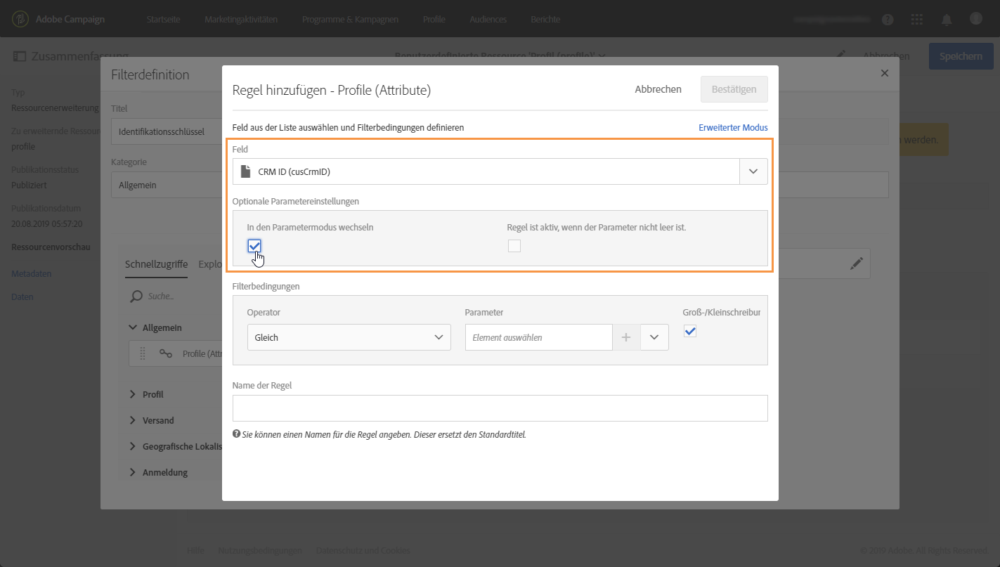

# Eine Ressource unter Verwendung eines Verbundschlüssels für die Identifizierung

In einigen Fällen müssen Sie möglicherweise einen Identifikationsschlüssel festlegen, der aus zwei Bereichen besteht. Sobald der Identifizierungsschlüssel konfiguriert ist, müssen Sie eine Filterdefinition konfigurieren, um die Ressource mit diesem Identifikationsschlüssel entweder von der Schnittstelle "Campaign Standard «oder APIS bezeichnen zu können.

In diesem Fall wurde das **Profilvermögen** mit dem **Feld "CRM-ID"** und " **Kategorie"** erweitert. Wir werden einen Identitätsschlüssel für das Profil schaffen, der aus diesen beiden Bereichen besteht. Dann werden wir eine Filterdefinition konfigurieren, damit wir auf das Profil zugreifen können, das den Identifizierungsschlüssel verwendet.

Die wichtigsten Schritte für diesen Einsatz sind:

1. Den Identifikationsschlüssel für das Profil-Ressourcenprofil auf der Grundlage der beiden Felder erstellen.
1. Die Filterdefinition ist zu konfigurieren, um die Profilressource mithilfe ihres Identifizierungsschlüssels anzurufen.
1. Nenn das Profil von der Schnittstelle oder von der APIS.

Verwandte Themen:

* [Ressource erstellen oder erweitern](../../developing/using/creating-or-extending-the-resource.md)
* [Identifizierungsschlüssel definieren ](../../developing/using/configuring-the-resource-s-data-structure.md#defining-identification-keys)
* [Standard-Standard-Ruheapis](https://docs.campaign.adobe.com/doc/standard/en/api/ACS_API.html)

## Schritt 1: Konfigurationsschlüssel

>[!NOTE]
> Globale Konzepte, bei denen Kennzeichnungen konfiguriert werden, sind in diesem [Abschnitt ausführlich beschrieben](../../developing/using/configuring-the-resource-s-data-structure.md#defining-identification-keys).

1. Vor der Festlegung des Identifizierungsschlüssels ist sicherzustellen, dass die Ressource mit den gewünschten Bereichen erweitert wurde und veröffentlicht wurde. Weiterführende Informationen hierzu finden Sie in [diesem Abschnitt](../../developing/using/creating-or-extending-the-resource.md).

1. Gehen Sie in das Menü **[!UICONTROL für Verwaltung]** / **[!UICONTROL Entwicklung]** / **[!UICONTROL Zolltarif]** und öffnen Sie das **[!UICONTROL Profil.]**

   

1. In the **[!UICONTROL Identification keys]** section, click the **[!UICONTROL Create element]** button.

   

1. Ergänzen Sie die beiden Felder "CRM-ID" und "Kategorie", **[!UICONTROL dann klicken Sie.]**

   

   >[!NOTE]
   > Wenn Sie die beiden Zollfelder in der Schnittstelle des Profils zeigen wollen, ist die **[!UICONTROL Bildschirmdefinition]** der Bildschirmdefinition zu konfigurieren. Weiterführende Informationen hierzu finden Sie in [diesem Abschnitt](../../developing/using/configuring-the-screen-definition.md).

1. Sie können nun die Filterdefinition konfigurieren, um die Ressource mithilfe ihres Identifizierungsschlüssels anrufen zu können.

## Schritt 2: Konfiguration der Filterdefinition

>[!NOTE]
> Globale Konzepte, bei denen Filterdefinitionen konfiguriert werden, sind in diesem [Abschnitt ausführlich](../../developing/using/configuring-filter-definition.md)beschrieben.

1. In der **[!UICONTROL Filter-Definition]** ist Klicken **[!UICONTROL ein Element hinzuzufügen]**, dann in das Etikett und die Kennung des Filters einzugeben.

1. Die Eigenschaften der Filter definieren, um ihre Regeln zu konfigurieren.

   

1. Drag und Abtropfen in den Arbeitsraum, die die im Identifizierungsschlüssel verwendeten Felder enthalten.

   

1. Wählen Sie den ersten im Identifizierungsschlüssel verwendeten Feld (CRM-ID) aus und aktivieren Sie die **[!UICONTROL Umstellung auf]** Parameteroption.

   

1. Im **[!UICONTROL Filter-Zustand]** ist der **[!UICONTROL gleiche Betreiber]** zu halten, dann den Namen des Parameters zu bestimmen und das Plus anzugeben, um es zu schaffen.

   

   >[!NOTE]
   > Sobald Sie die Plus-Taste klicken, wird der Name des Parameters automatisch erzeugt. Beachten Sie diese Informationen, da Sie den Filter von der APIS verwenden müssen.

1. Wiederholen Sie die oben genannten Schritte mit allen Feldern, die den Identifizierungsschlüssel ausmachen ("Kategorie"), dann sparen Sie Ihre Änderungen.

   

1. Die Filterdefinition ist nun konfiguriert. Sie können die Ressource veröffentlichen, damit der Filter verfügbar ist.

## Schritt 3: Nennen Sie die Ressource auf der Grundlage ihres Identitätsschlüssels.

Sobald der Identifizierungsschlüssel und seine Filterdefinition konfiguriert sind, können Sie die Ressourcen entweder von der Wahlstandard-Schnittstelle oder vom REST-APIS bezeichnen.

Um die Filterdefinition von der Schnittstelle zu verwenden, ist eine **[!UICONTROL Query]** -Aktivität bei einem Arbeitsfluss zu verwenden (siehe [Abschnitt)](../../automating/using/query.md). Der Filter ist dann in der linken Scheibe verfügbar.


Zur Verwendung der Filterdefinition von der Campaign STANDARD RUHE apis ist die nachstehende Syntax zu verwenden:

```
GET /profileAndServicesExt/<resourceName><filterName>?<param1_parameter>=<value>&<param2_parameter>=<value>
```

In unserem Fall wäre die Syntax, um ein Profil von der Kategorie "Frühjahr" und mit der CRM-Kennung "123456" abzurufen,

```
GET https://mc.adobe.io/<ORGANIZATION>/campaign/profileAndServicesExt/profile/identification_key?category_parameter=spring&crm_id_parameter=123456
```

Weitere Einzelheiten sind [der Dokumentation "Campaign STANDARD REST APIS «zu entnehmen](https://docs.campaign.adobe.com/doc/standard/en/api/ACS_API.html#filtering).