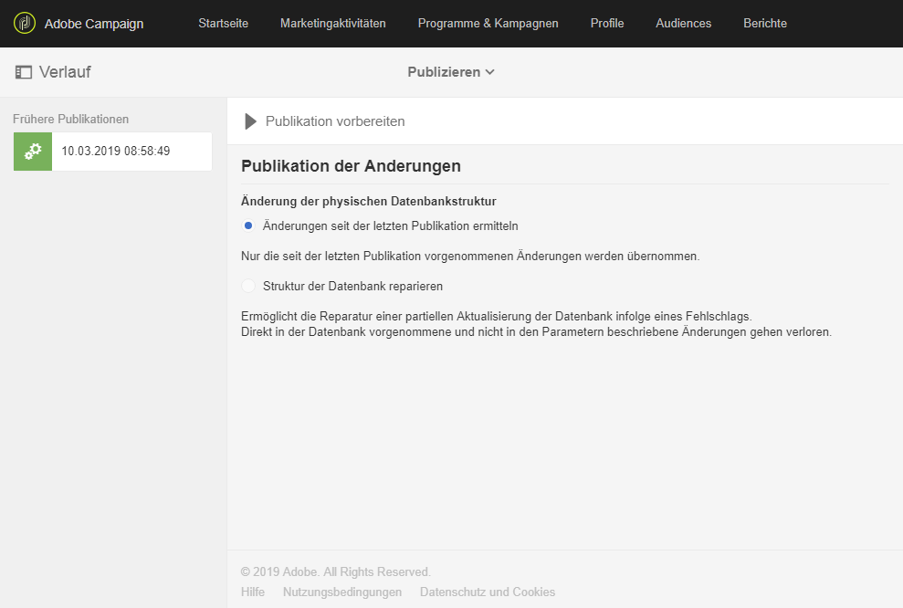
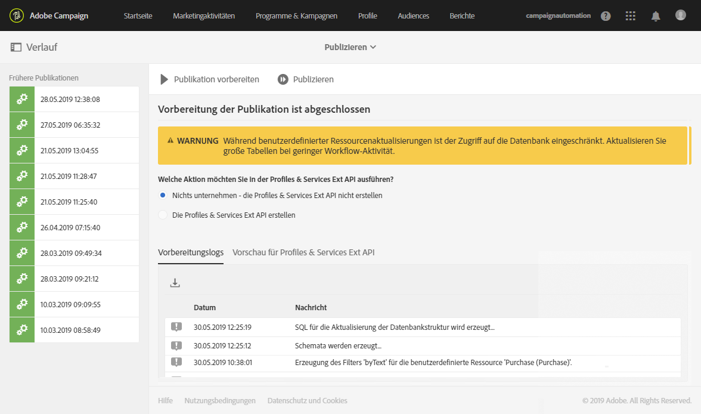
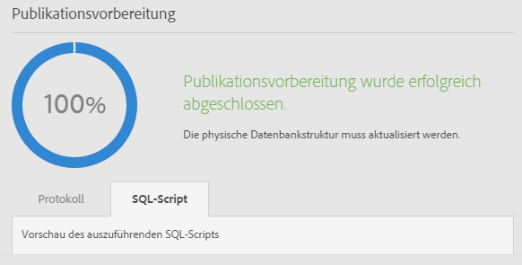
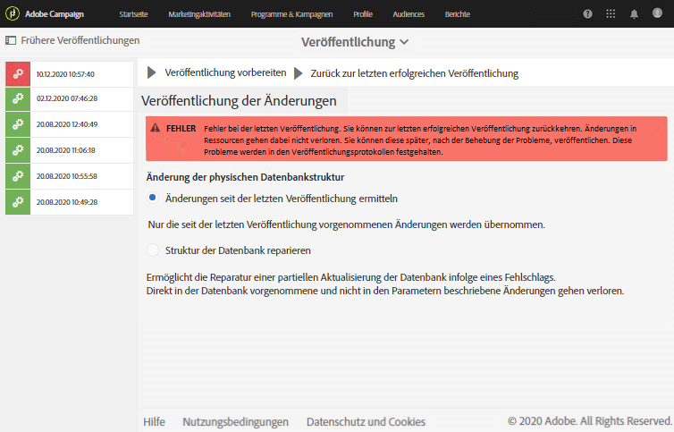
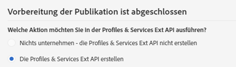
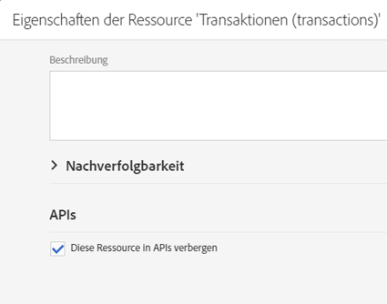
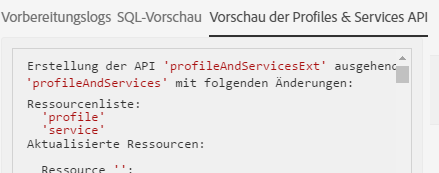

# Datenbankstruktur aktualisieren{#updating-the-database-structure}

Damit Ihre Änderungen am Datenmodell wirksam werden und Sie sie verwenden können, muss die Datenbankstruktur aktualisiert werden.

>[!NOTE]
>
>Benutzerdefinierte Ressourcen werden im Zuge der automatischen Aktualisierungen durch Adobe automatisch aktualisiert.

## Benutzerdefinierte Ressource publizieren {#publishing-a-custom-resource}

Zur Übernahme der Änderungen der Ressourcen muss die Datenbank aktualisiert werden.

>[!NOTE]
>
>Wenn ein Feld einer für ein Ereignis verwendeten benutzerdefinierten Ressource geändert oder gelöscht wird, wird das zugehörige Ereignis automatisch depubliziert. Siehe [Transaktionsnachrichten konfigurieren](../../administration/using/configuring-transactional-messaging.md).

1. Greifen Sie mithilfe des Adobe-Campaign-Logos oben links im Bildschirm und der Schaltflächen **[!UICONTROL Administration]** > **[!UICONTROL Entwicklung]** > **[!UICONTROL Publizieren]** auf das entsprechende Menü zu.
1. Standardmäßig ist die Option **[!UICONTROL Änderungen seit der letzten Publikation ermitteln]** aktiv. Dies bedeutet, dass nur die Änderungen übernommen werden, die seit der letzten Publikation vorgenommen wurden.

   >[!NOTE]
   >
   >Die Option **[!UICONTROL Struktur der Datenbank reparieren]** ermöglicht die Wiederherstellung einer korrekten Konfiguration, falls die Publikation fehlschlägt. Eventuell direkt an der Datenbank und nicht über benutzerdefinierte Ressourcen vorgenommene Änderungen werden gelöscht.

   

1. Starten Sie die Analyse mithilfe der Schaltfläche **[!UICONTROL Publikation vorbereiten]**. Beachten Sie, dass Aktualisierungen großer Tabellen nur dann vorgenommen werden sollten, wenn auf der Instanz nicht übermäßig viele Workflows ausgeführt werden.

   Weiterführende Informationen zu Aktionen bei der Profiles &amp; Services API finden Sie im Abschnitt [Ressource mit API-Erweiterung publizieren](#publishing-a-resource-with-api-extension).

   

1. Nach erfolgreicher Analyse können Sie unter Verwendung der Schaltfläche **[!UICONTROL Publizieren]** die Konfigurationsänderungen übernehmen.
1. Im Anschluss an die Publikation werden in der **[!UICONTROL Zusammenfassung]** der entsprechenden Ressourcen der Status **[!UICONTROL Publiziert]** und das letzte Publikationsdatum angezeigt.

   >[!NOTE]
   >
   >Bei jeder weiteren Änderung einer Ressource ist zur Übernahme der Änderungen der Aktualisierungsvorgang zu wiederholen.

   Sollten Sie vor der Publikation Ressourcen mit dem Status **[!UICONTROL Initialisierung ausstehend]** haben, fordert Sie ein Hinweis dazu auf, den Vorgang erneut zu prüfen. In der Tat sind die durch die Publikation vorgenommenen Änderungen an der Datenstruktur (Löschen von Spalten oder Tabellen etc.) unwiderruflich. Gehen Sie zur Prüfung in den Tab **[!UICONTROL SQL-Script]**. Hier wird der im Zuge der Publikation ausgeführte SQL-Befehl angezeigt.

   

   >[!NOTE]
   >
   >Der Initialisierungsprozess kann durch die Verwendung der Schaltfläche **[!UICONTROL Zurücksetzung abbrechen]** gestoppt werden. Dadurch nimmt die Ressource ihren ursprünglichen Status an.

1. Wenn Ihre Publikation fehlgeschlagen ist, können Sie zur vorherigen Publikation zurückkehren, indem Sie die Option **[!UICONTROL Zurück zur letzten erfolgreichen Publikation]** auswählen.

   Wenn Sie eine Publikation in einem Fehlerstatus belassen, öffnet sich bei der Anmeldung bei Ihrer Instanz ein Fenster, das Sie an die Fehlerbehebung bei dieser Publikation erinnert. Ihre Instanz wird erst mit neuen Produktversionen aktualisiert, wenn Ihre Publikation korrigiert wurde.

   

## Ressource mit API-Erweiterung publizieren {#publishing-a-resource-with-api-extension}

In folgenden Fällen können Sie die Profiles &amp; Services API erstellen:

* Beim Erweitern der benutzerdefinierten Ressourcen **[!UICONTROL Profile]** oder **[!UICONTROL Dienste]** können Sie eine Aktualisierung der Profiles &amp; Services API ausführen, um die in der Erweiterung der benutzerdefinierten Ressourcen deklarierten Felder zu integrieren.
* Wenn Sie eine Ressource definieren und eine Verknüpfung zwischen den **[!UICONTROL Profil]**- oder **[!UICONTROL Dienst]**-Ressourcen und der benutzerdefinierten Ressource erstellen, können Sie die neue Ressource mit einer Aktualisierung in die API einschließen.

Sie können diese Option im Publikationsbildschirm auswählen.

* Wenn die API noch nicht publiziert wurde (d. h. wenn Sie die Ressource nie erweitert haben oder diese Option oder diese oder eine andere Ressource noch nie aktiviert haben), können Sie auswählen, ob Sie sie erstellen möchten oder nicht.

   

* Wenn die API bereits publiziert wurde (d. h. wenn Sie die Ressource schon erweitert und diese Option aktiviert haben), wird die API-Aktualisierung erzwungen.

   Nachdem die API erstellt wurde, wird sie bei jeder neuen Publikation automatisch aktualisiert. Dadurch wird verhindert, dass die Profil- oder Dienst-Ressource dieser API fehlerhaft werden und Ihrer Instanz schaden könnte.

Beachten Sie, dass standardmäßig die benutzerdefinierte Ressource integriert ist. Wenn Sie aber zur Gewährleistung eines bestimmten Verhaltens diese Ressource nicht publizieren möchten, können Sie die Option **[!UICONTROL Diese Ressource in APIs verbergen]** in **[!UICONTROL Eigenschaften der Ressource]** auswählen.

Nach dem Schritt **[!UICONTROL Publikation vorbereiten]** wird in Adobe Campaign im Tab **[!UICONTROL Vorschau der Profiles &amp; Services API]** die Differenz zwischen der aktuellen und der zukünftigen API-Version nach der Publikation angezeigt. Wenn Sie die API zum ersten Mal erweitern, wird bei der Differenzspeicherung die native Definition der benutzerdefinierten Ressource mit Ihrer Erweiterung verglichen.

Die im Tab angezeigten Informationen sind in drei Abschnitte unterteilt: hinzugefügte, gelöschte und geänderte Elemente.

Bei der Differenzanalyse handelt es sich um einen notwendigen Schritt, da während der Publikationsphase das API-Verhalten geändert und höchstwahrscheinlich die umliegende Entwicklung im Dominoeffektverfahren beeinflusst wird.

>[!NOTE]
>
>Bei dieser Publikation wird die API **[!UICONTROL profilesAndServicesExt]**, Die API **[!UICONTROL profilesAndServices]** wird nicht aktualisiert.

Lesen Sie für weiterführende Informationen zur Adobe Campaign-API die entsprechende Adobe Campaign-Dokumentation auf [Adobe IO](https://docs.campaign.adobe.com/doc/standard/en/adobeio.html).
