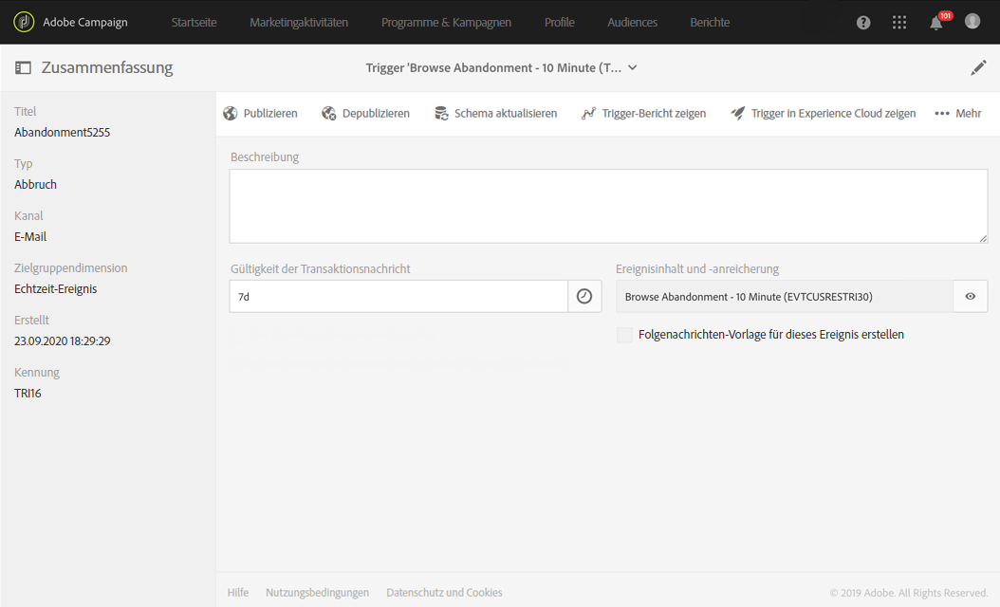
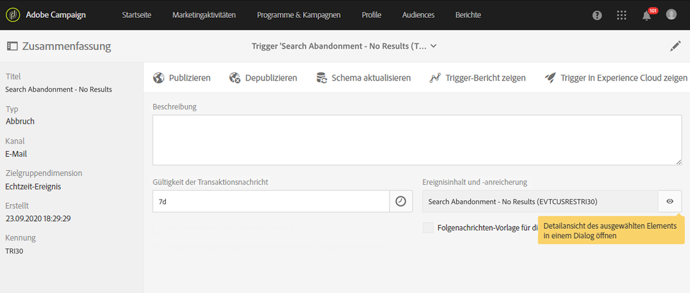

# Anwendungsbeispiele zu Triggern für die abgebrochene Suche{#abandonment-triggers-use-cases}

In diesem Abschnitt finden Sie zwei Anwendungsbeispiele für die Integration von Adobe Campaign mit Experience Cloud Triggers: In diesem Abschnitt finden Sie zwei Anwendungsbeispiele:

* [Trigger für abgebrochene Suche](#browse-abandonment-trigger): Senden Sie eine Nachricht an Kunden, die ihren Besuch auf Ihrer Website abgebrochen haben.
* [Trigger für abgebrochene Suche](#search-abandonment-trigger): Kontaktieren Sie Besucher, die Ihre Website durchsucht, aber nichts gekauft haben.

>[!NOTE]
>
>Die in diesem Abschnitt beschriebenen Anwendungsbeispiele verwenden die Experience-Cloud-Visitor-ID. Sie können dafür auch die Experience Cloud Declared ID verwenden. Hash- und verschlüsselte Declared IDs werden auch unterstützt. Sie können E-Mails/SMS an ein Profil senden, das nicht in Campaign vorhanden ist, indem Sie die verschlüsselte E-Mail-Adresse/Mobiltelefonnummer direkt entschlüsseln. In diesem Fall kann jedoch keine Personalisierung verwendet werden, die Profildaten verwendet.

## Voraussetzungen:     {#pre-requisites}

Damit Sie diese Anwendungsbeispiele umsetzen können, benötigen Sie Zugriff auf folgende Lösungen/Core Services:

* Adobe Campaign
* Adobe Analytics Ultimate, Premium, Foundation, OD, Select, Prime, Mobile Apps, Select oder Standard.
* Experience Cloud Triggers Core Service
* Experience Cloud DTM Core Service
* Experience Cloud Visitor ID und Experience Cloud People Core Service

Zusätzlich benötigen Sie eine funktionierende Website.

Weiterführende Informationen dazu finden Sie im Abschnitt [Lösungen und Dienste konfigurieren](../../integrating/using/configuring-triggers-in-experience-cloud.md#configuring-solutions-and-services).

## Trigger für abgebrochene Suche {#browse-abandonment-trigger}

In diesem Anwendungsbeispiel erstellen wir einen einfachen Trigger, der jedes Mal ausgelöst wird, wenn ein Kunde einen Besuch auf der Website abbricht. Wir gehen in diesem Beispiel davon aus, dass DTM auf Ihrem System bereits Daten erfasst und zu Adobe Analytics sendet und Sie bereits alle Ereignisse erstellt haben.

### Experience Cloud-Trigger erstellen     {#creating-an-experience-cloud-trigger}

1. Wählen Sie im Menü von Experience Cloud Activation Core Service die Option **[!UICONTROL Manage Triggers]**.

   

1. Wählen Sie einen Trigger-Typ aus (in unserem Fall **[!UICONTROL Abbruch]**).

   

1. Für dieses Anwendungsbeispiel benötigen wir einen einfachen Abbruch-Trigger. Wir müssen nun die Besucher identifizieren, die unsere Reisebuchungs-Website besuchen, sich die Angebote ansehen, aber keine Reise buchen. Sobald wir diese Zielgruppe identifiziert haben, möchten wir innerhalb kurzer Zeit wieder Kontakt mit ihr aufnehmen. In unserem Beispiel möchten wir den Trigger nach 10 Minuten senden.

   

### Trigger in Adobe Campaign verwenden     {#using-the-trigger-in-adobe-campaign}

Lassen Sie uns jetzt den erstellten Experience Cloud Trigger in Adobe Campaign verwenden.

Erstellen Sie in Adobe Campaign einen Trigger, der mit dem zuvor in Experience Cloud erstellten verknüpft ist.

1. Um den Trigger in Adobe Campaign zu erstellen, klicken Sie auf das **Adobe**-Logo oben links im Bildschirm und anschließend auf **[!UICONTROL Marketing-Pläne]** > **[!UICONTROL Transaktionsnachrichten]** > **[!UICONTROL Experience Cloud Triggers]**.

   

1. Wählen Sie **[!UICONTROL Erstellen]** aus.
1. Wählen Sie den zuvor erstellten Trigger und danach **[!UICONTROL Weiter]** aus.

   

1. Wählen Sie den Kanal **[!UICONTROL E-Mail]**, die Zielgruppendimension **[!UICONTROL Echtzeit-Ereignis]** und danach **[!UICONTROL Erstellen]** aus.

   

1. Veröffentlichen Sie den Trigger in Adobe Campaign. Durch diesen Vorgang wird automatisch eine Transaktionsnachrichtenvorlage erstellt.

   

1. Um die Nachrichtenvorlage anzuzeigen, wählen Sie rechts oben die Schaltfläche **[!UICONTROL Mehr]** und danach **[!UICONTROL Trigger-Transaktionsvorlage]** aus.

1. Personalisieren Sie den Inhalt und die Absenderdetails.

   

1. Veröffentlichen Sie die Nachrichtenvorlage. Der Trigger ist jetzt aktiviert und einsatzbereit.

   

### Das Szenario     {#running-the-scenario}

1. Am Beginn dieses Anwendungsbeispiels steht eine E-Mail, die mit Adobe Campaign an Ihre Zielgruppe gesendet wurde.

   

1. Der Empfänger öffnet die E-Mail.

   

1. Der Empfänger klickt auf einen Link, über den er auf Ihre Website gelangt. In diesem Beispiel wird der Empfänger vom Banner zur Startseite der Reisebuchungs-Website weitergeleitet.

   

1. Der Empfänger öffnet die Seite &quot;Angebote&quot;, stoppt seinen Besuch aber. Nach 10 Minuten startet Adobe Campaign mit dem Versand der Transaktionsnachricht.

   

1. Sie können jederzeit in den Experience-Cloud-Logs überprüfen, wie oft der Trigger ausgelöst wurde.

   

1. Zusätzlich können Sie den Trigger-Bericht von Adobe Campaign einsehen.

   

## Trigger für abgebrochene Suche     {#search-abandonment-trigger}

In diesem Anwendungsbeispiel erstellen wir einen Trigger, um Besucher nochmals anzusprechen, die unsere Reisebuchungs-Website besucht, nach einem Reiseziel gesucht, keine passenden Ergebnisse gefunden und schließlich keine Buchung vorgenommen haben. Im Allgemeinen ist dieser Vorgang identisch zum vorherigen Anwendungsbeispiel (siehe [Trigger für abgebrochene Suche](#browse-abandonment-trigger)). Hier widmen wir uns aber intensiver der Frage, wie die Remarketing-E-Mail-Nachricht personalisiert werden kann.

### Experience Cloud-Trigger erstellen     {#creating-an-experience-cloud-trigger-1}

Folgen Sie zur Erstellung des Experience-Cloud-Triggers der im vorherigen Anwendungsbeispiel beschriebenen Anleitung. Siehe [Experience Cloud-Trigger erstellen](#creating-an-experience-cloud-trigger). Der wesentliche Unterschied liegt in der Trigger-Definition.

Mit dem Bereich **[!UICONTROL Metadaten einschließen]** können Sie die von Analytics erfassten Daten an die Trigger-Payload weiterleiten. In diesem Fall erstellen wir eine benutzerdefinierte eVar (z. B. eVar 3), um den vom Besucher eingegebenen Suchbegriff zu erfassen. Dieser Begriff wird dann in der an denselben Besucher gesendeten Transaktions-E-Mail verwendet.

### Trigger in Adobe Campaign verwenden     {#using-the-trigger-in-adobe-campaign-1}

1. Folgen Sie der im vorherigen Anwendungsbeispiel beschriebenen Anleitung, um den Trigger in Adobe Campaign zu erstellen. Siehe [Trigger in Adobe Campaign verwenden](#using-the-trigger-in-adobe-campaign). Der wesentliche Unterschied besteht darin, wie wir in Adobe Campaign die an die Trigger-Payload übermittelten Metadaten verwenden.
1. Klicken Sie im Suchabbruch-Trigger, den Sie in Adobe Campaign erstellt haben, auf das Symbol **[!UICONTROL Ereignisinhalt und -anreicherung]**, um sich die Payload anzusehen, die an Adobe Campaign übermittelt wird.

   

1. Wie Sie sehen können, wurde die benutzerdefinierte eVar in den Trigger-Payload übermittelt und der Tabelle **Ereignis-Kontext** (ctx) zugeordnet. Wir können jetzt darauf zugreifen und die Transaktionsnachricht personalisieren.

   

1. In unserem Beispiel übernehmen wir den Suchbegriff in der Betreffzeile und im Hauptteil der E-Mail.

   

1. Suchen Sie bei der Auswahl eines Personalisierungsfeldes nach den Metadaten Ihrer Payload in der Tabelle **Transaktionsereignis** (rtEvent) und danach in der Untertabelle **Ereignis-Kontext** (ctx).

   

### Das Szenario     {#running-the-scenario-1}

1. Der Besucher geht zur Reisebuchungs-Website und sucht nach einem Reiseziel. In unserem Fall möchte der Besucher nach Japan reisen, findet aber kein passendes Angebot. Dies ist unsere Chance, diesen Besucher nochmals anzusprechen und ihm eine andere Reise anzubieten.

   

   >[!NOTE]
   >
   >In unserem Beispiel nehmen wir an, dass der Besucher/Empfänger bereits eine von derselben Website stammende E-Mail geöffnet und angeklickt hat. Dadurch können wir die Besucherkennung erfassen und sie dem Empfänger zuordnen. Dies ist nur ein einziges Mal erforderlich.

1. Kurze Zeit später erhält derselbe Besucher/Empfänger eine Remarketing-Nachricht. In der Nachricht wird das kürzlich gesuchte Reiseziel genannt.

   
