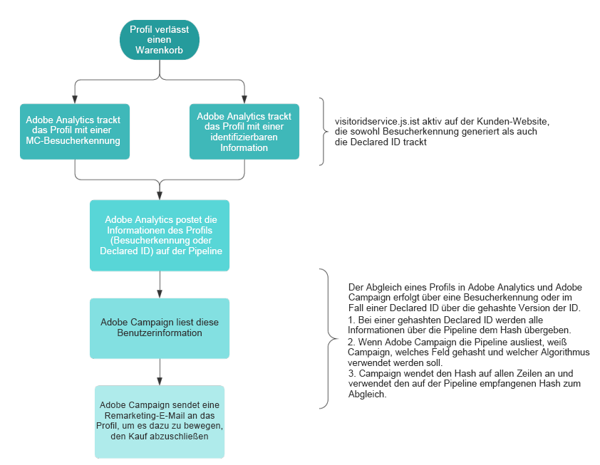

# Über Adobe Experience Cloud Triggers{#about-adobe-experience-cloud-triggers}

Durch die Integration von Adobe Campaign mit dem Experience Cloud Activation Core Service **[!UICONTROL Triggers]** können Sie Ihren Kunden personalisierte E-Mails senden, die auf bestimmte Verhaltensweisen abgestimmt sind, die auf Ihrer Website mithilfe von Adobe Analytics (innerhalb von 15 Minuten) ermittelt wurden.

In Adobe Experience Cloud werden die verschiedenen Trigger definiert, also jene Verhaltensweisen von Kunden, die Sie verfolgen möchten. Dabei kann es sich beispielsweise um Kunden handeln, die ihren Besuch auf Ihrer Website abgebrochen haben, auf Ihrer Website gesucht, aber nichts gekauft haben oder sogar Kunden, deren Sitzung abgelaufen ist. Bei der Erstellung von Triggern bestimmen Sie die Trigger-Bedingung sowie die Daten, die im Falle der Auslösung des Ereignisses an Adobe Campaign gesendet werden (pload).

In Adobe Campaign werden der zuvor erstellte Trigger ausgewählt, die Ereignisdaten mit Datamart-Daten angereichert und eine mit diesem Trigger verknüpfte Transaktionsnachrichtenvorlage definiert. Bricht zum Beispiel ein Kunde seinen Besuch auf Ihrer Website ab, wird ein Ereignis an Adobe Campaign gesendet, wodurch eine Remarketing-E-Mail erstellt werden kann, die innerhalb von 15 Minuten an den Kunden gesendet wird.

Im folgenden Diagramm wird beschrieben, wie diese Integration funktioniert.

**Verwandte Themen:**

* Lesen Sie mehr zu den unterschiedlichen Typen von Triggern in der [Dokumentation zu Adobe Experience Cloud](https://experienceleague.adobe.com/docs/core-services/interface/triggers.html?lang=de).
* Sehen Sie sich das Video [Trigger Remarketing Messages based on Site Activity](https://helpx.adobe.com/de/marketing-cloud/how-to/email-marketing.html#step-two) an.
* Erfahren Sie mehr in unseren zwei [Anwendungsbeispiele zu Triggern für die abgebrochene Suche](../../integrating/using/abandonment-triggers-use-cases.md).

## Die Verwendung von Triggers    {#triggers-user-process}

>[!CAUTION]
>
>Vor der Durchführung der wichtigsten Schritte durch den Benutzer muss die Funktion konfiguriert werden. Weiterführende Informationen dazu finden Sie in den Abschnitten [Funktion aktivieren](../../integrating/using/configuring-triggers-in-experience-cloud.md#activating-the-functionality), [Lösungen und Dienste konfigurieren](../../integrating/using/configuring-triggers-in-experience-cloud.md#configuring-solutions-and-services) und [In Campaign einen gemappten Trigger erstellen](../../integrating/using/using-triggers-in-campaign.md#creating-a-mapped-trigger-in-campaign).

Gehen Sie in Adobe Campaign wie folgt vor:

1. Erstellen Sie ein mit einem bereits vorhandenen Trigger in Adobe Experience Cloud verknüpftes Trigger-Ereignis.
1. Veröffentlichen Sie das Trigger-Ereignis.
1. Definieren Sie den Inhalt der Transaktionsnachrichtenvorlage.
1. Testen Sie die Vorlage (Testprofil erstellen und Testversand senden).
1. Veröffentlichen Sie die Transaktionsnachrichtenvorlage.

Vollständige Anwendungsbeispiele werden in [diesem Abschnitt](../../integrating/using/abandonment-triggers-use-cases.md) erläutert.

## Wichtige Hinweise        {#important-notes}

Beachten Sie bei der Verwendung der Triggers-Campaign-Integration Folgendes:

* Push-Benachrichtigungen werden von Triggern nicht unterstützt. Nur E-Mails und SMS werden unterstützt.
* Sie können Trigger mit über Analytics erfassten Metadaten anreichern, wie z. B. E-Mail-Kennung, Seitenname etc.
* Sie können einen Trigger mit einem in Campaign Standard gespeicherten Profil abstimmen und die Felder des Profils zur Personalisierung der Nachricht verwenden.
* Sobald ein Trigger empfangen wird, wird dieser verarbeitet, abgestimmt und gesendet. Je nach der Menge der empfangenen Trigger und der Anzahl der in der Vorlage verwendeten Personalisierungsfelder dauert dieser Vorgang 5 bis 15 Minuten.

>[!NOTE]
>
>Weiterführende Informationen zu Best Practices und technische Einschränkungen finden Sie im Abschnitt [Best Practices und Einschränkungen bei der Verwendung von Triggers](../../integrating/using/configuring-triggers-in-experience-cloud.md#triggers-best-practices-and-limitations).
