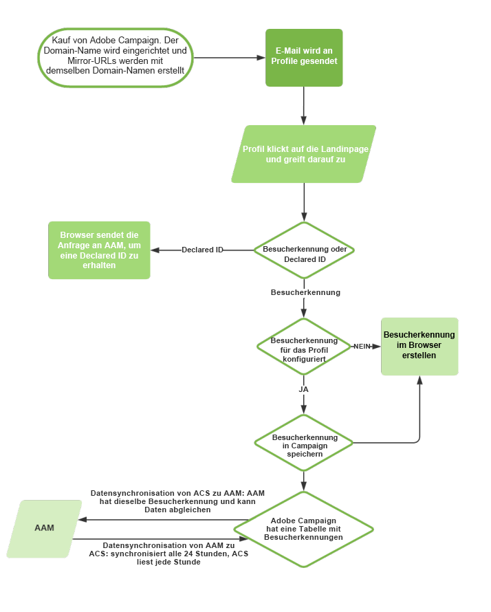

# Über die Integration von Campaign mit Audience Manager oder People Core Service{#about-campaign-audience-manager-or-people-core-service-integration}

>[!CAUTION]
>
>Der Zielgruppenimport in Adobe Campaign kann je nach ausgetauschten Daten rechtlichen Beschränkungen unterliegen.

Adobe Campaign erlaubt die lösungsübergreifende Nutzung von Audiences/Segmenten in Adobe Experience Cloud. Konkret bietet die Integration von **Adobe Campaign** und **People Core Service** (auch **Profiles &amp; Audiences Core Service** genannt) oder Adobe Audience Manager folgende Möglichkeiten:

* Import von Zielgruppen/Segmenten aus den verschiedenen Adobe Experience Cloud-Lösungen in Adobe Campaign. Der Import von Zielgruppen erfolgt in Adobe Campaign ausgehend vom Menü **[!UICONTROL Audiences]**.
* Export von Audiences als freigegebene Zielgruppen/Segmente. Diese Zielgruppen können dann in den anderen von Ihnen verwendeten Adobe Experience Cloud-Lösungen genutzt werden. Der Export von Audiences erfolgt innerhalb eines Workflows mithilfe der Aktivität **[!UICONTROL Audience-Speicherung]**, welche sich an eine Zielgruppenbestimmung anschließt.

Die Integration unterstützt zwei Typen von Adobe Experience Cloud-Kennungen:

* **Visitor ID**: Dieser Kennungstyp ermöglicht die Abstimmung von Adobe Experience Cloud-Besuchern mit Profilen aus Adobe Campaign. Sobald eine Verbindung über Adobe IMS aktiviert wird, wird der Marketing Cloud Besucher-ID-Dienst aktiviert, der das von Adobe Campaign verwendete permanente Cookie ersetzt. Auf diese Weise können Sie einen Besucher identifizieren und ihn dann mit einem Profil verknüpfen.
    Einem Profil wird eine Besucherkennung zugeordnet, sobald das Profil einen Link in einer mit Adobe Campaign versendeten E-Mail anklickt:
   * Wenn das Profil bereits über eine Besucherkennung verfügt, kann Adobe Campaign mithilfe der Browser-Daten des Profils das Profil wiederherstellen und automatisch mit der Besucherkennung verknüpfen.
   * Wenn keine Besucherkennung gefunden wird, wird eine neue Kennung erstellt. Diese Besucherkennung wird in den Trackinglogs der Profile gespeichert.

   Unter der Voraussetzung, dass sie denselben CNAME aufweisen, erkennen die anderen Lösungen der Adobe Marketing Cloud diese Kennung.

* **Declared ID**: Dieser Kennungstyp ermöglicht die Abstimmung beliebiger Datentypen mit Elementen der Adobe Campaign-Datenbank. Sie wird in Adobe Campaign als vordefinierter Abstimmschlüssel dargestellt. Beim Datenaustausch werden die Kennungen der Adobe Campaign-Datenbank verschlüsselt übertragen. Die verschlüsselten Kennungen werden mit den verschlüsselten Kennungen der importierten oder exportierten Adobe Marketing Cloud-Zielgruppe verglichen.
    Diese Integration unterstützt reguläre Declared IDs, Declared IDs mit Hash-Kennung und verschlüsselte Declared IDs.

   >[!CAUTION]
   >
   >Declared ID funktioniert nur mit Adobe Audience Manager. Declared ID funktioniert nicht ohne Adobe Audience Manager.

   Durch die Sicherheitsfunktion können verschlüsselte Daten in Datenquellen (z. B. PII) unter Verwendung der Declared ID und der Spezifikation des Verschlüsselungsalgorithmus freigegeben werden.

   Beispielsweise können Sie durch die Möglichkeit, verschlüsselte E-Mail-Adressen oder SMS-Nummern zu entschlüsseln, auch automatisch ausgelöste Nachrichten an Ihre Benutzer senden, selbst wenn deren Profil nicht in der Adobe-Campaign-Datenbank vorhanden ist.

Im folgenden Diagramm wird beschrieben, wie diese Integration funktioniert. Hier steht AAM für Adobe Audience Manager und ACS für Adobe Campaign Standard.

