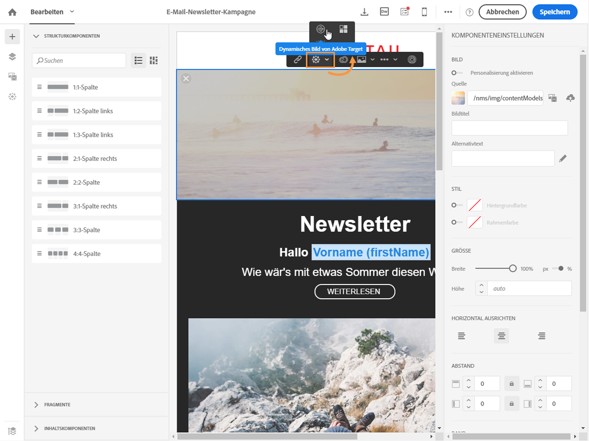
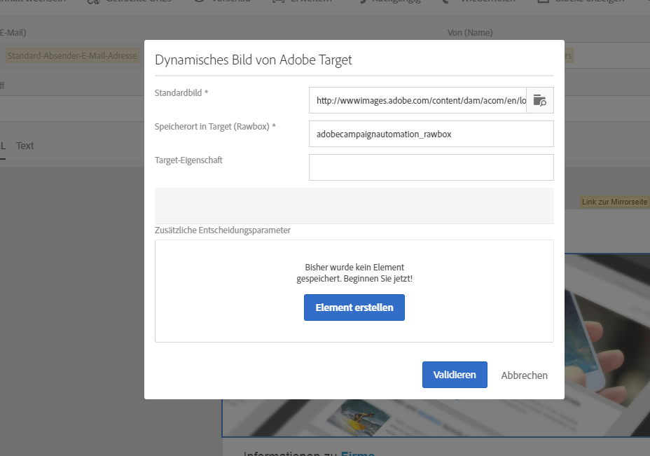

# Dynamische Inhalte aus Target einfügen{#adding-target-dynamic-content}

Die Integration mit Adobe Target ermöglicht es Ihnen, einem Versand dynamische Bilder hinzuzufügen, um den Inhalt zu personalisieren.

Ein dynamisches Bild kann während der Bearbeitung einer E-Mail hinzugefügt werden und verändert sich je nach Empfänger.

Bevor Sie auf das Bild in Adobe Campaign zugreifen, müssen Sie die folgenden Schritte in Adobe Target durchführen:

* [Umleitungsangebote](https://experienceleague.adobe.com/docs/target/using/experiences/offers/offer-redirect.html?lang=de), in denen die URL der zu verwendenden Bilder anzugeben ist;
* [Zielgruppen](https://experienceleague.adobe.com/docs/target/using/audiences/create-audiences/audiences.html?lang=de), die die durch Ihre Aktivität anzusprechenden Kontakte enthalten;
* Aktivität vom Typ [formularbasierter Experience Composer](https://experienceleague.adobe.com/docs/target/using/experiences/form-experience-composer.html?lang=de), in der eine Rawbox auszuwählen und entsprechend der Anzahl erstellter Umleitungsangebote Erlebnisse zu definieren sind. Für jedes Erlebnis ist eins der erstellten Umleitungsangebote auszuwählen.
* Erstellen Sie Segmente mit Informationen von Adobe Campaign, um Erlebnisse zu spezifizieren. Wenn Sie in den Angebotsauswahlregeln Daten aus Adobe Campaign verwenden möchten, müssen diese in der Adobe-Target-Rawbox angegeben werden.

1. Erstellen Sie in Adobe Campaign einen E-Mail-Versand.
1. Markieren Sie im Inhaltseditor einer E-Mail oder einer Landingpage einen Bild-Block und wählen Sie über das Kontextmenü die Option **[!UICONTROL Dynamisches Bild von Adobe Target]** aus.

   

1. Wählen Sie das Bild aus, das standardmäßig in der E-Mail angezeigt werden soll. Sie können die Bild-URL angeben oder ein in [Assets](../../integrating/using/working-with-campaign-and-assets-core-service.md) freigegebenes Bild verwenden.

   Im Rahmen der Integration werden nur statische Bilder unterstützt. Der weitere Inhalt kann nicht personalisiert werden.

1. Geben Sie den Namen der in Adobe Target definierten Rawbox an.
1. Wenn Sie in Ihren Einstellungen in Adobe Target Berechtigungen auf Unternehmensebene verwenden, fügen Sie in diesem Feld die entsprechende Eigenschaft hinzu. Weiterführende Informationen zu Berechtigungen auf Unternehmensebene in Target finden Sie auf [dieser Seite](https://experienceleague.adobe.com/docs/target/using/administer/manage-users/enterprise/properties-overview.html?lang=de). Dieses Feld ist optional und nicht erforderlich, wenn Sie keine Berechtigungen auf Unternehmensebene in Target verwenden.
1. Stellen Sie im Bereich **[!UICONTROL Zusätzliche Entscheidungsparameter]** die Verbindung zwischen den in den Adobe Target-Segmenten definierten Feldern und den Feldern in Adobe Campaign her.

   Die in Adobe Campaign verwendeten Felder müssen zuvor in der Rawbox angegeben werden. Definieren Sie in diesem Beispiel je nach Geschlecht des Empfängers unterschiedliche Erlebnisse.

   

1. Sehen Sie sich die Vorschau der E-Mail an, um festzustellen, ob je nach ausgewähltem Profil das angezeigte Bild wechselt. Die Anzeige erfolgt in Abhängigkeit von den Parametern, die in Adobe Campaign und in der Aktivität in Adobe Target konfiguriert wurden.

Ihr Versand mit dem dynamischen Bild kann jetzt durchgeführt werden. Die Ergebnisse sind in Adobe Target zu sehen.

**Verwandte Themen:**

* [Adobe Target-Portal](https://experienceleague.adobe.com/docs/target/using/integrate/campaign-and-target.html?lang=de)
* [Über die Inhaltserstellung in E-Mails](../../designing/using/designing-content-in-adobe-campaign.md)
* Video zur [Personalisierung von E-Mail-Bildern in Echtzeit](https://helpx.adobe.com/de/marketing-cloud/how-to/email-marketing.html)
