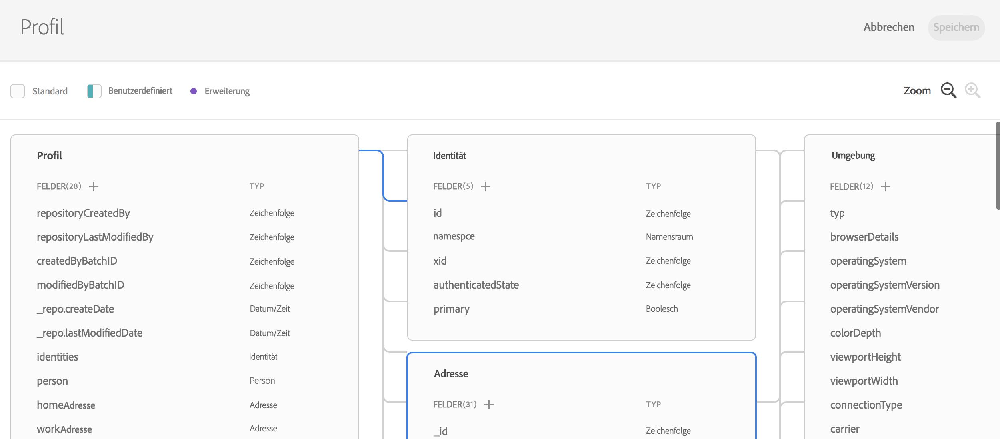

# Übersicht über das Experience-Datenmodell {#experience-data-model-overview}

>[!IMPORTANT]
>
>Adobe Experience Platform Data Connector befindet sich derzeit in der Betaversion, die häufig ohne Vorankündigung aktualisiert werden kann. Kunden müssen auf Azure gehostet werden (derzeit nur für Nordamerika in der Betaversion), um auf diese Funktionen zugreifen zu können. Wenden Sie sich an die Adobe-Kundenunterstützung, wenn Sie Zugriff haben möchten.

Das Experience-Datenmodell (XDM) ist ein Standardsatz von Datenschemata, in die Daten aufgenommen und mit Adobe Experience Platform-Lösungen und -Produkten verwendet werden können.

Die Erstellung und Verwaltung von XDM-Schemata ist mit einer speziellen API oder mit der XDM-Benutzeroberfläche möglich.

## XDM-Arbeitsbereich {#xdm-workspace}

Der XDM-Arbeitsbereich bietet die Möglichkeit, Datenschemata anzuzeigen, zu erstellen und zu erweitern.

Um auf die XDM-Benutzeroberfläche zuzugreifen, öffnen Sie Adobe Experience Platform. Navigieren Sie zum Fenster „Datenmodell“, um ein XDM-Schema zu erstellen oder zu erweitern.

Lesen Sie die vollständige [Dokumentation zum XDM-Arbeitsbereich](https://experienceleague.adobe.com/docs/experience-platform/xdm/api/getting-started.html?lang=de).

## XDM-API {#xdm-api}

Sie können die folgenden Aktionen über die XDM-Schema-API ausführen:

* Liste vorhandener Schemata anzeigen
* Ein bestimmte Schema anzeigen, ein bestehende Schema erweitern
* Felder zu einer Erweiterung hinzufügen
* Neues Schema erstellen und aktualisieren
* Schema-Deskriptoren anzeigen
* Schema-Deskriptoren erstellen, aktualisieren und löschen

Alle Details zum Bearbeiten von API-Aufrufen finden Sie im [Entwicklerhandbuch](https://experienceleague.adobe.com/docs/experience-platform/xdm/api/getting-started.html?lang=de).
