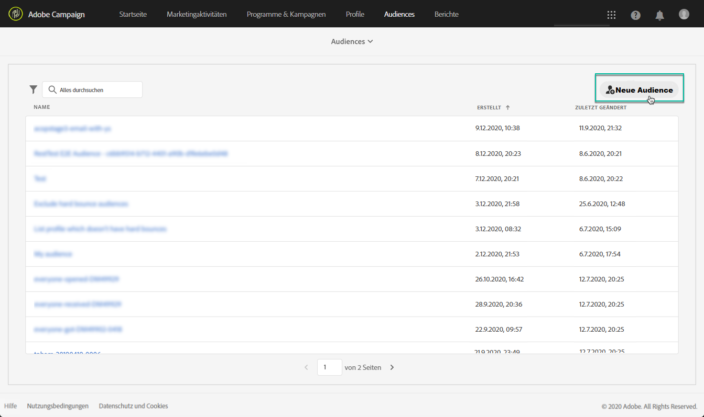

# Adobe Experience Platform-Zielgruppen verwalten {#about-audiences}

>[!IMPORTANT]
>
>Der Audience Destinations-Dienst befindet sich derzeit in der Betaversion, die häufig ohne Vorankündigung aktualisiert werden kann. Kunden müssen auf Azure gehostet werden (derzeit nur für Nordamerika in der Betaversion), um auf diese Funktionen zugreifen zu können. Wenden Sie sich an die Adobe-Kundenunterstützung, wenn Sie Zugriff haben möchten.

## Adobe Experience Platform-Zielgruppen aufrufen

Um Segment Builder von Adobe Experience Platform aufzurufen, navigieren Sie zur Karte **[!UICONTROL Zielgruppen]** auf der Startseite von Campaign Standard (oder zum Link **[!UICONTROL Zielgruppen]** in der Kopfzeile) und wählen Sie dann die Umgebung **[!UICONTROL Adobe Experience Platform]**.

Sie werden zunächst zur Segmentlistenseite von Adobe Experience Platform weitergeleitet, auf der bereits vorhandene Adobe Experience Platform-Segmente zur weiteren Bearbeitung aufgerufen werden können.

Es stehen eine Suchleiste und ein Filter zur Verfügung, die Ihnen bei der Suche nach dem gewünschten Adobe Experience Platform-Segment helfen.

## Adobe Experience Platform-Zielgruppen erstellen

Gehen Sie wie folgt vor, um direkt in Campaign Standard eine Adobe Experience Platform-Zielgruppe zu erstellen:

1. Wählen Sie auf der Segmentlistenseite von Adobe Experience Platform rechts die Schaltfläche **[!UICONTROL Neue Zielgruppe]** aus.

   

1.  Segment Builder sollte jetzt in Ihrem Arbeitsbereich angezeigt werden. Damit können Sie ein Segment mithilfe von Daten aus Adobe Experience Platform erstellen, das letztendlich zur Erstellung Ihrer Zielgruppe verwendet wird.

1. Benennen Sie das Segment im rechten Bereich und geben Sie eine Beschreibung ein (optional).

   

1. Zur erfolgreichen Erstellung eines Segments müssen Sie eine **Zusammenführungsrichtlinie** auswählen, die dem Marketing-Zweck dieses Segments entspricht.

   Im Einstellungsbereich ist eine standardmäßige Platform-Zusammenführungsrichtlinie ausgewählt. Weiterführende Informationen zu Zusammenführungsrichtlinien finden Sie im entsprechenden Abschnitt im [Segment Builder-Benutzerhandbuch](https://experienceleague.adobe.com/docs/experience-platform/segmentation/ui/overview.html?lang=de).

   

1. Definieren Sie die Regeln, um Profile zu identifizieren, die in Ihrer Zielgruppe abgerufen werden sollen.

   Ziehen Sie dazu die gewünschten Attribute und/oder Ereignisse aus dem linken Bereich in den Arbeitsbereich, definieren Sie die entsprechenden Regeln und wählen Sie dann die Schaltfläche **[!UICONTROL Segment erstellen]** aus, um das Segment zu speichern (siehe [Verwenden von Segment Builder](../../integrating/using/aep-using-segment-builder.md)).

   

Die Audience kann jetzt aktiviert werden. Sie können sie als Zielgruppe für Ihre Kampagnen nutzen (siehe [Zielgruppenbestimmung für Adobe Experience Platform-Audiences](../../integrating/using/aep-targeting-audiences.md)).

## Zielgruppen ändern

Um eine Zielgruppe zu bearbeiten, öffnen Sie sie und ändern Sie die Regeln nach Bedarf in der Segment Builder-Benutzeroberfläche (siehe [Verwenden von Segment Builder](../../integrating/using/aep-using-segment-builder.md)).

Wählen Sie nach Abschluss der Änderungen die Schaltfläche **[!UICONTROL Segment speichern]** aus, um Ihre Zielgruppe zu aktualisieren.

