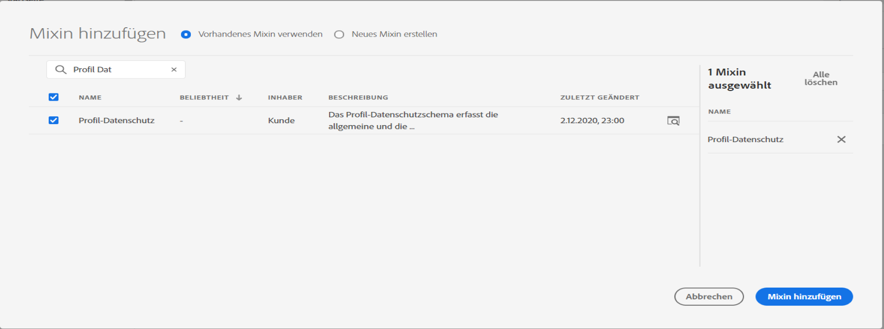

# Mapping-Aktivierung {#mapping-activation}

>[!IMPORTANT]
>
>Adobe Experience Platform Data Connector befindet sich derzeit in der Betaphase, die häufig ohne Vorankündigung aktualisiert werden kann. Kunden müssen auf Azure gehostet werden (derzeit nur für Nordamerika in der Betaphase), um auf diese Funktionen zugreifen zu können. Wenden Sie sich an die Adobe-Kundenunterstützung, wenn Sie Zugriff haben möchten.

Nach Abschluss der Mapping-Definition können Sie das Mapping veröffentlichen. Nach der Freigabe wird die Datenreplikation zwischen Campaign Standard und Adobe Experience Platform automatisch gestartet. Sie können die Replikation jederzeit beenden, indem Sie auf die Schaltfläche **[!UICONTROL Beenden]** klicken.

Je nach Ihren Mapping-Änderungen können Sie festlegen, alle Ihre Datensätze erneut an die Adobe Experience Platform zu senden.

Auf der Freigabekachel können Sie auf das Veröffentlichungslog und die Exportprotokolle zugreifen.

Im Tab **[!UICONTROL Exportaufträge]** können Sie den Exportauftrag für das veröffentlichte Mapping überwachen.

Wenn Sie alle Datenexportvorgänge überwachen möchten, gehen Sie zum Menü **[!UICONTROL Administration]** > **[!UICONTROL Entwicklung]** > **[!UICONTROL Plattform]** > **[!UICONTROL Status des Datenexports zu Platform]**.

Status des Datenerfassungsvorgangs sind:

* **[!UICONTROL Erstellt]**: Es wird ein Datenerfassungsvorgang erstellt und die Datenerfassung wird ausgeführt.
* **[!UICONTROL Fehlgeschlagen]**: Ein Datenerfassungsvorgang ist fehlgeschlagen. Das Feld „Grund“ beschreibt den Grund des Fehlschlagens. Fehler können vorübergehend oder dauerhaft sein. Bei vorübergehenden Fehlern wird nach einem konfigurierten Intervall ein neuer Erfassungsvorgang erstellt. Als ersten Schritt zur Fehlerbehebung können Benutzer das Feld „Grund“ des Fehlers überprüfen. Wenn der Grund einen Benutzer zur Adobe Experience Platform-Benutzeroberfläche weiterleitet, kann sich der Benutzer dort anmelden und den Batch-Status im Datensatz prüfen, um den genauen Fehlergrund zu ermitteln.
* **[!UICONTROL Hochgeladen]**: Zuerst wird ein Batch in Adobe Experience Platform erstellt und dann werden Daten in den Batch aufgenommen. Das Feld „Batch-ID“ zeigt die Batch-ID für den Batch in Adobe Experience Platform an. Adobe Experience Platform führt auch eine Nachvalidierung für den Batch durch. Der Batch wird zuerst als hochgeladen markiert, bis Adobe Experience Platform den Nachvalidierungsschritt abgeschlossen hat. Ein Vorgang fragt nach dem Hochladen weiterhin den Batch-Status von der Adobe Experience Platform ab. Ein Batch kann in Adobe Experience Platform bei der Validierung entweder den Status „Fehlgeschlagen“ oder „Erfolgreich abgeschlossen“ erhalten.
* **[!UICONTROL Erfolgreich abgeschlossen]**: Nach dem Hochladen eines Batches auf Adobe Experience Platform wird der Status des Vorgangs (Nachvalidierung in der Plattform) nach einem konfigurierten Intervall überprüft. Der Status „Erfolgreich abgeschlossen“ kennzeichnet eine erfolgreiche Datenerfassung in Adobe Experience Platform.

In einigen Fällen erhalten Sie beim Veröffentlichen der Zuordnung den folgenden Validierungsfehler.

Dies tritt auf, wenn das von Ihnen verwendete XDM-Schema nicht mit dem neuesten XDM-Feld für die Datenschutzverwaltung aktualisiert wurde und weiterhin das veraltete XDM-Feld &quot;ccpa&quot; enthält.

Gehen Sie wie folgt vor, um das XDM-Schema zu aktualisieren:

1. Gehen Sie zum Datensatz auf Adobe Experience Platform, indem Sie den Link auf der Seite mit der XDM-Zuordnung verwenden.

1. Navigieren Sie zu Ihrem XDM-Schema.

1. Fügen Sie dem Schema das Mixin **[!UICONTROL Profile Privacy]** hinzu.

   

1. Speichern Sie das Schema und versuchen Sie dann erneut, die Zuordnung zu veröffentlichen. Die Veröffentlichung sollte nun möglich sein.

   
