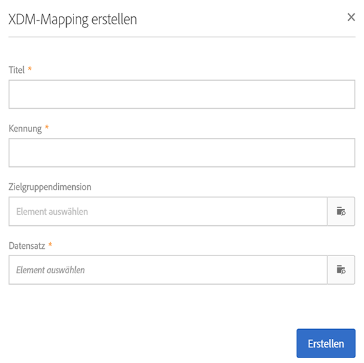
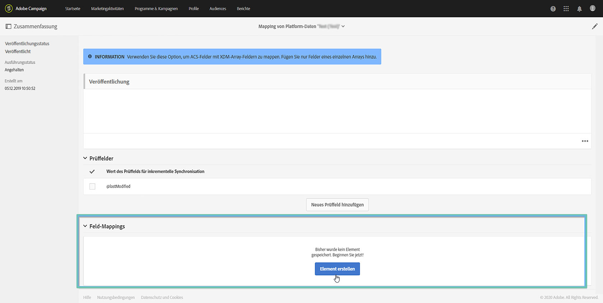
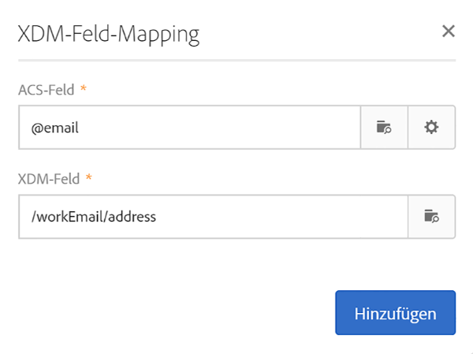
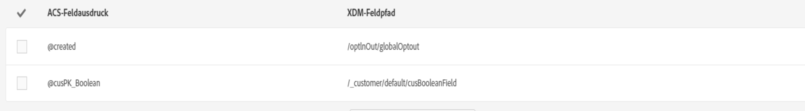
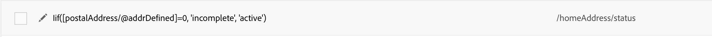
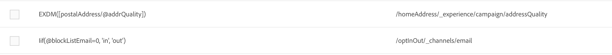
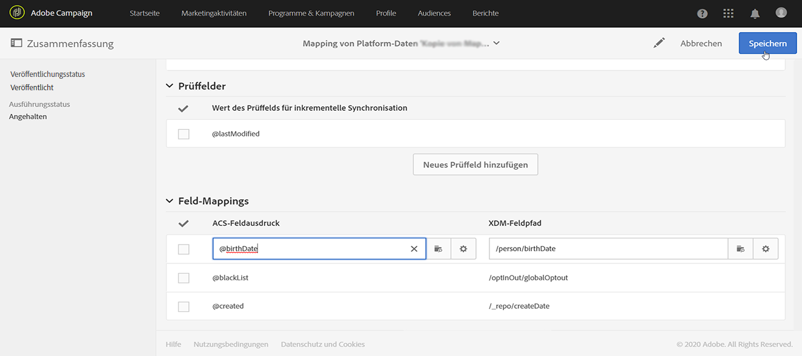

# Mapping-Definition {#mapping-definition}

>[!IMPORTANT]
>
>Adobe Experience Platform Data Connector befindet sich derzeit in der Betaversion, die häufig ohne Vorankündigung aktualisiert werden kann. Kunden müssen auf Azure gehostet werden (derzeit nur für Nordamerika in der Betaversion), um auf diese Funktionen zugreifen zu können. Wenden Sie sich an die Adobe-Kundenunterstützung, wenn Sie Zugriff haben möchten.

In diesem Abschnitt erfahren Sie, wie Sie ein Campaign Standard-Feld auf ein XDM-Feld (Experience-Datenmodell-Feld) abbilden.

Zur Durchführung dieser Aufgabe sind folgende Voraussetzungen erforderlich:

* XDM-Schemadefinition über die Oberfläche oder die REST-API, die XDM zugeordnet ist
* Datensatzerstellung anhand der XDM-Schemadefinition

1. Gehen Sie zu **[!UICONTROL Administration]** > **[!UICONTROL Entwicklung]** > **[!UICONTROL Plattform]** und wählen Sie den Eintrag **[!UICONTROL Daten-Mappings]** aus.

1. Klicken Sie auf **[!UICONTROL Erstellen]**, um ein neues XDM-Mapping zu starten.

   

1. Füllen Sie die erforderlichen Felder aus und wählen Sie:

   * eine **Zielgruppendimension**: dies ist das Campaign Standard-Schema, das abgebildet werden soll
   * einen **Datensatz**: dies ist das Datenpaket, das einem XDM-Schema in Adobe Experience Platform zugeordnet ist.

>[!NOTE]
>
>Damit ein Batch in das Echtzeit-Kundenprofil oder den Identity Service aufgenommen werden kann, muss der Datensatz für [das Echtzeit-Kundenprofil aktiviert](https://experienceleague.adobe.com/docs/experience-platform/rtcdp/intro/get-started.html?lang=de) werden.
>
>Wenn der ausgewählte Datensatz bereits in einem vorhandenen Daten-Mapping verwendet wird, wird ein Warnhinweis angezeigt, der Sie darüber informiert, dass Ihre Daten in Adobe Experience Platform möglicherweise überschrieben werden. Dies kann passieren, wenn es einige gemeinsame Empfänger in Daten-Mappings gibt, die den gleichen Datensatz verwenden.

Im folgenden Bildschirm wird der Abschnitt **[!UICONTROL Feld-Mappings]** angezeigt, in dem Sie für jedes Feld im Campaign Standard-Schema ein neues Mapping erstellen können.

Mit der Schaltfläche **[!UICONTROL Neues Feld-Mapping erstellen]** können Sie das Campaign Standard-Feld und den entsprechenden Feldpfadausdruck im XDM-Schema auswählen.

Wenn Sie ein Adobe Campaign Standard-Feld nicht finden können, können Sie das Suchfeld verwenden, um nach dem Feld zu suchen. Derzeit funktioniert die Suche nur für Felder, die in der Hierarchie geöffnet sind.

Die in Campaign Standard definierten erweiterten Ressourcen werden wie alle nativen Felder abgebildet. Sie werden in der _customer/default-Erweiterung in XDM definiert.

Sie können die XDM-Erweiterung über die API anpassen und Ihre eigene Erweiterung definieren, um die Kontrolle über das Mapping zu verbessern.

Weitere Informationen zur XDM-API finden Sie im [Tutorial zur Schema Registry-API](https://experienceleague.adobe.com/docs/experience-platform/xdm/api/getting-started.html?lang=de).

Um ein Auflistungsfeld abzubilden, müssen Sie den Ausdruckseditor verwenden, um jeden Auflistungswert zu definieren, der dem XDM-Wert entspricht. So muss zum Beispiel &quot;postaladdressfield&quot; wie folgt definiert werden:

Wenn der XDM-Wert als Auflistung im XDM-Schema definiert ist, können Sie die native EXDM-Funktion verwenden, die die **lif**-Syntax automatisch ersetzt.

Um ein XDM-Mapping zu bearbeiten, öffnen Sie es, ändern Sie die gewünschten Informationen und speichern Sie es.

>[!IMPORTANT]
>
>Wenn Sie zunächst einen Wert im Abschnitt **[!UICONTROL Feld-Mappings]** bearbeiten und dann außerhalb des Felds klicken, wird die Änderung erst dann auf der Benutzeroberfläche angezeigt, wenn Sie auf die Schaltfläche **[!UICONTROL Speichern]** klicken. Dieses Verhalten tritt nur einmal auf, wenn die Bearbeitung bei **[!UICONTROL Feld-Mappings]** die erste Bearbeitung auf der Seite ist.
