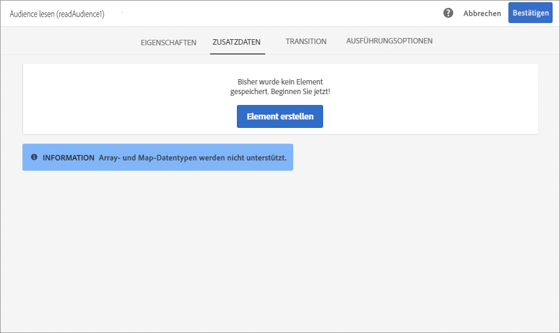
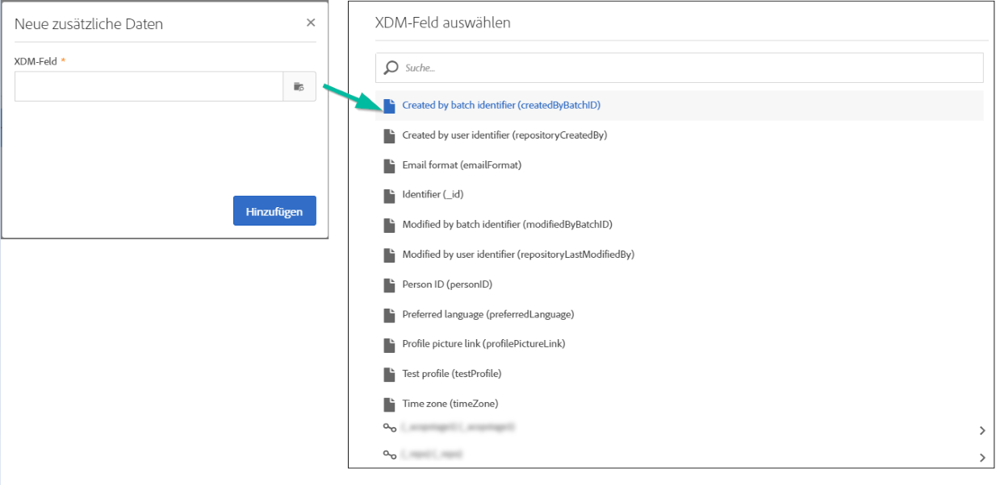
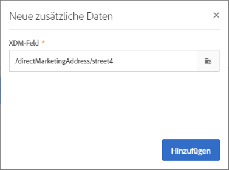

# Kampagnen mithilfe von Adobe Experience Platform-Attributen personalisieren {#personalizing-campaigns-using-aep-attributes}

>[!IMPORTANT]
>
>Der Audience Destinations-Dienst befindet sich derzeit in der Betaversion, die häufig ohne Vorankündigung aktualisiert werden kann. Kunden müssen auf Azure gehostet werden (derzeit nur für Nordamerika in der Betaversion), um auf diese Funktionen zugreifen zu können. Wenden Sie sich an die Adobe-Kundenunterstützung, wenn Sie Zugriff haben möchten.
>
>**Push**- und **In-App**-Kanäle stehen noch nicht zur Personalisierung mit kontextuellen Daten aus Adobe Experience Platform zur Verfügung.

Sobald Ihr Workflow mit einer [Adobe Experience Platform-Audience](../../integrating/using/aep-about-audience-destinations-service.md) konfiguriert wurde, können Sie Nachrichten mit Profilattributen personalisieren, die ausschließlich im Experience-Datenmodell (XDM) vorhanden sind.

Dazu müssen Sie die folgenden Attribute zur Aktivität **[!UICONTROL Audience lesen]** hinzufügen:

1. Öffnen Sie die Aktivität **[!UICONTROL Audience lesen]**. Klicken Sie im Tab **[!UICONTROL Zusätzliche Daten]** auf die Schaltfläche **[!UICONTROL Element erstellen]**.

   Beachten Sie, dass der Tab **[!UICONTROL Zusätzliche Daten]** erst verfügbar ist, nachdem eine Audience für Adobe Experience Platform ausgewählt wurde.

   

   >[!NOTE]
   >
   >Array- und Map-Datentypen werden in dieser Funktion nicht unterstützt. Außerdem werden nur Daten aus dem Vereinigungsschema in der Auswahl angezeigt.

1. Wählen Sie das gewünschte XDM-Feld aus der Liste aus und klicken Sie dann auf **[!UICONTROL Bestätigen]**.

   

1. Klicken Sie auf die Schaltfläche **[!UICONTROL Hinzufügen]**, um es der Liste der zusätzlichen Daten hinzuzufügen.

   

1. Wiederholen Sie diese Schritte für jedes XDM-Feld, das Sie Ihrem Workflow hinzufügen möchten.

   >[!NOTE]
   >
   >Sie können in der Aktivität **[!UICONTROL Audience lesen]** maximal 20 XDM-Felder hinzufügen.

1. Nachdem alle Felder hinzugefügt wurden, klicken Sie auf die Schaltfläche **[!UICONTROL Bestätigen]**, um die Änderungen zu speichern. Sie stehen nun zur Personalisierung Ihrer Sendungen zur Verfügung.

Weitere Informationen zum Erstellen und Personalisieren von Sendungen finden Sie in der Dokumentation zu Campaign Standard:

* [Kommunikationskanäle](../../channels/using/get-started-communication-channels.md)
* [Über Kanalaktivitäten](../../automating/using/about-channel-activities.md)
* [Sendungen personalisieren](../../designing/using/personalization.md)
