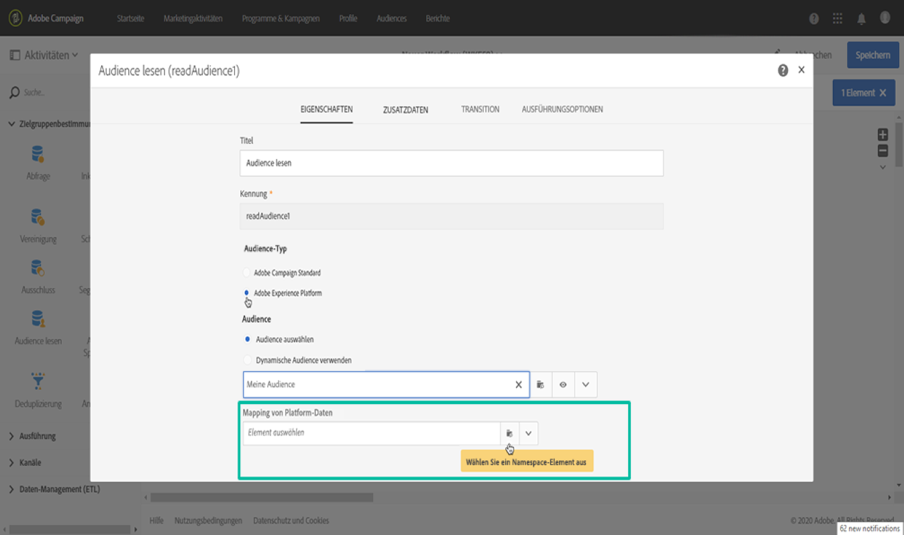
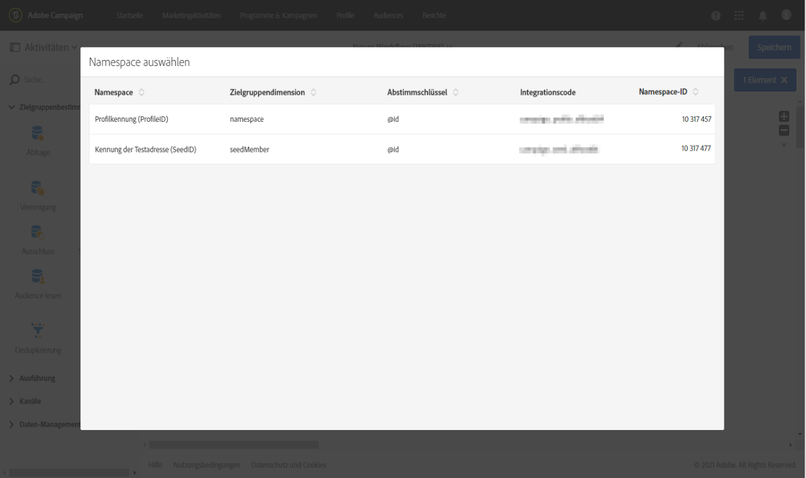
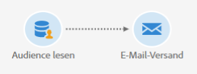

# Adobe Experience Platform-Audiences auswählen {#targeting-aep-audiences}

>[!IMPORTANT]
>
>Der Audience Destinations-Dienst befindet sich derzeit in der Betaversion, die häufig ohne Vorankündigung aktualisiert werden kann. Kunden müssen auf Azure gehostet werden (derzeit nur für Nordamerika in der Betaversion), um auf diese Funktionen zugreifen zu können. Wenden Sie sich an die Adobe-Kundenunterstützung, wenn Sie Zugriff haben möchten.

Nachdem Sie mit Segment Builder eine [Adobe Experience Platform-Audience](../../integrating/using/aep-about-audience-destinations-service.md) erstellt haben, können Sie diese wie eine Campaign-Audience innerhalb von Workflows verwenden, um Nachrichten zu personalisieren und zu senden.

Gehen Sie wie folgt vor, um eine Adobe Experience Platform-Audience in Ihren Workflows zu aktivieren:

1. Fügen Sie dem Workflow die Aktivität **[!UICONTROL Audience lesen]** hinzu und öffnen Sie sie.

1. Wählen Sie die Option **[!UICONTROL Adobe Experience Platform]** unter **[!UICONTROL Audience-Typ]** aus und fügen Sie dann die gewünschte Audience hinzu.

   

1. (Optional) Nachdem die Audience ausgewählt wurde, können Sie auf die Augenschaltfläche klicken, um die Segmentdefinition zu überprüfen und/oder zu bearbeiten (stellen Sie sicher, dass Sie die Änderungen erneut speichern).

   Wenn Sie auf die Augenschaltfläche klicken, gelangen Sie direkt zum Segment Builder (in einem anderen Tab), der der ausgewählten Audience in Campaign zugeordnet ist.

1. Wählen Sie das Element **[!UICONTROL Mapping von Platform-Daten]** aus, um die gewünschte Zielgruppendimension für die ausgewählte Adobe Experience Platform-Audience festzulegen.

   Standardmäßig ist der Primärschlüssel (z. B. iRecipientID für die Profiltabelle, iAppSubscriptionID für die AppSubscription-Tabelle), der für die Abstimmung verwendet wird, automatisch in der Dropdown-Liste verfügbar. Um eine Zielgruppenbestimmung außerhalb des Primärschlüssels durchzuführen, müssen Sie einen benutzerdefinierten **Namespace** erstellen.

   >[!NOTE]
   >
   >Bei Zielgruppen außerhalb des Primärschlüssels müssen Sie auch ein benutzerdefiniertes Zielgruppen-Mapping erstellen, das dem benutzerdefinierten Namespace entspricht. Weiterführende Informationen zum Zielgruppen-Mapping erfahren Sie in [diesem Abschnitt](../../administration/using/target-mappings-in-campaign.md).

   

   Diese Liste enthält alle XDM-Mappings (Experience-Datenmodell), die für Ihre Instanz konfiguriert wurden. Weitere Informationen zu Adobe Experience Platform Data Connector finden Sie in [diesem Dokument](../../integrating/using/aep-about-data-connector.md).

   

1. Nachdem die Audience- und Zielgruppendimensionen korrekt konfiguriert wurden, klicken Sie auf die Schaltfläche **[!UICONTROL Bestätigen]**, um die Änderungen zu speichern.

Sie können Ihren Workflow jetzt mit anderen Aktivitäten konfigurieren. Sie können beispielsweise die Aktivität **[!UICONTROL E-Mail-Versand]** anfügen, um eine E-Mail an die ausgewählte Audience zu senden.

>[!NOTE]
>
>Mit Campaign Standard können Sie Adobe Experience Platform-Audiences in allen Versandkanälen auswählen: E-Mails, SMS-Nachrichten, Briefpostnachrichten, Push-Benachrichtigungen und In-App-Nachrichten.
>
>*Hinweis: Bei allen Push- und In-App-Nachrichten unterstützt Campaign Standard nur Sendungen an bekannte Profile.

Weitere Informationen zur Verwendung von Workflows und Sendungen finden Sie in den folgenden Abschnitten:

* [Workflows](../../automating/using/get-started-workflows.md)
* [Workflow erstellen](../../automating/using/building-a-workflow.md)
* [Kommunikationskanäle](../../channels/using/get-started-communication-channels.md)
* [Über Kanalaktivitäten](../../automating/using/about-channel-activities.md)
