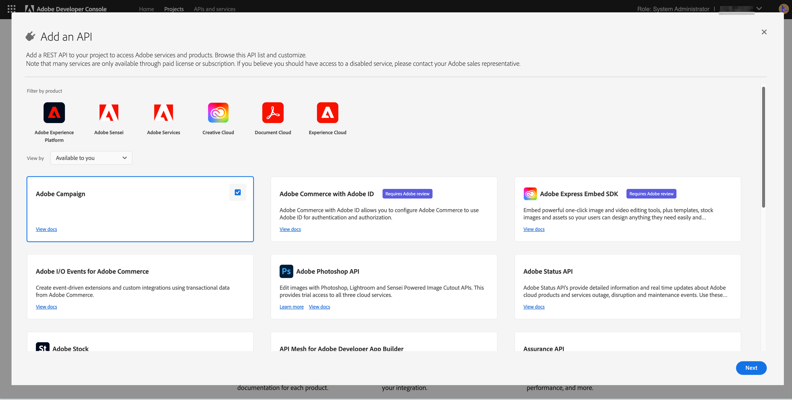
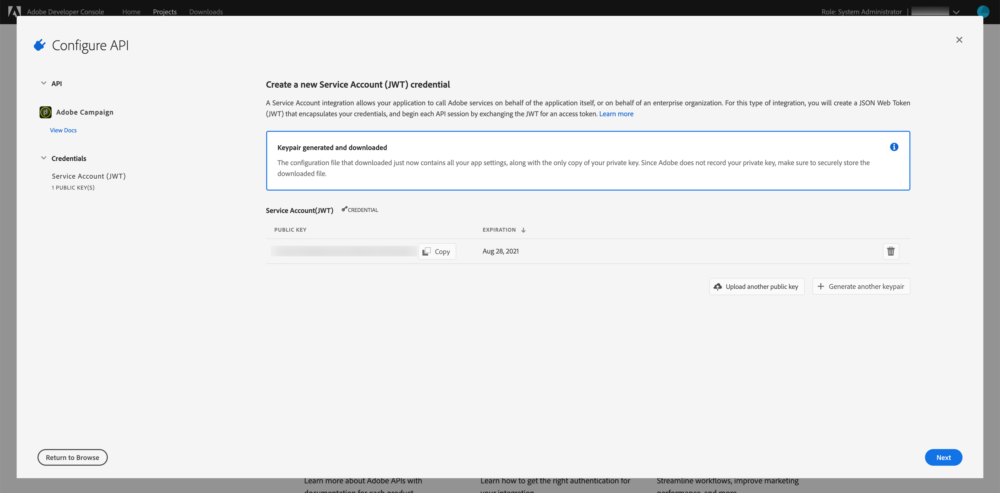

# Adobe I/O für die Integration mit Microsoft Dynamics 365 konfigurieren

Aktivieren Sie Ihre CRM-Daten bei der Kommunikation über Kanal hinweg: lernen Sie die Schritte, die während der Einrichtung vor der Integration erforderlich sind, um ein neues Adobe-IO-Projekt zu erstellen und es für die Microsoft Dynamics 365-Integration zu konfigurieren.

## Übersicht

Die Integration von Adobe Campaign Standard mit Microsoft Dynamics 365 wird auf [dieser Seite](../../integrating/using/working-with-campaign-standard-and-microsoft-dynamics-365.md) beschrieben.

Bevor Sie die in diesem Artikel beschriebene Vorintegrationseinrichtung durchführen, wird davon ausgegangen, dass Sie bereits bereitgestellt wurden und Administratorrechte auf die Campaign Standard-Instanz in Ihrem Unternehmen haben.  Ist dies nicht der Fall, setzen Sie sich mit der Adobe-Kundenunterstützung in Verbindung, um die Bereitstellung von Campaign abzuschließen.

>[!CAUTION]
>
>Die unten beschriebenen Schritte müssen von einem Administrator ausgeführt werden.

## Konfiguration 

Sie müssen ein neues Adobe-IO-Projekt erstellen und für die Integration konfigurieren.

### Neues Projekt erstellen

Gehen Sie dazu wie folgt vor:

1. Navigate to [Adobe IO Console](https://console.adobe.io/home#) and select your Adobe IMS Organization ID from the drop-down menu at the top right of the screen.

1. Klicken Sie dann auf Neues Projekt **[!UICONTROL erstellen]** unter **[!UICONTROL Quick Beginn]**.

1. Klicken Sie unter **[!UICONTROL Erste Schritte mit Ihrem neuen Projekt]** auf **[!UICONTROL Hinzufügen API]**.

1. Wählen Sie die Adobe Campaign-API aus (Sie müssen ggf. nach unten blättern) und klicken Sie auf &quot;Weiter&quot;.

1. Im nächsten Bildschirm haben Sie die Möglichkeit, Ihren eigenen öffentlichen Schlüssel hochzuladen oder die Adobe IO das Schlüsselpaar für Sie generieren zu lassen. Diese Anweisungen folgen der letzteren Option. Wenn Sie sich dafür entscheiden, dass Adobe IO das Schlüsselpaar generiert, klicken Sie auf Option 1. Klicken Sie dann auf &quot;Generate keypair&quot;.

1. Im nächsten Bildschirm werden Sie aufgefordert, den Namen anzugeben und den Download-Speicherort der ZIP-Datei für das Schlüsselpaar auszuwählen.

Nach dem Herunterladen können Sie die Datei entpacken, um die öffentlichen und privaten Schlüssel anzuzeigen. Adobe IO hat den öffentlichen Schlüssel bereits auf Ihr Adobe-IO-Projekt angewendet. Sie müssen später Ihren privaten Schlüssel behalten; Der private Schlüssel wird während der Einrichtung des Integrationstools vor der Integration verwendet.

1. Klicken Sie auf &quot;Weiter&quot;, um fortzufahren

1. Im nächsten Bildschirm wählen Sie die Profile aus, die mit diesem Projekt verknüpft werden sollen.

1. Wählen Sie das Produkt-Profil aus, das im Titel enthalten ist: Die Mandant-ID Ihrer Kampagne-Instanz - [!UICONTROL Administratoren] - Beispiel: Campaign Standard - Ihre Kampagne-MandantID - Administratoren

1. Klicken Sie auf [!UICONTROL Konfigurierte API]speichern.

1. Im nächsten Bildschirm sehen Sie die Details Ihres neuen Adobe IO Projektes.

1. Klicken Sie oben links im Bildschirm auf &quot;Hinzufügen zu Projekt&quot; und wählen Sie &quot;API&quot; aus der Dropdown-Liste.

1. Im nächsten Bildschirm müssen Sie die I/O-Ereignisse-API auswählen und dann auf &quot;Weiter&quot; klicken.

1. Klicken Sie im nächsten Bildschirm auf &quot;Konfigurierte API speichern&quot;.  Sie werden zum Projektinformationsbildschirm zurückgebracht.

1. Klicken Sie nun auf &quot;Hinzufügen zu Projekt&quot; oben links im Bildschirm und wählen Sie &quot;API&quot; aus der Dropdown-Liste, wie Sie es zuvor getan haben.

1. Im nächsten Bildschirm müssen Sie die I/O Management API auswählen und auf &quot;Weiter&quot; klicken.

1. Klicken Sie im nächsten Bildschirm auf &quot;Konfigurierte API speichern&quot;.

Die Einrichtung der Kampagne vor der Integration ist jetzt abgeschlossen.  Fahren Sie fort mit dem Abschluss der [Vorintegration für Microsoft Dynamics 365](../../integrating/using/configure-microsoft-dynamics-365-for-campaign-integration.md).

**Verwandte Themen**

* [Adobe IO – Integration von Dienstkonten](https://www.adobe.io/authentication/auth-methods.html#!AdobeDocs/adobeio-auth/master/AuthenticationOverview/ServiceAccountIntegration.md)
* [Campaign Standard – Einrichtung von API-Zugriff](../../api/using/setting-up-api-access.md)
* [Campaign Standard – Integration mit Dynamics 365](../../integrating/using/configure-microsoft-dynamics-365-for-campaign-integration.md)