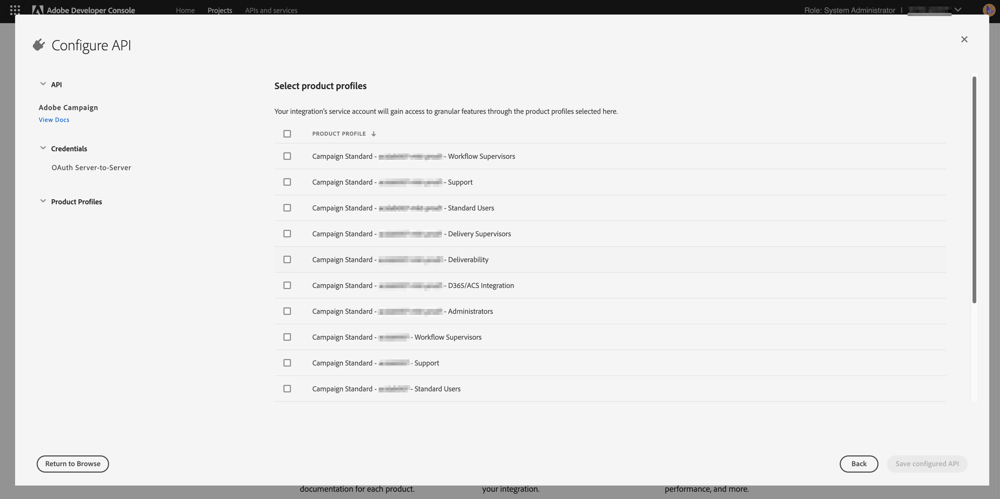

# Adobe I/O für die Integration mit Microsoft Dynamics 365 konfigurieren

Aktivieren Sie Ihre CRM-Daten für die kanalübergreifende Kommunikation: Lernen Sie die Schritte kennen, die während der Einrichtung vor der Integration erforderlich sind, um ein neues Adobe IO-Projekt zu erstellen und es für die Microsoft Dynamics 365-Integration zu konfigurieren.

## Übersicht

Die Integration von Adobe Campaign Standard mit Microsoft Dynamics 365 wird auf [dieser Seite](../../integrating/using/working-with-campaign-standard-and-microsoft-dynamics-365.md) beschrieben.

Bevor Sie die Einrichtungsschritte vor der Integration in diesem Artikel durchführen, wird davon ausgegangen, dass Sie bereits Administratorrechte für die Campaign Standard-Instanz Ihres Unternehmens erhalten haben.  Ist dies nicht der Fall, setzen Sie sich mit der Adobe-Kundenunterstützung in Verbindung, um die Bereitstellung von Campaign abzuschließen.

>[!CAUTION]
>
>Die unten beschriebenen Schritte müssen von einem Administrator ausgeführt werden.

## Konfiguration 

Sie müssen ein neues Adobe-IO-Projekt erstellen und für die Integration konfigurieren.

### Neues Projekt erstellen

Gehen Sie dazu wie folgt vor:

1. Navigieren Sie zur [Adobe I/O-Konsole](https://console.adobe.io/home#) und wählen Sie im Dropdown-Menü oben rechts auf dem Bildschirm die Kennung Ihrer Adobe IMS-Organisation aus.

1. Klicken Sie anschließend unter **[!UICONTROL Schnellstart]** auf **[!UICONTROL Neues Projekt erstellen]**.

   

1. Klicken Sie unter **[!UICONTROL Erste Schritte mit Ihrem neuen Projekt]** auf **[!UICONTROL API hinzufügen]**.

   

1. Wählen Sie die Adobe Campaign-API aus (Sie müssen ggf. nach unten blättern) und klicken Sie auf **[!UICONTROL Weiter]**.

   

1. Auf dem nächsten Bildschirm haben Sie die Möglichkeit, Ihren eigenen öffentlichen Schlüssel hochzuladen oder Adobe IO das Schlüsselpaar für Sie generieren zu lassen. Diese Anweisungen entsprechen der letztgenannten Option. Wenn Sie sich dafür entscheiden, Adobe IO das Schlüsselpaar generieren zu lassen, klicken Sie auf Option 1. Klicken Sie dann auf die Schaltfläche **[!UICONTROL Generate keypair]**.

   

1. Auf dem nächsten Bildschirm werden Sie aufgefordert, den Download-Speicherort der Zip-Datei für das Schlüsselpaar zu nennen und auszuwählen.

Nach dem Herunterladen können Sie die Datei entpacken, um die öffentlichen und privaten Schlüssel anzuzeigen. Adobe IO hat den öffentlichen Schlüssel bereits auf Ihr Adobe IO-Projekt angewendet. Sie müssen Ihren privaten Schlüssel für später aufbewahren. Der private Schlüssel wird während der Einrichtung des Integrations-Tools vor der Integration verwendet.

1. Klicken Sie auf **[!UICONTROL Weiter]**, um fortzufahren.

   

1. Auf dem nächsten Bildschirm wählen Sie Produktprofile aus, die diesem Projekt zugeordnet werden sollen. Select the product profile that contains in the solution: Campaign Standard
product: campaign
title: The tenant ID of your Campaign instance - [!UICONTROL Administrators]

   Beispiel: Campaign Standard – Ihre Campaign-Mandantenkennung – Administratoren

1. Klicken Sie auf **[!UICONTROL Konfigurierte API speichern]**.

   

1. Auf dem nächsten Bildschirm sehen Sie die Details Ihres neuen Adobe IO-Projekts. Klicken Sie oben links im Bildschirm auf **[!UICONTROL Zum Projekt hinzufügen]** und wählen Sie in der Dropdown-Liste die Option **API** aus.

   

1. Wählen Sie im nächsten Bildschirm die I/O Events-API aus und klicken Sie dann auf **[!UICONTROL Weiter]**.

1. Klicken Sie im nächsten Bildschirm auf **[!UICONTROL Save the configured API]**.  Sie kehren zum Bildschirm mit den Projektdetails zurück.

1. Klicken Sie nun oben links im Bildschirm auf **[!UICONTROL Add to Project]** und wählen Sie wie zuvor in der Dropdown-Liste die Option **API** aus.

1. Wählen Sie im nächsten Bildschirm die I/O Management-API aus und klicken Sie auf **[!UICONTROL Weiter]**.

1. Klicken Sie im nächsten Bildschirm auf **[!UICONTROL Save the configured API]**.

Die Einrichtung vor der Integration in Campaign ist jetzt abgeschlossen.  Fahren Sie fort, um die [Einrichtung vor der Integration für Microsoft Dynamics 365](../../integrating/using/configure-microsoft-dynamics-365-for-campaign-integration.md) abzuschließen.

**Verwandte Themen**

* [Adobe IO – Integration von Dienstkonten](https://www.adobe.io/authentication/auth-methods.html#!AdobeDocs/adobeio-auth/master/AuthenticationOverview/ServiceAccountIntegration.md)
* [Campaign Standard – Einrichtung von API-Zugriff](../../api/using/setting-up-api-access.md)
* [Campaign Standard – Integration mit Dynamics 365](../../integrating/using/configure-microsoft-dynamics-365-for-campaign-integration.md)