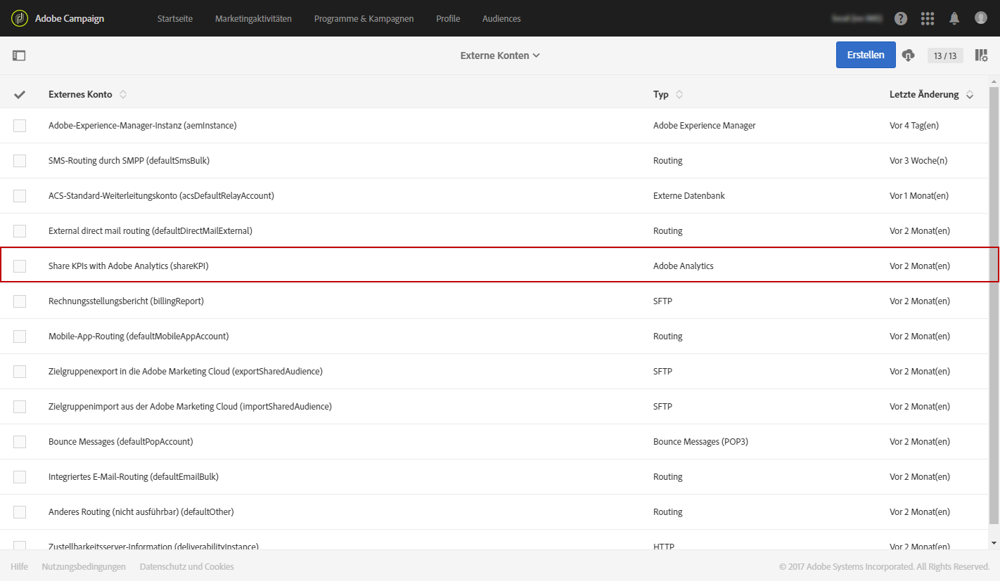
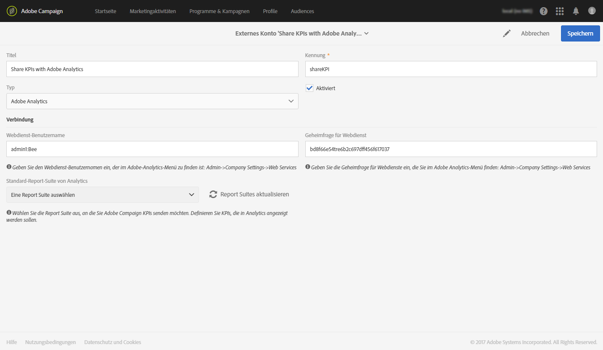
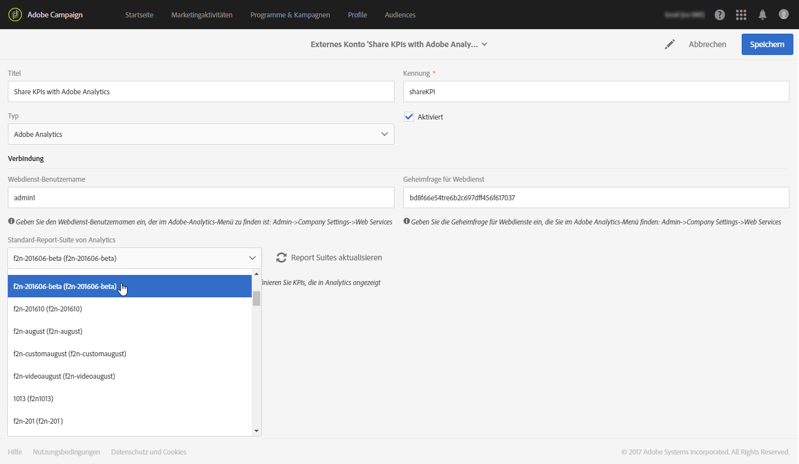
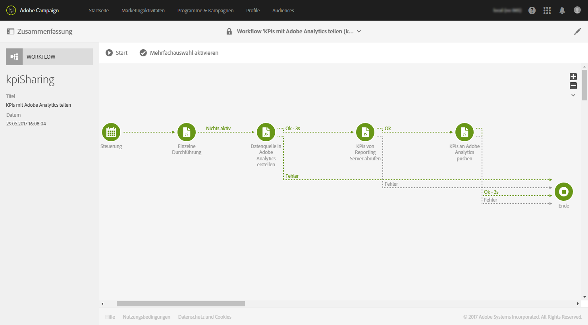

# Integration von Campaign mit Analytics konfigurieren{#configure-campaign-analytics-integration}

Durch diese Integration können Sie Ihre KPI-Daten direkt von Adobe Campaign an Adobe Analytics Standard oder Premium übertragen.

Für die Integration von Adobe Campaign mit Adobe Analytics müssen Sie zunächst das externe mit Adobe Analytics verknüpfte Konto konfigurieren.

Externe Konten und technische Workflows können nur vom funktionalen Administrator der Plattform verwaltet werden.

1. Greifen Sie mithilfe des Adobe-Campaign-Logos oben links im Bildschirm und der Schaltflächen **[!UICONTROL Administration > Anwendungskonfiguration > externe Konten auf das entsprechende Menü zu]**.
1. Wählen Sie das externe Konto **[!UICONTROL KPIs mit Adobe Analytics teilen]** aus.

   

1. Geben Sie Ihren **[!UICONTROL Webdienst-Benutzernamen]** und die **[!UICONTROL Geheimfrage für Webdienst]** im Feld **[!UICONTROL Verbindung]** ein.

   Diese Parameter können in Analytics durch die Auswahl von **[!UICONTROL Admin > Unternehmenseinstellungen > Webdienste abgerufen werden]**.

   

1. Verwenden Sie die Schaltfläche **[!UICONTROL Report Suites aktualisieren]**.
1. Wählen Sie in der Dropdown-Liste **[!UICONTROL Standard-Report-Suite von Analytics]** die Adobe-Analytics-Report-Suite aus, die Sie mit Adobe-Campaign-Daten anreichern möchten.

   Ihr externes Konto steht nun bereit und ist mit Adobe Analytics verknüpft. Sie können es jederzeit deaktivieren, indem Sie die Option **[!UICONTROL Aktiviert]** aktivieren.

   

Der technische Workflow **[!UICONTROL KPIs mit Adobe Analytics teilen]** wird jetzt automatisch gestartet und kann im erweiterten Menü über die Schaltflächen **[!UICONTROL Administration > Anwendungskonfiguration > Workflow]** aufgerufen werden. Dieser technische Workflow kann bis zu sechs Monate alte Broadlogs beibehalten. Beachten Sie, dass dieser Workflow inkrementell ist und die Daten vom Vortag überträgt.

Ihre Daten sind nun in Adobe Analytics verfügbar.

**Verwandte Themen:**

* [Externe Konten](../../administration/using/external-accounts.md)
* [Technische Workflows](../../administration/using/technical-workflows.md)
* Video [Share KPIs for integrated Campaign reporting](https://helpx.adobe.com/de/marketing-cloud/how-to/email-marketing.html)
