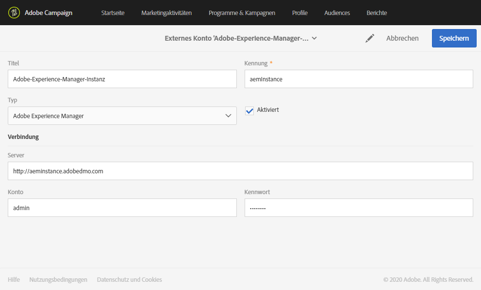
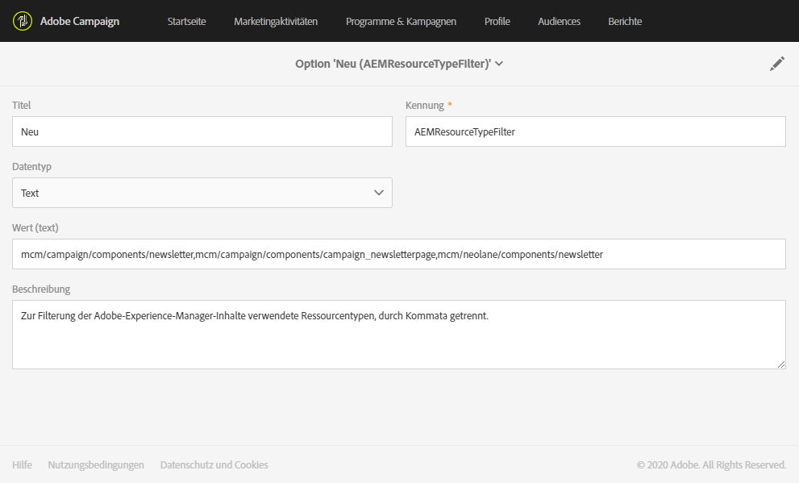
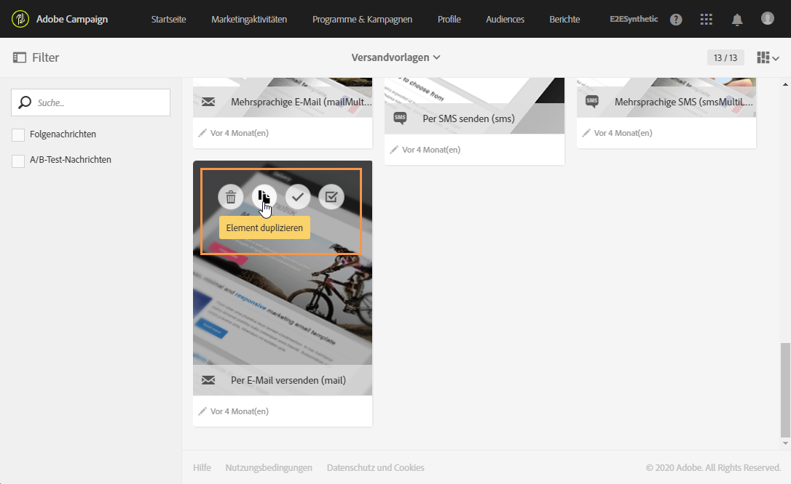
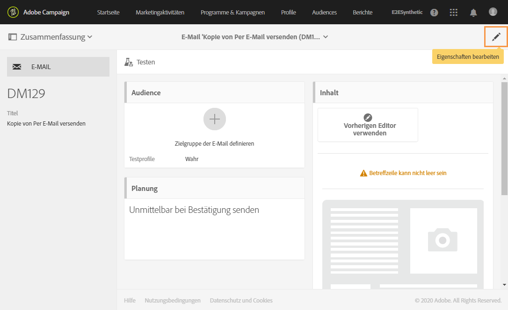

# Integration von Campaign mit Experience Manager konfigurieren {#configuration-aem}

Durch die Integration von Adobe Campaign Standard mit Adobe Experience Manager können Sie die in Adobe Experience Manager erstellten Inhalte in E-Mails in Adobe Campaign verwenden.

Anhand dieses Anwendungsbeispiels lernen Sie, in Adobe Experience Manager E-Mail-Inhalte zu erstellen und zu verwalten und diese anschließend für Ihre Marketingkampagnen zu verwenden, indem Sie sie in Ihre Adobe Campaign Standard-E-Mails importieren.

## Voraussetzungen {#prerequisites}

Vergewissern Sie sich zunächst, dass Sie über folgende Elemente verfügen:

* Adobe-Experience-Manager-**Authoring**-Instanz zur Erstellung der Inhalte,
* Adobe-Experience-Manager-**Publishing**-Instanz zur Veröffentlichung der Inhalte,
* Adobe-Campaign-Instanz.

## Konfiguration in Adobe Campaign Standard {#config-acs}

Um die kombinierte Nutzung von Adobe Campaign und Adobe Experience Manager zu ermöglichen, ist zunächst eine Konfiguration beider Lösungen erforderlich.
Gehen Sie wie folgt vor:

1. Konfigurieren Sie zunächst das externe Konto der **[!UICONTROL Adobe-Experience-Manager-Instanz]** im Menü **[!UICONTROL Administration]** > **[!UICONTROL Anwendungskonfiguration]** > **[!UICONTROL Externe Konten]**.

1. Konfigurieren Sie das externe Adobe Experience Manager-Konto mit Ihrer **[!UICONTROL Server]**-URL, Ihrem **[!UICONTROL Konto]** und Ihrem **[!UICONTROL Passwort]**.

   

1. Überprüfen Sie, ob die Option **[!UICONTROL AEMResourceTypeFilter]** richtig konfiguriert wurde. Rufen Sie das Menü **[!UICONTROL Optionen]** unter **[!UICONTROL Administration]** > **[!UICONTROL Anwendungskonfiguration]** > **[!UICONTROL Optionen]** auf.

1. Überprüfen Sie im Feld **[!UICONTROL Wert (text)]**, ob die folgende Syntax korrekt ist:

   ```
   mcm/campaign/components/newsletter,mcm/campaign/components/campaign_newsletterpage,mcm/neolane/components/newsletter
   ```

   

1. Duplizieren Sie dann im erweiterten Menü unter **[!UICONTROL Ressourcen]** > **[!UICONTROL Vorlagen]** > **[!UICONTROL Versandvorlagen]** eine vorhandene Vorlage, um eine für Adobe Experience Manager spezifische E-Mail-Vorlage zu erstellen.

   

1. Klicken Sie auf das Symbol **[!UICONTROL Eigenschaften bearbeiten]**.

   

1. Wählen Sie in der Dropdown-Liste **[!UICONTROL Inhalt]** die Option **[!UICONTROL Adobe Experience Manager]** im Feld **[!UICONTROL Inhaltsquelle]** und dann Ihr zuvor erstelltes externes Konto im **[!UICONTROL Adobe Experience Manager-Konto]** aus.

Konfigurieren Sie jetzt die Integration in Adobe Experience Manager.

## Konfiguration in Adobe Experience Manager {#config-aem}

Führen Sie die folgenden Schritte aus, um Adobe Experience Manager mit Adobe Campaign Standard zu konfigurieren:

1. Konfigurieren Sie zunächst die Replikation zwischen den Authoring- und Publishing-Instanzen von Adobe Experience Manager. Siehe diesen [Abschnitt](https://docs.adobe.com/content/help/de-DE/experience-manager-65/administering/integration/campaignstandard.html#configuring-adobe-experience-manager).

1. Stellen Sie dann die Verbindung zwischen Adobe Experience Manager und Adobe Campaign her, indem Sie einen dedizierten **[!UICONTROL Cloud Service]** konfigurieren. Siehe diesen [Abschnitt](https://docs.adobe.com/content/help/de-DE/experience-manager-65/administering/integration/campaignstandard.html#connecting-aem-to-adobe-campaign).

1. Konfigurieren Sie jetzt den Externalizer in Adobe Experience Manager auf Ihrer Authoring-Instanz. Siehe diesen [Abschnitt](https://docs.adobe.com/content/help/de-DE/experience-manager-65/administering/integration/campaignstandard.html#configuring-the-externalizer).

