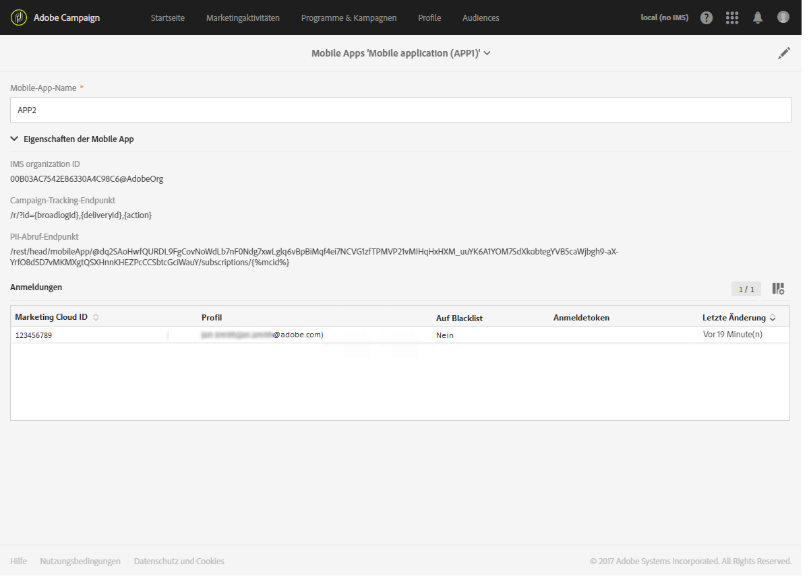
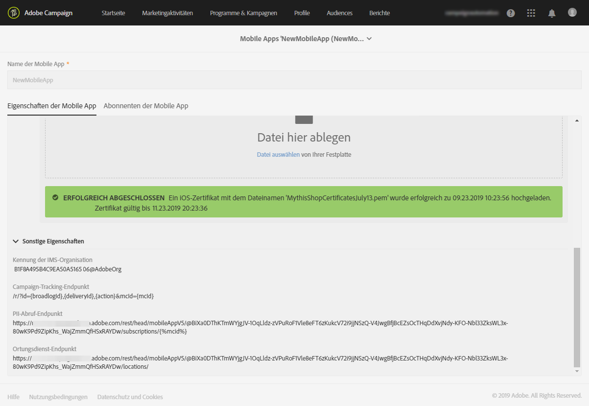
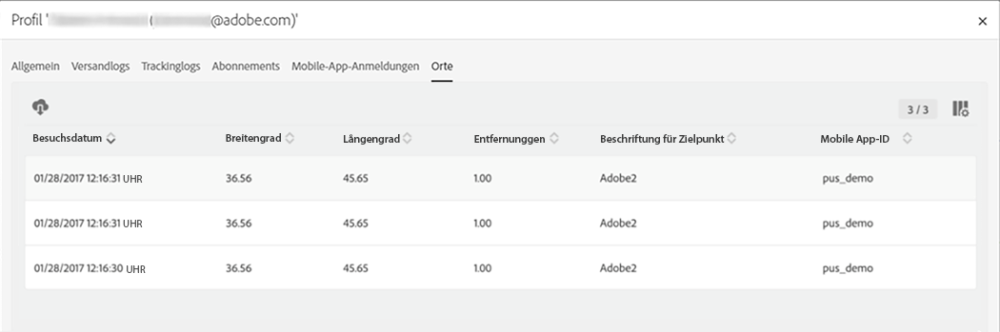

# Konfigurieren der Integration von Campaign-POI-Daten  {#configuring-campaign-points-of-interest-data-integration}

## Konfigurieren der Integration von Campaign-POI-Daten mit Adobe Experience Platform SDKs {#configuring-campaign-poi-aep-sdk}

>[!NOTE]
>
>Ihre Mobile App sollte bereits mit dem Adobe Experience Platform SDK in Adobe Campaign Standard konfiguriert sein. Eine detaillierte Anleitung finden Sie auf dieser [Seite](https://helpx.adobe.com/de/campaign/kb/configuring-app-sdk.html).

Mobile Apps, mit denen Standortdaten erfasst werden, müssen von einem **Administrator** in der Adobe Campaign-Benutzeroberfläche konfiguriert werden.

Um Adobe Experience Platform Location Services mit Mobile Apps zu verwenden, die mit dem Adobe Experience Platform SDK konfiguriert wurden, gehen Sie folgendermaßen vor:

1. Fügen Sie die Erweiterung **[!UICONTROL Places]** zur Konfiguration Ihrer Mobile App in der Benutzeroberfläche „Datenerfassung“ hinzu. Richten Sie in Adobe Campaign Ihre Mobile App ein. Siehe [Installieren der Places-Erweiterung](https://developer.adobe.com/client-sdks/solution/places).

1. Erstellen Sie nach dem Einrichten der Erweiterungen Datenelemente in der Datenerfassungs-UI, um Daten aus diesen Erweiterungen abzurufen. Weiterführende Informationen zum Erstellen von Datenelementen finden Sie auf dieser [Seite](https://helpx.adobe.com/de/campaign/kb/config-app-in-launch.html#Step1Createdataelements).

1. Anschließend müssen Sie in der Datenerfassungs-UI Regeln für mobile Anwendungsfälle zwischen POI und Adobe Campaign erstellen.\
   Eine Regel wird ausgelöst, wenn ein Benutzer einen durch Geofencing gekennzeichneten **[!UICONTROL Point of Interest]** betritt. Weiterführende Informationen zum Erstellen von Regeln finden Sie auf dieser [Seite](https://helpx.adobe.com/de/campaign/kb/config-app-in-launch.html#Locationpostback).

1. Definieren Sie Ihre **[!UICONTROL Points of Interest]** in Places. Weiterführende Informationen dazu finden Sie im Abschnitt zum [Erstellen eines Point of Interest](https://experienceleague.adobe.com/docs/places/using/poi-mgmt-ui/create-a-poi-ui.html?lang=de).

1. Stellen Sie sicher, dass Sie auf die Mobile App und die erfassten Standortdaten in Adobe Campaign Zugriff haben. Siehe [Auf Mobile Apps zugreifen, mit denen Standortdaten erfasst werden](#accessing-mobile-apps-used-to-collect-location-data) und [Erfasste Standortdaten abrufen](#accessing-collected-location-data).

## Die Integration von POI-Daten in Campaign mithilfe von SDK V4 konfigurieren {#configuring-campaign-poi-sdkv4}

Mobile Apps, mit denen Standortdaten erfasst werden, müssen von einem **Administrator** in der Adobe Campaign-Benutzeroberfläche konfiguriert werden.

Um die POI-Daten-Funktion mit Mobile Apps zu verwenden, die mit SDK V4 konfiguriert wurden, gehen Sie folgendermaßen vor:

1. Zunächst benötigen Sie Zugriff auf Adobe Analytics for Mobile. Wenn Sie weitere Informationen benötigen, überprüfen Sie Ihr Lizenzabkommen oder kontaktieren Sie Ihren Adobe-Kundenbetreuer.
1. Richten Sie in Adobe Campaign Ihre Mobile App ein. Siehe [Mobile App in Campaign einrichten](#setting-up-a-mobile-app-in-campaign).
1. Richten Sie in der Benutzeroberfläche von Adobe Mobile Services Ihre Mobile App ein. Damit können Sie sicherstellen, dass die von Adobe Mobile Services erfassten Daten an Adobe Campaign gesendet werden. Siehe [Mobile App in Adobe Mobile Services konfigurieren](#configuring-a-mobile-app-in-adobe-mobile-services).
1. Richten Sie die Mobile App ein:

   * Verpacken Sie die von der Adobe-Mobile-Services-Benutzeroberfläche heruntergeladene Konfigurationsdatei mit der Mobile App.
   * Integrieren Sie das Experience Cloud Mobile SDK in Ihre Mobile App. Siehe [SDK in Mobile Apps integrieren](#integrating-the-sdk-into-a-mobile-application).

1. Definieren Sie POI in der Adobe-Mobile-Services-Benutzeroberfläche. Siehe [POI in Adobe Mobile Services definieren](#defining-points-of-interest-in-adobe-mobile-services).
1. Definieren Sie die Daten, die Sie von den Abonnenten Ihrer Mobile App erfassen möchten. Siehe [POI-Daten von Abonnenten erfassen](#collecting-subscribers--points-of-interest-data).
1. Stellen Sie sicher, dass Sie auf die Mobile App und die erfassten Standortdaten in Adobe Campaign Zugriff haben. Siehe [Auf Mobile Apps zugreifen, mit denen Standortdaten erfasst werden](#accessing-mobile-apps-used-to-collect-location-data) und [Erfasste Standortdaten abrufen](#accessing-collected-location-data).

### Eine Mobile App in Adobe Campaign mit SDK V4 einrichten {#setting-up-a-mobile-app-in-campaign}

Um POI-Daten mit Adobe Campaign erfassen zu können, müssen Sie die Mobile App konfigurieren, von der Adobe Campaign Daten erhält.

1. Klicken Sie auf das **Adobe**-Logo oben links im Bildschirm und anschließend auf  **[!UICONTROL Administration]** > **[!UICONTROL Kanäle]** > **[!UICONTROL Mobile App]**.
1. Verwenden Sie die Schaltfläche **[!UICONTROL Erstellen]**, um eine App einzurichten.
1. Füllen Sie das Feld **[!UICONTROL App-Name]** aus und klicken Sie auf **[!UICONTROL Erstellen]**.

   Füllen Sie nicht den Bereich **[!UICONTROL Gerätespezifische Parameter]** aus. Dies gilt nur für das Konfigurieren von Anwendungen, die Push-Benachrichtigungen empfangen.

Im Bereich **[!UICONTROL Eigenschaften der Mobile App]** werden zwei URLs aufgelistet: **[!UICONTROL PII-Abruf-Endpunkt]** und **[!UICONTROL Ortungsdienste-Endpunkt]**. Diese werden in der Adobe-Mobile-Services-Benutzeroberfläche verwendet. Siehe [Mobile App in Adobe Mobile Services konfigurieren](#configuring-a-mobile-app-in-adobe-mobile-services).

* Über die URL für den **[!UICONTROL PII-Abruf-Endpunkt]** ruft die Mobile App bei ihrem Start die Experience Cloud-Kennung und den Anmeldetoken des jeweiligen Benutzers ab. Wenn sich ein Benutzer bei der App mit seinen Anmeldedaten, wie E-Mail, Vorname, Nachname etc., anmeldet, werden auch diese Daten erfasst und verwendet, um den Anmeldetoken des Benutzers mit einem Adobe Campaign-Profil abzustimmen.
* Mit der URL **[!UICONTROL Ortungsdienst-Endpunkt]** werden Standortdaten wie der Längen- und Breitengrad und die Entfernung des Benutzers von einem POI (Point of Interest) erfasst.

Sie können diese Werte jetzt in Adobe Mobile Services verwenden, um die Konfiguration wie im Abschnitt [Mobile App in Adobe Mobile Services konfigurieren](#configuring-a-mobile-app-in-adobe-mobile-services) beschrieben abzuschließen.



### Eine V4-Mobile App in Adobe Mobile Services konfigurieren {#configuring-a-mobile-app-in-adobe-mobile-services}

Um die von Adobe Mobile Services erfassten Daten an Adobe Campaign zu senden, müssen Sie in der Mobile-Services-Benutzeroberfläche Postbacks konfigurieren.

Des Weiteren benötigen Sie spezielle Informationen, die Sie in den in Adobe Campaign eingerichteten Parametern der Mobile App finden (siehe [Mobile App in Campaign einrichten](#setting-up-a-mobile-app-in-campaign)):

* **[!UICONTROL Kennung der IMS-Organisation]**
* **[!UICONTROL PII-Abruf-Endpunkt]**
* **[!UICONTROL Ortungsdienst-Endpunkt]**

Um die folgende Konfiguration durchzuführen, benötigen Sie Zugriff auf Adobe Analytics. Wenn Sie kein Benutzer von Adobe Analytics sind, kontaktieren Sie Ihren Adobe Campaign-Administrator.

1. Melden Sie sich bei [mobilemarketing.adobe.com](https://mobilemarketing.adobe.com/) an.
1. Erstellen Sie eine Mobile-App oder wählen Sie eine bestehende aus.
1. Gehen Sie zur Seite **[!UICONTROL App-Einstellungen verwalten]**.
1. Markieren Sie im Bereich **Visitor ID-Dienst** die Option **Enable** und wählen Sie Ihr Unternehmen aus der Dropdown-Liste aus. Wählen Sie **Speichern** aus.

   >[!CAUTION]
   >
   >Dieses Unternehmen muss mit dem in der Adobe Campaign-Instanz verwendeten übereinstimmen.

1. Klicken Sie auf **[!UICONTROL Postbacks verwalten]**.
1. Erstellen Sie ein Postback.

   * Wählen Sie **[!UICONTROL PII]** als **[!UICONTROL Postback-Typ]** aus.
   * Kopieren Sie in das Feld **[!UICONTROL URL]** den Servernamen gefolgt von der URL **[!UICONTROL PII-Abruf-Endpunkt]** von der in der Adobe Campaign-Benutzeroberfläche konfigurierten Mobile App. Siehe [Mobile App in Campaign einrichten](#setting-up-a-mobile-app-in-campaign).
   * Füllen Sie das Feld **[!UICONTROL Post-Körper]** folgendermaßen aus:

     Für iOS:

     ```
     {
     "userKey": "{userKey}",
     "pushPlatform":"apns",
     "marketingCloudId":"",
     "cusEmail":"{email}",
     "cusFirstName":"{firstName}",
     "cusLastName":"{lastName}"
     }
     ```

     Für Android:

     ```
     {
     "userKey": "{userKey}",
     "pushPlatform":"gcm",
     "marketingCloudId":"",
     "cusEmail":"{email}",
     "cusFirstName":"{firstName}",
     "cusLastName":"{lastName}"
     }
     ```

   * Wählen Sie für **Inhaltstyp** die Option **[!UICONTROL application/json]**.
   * Wählen Sie in **Welche Daten-Tags lösen den Postback aus?** ein beliebiges Ereignis aus, typischerweise **[!UICONTROL Gestartet]** und **[!UICONTROL ist vorhanden]**.
   * Klicken Sie auf **[!UICONTROL Speichern und aktivieren]**.

1. Erstellen Sie ein zweites Postback.

   * Wählen Sie **[!UICONTROL Postback]** als **[!UICONTROL Postback-Typ]** aus.
   * Kopieren Sie in das Feld **[!UICONTROL URL]** den Servernamen gefolgt von der URL **[!UICONTROL Ortungsdienst-Endpunkt]** von der in der Adobe Campaign-Benutzeroberfläche konfigurierten Mobile App. Siehe [Mobile App in Campaign einrichten](#setting-up-a-mobile-app-in-campaign).
   * Füllen Sie das Feld **[!UICONTROL Post-Körper]** folgendermaßen aus:

     ```
     {
     "locationData":{
     "distances":"{a.loc.dist}",
     "poiLabel":"{a.loc.poi}",
     "latitude.a":"{a.loc.lat.a}",
     "latitude.b":"{a.loc.lat.b}",
     "latitude.c":"{a.loc.lat.c}",
     "longitude.a":"{a.loc.lon.a}",
     "longitude.b":"{a.loc.lon.b}",
     "longitude.c":"{a.loc.lon.c}",
     "appId":"{a.appid}",
     "marketingCloudId":"{mid}"
     }
     }
     ```

   * Wählen Sie für **Inhaltstyp** die Option **[!UICONTROL application/json]**.
   * Wählen Sie in **Welche Daten-Tags lösen den Postback aus?** die Optionen **[!UICONTROL campaign.test]** und **[!UICONTROL ist vorhanden]** aus.
   * Klicken Sie auf **[!UICONTROL Speichern und aktivieren]**.

>[!NOTE]
>
>Weitere Informationen zur Konfiguration von Postbacks finden Sie in der [Dokumentation zu Adobe Mobile Services](https://experienceleague.adobe.com/docs/mobile-services/using/manage-app-settings-ug/configuring-app/signals.html?lang=de).

### SDK in Mobile Apps integrieren {#integrating-the-sdk-into-a-mobile-application}

Mit dem Mobile-Coreservice-SDK (Software Developer Kit) kann eine Mobile App in Adobe Campaign integriert werden.

Dieser Schritt wird auf dieser [Seite](https://helpx.adobe.com/de/campaign/kb/configuring-app-sdkv4.html) beschrieben.

### POI in Adobe Mobile Services definieren {#defining-points-of-interest-in-adobe-mobile-services}

So definieren Sie POI zum Erfassen von Standortdaten:

1. Gehen Sie zur Adobe-Mobile-Services-Benutzeroberfläche.
1. Fügen Sie Ihre Anwendung hinzu.

   Weitere Informationen zur Verwaltung von Anwendungen in Mobile Services finden Sie im [Adobe-Mobile-Services-Handbuch](https://experienceleague.adobe.com/docs/mobile-services/using/manage-apps-ug/t-new-app.html?lang=de).

1. Definieren Sie die POI.

   Weitere Informationen zur Verwaltung von POI finden Sie im [Adobe Mobile Services-Handbuch](https://experienceleague.adobe.com/docs/mobile-services/using/location-ug/t-manage-points.html?lang=de).

### POI-Daten von Abonnenten erfassen {#collecting-subscribers--points-of-interest-data}

Eine spezielle benutzerdefinierte Ressource ermöglicht es Ihnen, die Daten zu definieren, die Sie von den Abonnenten Ihrer Mobile App erfassen möchten.

Dieser Schritt wird auf der Seite [Eine Mobile App mit SDK V4 konfigurieren](https://helpx.adobe.com/de/campaign/kb/configuring-app-sdkv4.html) beschrieben.

## Auf Mobile Apps zugreifen, mit denen Standortdaten erfasst werden {#accessing-mobile-apps-used-to-collect-location-data}

Um die in Adobe Campaign erfolgreich erstellten Anwendungen zu öffnen, gehen Sie folgendermaßen vor:

1. Klicken Sie oben links auf das **Adobe**-Logo.
1. Wählen Sie je nach dem SDK **[!UICONTROL Administration]** > **[!UICONTROL Kanäle]** > **[!UICONTROL Mobile App (SDK v4)]** oder **[!UICONTROL Mobile App (AEP SDK)]** aus.
1. Wählen Sie eine Mobile App aus der Liste aus, um ihre Eigenschaften anzuzeigen.

   

Eine Liste der Abonnenten der App wird auch im Tab **[!UICONTROL Abonnenten der Mobile App]** angezeigt. Die Abonnenten sind alle Benutzer, die die Anwendung auf ihrem Mobilgerät installiert haben. Die Profile in der Adobe Campaign-Datenbank werden mit einem Anmeldetoken identifiziert.

## Erfasste Standortdaten abrufen        {#accessing-collected-location-data}

Nach dem Einrichten werden die erfassten POI-Daten im Tab **[!UICONTROL Orte]** eines jeden Profils aufgeführt. So greifen Sie auf die Liste zu:

1. Wählen Sie ein Profil aus.
1. Wählen Sie rechts die Schaltfläche **[!UICONTROL Profileigenschaften bearbeiten]** aus.
1. Wählen Sie den Tab **[!UICONTROL Orte]** aus.

   

Die erfassten POI-Daten für das aktuelle Profil werden angezeigt. Standortdaten werden sechs Monate lang in der Datenbank von Adobe Campaign gespeichert.

Weitere Informationen zum Öffnen und Bearbeiten von Profilen finden Sie unter [Profile](../../audiences/using/about-profiles.md).
