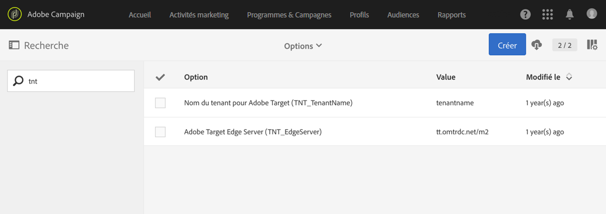

# Integration von Campaign mit Target konfigurieren{#configuring-the-campaign-target-integration}

Durch die Integration von Adobe Campaign mit Adobe Target können dynamische Inhalte in Sendungen eingefügt werden.

Um die Integrationsfunktionen mit Adobe Target nutzen zu können, ist zunächst eine Konfiguration in Adobe Campaign erforderlich. Diese muss vom funktionalen Administrator vorgenommen werden.

Für dieses Verfahren sind die folgenden Elemente erforderlich:

* Adobe-Experience-Cloud-Mandant,
* Mandant für Adobe Target,
* Adobe-Target-Rawbox für Adobe Campaign.

1. Wählen Sie im erweiterten Menü über das Adobe Campaign-Logo oben links im Bildschirm die Schaltflächen  **[!UICONTROL Administration]** > **[!UICONTROL Anwendungskonfiguration]** > **[!UICONTROL Optionen]**.
1. Um die Server- und Mandantenoptionen für Adobe Target zu konfigurieren, füllen Sie die folgenden Felder aus:

   * **[!UICONTROL TNT_TenantName]**, Name des Mandanten für Adobe Target. Dieser Wert entspricht dem Adobe-Target-**[!UICONTROL Client-Namen]**.
   * **[!UICONTROL TNT_EdgeServer]**, der für die Integration verwendete Adobe-Target-Server. Diese Option ist standardmäßig ausgefüllt. Dieser Wert entspricht der Adobe-Target-**[!UICONTROL Server-Domain]** und wird vom Wert **/m2** gefolgt. Beispiel: **tt.omtrdc.net/m2**.

   

Ihre Benutzer können jetzt mit Adobe Target in einen Versand dynamische Bilder einfügen.
