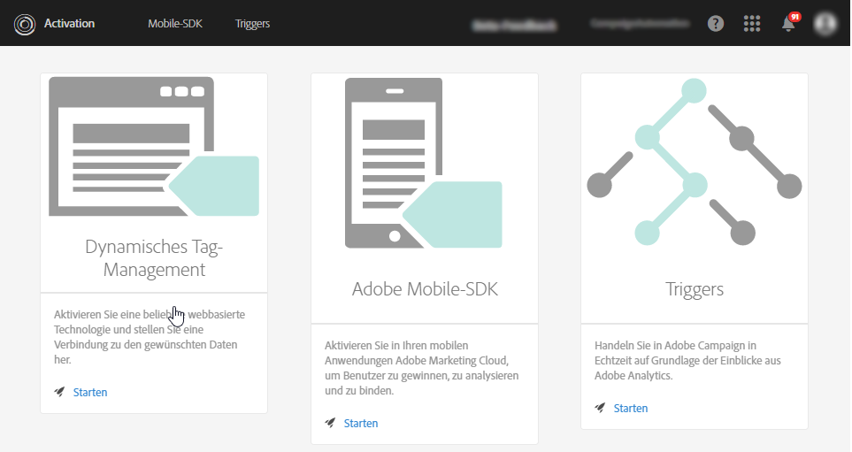
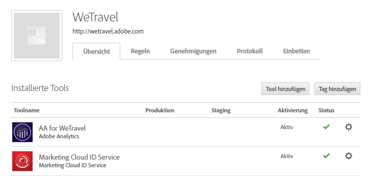
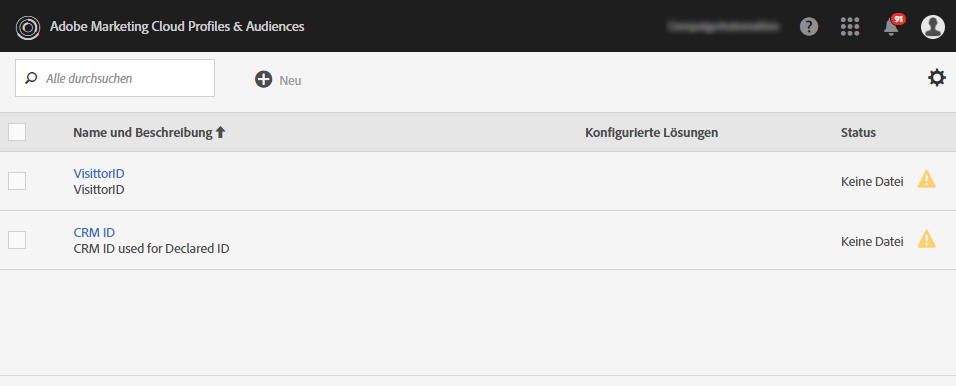
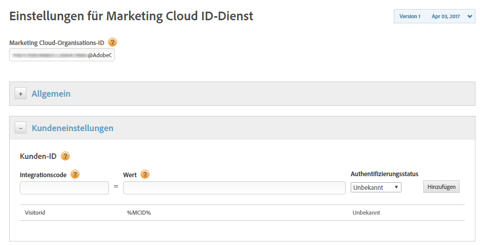
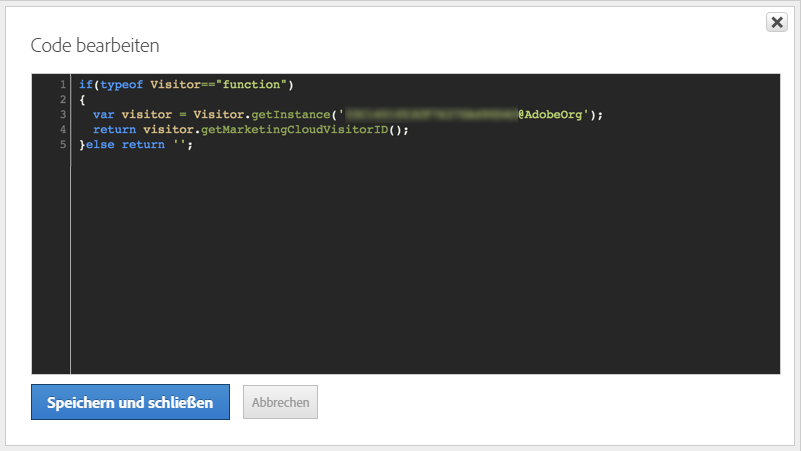
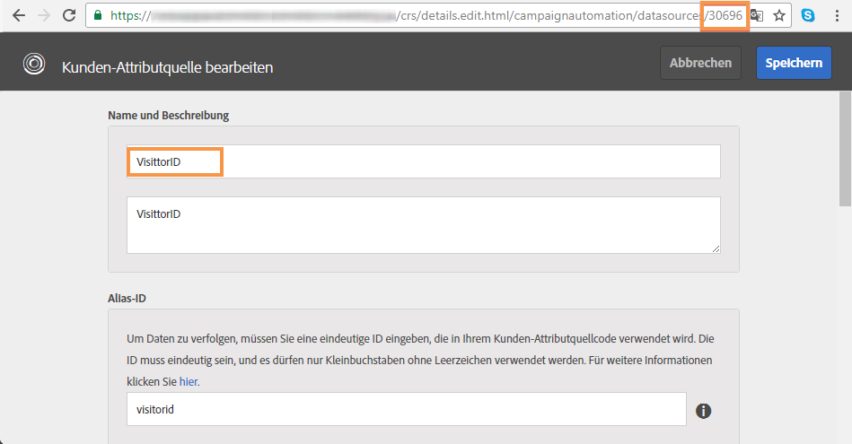

# Triggers in Experience Cloud konfigurieren{#configuring-triggers-in-experience-cloud}

## Funktion aktivieren {#activating-the-functionality}

Die Funktion muss von Adobe in Adobe Campaign aktiviert werden. Bitte kontaktieren Sie Ihren Adobe-Kundenbetreuer oder Professional Services-Partner.

Das Adobe-Team benötigt die folgenden Informationen, um Triggers zu aktivieren:

* Experience Cloud-Unternehmensname
* Kennung der IMS-Organisation
* Analytics-Unternehmensanmeldung (kann identisch mit dem Experience Cloud-Unternehmensnamen sein)

## Lösungen und Dienste konfigurieren   {#configuring-solutions-and-services}

Damit Sie diese Funktion verwenden können, benötigen Sie Zugriff auf folgende Lösungen/Core Services:

* Adobe Campaign
* Adobe Analytics Ultimate, Premium, Foundation, OD, Select, Prime, Mobile Apps, Select oder Standard.
* Experience Cloud Triggers Core Service

   

* Experience Cloud DTM Core Service

   

* Experience Cloud Visitor ID und Experience Cloud People Core Service

   

Zusätzlich benötigen Sie eine funktionierende Website.

>[!CAUTION]
>
>Die Subdomain-Konfiguration ist ein Schlüsselelement der Zustellbarkeit der E-Mails. Adobe-Campaign-E-Mails müssen von derselben Domain gesendet werden, die von der Website verwendet wird.

Um diese Anwendungsbeispiele auszuführen, müssen Sie [Experience Cloud DTM Core Service](#configuring-experience-cloud-dtm-core-service), [Experience Cloud People Core Service](#configuring-experience-cloud-people-core-service) und [Campaign](#configuring-triggers-and-aliases-in-campaign) konfigurieren.

### Experience Cloud DTM Core Service konfigurieren   {#configuring-experience-cloud-dtm-core-service}

1. Aktivieren Sie in Experience Cloud DTM Core Service (Dynamic Tag Management) Experience Cloud ID und Adobe Analytics für Ihre Webseiten.

   

1. Die ID-Abstimmung zwischen der Website, Adobe Analytics und Adobe Campaign erfordert die Verwendung von Aliasing. Erstellen Sie ein Alias, z. B. &quot;visitorid&quot;.

   

### Experience Cloud People Core Service konfigurieren   {#configuring-experience-cloud-people-core-service}

Das zuvor in DTM referenzierte Alias muss in Experience Cloud People Core Service mit einem Kundenattribut erstellt werden. Erstellen Sie ein neues und referenzieren Sie dasselbe DTM-Alias im Integrationscode (z. B. &quot;visitorid&quot;).

>[!NOTE]
>
>Dieses Kundenattribut werden wir im nächsten Schritt in der Datenquelle in Adobe Campaign verwenden.

### Trigger und Aliasse in Campaign konfigurieren   {#configuring-triggers-and-aliases-in-campaign}

1. Vergewissern Sie sich, dass **[!UICONTROL Experience Cloud-Trigger]** in Ihrer Adobe Campaign Standard-Instanz sichtbar sind. Ist dies nicht der Fall, kontaktieren Sie den Adobe Campaign-Administrator.

   

1. Mithilfe von Alias lassen sich Kontakte in Analytics mit Profilen in Adobe Campaign abstimmen. Gleichen Sie die im Experience-Cloud-ID-Dienst definierten Alias mit einer freigegebenen Datenquelle in Campaign ab. Konfigurieren Sie die Alias-Auflösung in Adobe Campaign über eine Datenquelle (**[!UICONTROL Administration]** > **[!UICONTROL Anwendungskonfiguration]** > **[!UICONTROL Freigegebene Datenquellen]**). Achten Sie darauf, dass Sie diejenige Datenquelle im Dropdown-Menü **[!UICONTROL Datenquelle/Alias]** auswählen, die der zuvor erstellten Kundenattribut-Datenquelle zugeordnet ist.

   

   >[!NOTE]
   >
   >Sie können Trigger für sowohl anonyme als auch angemeldete Benutzer abstimmen. Im Fall von anonymen Benutzern ist zu beachten, dass das Profil in Adobe Campaign existieren muss und dem Benutzer zuvor eine E-Mail gesendet worden sein muss. Dazu ist die Konfiguration der Besucher-ID ausreichend. Wenn Sie jedoch Trigger für angemeldete Benutzer abstimmen möchten, muss eine Declared ID-Datenquelle eingerichtet werden. Lesen Sie diesbezüglich auch den Abschnitt [Konfiguration der Datenquelle](../../integrating/using/provisioning-and-configuring-integration-with-audience-manager-or-people-core-service.md#step-2--configure-the-data-sources).

## Trigger in der Experience Cloud-Benutzeroberfläche erstellen   {#creating-a-trigger-in-the-experience-cloud-interface}

Ein Adobe Experience Cloud-Trigger muss erst erstellt werden, damit er in Campaign verwendet werden kann.

Erstellen Sie einen neuen Trigger in Experience Cloud und wählen Sie dabei die auf Ihrer Website verwendete Report Suite aus. Wählen Sie die richtige Dimension aus, damit der Trigger ausgelöst wird.

Weiterführende Informationen dazu finden Sie in der [Dokumentation zu Adobe Experience Cloud](https://docs.adobe.com/content/help/de-DE/core-services/interface/activation/triggers.html) und in diesem [Video](https://helpx.adobe.com/de/marketing-cloud/how-to/email-marketing.html#step-two).

## Best Practices und Einschränkungen bei der Verwendung von Triggers {#triggers-best-practices-and-limitations}

Im Folgenden finden Sie eine Liste mit Best Practices und Einschränkungen für die Verwendung der Integration von Campaign mit Triggers.

* Wenn mehrere Instanzen von Campaign Standard ausgeführt werden, können Triggers von allen empfangen werden, vorausgesetzt sie weisen dieselbe IMS-Organisationskennung auf. Auch Analytics muss dieselbe IMS-Organisationskennung aufweisen.
* Das Erstellen eines Triggers im Trigger Core Service unter Verwendung von Ereignissen in zwei unterschiedlichen Report Suites ist nicht möglich.
* Trigger basieren auf Transaktionsnachrichten. Transaktionsnachrichten werden verwendet, wenn eine Nachricht sehr schnell gesendet werden muss. Transaktionsnachrichten können nicht in einer Warteschlange aufbewahrt und dann gemeinsam gesendet werden.
* Trigger sind nicht deterministisch. Wenn ein Trigger erstellt wird, werden alle mit dem Cookie verknüpften Alias gesendet. Im Fall von gemeinsam verwendeten Browsern, wie z. B. bei Verkaufsständen, Bibliotheken, Internetcafés oder gemeinsam genutzten Geräten zu Hause (Ehepartner melden sich auf demselben Gerät an), kann kein Mapping zur richtigen Kennung durchgeführt werden. Alle bei der Anmeldung mit dem Browser verwendeten Kennungen werden an Campaign gesendet. Campaign sendet dann eine Nachricht auf der Basis der ersten Abstimmung. Wenn mehrere &quot;email IDs&quot; für die Abstimmung in Frage kommen, sendet Campaign keine E-Mail. Es gibt keine Möglichkeit für Campaign festzustellen, welche die richtige E-Mail-Kennung ist, wenn sie nicht von Analytics erfasst und gesendet wird.
* In Campaign kann kein Payload-Inhalt gespeichert werden. Mit Triggers können keine Profildaten aktualisiert werden.
* Kundenattribute werden in Triggers nicht unterstützt (d. h. nur Report-Suite-Daten können zur Definition von Triggers-Geschäftsregeln verwendet werden).
* Kollektionen von Kollektionen werden in Campaign nicht unterstützt.

>[!CAUTION]
>
>Ihre Website muss sich in derselben Domain befinden wie der Adobe Campaign-Server. Ist dies nicht der Fall, können Sie nicht die Besucher-ID verwenden, um anonyme Besucher der Website abzustimmen und zu kontaktieren.

