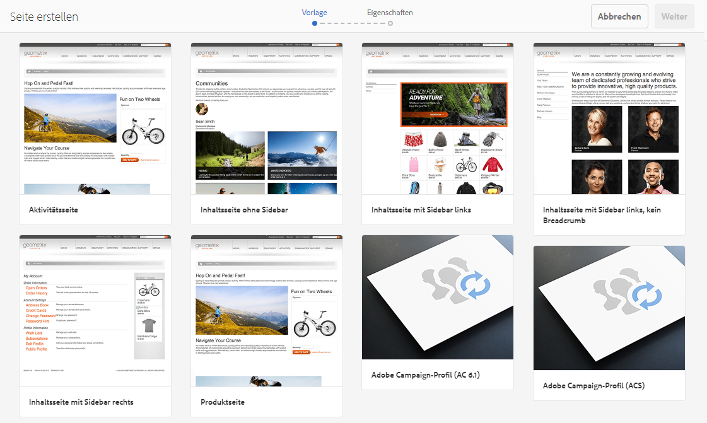
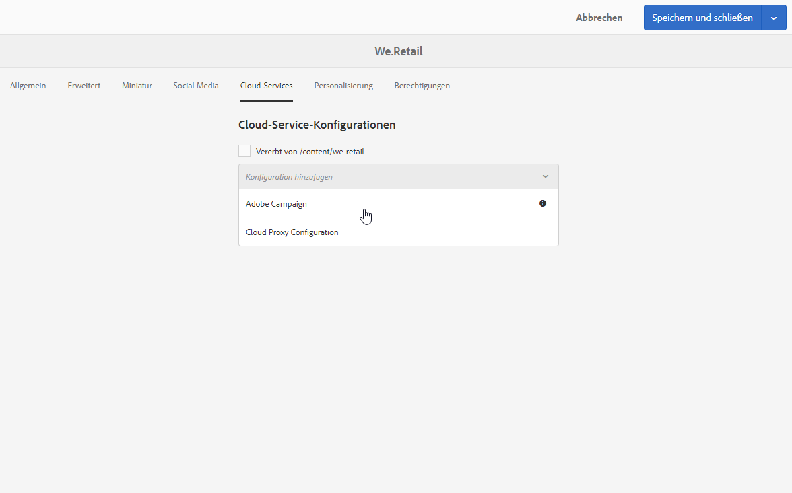

# Campaign-Formular in Adobe Experience Manager erstellen {#creating-a-campaign-form-in-experience-manager}

Sie können &quot;Formular&quot;-Seiten auf Ihren AEM-Websites erstellen und die Felder dieses Formulars Feldern der Adobe Campaign-Datenbank zuordnen. Damit können Sie Profile erstellen und aktualisieren sowie Dienstanmeldungen verwalten.

Gehen Sie zur Erstellung eines Adobe Campaign-Formulars auf Ihrer AEM-Seite wie folgt vor:

1. Erstellen Sie auf Ihrer AEM-Website ausgehend von der Vorlage **Adobe Campaign-Profil** eine neue Seite.

   

1. Wählen Sie in den Eigenschaften der Seite den Ihrer Adobe Campaign-Instanz entsprechenden **[!UICONTROL Cloud Service]** aus.

   

1. Wählen Sie ausgehend von der Komponente **[!UICONTROL Formular-Start]** den Formulartyp aus:

   * **Adobe Campaign: Profil speichern**
   * **Adobe Campaign: Dienstanmeldung**
   * **Adobe Campaign: Dienstabmeldung**

1. Bearbeiten Sie den Formularinhalt, indem Sie verschiedene Felder und Komponenten hinzufügen, die Sie den Feldern der Adobe Campaign-Datenbank zuordnen können.
1. Testen und veröffentlichen Sie das Formular, damit sich über Ihre AEM-Seite darauf zugreifen lässt.

Lesen Sie für weiterführende Informationen das [entsprechende Handbuch](https://experienceleague.adobe.com/docs/experience-manager-65/authoring/aem-adobe-campaign/adobe-campaign-forms.html?lang=de).
