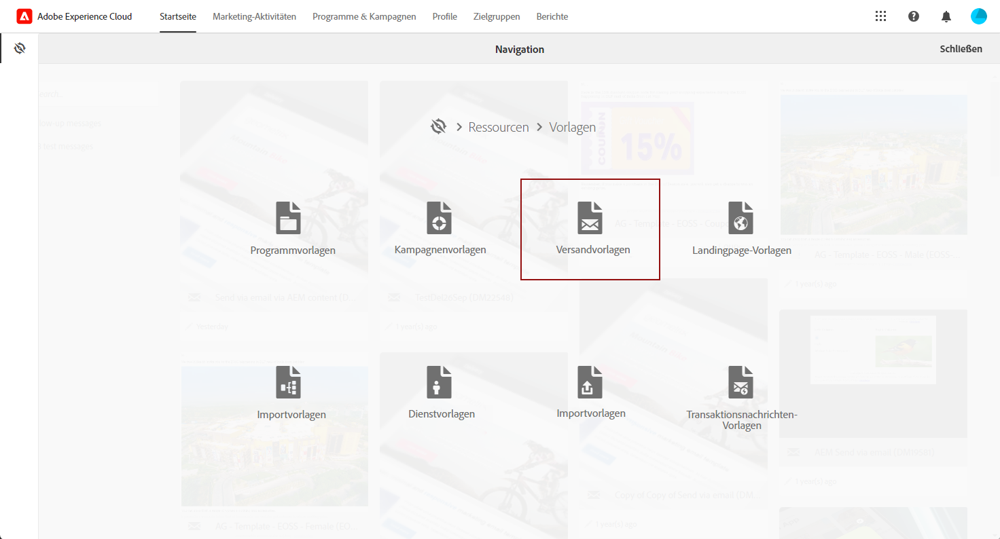
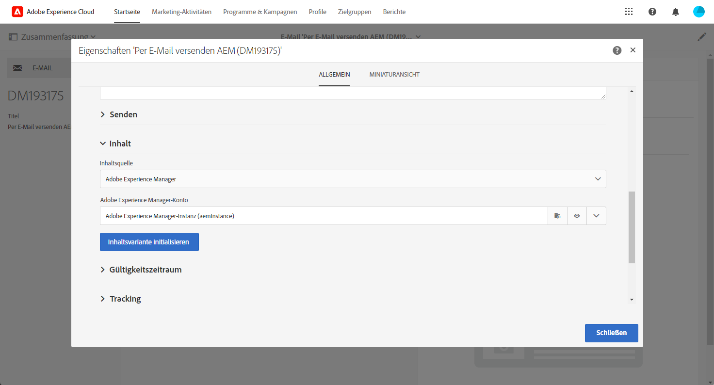
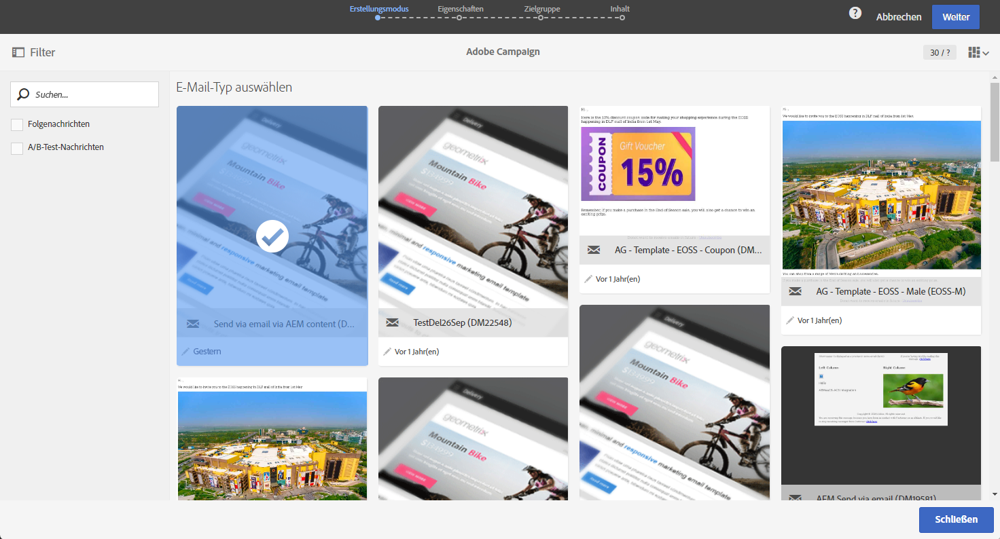
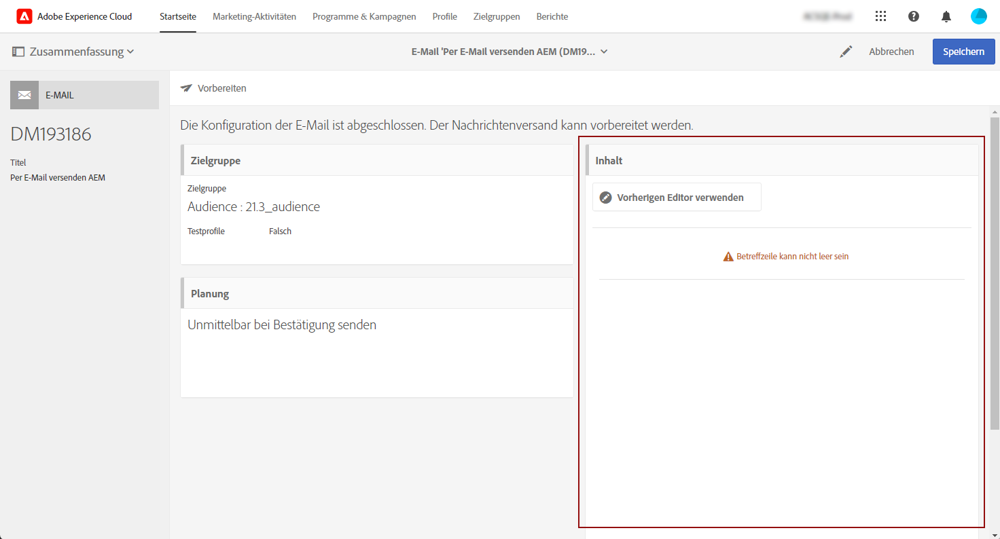
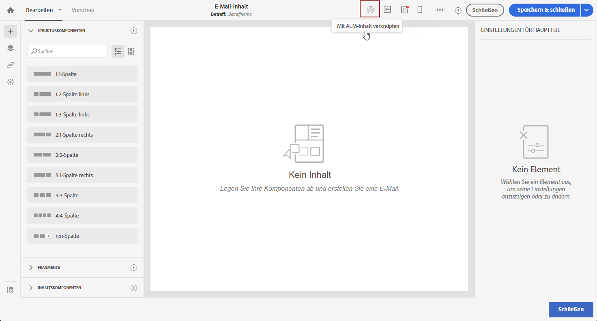

# Adobe Experience Manager-Inhalte in eine Adobe Campaign-E-Mail importieren {#creating-email-aem}

Mithilfe dieses Dokuments lernen Sie, in Adobe Experience Manager E-Mail-Inhalte zu erstellen und zu verwalten und diese anschließend für Ihre Marketing-Kampagnen zu verwenden, indem Sie sie in Ihre Adobe Campaign Standard-E-Mails importieren.

Folgende Voraussetzungen müssen erfüllt sein:

* Zugriff auf eine AEM-Instanz, die für die Integration konfiguriert ist.
* Zugriff auf eine Adobe Campaign-Instanz, die für die Integration konfiguriert ist.
* Adobe Campaign-E-Mail-Vorlage, die für die Aufnahme eines AEM-Inhalts konfiguriert ist.

## In Adobe Experience Manager auf E-Mails zugreifen {#email-content-aem}

Melden Sie sich bei Ihrer Adobe Experience Manager-Authoring-Instanz an, und greifen Sie über Ihre Website auf den Ordner mit den E-Mail-Inhalten zu.

>[!VIDEO](https://video.tv.adobe.com/v/29996)

## Neue E-Mail-Inhalte in Adobe Experience Manager erstellen {#creating-email-content-aem}

Es stehen verschiedene Vorlagen für Adobe Campaign zur Verfügung. Verwenden Sie eine dieser Vorlagen, da sie vordefinierte Komponenten enthalten, die von Adobe Campaign unterstützt werden.

Standardmäßig stehen zwei vordefinierte Vorlagen zur Erstellung von E-Mail-Inhalten für Adobe Campaign zur Verfügung.

* **[!UICONTROL Adobe Campaign-E-Mail]**: Diese Vorlage enthält einen Standardinhalt, den Sie personalisieren können. Sie haben die Wahl zwischen Adobe Campaign-E-Mail (AC6.1) und Adobe Campaign-E-Mail (ACS).
* **[!UICONTROL Importtool-Seite]**: Diese Vorlage ermöglicht Ihnen den Import einer ZIP-Datei, die wiederum eine HTML-Datei enthält, deren Inhalt sich anschließend personalisieren lässt.

1. Erstellen Sie eine neue **[!UICONTROL Seite]** in Adobe Experience Manager.

1. Wählen Sie die **[!UICONTROL Adobe Campaign-E-Mail]**-Vorlage aus. Die einzelnen Schritte finden Sie im folgenden Video.

   >[!VIDEO](https://video.tv.adobe.com/v/29997)

1. Öffnen Sie Ihren neuen E-Mail-Inhalt.

1. Legen Sie in den **[!UICONTROL Seiteneigenschaften]** **[!UICONTROL Adobe Campaign]** als **[!UICONTROL Cloud Service-Konfiguration]** fest. Dies ermöglicht die Kommunikation zwischen Ihrem Inhalt und Ihrer Adobe Campaign-Instanz.

   Sehen Sie sich für weiterführende Informationen das folgende Video an:

   >[!VIDEO](https://video.tv.adobe.com/v/29999)

## E-Mails bearbeiten und senden {#editing-email-aem}

Sie können den E-Mail-Inhalt bearbeiten, indem Sie Komponenten und Elemente hinzufügen. Personalisierungsfelder können verwendet werden, um in Adobe Campaign mithilfe Empfängerdaten eine relevantere Nachricht bereitzustellen.

So erstellen Sie E-Mail-Inhalt in Adobe Experience Manager:

1. Bearbeiten Sie den Betreff und die **[!UICONTROL Klartextversion]** Ihrer E-Mail im über den Sidekick verfügbaren Menü **[!UICONTROL Seiteneigenschaften]** > **[!UICONTROL E-Mail]**.

1. Fügen Sie **[!UICONTROL Personalisierungsfelder]** über die Komponente **[!UICONTROL Text und Personalisierung]** hinzu. Jede Komponente entspricht einer bestimmten Nutzung: Einfügen von Bildern, Hinzufügen der Personalisierung usw.

   Sehen Sie sich für weiterführende Informationen das folgende Video an:

   >[!VIDEO](https://video.tv.adobe.com/v/29998)

1. Wählen Sie im Tab **[!UICONTROL Workflow]** den Validierungs-Workflow **[!UICONTROL Für Adobe Campaign genehmigen]** aus. Sie können in Adobe Campaign nur E-Mails senden, deren Inhalt validiert wurde.

So senden Sie Ihre E-Mail in Adobe Campaign Standard:

1. Nach der Definition des Inhalts und der Versandparameter können Sie eine E-Mail basierend auf einer AEM-spezifischen E-Mail-Vorlage in Adobe Campaign Standard erstellen.

+++ Erfahren Sie mehr über AEM-spezifische Vorlagen.

   1. Wählen Sie im erweiterten Menü **[!UICONTROL Ressourcen]** die Option `>` **[!UICONTROL Vorlagen]** `>` **[!UICONTROL Versandvorlagen]** aus.

      

   1. Duplizieren oder wählen Sie eine der Versandvorlagen aus.

   1. Wählen Sie in den **[!UICONTROL Eigenschaften]** der Vorlage im Dropdown-Menü **[!UICONTROL Inhalt]** **[!UICONTROL „Adobe Experience Manager“ als Inhaltsmodus]** und dann Ihr Adobe Experience Manager-Konto aus.

      

+++

   

1. Füllen Sie die Eigenschaften Ihrer E-Mail aus und klicken Sie auf **[!UICONTROL Erstellen]**, um Ihren AEM-Inhalt auswählen zu können.

1. Rufen Sie den **[!UICONTROL Inhaltsbaustein]** auf.

   

1. Klicken Sie im Menü **[!UICONTROL Inhalt aus Adobe Experience Manager verwenden]** auf **[!UICONTROL AEM-Inhalt verknüpfen]**.

   Wählen Sie dann den Inhalt aus, den Sie in Ihrer E-Mail verwenden möchten.

   

1. Passen Sie Ihre E-Mail weiter an, indem Sie im Dashboard zusätzliche Parameter wie Zielgruppen und Ausführungsplanung angeben. Nach der Konfiguration können Sie nun den E-Mail-Versand durchführen. [Weitere Informationen](../../sending/using/confirming-the-send.md)

