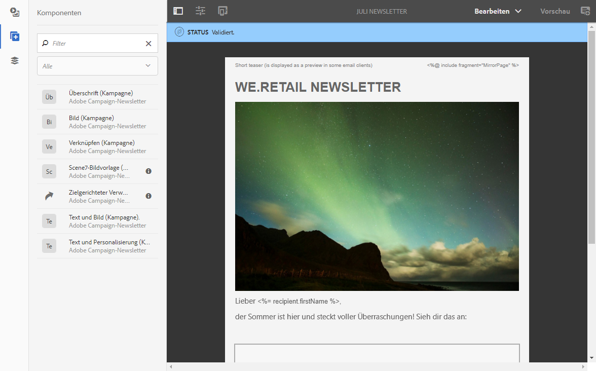
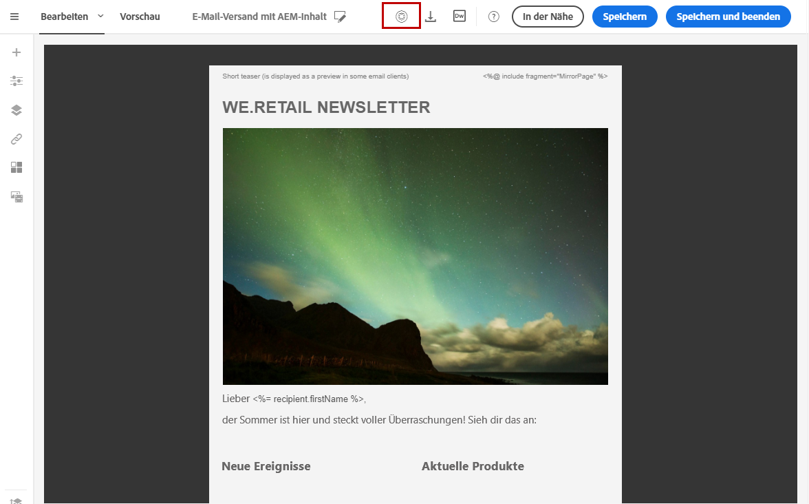

# Creating an email content in Adobe Experience Manager {#creating-email-aem}

Durch die Integration von Adobe Campaign Standard mit Adobe Experience Manager können Sie die in Adobe Experience Manager erstellten Inhalte in E-Mails in Adobe Campaign verwenden.

Dieser Verwendungsfall zeigt Ihnen, wie Sie E-Mail-Inhalte in Adobe Experience Manager erstellen.

## Voraussetzungen {#prerequisites}

Vergewissern Sie sich zunächst, dass Sie über folgende Elemente verfügen:

* Adobe-Experience-Manager-**Authoring**-Instanz zur Erstellung der Inhalte,
* Adobe-Experience-Manager-**Publishing**-Instanz zur Veröffentlichung der Inhalte,
* Adobe-Campaign-Instanz.

## Konfiguration {#configuration}

Um die kombinierte Nutzung von Adobe Campaign und Adobe Experience Manager zu ermöglichen, ist zunächst eine Konfiguration beider Lösungen erforderlich.

1. Konfiguration in Adobe Campaign: Gehen Sie wie folgt vor:

   * Konfigurieren Sie ein externes Konto vom Typ Adobe Experience Manager.
   * Konfigurieren Sie die Option **[!UICONTROL AEMResourceTypeFilter]**, die zur Identifizierung von in Adobe Experience Manager erstellten, für Adobe Campaign bestimmten Inhaltstypen dient.
   * Erstellen Sie eine E-Mail-Vorlage und definieren Sie den Inhalt als aus Adobe Experience Manager stammend.

1. Ordnen Sie der Vorlage das zuvor erstellte externe Konto zu. Gehen Sie wie folgt vor:

   * Konfigurieren Sie die Replikation zwischen der Authoring-Instanz und der Publishing-Instanz von Adobe Experience Manager.
   * Stellen Sie die Verbindung zwischen Adobe Experience Manager und Adobe Campaign her, indem Sie einen dedizierten **[!UICONTROL Cloud Service konfigurieren]**.

## Creating an email content in Adobe Experience Manager {#use-case}

So erstellen Sie E-Mail-Inhalt in Adobe Experience Manager:

1. Erstellen Sie einen E-Mail-Inhalt anhand einer der speziell für Adobe Campaign konzipierten Vorlagen.
1. Wählen Sie in den Inhaltseigenschaften den **[!UICONTROL Cloud Service]**aus, der Ihrer Adobe Campaign-Instanz entspricht.
1. Bearbeiten Sie den Inhalt, indem Sie beispielsweise Text, Bilder oder Personalisierungselemente einfügen.
1. Validieren Sie den Inhalt.

Lesen Sie für weiterführende Informationen das [entsprechende Handbuch](https://docs.adobe.com/content/help/en/experience-manager-65/authoring/aem-adobe-campaign/campaign.html).

So rufen Sie den Inhalt in Adobe Campaign ab:

1. Erstellen Sie eine E-Mail anhand einer Vorlage, deren Inhaltstyp Adobe Experience Manager entspricht.
1. Verknüpfen Sie ausgehend vom Bildschirm zur Inhaltserstellung in Adobe Campaign einen in Adobe Experience Manager erstellten Inhalt.

