# Mehrsprachige E-Mail mit Adobe Experience Manager-Integration erstellen {#creating-multilingual-email-aem}

In diesem Dokument erfahren Sie, wie Sie eine mehrsprachige E-Mail mit Adobe Experience Manager-Inhalten und Sprachkopien erstellen.

Folgende Voraussetzungen müssen erfüllt sein:

* Zugriff auf eine AEM-Instanz, die für die Integration konfiguriert ist.
* Zugriff auf eine Adobe Campaign-Instanz, die für die Integration konfiguriert ist.
* Eine mehrsprachige Adobe Campaign-E-Mail-Vorlage, die für die Aufnahme eines AEM-Inhalts konfiguriert ist.

## Neue E-Mail-Inhalte in Adobe Experience Manager erstellen {#creating-email-content-aem}

1. Wählen Sie auf der Adobe Experience Manager-Startseite **[!UICONTROL Site]** aus.

   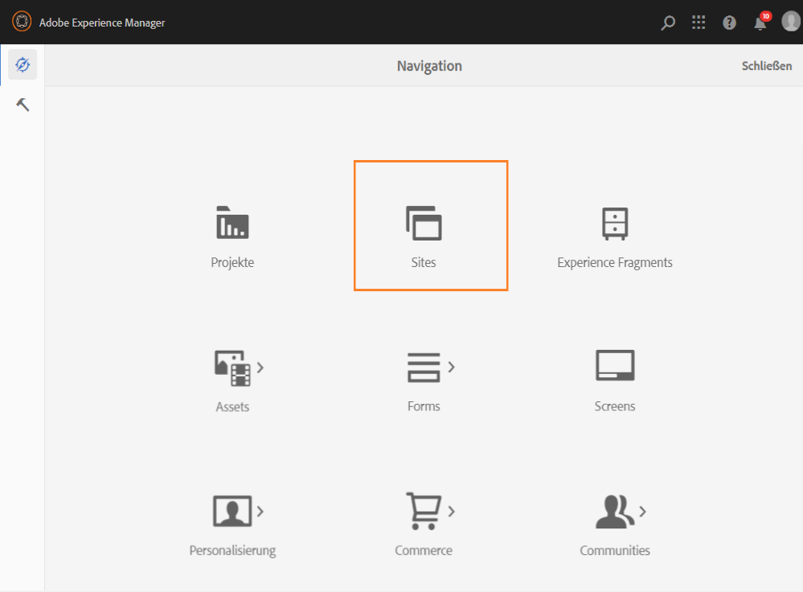

1. Wählen Sie aus, in welchem Ordner Sie Ihre Seite erstellen möchten, und klicken Sie auf **[!UICONTROL Erstellen]** und dann auf **[!UICONTROL Seite]**. Hier erstellen wir unsere Seite im Ordner &quot;en_us&quot;, was unsere Standardsprache sein wird.

   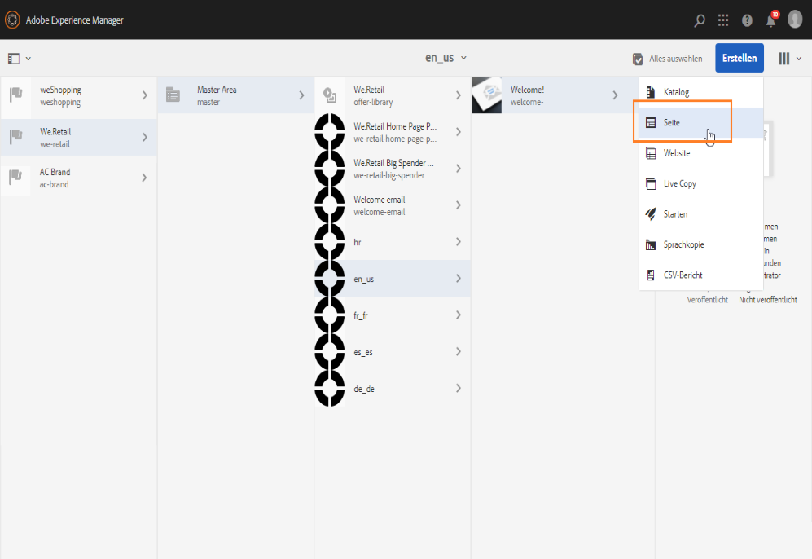

1. Wählen Sie die Vorlage **[!UICONTROL Adobe Campaign-E-Mail (ACS)]** aus.

1. Geben Sie die Eigenschaften Ihrer E-Mail ein und klicken Sie auf **[!UICONTROL Erstellen]**.

   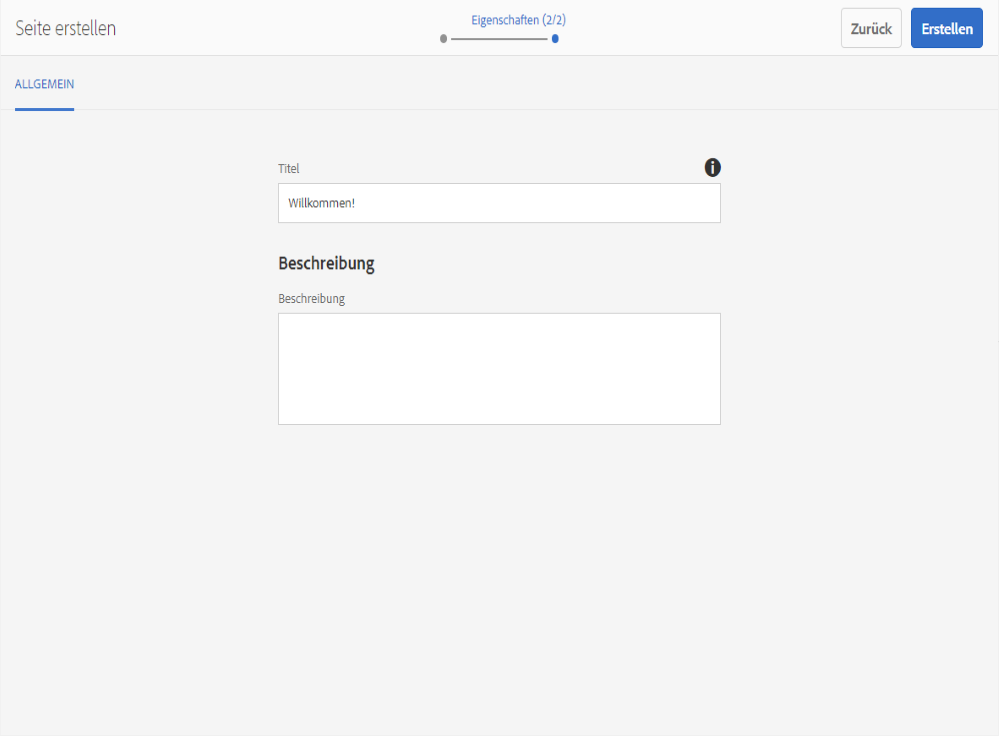

1. Öffnen Sie Ihren neuen E-Mail-Inhalt und personalisieren Sie ihn nach Bedarf. Weiterführende Informationen hierzu finden Sie auf dieser [Seite](../../integrating/using/creating-email-experience-manager.md#editing-email-aem).

   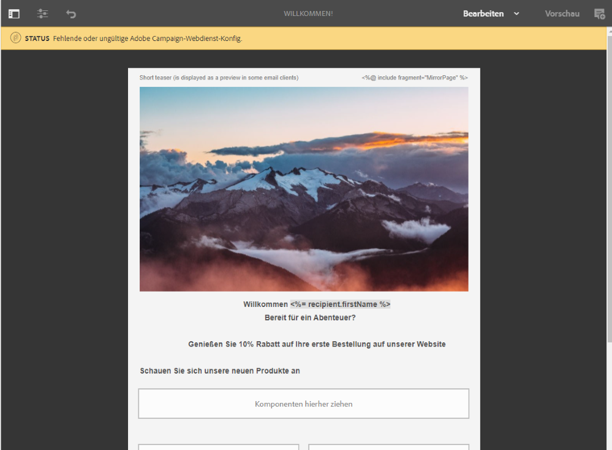

1. Wählen Sie im Tab **[!UICONTROL Workflow]** den Validierungs-Workflow **[!UICONTROL Für Adobe Campaign genehmigen]** aus. Sie können in Adobe Campaign nur E-Mails senden, deren Inhalt validiert wurde.

   

1. Klicken Sie im Fenster **[!UICONTROL Arbeitsschritt beenden]** auf **[!UICONTROL Beendet]** und dann auf **[!UICONTROL Newsletter-Prüfung]**.

1. Klicken Sie auf **[!UICONTROL Beendet]** und dann auf **[!UICONTROL Newsletter-Validierung]**. Nach der Definition des Inhalts und der Versandparameter können Sie die E-Mail in Adobe Campaign Standard validieren, vorbereiten und senden.

   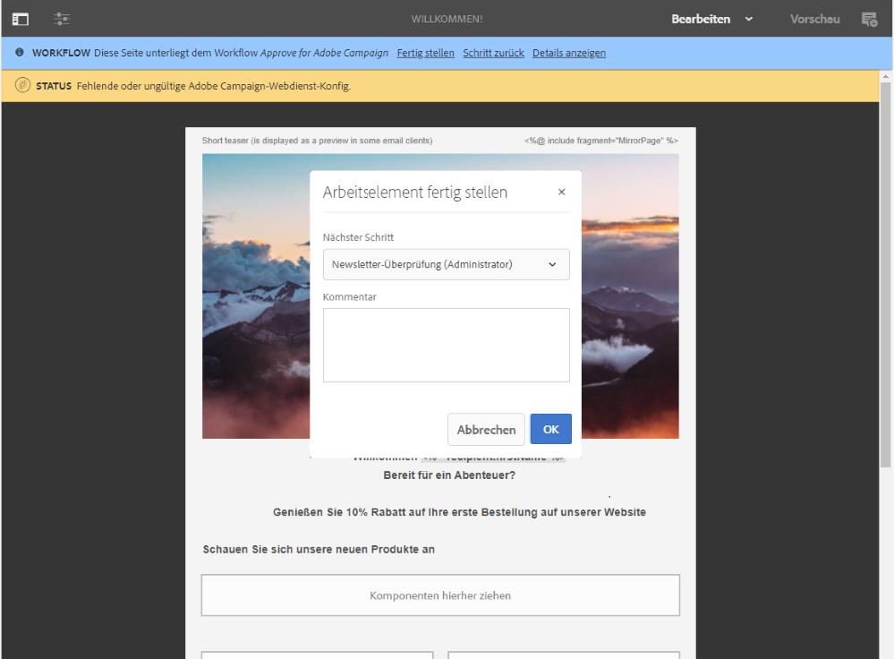

## Sprachkopien erstellen {#creating-language-copies}

Nachdem Sie Ihre E-Mail-Inhalte entworfen haben, müssen Sie Ihre Sprachkopien erstellen, die als Varianten mit Adobe Campaign Standard synchronisiert werden.

1. Wählen Sie Ihre zuvor erstellte Seite aus, klicken Sie auf **[!UICONTROL Erstellen]** und dann auf **[!UICONTROL Sprachkopie]**.

   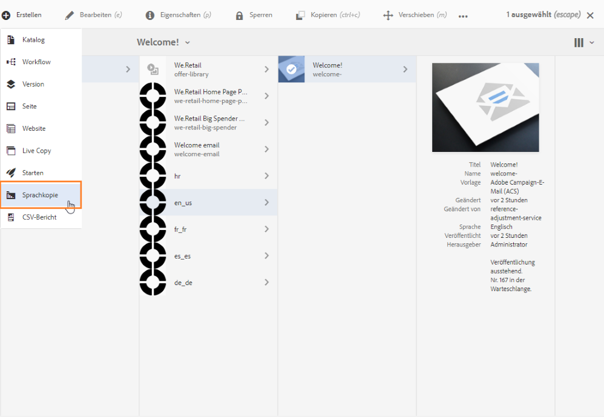

1. Wählen Sie die zuvor erstellten E-Mail-Inhalte aus, die in die ausgewählten Sprachen übersetzt werden, und klicken Sie dann auf **[!UICONTROL Weiter]**.

   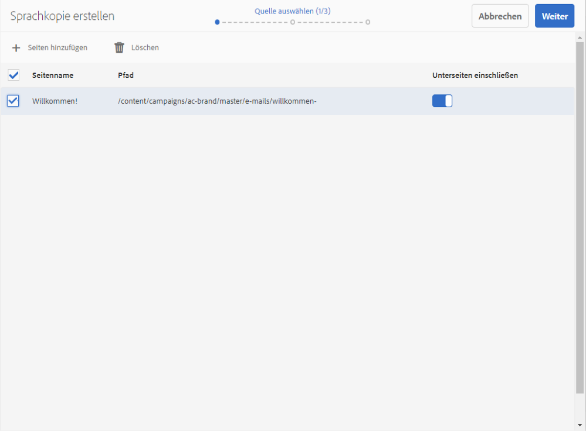

1. Wählen Sie in der Dropdown-Liste **[!UICONTROL Zielsprache(n)]** aus, in welche Sprache Ihre Inhalte übersetzt werden sollen, und klicken Sie dann auf **[!UICONTROL Weiter]**.

   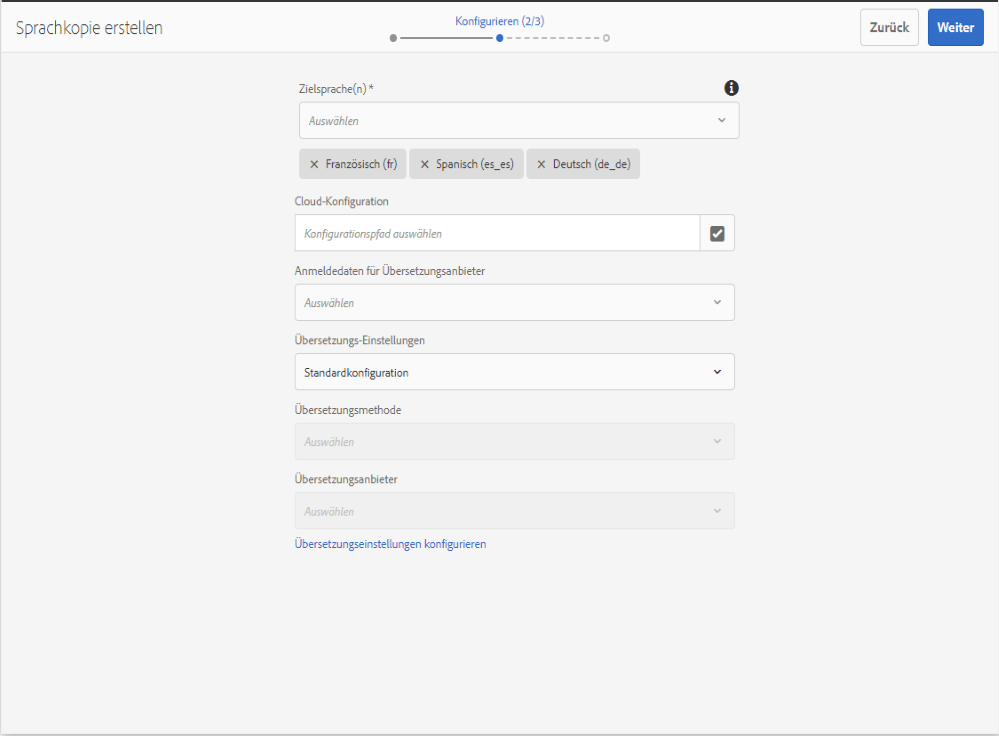

1. Wählen Sie **[!UICONTROL Erstellen]** aus.

Ihre Sprachkopien werden jetzt erstellt. Sie können Ihre Inhalte jetzt je nach Sprache bearbeiten.

>[!CAUTION]
>
>Jede Sprachkopie muss über den Validierungs-Workflow **[!UICONTROL Für Adobe Campaign genehmigen]** genehmigt werden. Sie können in Adobe Campaign nur E-Mails senden, deren Inhalt validiert wurde.

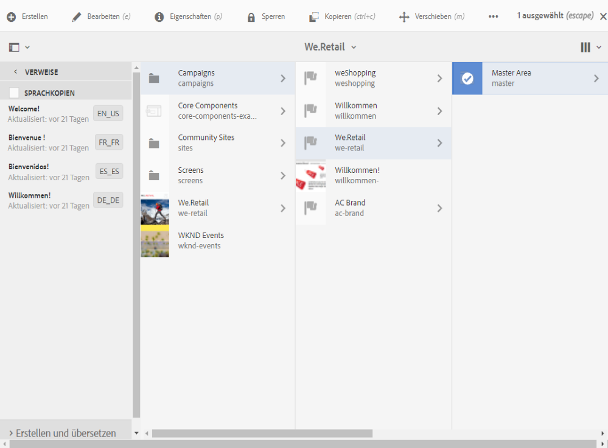

## Mehrsprachige Inhalte in Adobe Campaign Standard erstellen {#multilingual-acs}

1. Klicken Sie auf der Adobe Campaign Standard-Startseite auf **[!UICONTROL E-Mail erstellen]**.

   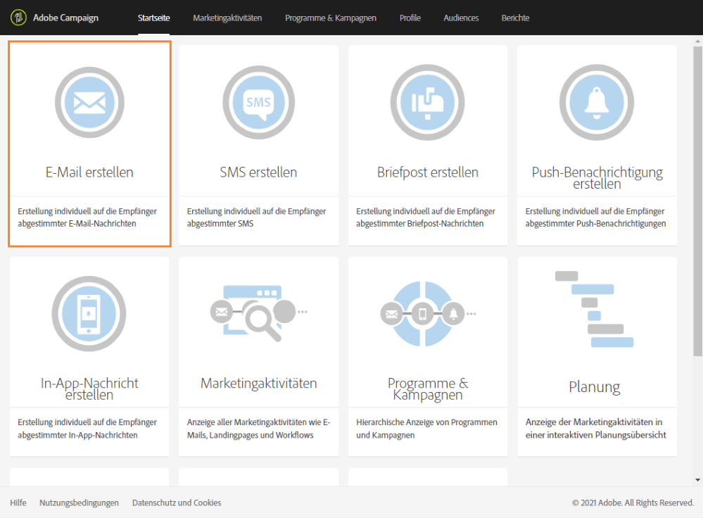

1. Wählen Sie Ihre mehrsprachige Adobe Campaign-E-Mail-Vorlage aus, die für den Empfang von Adobe Experience Manager-Inhalten konfiguriert ist. Weitere Informationen zum Erstellen einer Vorlage, die mit Ihrer Adobe Experience Manager-Instanz verknüpft ist, finden Sie auf dieser [Seite](../../integrating/using/configure-experience-manager.md#config-acs).

   >[!NOTE]
   >
   >In diesem Fall müssen Sie die integrierte Vorlage **[!UICONTROL Mehrsprachige E-Mail (mailMultiLang)]** duplizieren, um Ihre mehrsprachige E-Mail senden zu können.

   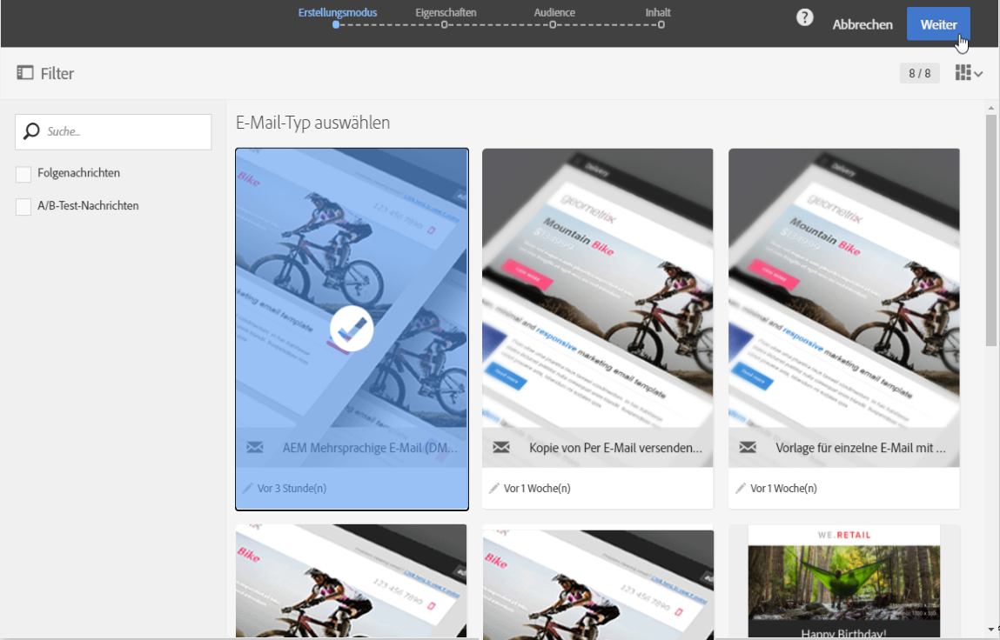

1. Füllen Sie die **[!UICONTROL Eigenschaften]** und **[!UICONTROL Audience]** Ihrer E-Mail aus und klicken Sie auf **[!UICONTROL Erstellen]**.

1. Stellen Sie unter **[!UICONTROL Eigenschaften bearbeiten]** sicher, dass Ihr Adobe Experience Manager-Konto in der Dropdown-Liste **[!UICONTROL Inhalt]** richtig eingerichtet ist.

   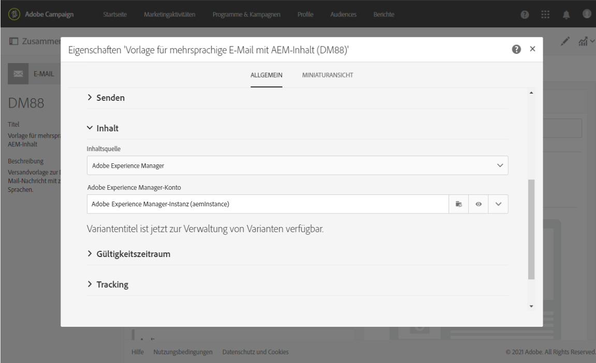

1. Klicken Sie auf **[!UICONTROL Erstellung von Sprachkopien]**.

   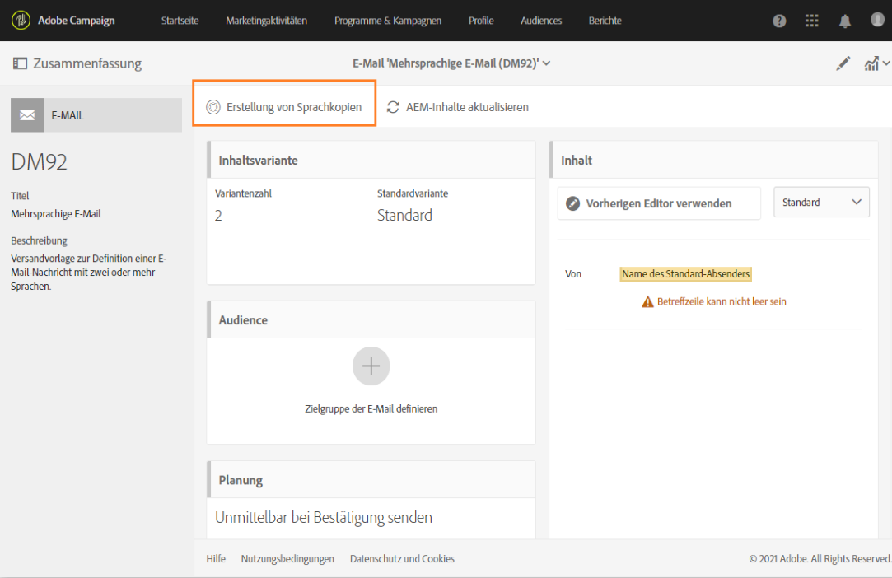

1. Wählen Sie den zuvor erstellten Adobe Experience Manager-Inhalt aus und klicken Sie auf **[!UICONTROL Bestätigen]**. Die hier angezeigten Adobe Experience Manager-Inhalte sind nur validierte Inhalte und können anhand des **[!UICONTROL Titels]** und des **[!UICONTROL Pfads]** gefiltert werden.

   >[!NOTE]
   >
   >Die ausgewählte Sprachkopie wird als Standard festgelegt. Sie können dies später in der Kachel **[!UICONTROL Inhaltsvariante]** ändern.

   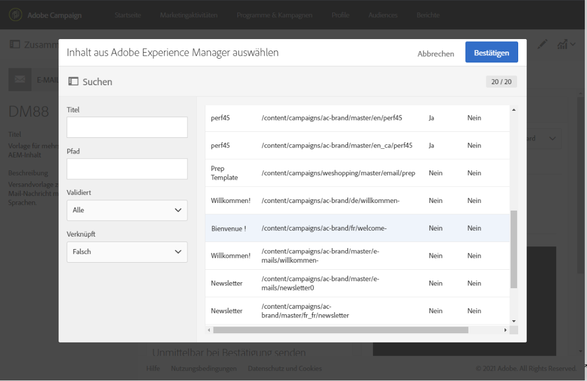

1. Klicken Sie auf **[!UICONTROL Varianten erstellen]**, um Ihren mehrsprachigen Inhalt zu verknüpfen. Adobe Campaign Standard verknüpft dann automatisch die anderen Sprachkopien mit diesem Inhalt. Die erstellten Varianten haben dieselbe Titel- und Code-Sprache wie die in Adobe Experience Manager ausgewählte.

   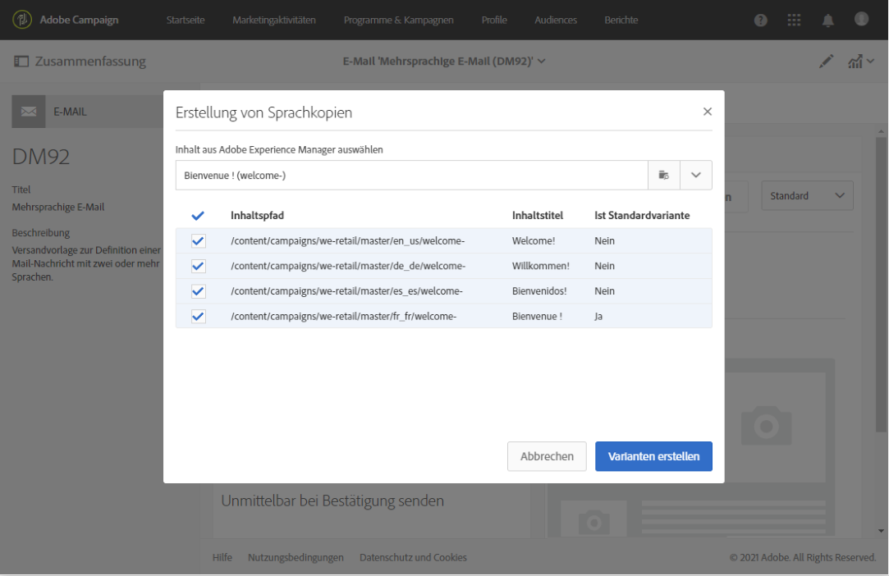

1. Klicken Sie auf die Kachel **[!UICONTROL Inhaltsvariante]**, um die Standardvariante bei Bedarf zu ändern, und klicken Sie auf **[!UICONTROL Bestätigen]**.

   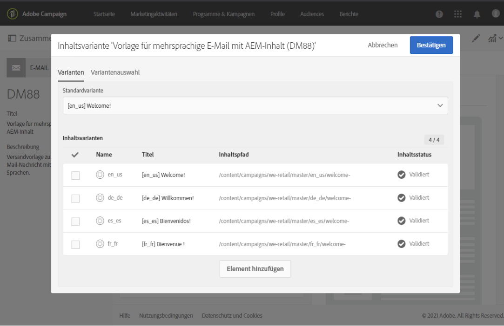

1. Wenn Ihre Inhalte oder Varianten in Adobe Experience Manager aktualisiert werden, können Sie sie direkt in Adobe Campaign Standard mit der Schaltfläche **[!UICONTROL AEM-Inhalte aktualisieren]** synchronisieren.

1. Ihre E-Mail kann nun gesendet werden. Weiterführende Informationen dazu finden Sie auf dieser [Seite](../../sending/using/get-started-sending-messages.md).

   >[!NOTE]
   >
   >Sie können eine E-Mail in Adobe Campaign nicht versenden, wenn in ihr AEM-Inhalt verwendet wird, der nicht genehmigt wurde.

Ihre Audience erhält Ihre E-Mail in der im jeweiligen **[!UICONTROL Profil]** eingestellten **[!UICONTROL bevorzugten Sprache]**. Weitere Informationen zum Bearbeiten von Profilen und bevorzugten Sprachen finden Sie auf dieser [Seite](../../audiences/using/editing-profiles.md).
