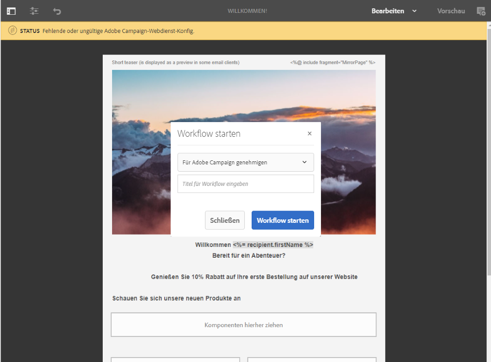

# Mehrsprachige E-Mail mit Adobe Experience Manager-Integration {#creating-multilingual-email-aem} erstellen

In diesem Dokument erfahren Sie, wie Sie eine mehrsprachige E-Mail mit Adobe Experience Manager-Inhalten und Sprachkopien erstellen.

Folgende Voraussetzungen müssen erfüllt sein:

* Zugriff auf eine AEM-Instanz, die für die Integration konfiguriert ist.
* Zugriff auf eine Adobe Campaign-Instanz, die für die Integration konfiguriert ist.
* Eine mehrsprachige E-Mail-Vorlage für Adobe Campaigne, die für den Empfang AEM Inhalte konfiguriert wurde.

## Neue E-Mail-Inhalte in Adobe Experience Manager erstellen {#creating-email-content-aem}

1. Wählen Sie auf der Adobe Experience Manager-Homepage **[!UICONTROL Site]**.

   

1. Wählen Sie aus, in welchem Ordner Sie Ihre Seite erstellen möchten, und klicken Sie auf **[!UICONTROL Erstellen]** und dann **[!UICONTROL Seite]**. Hier erstellen wir unsere Seite im Ordner en_us, was unsere Standardsprache sein wird.

   

1. Wählen Sie die Vorlage **[!UICONTROL Adobe Campaign Email (ACS)]**.

1. Füllen Sie die Eigenschaften Ihrer E-Mail aus und klicken Sie auf **[!UICONTROL Erstellen]**.

   

1. Öffnen Sie Ihren neuen E-Mail-Inhalt und personalisieren Sie ihn nach Bedarf. Weiterführende Informationen hierzu finden Sie auf dieser [Seite](../../integrating/using/creating-email-experience-manager.md#editing-email-aem).

   

1. Wählen Sie im Tab **[!UICONTROL Workflow]** den Validierungs-Workflow **[!UICONTROL Für Adobe Campaign genehmigen]** aus. Sie können in Adobe Campaign nur E-Mails senden, deren Inhalt validiert wurde.

   

1. Klicken Sie auf **[!UICONTROL Complete]** und dann **[!UICONTROL Newsletter-Review]** aus dem Fenster **[!UICONTROL Complete work item]**.

1. Klicken Sie auf **[!UICONTROL Complete]** und dann **[!UICONTROL Newsletter-Genehmigung]**. Nach der Definition des Inhalts und der Versandparameter können Sie die E-Mail in Adobe Campaign Standard validieren, vorbereiten und senden.

   

## Erstellen von Sprachkopien {#creating-language-copies}

Nachdem Sie Ihre E-Mail-Inhalte entworfen haben, müssen Sie Ihre Sprachkopien erstellen, die als Varianten mit Adobe Campaign Standard synchronisiert werden.

1. Wählen Sie Ihre zuvor erstellte Seite aus, klicken Sie auf **[!UICONTROL Erstellen]** und dann **[!UICONTROL Sprachkopie]**.

   

1. Wählen Sie die zuvor erstellten E-Mail-Inhalte aus, die in die ausgewählten Sprachen übersetzt werden, und klicken Sie dann auf **[!UICONTROL Weiter]**.

   

1. Wählen Sie in der Dropdown-Liste **[!UICONTROL Sprache(n)]** aus, in welcher Zielgruppe Ihre Inhalte übersetzt werden sollen, und klicken Sie dann auf **[!UICONTROL Weiter]**.

   

1. Wählen Sie **[!UICONTROL Erstellen]** aus.

Ihre Sprachkopien werden jetzt erstellt. Sie können jetzt Ihren Inhalt je nach Sprache bearbeiten.

>[!CAUTION]
>
>Jede Sprachkopie muss über den Überprüfungs-Workflow **[!UICONTROL Genehmigen für Adobe Campaign]** genehmigt werden. Sie können in Adobe Campaign nur E-Mails senden, deren Inhalt validiert wurde.

## Mehrsprachige Inhalte in Adobe Campaign Standard erstellen{#multilingual-acs}

1. Klicken Sie auf der Adobe Campaign Standard-Homepage auf **[!UICONTROL E-Mail erstellen]**.

   

1. Wählen Sie die mehrsprachige E-Mail-Vorlage Ihres Adobe Campaigns aus, die für den Empfang von Adobe Experience Manager-Inhalten konfiguriert ist. Weitere Informationen zum Erstellen einer Vorlage, die mit Ihrer Adobe Experience Manager-Instanz verknüpft ist, finden Sie auf dieser [Seite](../../integrating/using/configure-experience-manager.md#config-acs).

   >[!NOTE]
   >
   >In diesem Fall müssen Sie die integrierte Vorlage **[!UICONTROL Mehrsprachige E-Mail (mailMultiLang)]** Duplikat haben, um Ihre mehrsprachige E-Mail senden zu können.

   

1. Füllen Sie die **[!UICONTROL Properties]** und **[!UICONTROL Audience]** Ihrer E-Mail aus und klicken Sie auf **[!UICONTROL Create]**.

1. Vergewissern Sie sich in der Dropdownliste **[!UICONTROL Eigenschaften bearbeiten]**, dass Ihr Adobe Experience Manager-Konto korrekt eingestellt ist.****

   

1. Klicken Sie auf **[!UICONTROL Sprachkopie erstellen]**.

   

1. Wählen Sie den zuvor erstellten Adobe Experience Manager-Inhalt aus und klicken Sie auf **[!UICONTROL Bestätigen]**. Die hier angezeigten Adobe Experience Manager-Inhalte sind nur validierte Inhalte und können anhand ihrer **[!UICONTROL Beschriftung]** und **[!UICONTROL Pfad]** gefiltert werden.

   >[!NOTE]
   >
   >Die ausgewählte Sprachkopie wird als Standard festgelegt. Sie können sie später im Block **[!UICONTROL Inhaltsvariante]** ändern.

   

1. Klicken Sie auf **[!UICONTROL Varianten erstellen]**, um Ihren mehrsprachigen Inhalt zu verknüpfen. Adobe Campaign Standard verknüpft dann automatisch die anderen Sprachkopien mit diesem Inhalt. Die erstellten Varianten haben dieselbe Beschriftungs- und Codesprache wie die in Adobe Experience Manager ausgewählten.

   

1. Klicken Sie auf den Block **[!UICONTROL Inhaltsvariante]**, um die Standardvariante bei Bedarf zu ändern, und klicken Sie auf **[!UICONTROL Bestätigen]**.

   

1. Wenn Ihre Inhalte oder Varianten in Adobe Experience Manager aktualisiert werden, können Sie sie in Adobe Campaign Standard direkt mit der Schaltfläche **[!UICONTROL AEM aktualisieren]** synchronisieren.

1. Ihre E-Mail kann jetzt gesendet werden. Weiterführende Informationen dazu finden Sie auf dieser [Seite](../../sending/using/get-started-sending-messages.md).

Ihre Audience wird Ihre E-Mail erhalten, je nachdem, welche **[!UICONTROL bevorzugten Sprachen]** in den **[!UICONTROL Profilen]** eingestellt wurden. Weitere Informationen zum Bearbeiten von Profilen und bevorzugten Sprachen finden Sie auf dieser [Seite](../../audiences/using/editing-profiles.md).
