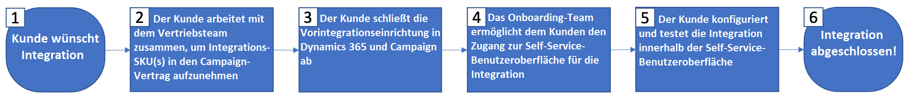

# Erste Schritte mit der Integration von Microsoft Dynamics 365

Aktivieren Sie Ihre CRM-Daten für kanalübergreifende Kommunikation: Erfahren Sie, wie Sie Kontakte von Microsoft Dynamics 365 an Adobe Campaign übertragen und Kampagnen-Performance-Daten (Sendungen, Öffnungen, Klicks und Bounces) von Adobe Campaign in Microsoft Dynamics 365 freigeben können.

Für diese Integration sind die folgenden Software-Versionen erforderlich:

* Nur Microsoft Dynamics 365 for Sales Online, neueste Version

* Adobe Campaign Standard, neueste Version

>[!CAUTION]
>
>Diese Funktion ist nicht im Produkt vorkonfiguriert. Die Implementierung erfordert die Einbindung von Adobe Consulting. Wenden Sie sich an Ihren Adobe-Support-Mitarbeiter, um weitere Informationen zu erhalten.
>

## Grundsätze

Die Integration von Adobe Campaign Standard mit Microsoft Dynamics 365 ermöglicht die Synchronisation aller verfügbaren Kontaktdaten im CRM-System, sodass alle relevanten Kontaktdaten für Kampagnenaktivitäten verfügbar sind.

Umgekehrt werden in Adobe Campaign Standard bei der Interaktion von Profilen mit Nachrichten diese Daten (z. B. Sendungen, Öffnungen, Klicks und Bounces) automatisch an Microsoft Dynamics 365 übermittelt, sodass Kontaktdatensätzen Marketing-Aktivitäten hinzugefügt werden.

Die Integration unterstützt auch die Synchronisation von [benutzerdefinierten Entitäten](../../integrating/using/d365-acs-self-service-app-settings.md) in Dynamics 365 mit den entsprechenden **benutzerdefinierten Ressourcen** in Campaign.

Diese Integration unterstützt vier Hauptanwendungsfälle:

1. Synchronisieren von Kontakten von Dynamics 365 mit Campaign, damit sie in Marketing-Kampagnen für Zielgruppen ausgewählt werden können
1. Synchronisieren von benutzerdefinierten Entitäten von Dynamics 365 mit Campaign, damit sie zur Segmentierung und Personalisierung verwendet werden können
1. Senden von E-Mail-Marketing-Ereignissen (Sendungen, Öffnungen, Klicks, Bounces) von Campaign zu Dynamics 365 zum Bereitstellen an das Sales-Repository in der Dynamics 365-Benutzeroberfläche
1. Synchronisieren der Opt-out-Status (z. B. keine E-Mail) zwischen Dynamics 365 und Campaign, um die Datenschutzeinstellungen der Kunden einzuhalten.

Die wichtigsten Vorteile sind:

* Konsistentes Messaging zwischen Vertrieb und Marketing: Die Integration von Adobe Campaign Standard mit Dynamics 365 ermöglicht beiden Systemen den Zugriff auf Kundeninformationen und E-Mail-Marketing-Verläufe, sodass alle Nachrichten an den Kunden das gleiche konsistente Messaging aufweisen.

* Ganzheitliche Sicht auf alle Interessenten- und Kundendaten: Durch die Integration von Adobe Campaign Standard mit Dynamics 365 ist es möglich, den E-Mail-Marketing-Verlauf für einzelne Kontakte im CRM-System freizugeben und darauf zuzugreifen.

* Dynamics 365-Daten auf jedem Kanal aktivieren: Mit Kontaktdaten, die mit Adobe Campaign synchronisiert werden, können Sie unter Verwendung von Campaign über jeden Online- oder Offline-Kanal Nachrichten senden, inklusive Mobile Push, In-App, E-Mail oder Briefpost. Campaign ist in der Lage, unabhängig vom bevorzugten Kanal jedes Kontakts Nachrichten zu versenden.

>[!CAUTION]
>
>Diese Integration verwendet Dynamics 365 als &quot;Source of Truth&quot; für die Synchronisation von Kontakten und benutzerdefinierten Entitäten.  Änderungen an synchronisierten Attributen sollten in Dynamics 365 und nicht in Adobe Campaign Standard vorgenommen werden.  Wenn Änderungen in Campaign vorgenommen werden, kann es sein, dass sie bei der Synchronisation wieder überschrieben werden.
>

## Wichtige Schritte zum Implementieren der Integration mit Microsoft Dynamics 365{#request-and-implement-this-integration}

Um diese Integration bereitzustellen, müssen Sie die folgenden Schritte ausführen.

Bitte folgen Sie dem unten stehenden Flussdiagramm und den entsprechenden Details, um die Integration anzufordern und zu konfigurieren.

Details des Flussdiagramms (sind mit den oben genannten Schritten verknüpft):

* **Schritt 1**: Es wird davon ausgegangen, dass Sie bereits über eine Lizenz für Microsoft Dynamics 365 for Sales und für Adobe Campaign Standard verfügen oder diese gerade erwerben.
* **Schritt 2**: Das Standardintegrationsangebot ist für alle Kunden kostenlos. Abhängig von Ihren Anforderungen können jedoch zusätzliche Kosten anfallen. Informationen über [Best Practices und Einschränkungen finden Sie hier](../../integrating/using/d365-acs-notices-and-recommendations.md). Ein neuer Kundenauftrag muss unterzeichnet werden, um die Integration nutzen zu können, wenn diese nicht im ursprünglichen Kundenauftrag enthalten war.
* **Schritt 3**: Vollständige Vorintegrationsschritte für Dynamics 365 und Campaign. Siehe [Diese Integration konfigurieren](#configure-this-integration).
* **Schritt 4**: Das Adobe-Onboarding-Team stellt Ihnen den Zugriff auf die Benutzeroberfläche der Integrationsanwendung zur Verfügung.
* **Schritt 5**: Sie können Ihre Daten-Mappings, Ersetzungen, Filter usw. konfigurieren und Ihre Integration über die Benutzeroberfläche der Integrationsanwendung testen.

  >[!IMPORTANT]
  >
  > Wenn Sie die Opt-out-Konfiguration &quot;bidirektional“ oder &quot;Synchronisation von Campaign mit Dynamics 365&quot; benötigen, müssen Sie die Anfrage an Ihren technischen Ansprechpartner bei Adobe stellen, damit die Opt-out-Workflows in Ihrer Campaign-Instanz eingerichtet werden können. [Weitere Informationen](../../integrating/using/d365-acs-notices-and-recommendations.md#opt-out).

### Konfigurieren dieser Integration {#configure-this-integration}

Drei Systeme müssen für diese Integration bereitgestellt und konfiguriert werden:

* **Adobe Campaign Standard**: Sie müssen den API-Zugang einrichten und eine neue Integration für das Integrations-Tool konfigurieren. Lesen Sie dazu [diesen Artikel](../../integrating/using/d365-acs-configure-adobe-io.md).
* **Microsoft Dynamics 365**: Sie müssen eine neue App-Registrierung erstellen und einen Anwender für die Verwendung der Integration aktivieren.  Informationen zum Konfigurieren von Microsoft Dynamics 365 für diese Integration finden Sie in [diesem Artikel](../../integrating/using/d365-acs-configure-d365.md).
* **Selfservice-Anwendung für die Integration von Adobe Campaign Standard mit Microsoft Dynamics 365**: Sie müssen die Schritte in [diesem Artikel](../../integrating/using/d365-acs-self-service-app-control-access.md) ausführen.

>[!IMPORTANT]
>
>Für jedes System müssen diese Schritte von einem **Administrator** ausgeführt werden.
>
>Die Schritte in dieser Dokumentation helfen Ihnen beim Erstellen von Integrationen/Registrierungen, die die Zuweisung von Berechtigungen und/oder Administratorzugriff erfordern.  Sie müssen vor der Ausführung sicherstellen, dass diese Schritte den Richtlinien Ihres Unternehmens entsprechen, und die Schritte dann sorgfältig durchführen.
>

### Support anfordern

Support-Tickets können bei der Adobe-Kundenunterstützung erstellt werden.

Bei Problemen mit Integrationsdatenflüssen sollten Sie die folgenden Informationen angeben:

* **Prozessverantwortlicher**: Technische Architekten
* **ES-Prozess-ID**: Wurde während des Onboarding-Prozesses bereitgestellt
* **Prozesstitel**: Integration von Adobe Campaign Standard mit Microsoft Dynamics 365
* **Problembeschreibung**: Beschreibung des Problems

Support für die Integration ist derzeit rund um die Uhr verfügbar (Montag bis Freitag, ausgenommen Feiertage und Betriebsferien von Adobe).
